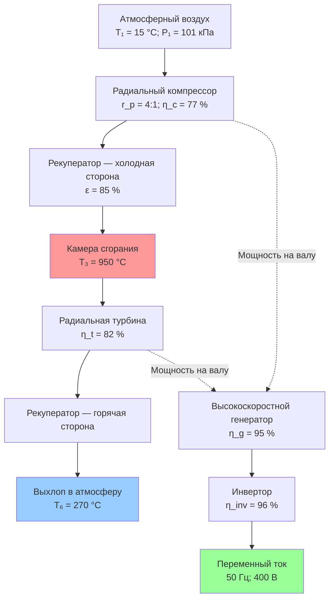

Микротурбины представляют собой компактные газотурбинные агрегаты мощностью 30–500 кВт с одновальными радиальными компрессорами и турбинами, вращающимися при чрезвычайно высоких скоростях (50 000–120 000 об/мин). Системы преобразуют топливо в электроэнергию по открытому циклу Брайтона, одновременно производя рекуперируемую тепловую энергию из выхлопа после рекуператора. Интеграция регенеративного теплообменника-рекуператора, воздушных подшипников и высокочастотного синхронного генератора с постоянными магнитами отличает микротурбины от обычных газовых турбин и обеспечивает их пригодность для распределённой генерации, где критичны компактность, низкие выбросы и минимальные требования к техническому обслуживанию. ASHRAE Handbook HVAC Systems and Equipment включает микротурбины в категорию первичных двигателей для систем ТЭЦ.

## Термодинамика цикла Брайтона

Микротурбины работают по открытому рекуперативному циклу Брайтона (recuperated Brayton cycle). Четыре основных процесса: адиабатное сжатие в компрессоре, регенеративный предварительный нагрев сжатого воздуха в рекуператоре, подвод теплоты при постоянном давлении путём сгорания топлива, адиабатное расширение в турбине с рекуперацией отходящего тепла.

КПД идеального простого цикла Брайтона:


\eta_\text{Brayton} = 1 - \frac{1}{r_p^{(\gamma-1)/\gamma}}


где $r_p$ — степень повышения давления компрессора; $\gamma \approx 1{,}4$ для воздуха. При практических степенях сжатия микротурбин $r_p = 3{,}5$–$5{,}0$ идеальный КПД составляет 30–37 % — недостаточно для коммерчески конкурентоспособного устройства. Рекуперация тепла устраняет этот дефицит.

Фактическая работа компрессора с учётом его изоэнтропного КПД $\eta_c$:


W_c = \frac{\dot{m}\, c_p\, T_1}{\eta_c} \left(r_p^{(\gamma-1)/\gamma} - 1\right)


где $\dot{m}$ — массовый расход воздуха, кг/с; $c_p$ — удельная теплоёмкость при постоянном давлении, кДж/(кг·К); $T_1$ — температура на входе в компрессор, К; $\eta_c = 0{,}75$–$0{,}80$ для радиальных компрессоров.

Фактическая мощность турбины с учётом изоэнтропного КПД $\eta_t$:


W_t = \dot{m}\, c_p\, T_3\, \eta_t \left(1 - \frac{1}{r_p^{(\gamma-1)/\gamma}}\right)


где $T_3$ — температура на входе в турбину, К; $\eta_t = 0{,}80$–$0{,}85$ для радиальных турбин. Чистая электрическая мощность равна $W_t - W_c$ за вычетом потерь в генераторе и инверторе.

## Интеграция рекуператора

Рекуператор (recuperator) — критический компонент микротурбины, обеспечивающий практическую конкурентоспособность технологии. Этот компактный теплообменник передаёт тепловую энергию горячего выхлопа турбины сжатому воздуху перед камерой сгорания, снижая расход топлива. Без рекуперации электрический КПД упал бы до 15–18 %.

Эффективность рекуператора (effectiveness):


\varepsilon = \frac{T_3' - T_2}{T_5 - T_2}


где $T_3'$ — фактическая температура на входе в камеру сгорания; $T_2$ — температура на выходе из компрессора; $T_5$ — температура выхлопа турбины. Современные рекуператоры с первичными поверхностями достигают $\varepsilon = 0{,}80$–$0{,}90$, существенно улучшая КПД цикла.

Расход топлива при рекуперации в сравнении с простым циклом:


\dot{Q}_\text{fuel,recup} = \dot{m}\, c_p\, (T_3 - T_2 - \varepsilon (T_5 - T_2))



\dot{Q}_\text{fuel,simple} = \dot{m}\, c_p\, (T_3 - T_2)


Экономия топлива от рекуперации достигает 40–50 % при генерации электроэнергии.

Конструкция рекуператора использует первичные поверхностные теплообменники (primary surface heat exchanger) из тонкой нержавеющей стали 0,05–0,10 мм со смещёнными или жалюзийными рёбрами в противоточном расположении. Плотность поверхности превышает 1000 м²/м³ объёма ядра. Перепад давления через рекуператор 3–5 % (с каждой стороны) снижает чистую мощность и КПД, представляя компромисс между эффективностью теплообмена и гидравлическими потерями.

## Одновальная архитектура

Микротурбины используют одновальную конструкцию (single-shaft design): компрессор, турбина и генератор вращаются на одном общем валу, поддерживаемом воздушными подшипниками. Одновальная архитектура исключает редуктор, упрощает конструкцию и снижает требования к техническому обслуживанию, но требует синхронного вращения всех компонентов.

Центробежное напряжение в крыльчатке компрессора нарастает с квадратом окружной скорости:


\sigma = \rho\, \omega^2\, r^2


При $\omega = 9000$ рад/с (90 000 об/мин) и $r = 0{,}05$ м крыльчатка диаметром 100 мм испытывает центробежные ускорения свыше 100 000 g. Это требует применения лёгких высокопрочных сплавов титана или алюминия с исключительным отношением предела прочности к плотности.

**Воздушные подшипники** (air bearings) исключают систему масляной смазки, что принципиально снижает трудозатраты на обслуживание. Гидродинамические воздушные подшипники генерируют несущее давление через вязкостное нагнетание в тонкой воздушной плёнке между валом и поверхностью подшипника. Несущая способность радиального воздушного подшипника:


W = \frac{\mu\, \omega\, R^3\, L}{c^2}\, S(\varepsilon)


где $\mu$ — динамическая вязкость воздуха; $R$ — радиус подшипника; $L$ — длина подшипника; $c = 0{,}025$–$0{,}075$ мм — радиальный зазор; $S(\varepsilon)$ — функция числа Зоммерфельда. Минимальные зазоры требуют точной обработки и тщательной фильтрации воздуха подшипников.

**Генераторы с постоянными магнитами** (permanent magnet generators, PMG) из редкоземельных сплавов (кобальт-самарий или неодим-железо-бор) вращаются вместе с валом внутри статорной обмотки. Генератор вырабатывает высокочастотное переменное напряжение — около 1500 Гц при 90 000 об/мин для двухполюсной машины. Силовая электроника (инвертор) преобразует его в стандартную частоту сети 50 Гц с регулированием напряжения и коэффициента мощности.

## Характеристики производительности


| Параметр | Значение | Примечание |
|---|---|---|
| Диапазон мощности | 30–500 кВт | Электрический выход |
| Электрический КПД | 26–33 % | База НТС; полная нагрузка |
| Суммарный КПД когенерации | 70–80 % | При полном использовании тепла |
| Степень повышения давления | 3,5–5,0 | Выход/вход компрессора |
| Температура на входе в турбину | 900–1000 °C | Металлургический предел |
| Температура выхлопа | 250–300 °C | После рекуператора |
| Скорость вращения | 50 000–120 000 об/мин | Зависит от типоразмера |
| Соотношение PHR | 0,5–0,7 | Электрический/тепловой выход |
| Выбросы NOₓ | < 9 ppm | При 15 % O₂; сухая основа |
| Выбросы CO | < 10 ppm | При 15 % O₂; сухая основа |


Теплопроизводительность (heat rate) — общепринятый показатель расхода топлива на единицу электрической мощности:


\text{HR} = \frac{3412{,}14}{\eta_e}\ \text{BTU/кВт·ч} = \frac{3600}{\eta_e}\ \text{кДж/кВт·ч}


**Пример расчёта.** Микротурбина с $\eta_e = 30$ %:


\text{HR} = \frac{3600}{0{,}30} = 12\,000\ \text{кДж/кВт·ч}


Для сравнения: крупные газовые турбины — 7500–9000 кДж/кВт·ч; поршневые двигатели — 8000–10 000 кДж/кВт·ч.

Производительность при частичных нагрузках у микротурбин относительно стабильна до 50 % нагрузки, поскольку рекуператор сохраняет высокую температуру на входе в камеру сгорания даже при снижении расхода топлива. Ниже 50 % нагрузки КПД снижается на 3–5 процентных пунктов.

## Характеристики выбросов

Микротурбины достигают исключительно низких выбросов благодаря тонко перемешанному обеднённому горению с коэффициентами избытка воздуха 3:1–5:1 (стехиометрическое соотношение для природного газа ≈ 1,02:1). Пониженная пиковая температура пламени подавляет образование теплового NOₓ по механизму Зельдовича.

Скорость образования теплового NOₓ:


\frac{d[\text{NO}]}{dt} = k_f\, [\text{O}]\, [\text{N}_2]\, \exp\!\left(-\frac{E_a}{R\, T_\text{flame}}\right)


где $E_a \approx 319$ кДж/моль — энергия активации; $R$ — универсальная газовая постоянная; $T_\text{flame}$ — абсолютная температура пламени. Экспоненциальная зависимость означает, что снижение $T_\text{flame}$ с 2000 К до 1700 К уменьшает скорость образования NOₓ примерно на 90 %.

Тонко перемешанное обеднённое горение достигает температур пламени 1500–1700 К, обеспечивая выбросы NOₓ менее 9 ppm при 15 % O₂ (сухая основа) без систем последующей обработки выхлопа. Ряд передовых конструкций достигает NOₓ < 5 ppm. Выбросы CO остаются ниже 10 ppm: высокая температура на входе в турбину обеспечивает достаточную энергию активации для полного окисления CO.

## Применение в распределённой генерации

Микротурбины применяются для объектов с потребностью в электрической мощности 30–500 кВт при наличии тепловых нагрузок. Компактный размер (типовой агрегат 200 кВт занимает около 1,2 × 1,2 × 2,4 м), низкий уровень вибрации и малый шум позволяют установку в шумочувствительных помещениях без специальных фундаментов.

**Коммерческие здания.** Отели, больницы, университеты и офисные здания с круглогодичными тепловыми нагрузками для теплоснабжения, одноступенчатого абсорбционного охлаждения и горячего водоснабжения. Соотношение PHR 0,5–0,7 соответствует объектам с умеренным электрическим спросом относительно тепловых потребностей.

**Биогаз и свалочный газ.** Возобновляемая генерация из топлива с содержанием метана 50–65 %. Микротурбины переносят топливо с пониженной теплотой сгорания (8–10,5 МДж/м³ против 16 МДж/м³ для природного газа) с минимальными модификациями; снижение электрического КПД составляет 2–3 процентных пункта. Объёмный расход топлива при низшей теплоте сгорания $LHV$:


\dot{V}_\text{fuel} = \frac{\dot{m}\, c_p\, (T_3 - T_3')}{LHV \cdot \eta_\text{comb}}


При переходе с природного газа ($LHV = 16$ МДж/м³) на биогаз ($LHV = 9{,}6$ МДж/м³) объёмный расход топлива возрастает примерно на 65 % при сохранении той же электрической мощности.

**Удалённое электроснабжение.** Изолированные от сети площадки с подачей природного газа, пропана или дизельного топлива. Минимальное потребление воды позволяет установку в засушливых климатических зонах.

Сетевое подключение для параллельной работы соответствует стандарту IEEE 1547: регулирование напряжения ±5 %, коэффициент мощности выше 0,9, THD (Total Harmonic Distortion) ниже 5 %. Это соответствует требованиям СП 60.13330 и ASHRAE 90.1 для распределённой генерации.

## Требования к техническому обслуживанию

Микротурбины имеют продлённые интервалы обслуживания по сравнению с поршневыми двигателями благодаря отсутствию возвратно-поступательных частей, безмасляной работе на воздушных подшипниках и простоте одновальной конструкции.


| Задача | Интервал | Признак необходимости |
|---|---|---|
| Замена воздушного фильтра | 2000–8000 ч | Превышение перепада давления |
| Проверка рекуператора | 10 000–20 000 ч | Снижение КПД; обнаружение утечек |
| Проверка камеры сгорания | 20 000–40 000 ч | Состояние обкладки и форсунок |
| Замена горячей секции | 40 000–80 000 ч | Ресурс турбины и рекуператора |


Электрический КПД снижается приблизительно на 0,5–1,0 процентных пункта на каждые 10 000 ч работы из-за постепенного увеличения зазоров на торцах лопаток компрессора и турбины, загрязнения рекуператора и деградации характеристик сгорания. Предсказуемость деградации позволяет заблаговременно планировать технические обслуживания.

## Нормативные документы

- ASHRAE Handbook — HVAC Systems and Equipment, Chapter 7: Cogeneration Systems
- ASHRAE Standard 90.1: Energy Standard for Buildings
- EN 12831: Системы отопления в зданиях — расчёт тепловой нагрузки
- СП 60.13330.2020: Отопление, вентиляция и кондиционирование воздуха
- DOE/EE-1334: Combined Heat and Power Technology Fact Sheet — Microturbines
- IEEE 1547: Standard for Interconnecting Distributed Resources with Electric Power Systems
