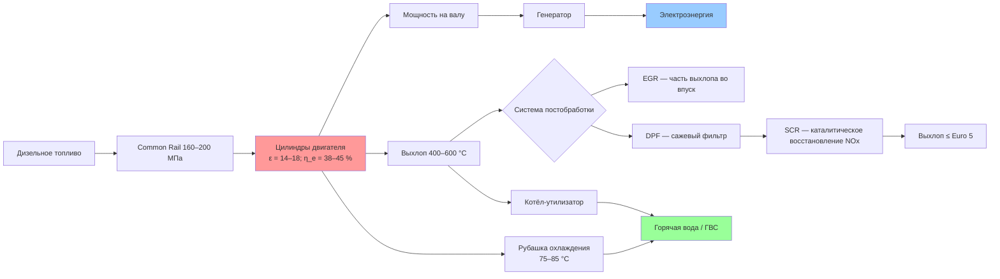

Дизельные двигатели с воспламенением от сжатия (Compression Ignition, CI) — наиболее распространённый тип поршневых машин в системах когенерации на объектах без магистрального газоснабжения. Они отличаются высоким электрическим КПД (38–45 %), долговечностью и способностью эффективно рекуперировать тепло выхлопных газов и рубашки охлаждения двигателя. Суммарный КПД когенерационной установки при полной утилизации всех тепловых потоков достигает 80–90 %, что обеспечивает высокую конкурентоспособность в секторе распределённой генерации и резервного электроснабжения. Проектирование установок регламентируется ASHRAE Handbook HVAC Systems and Equipment, ISO 3046, EN 12639 и СП 60.13330.2020.

## Физические принципы и рабочий цикл

Рабочий процесс дизельного двигателя следует термодинамическому циклу Дизеля с подводом теплоты при постоянном давлении. Индикаторный КПД идеального цикла:


\eta_\text{ind} = 1 - \frac{1}{\varepsilon^{\gamma-1}} \cdot \frac{\lambda^\gamma - 1}{\gamma(\lambda - 1)}


где $\varepsilon = V_1/V_2$ — степень сжатия (обычно 14–18); $\gamma \approx 1{,}40$ — показатель адиабаты воздуха; $\lambda$ — коэффициент предварительного расширения (отношение объёма цилиндра в конце сгорания к объёму в начале расширения).

Основные этапы четырёхтактного цикла:

1. **Впуск** (induction): поршень движется вниз при открытом впускном клапане — в цилиндр поступает атмосферный или предварительно нагнетённый воздух.
2. **Сжатие** (compression): оба клапана закрыты; воздух сжимается до $p_\text{max} = 3{,}5$–$6{,}0$ МПа, $T_\text{max} = 700$–$900$ К.
3. **Рабочий ход** (power stroke): в конце сжатия впрыскивается топливо и самовоспламеняется; расширение газов совершает работу на поршне.
4. **Выпуск** (exhaust): открывается выпускной клапан; отработанные газы покидают цилиндр при $T_\text{exhaust} = 400$–$600$ °C с энтальпией, пригодной для рекуперации.

Эффективная мощность двигателя:


P_e = p_e \cdot V_\text{sweep} \cdot \frac{n}{120}\quad \text{[кВт]}


где $p_e$ — среднее эффективное давление ($0{,}7$–$1{,}0$ МПа для атмосферных двигателей; $1{,}2$–$1{,}8$ МПа для турбонаддувных); $V_\text{sweep}$ — рабочий объём, л; $n$ — частота вращения, об/мин.

## Конструкция основных узлов

### Блок двигателя и поршневая группа

Блок цилиндров изготавливается из серого чугуна или алюминиевых сплавов. Поршни — из алюминиевых сплавов с высокопрочными кольцами; при высоких нагрузках применяются кованые поршни. Коленчатый вал преобразует возвратно-поступательное движение поршней во вращательное: для двигателей 10–500 кВт применяют валы из ковкого чугуна или стальные кованые.

### Топливная система Common Rail

Современные дизельные двигатели используют систему Common Rail с давлением впрыска 160–200 МПа, обеспечивающей тонкое распыление и полное сгорание. Плотность дизельного топлива $\rho = 820$–$860$ кг/м³, вязкость при 40 °C — 2,0–4,5 мм²/с (сСт), НТС — 44–46 МДж/кг. Требования к топливу: EN 590 (Европа) или ГОСТ 305-2013 (Россия). При температурах ниже $-20$ °C необходимы зимние сорта и подогрев топлива.

### Система охлаждения рубашки

Рубашка охлаждения двигателя омывается смесью воды и этиленгликоля (40–50 % об.) с температурой 75–85 °C на выходе из двигателя. Тепловая мощность, снимаемая рубашкой:


\dot{Q}_\text{jacket} = \dot{m}_\text{coolant} \cdot c_p \cdot (T_\text{out} - T_\text{in})


где $c_p \approx 3{,}5$ кДж/(кг·К) для водогликолевой смеси. Доля тепла через рубашку составляет 20–30 % от теплоты сгорания топлива.

### Рекуперация тепла выхлопных газов

Выхлоп дизельного двигателя при 400–600 °C содержит 15–25 % теплоты сгорания. Котёл-утилизатор (exhaust heat recovery boiler) на выхлопном трубопроводе снижает температуру газов до 120–180 °C, рекуперируя до 60–80 % энергии выхлопа. Рекуперированное тепло направляется в системы теплоснабжения или ГВС.


| Статья | Доля от теплоты топлива, % |
|---|---|
| Электрическая мощность | 38–45 |
| Тепло рубашки охлаждения | 20–30 |
| Тепло выхлопных газов | 15–25 |
| Потери в окружающую среду | 5–10 |


### Турбонаддув и промежуточное охлаждение

Турбокомпрессор повышает среднее эффективное давление с 0,7–0,8 МПа (атмосферный двигатель) до 1,2–1,8 МПа. Промежуточный охладитель (intercooler) снижает температуру нагнетаемого воздуха со 130–150 °C до 40–50 °C, улучшая наполнение цилиндра и снижая образование NOₓ.

## Показатели тепловой эффективности

Электрический КПД дизельного двигателя:


\eta_e = \frac{P_e}{\dot{Q}_\text{fuel}} \times 100\ [\%]


Удельный расход топлива (brake specific fuel consumption, BSFC):


b_e = \frac{\dot{m}_\text{fuel}}{P_e} = \frac{3600}{H_u \cdot \eta_e}\quad \text{[г/(кВт·ч)]}


Для современных двигателей $b_e = 200$–$230$ г/(кВт·ч) при номинальной нагрузке.

**Пример расчёта.** Двигатель мощностью 500 кВт, $\eta_e = 40$ %, $H_u = 44$ МДж/кг:


\dot{m}_\text{fuel} = \frac{P_e}{\eta_e \cdot H_u} = \frac{500}{0{,}40 \cdot 44\,000} = 0{,}0284\ \text{кг/с} = 102\ \text{кг/ч}


Суммарный КПД когенерации при рекуперации тепла рубашки и выхлопа:


\eta_\text{CHP} = \eta_e + \frac{\dot{Q}_\text{jacket} + \dot{Q}_\text{exhaust}}{\dot{Q}_\text{fuel}} = 0{,}80 \text{–} 0{,}92


## Системы постобработки выхлопных газов

Основной недостаток дизельных двигателей — повышенные выбросы NOₓ (5–15 г/кВт·ч без постобработки), твёрдых частиц (PM — Particulate Matter) и чёрного углерода. Современные системы позволяют привести выбросы в соответствие с требованиями норм ЕС Euro 5 и выше.

### Избирательное каталитическое восстановление NOₓ — SCR

SCR (Selective Catalytic Reduction) использует карбамид или аммиак в качестве восстановителя:


4\,\text{NO} + 4\,\text{NH}_3 + \text{O}_2 \rightarrow 4\,\text{N}_2 + 6\,\text{H}_2\text{O}


КПД системы SCR составляет 80–95 % в диапазоне температур выхлопа 300–500 °C. При температурах ниже этого диапазона требуется электрический подогрев выхлопа.

### Дизельный сажевый фильтр — DPF

DPF (Diesel Particulate Filter) задерживает частицы PM размером более 0,1 мкм с эффективностью 85–99 %. Регенерация фильтра (выжигание накопленной сажи) производится пассивно при $T > 400$ °C или активно с помощью электронагревателя или впрыска топлива. Без фильтрации выбросы PM составляют 0,5–2,0 г/кВт·ч; с DPF — ниже 0,05 г/кВт·ч.

### Рециркуляция выхлопных газов — EGR

EGR (Exhaust Gas Recirculation) направляет 10–30 % выхлопных газов обратно во впускной коллектор. Это снижает пиковую температуру сгорания и уменьшает образование NOₓ на 30–50 %, однако требует охлаждения рециркулирующих газов и увеличивает нагрузку на систему очистки масла.

## Применение в системах когенерации ОВК

### Распределённая генерация

Дизельные когенерационные установки мощностью 5–500 кВт применяются для теплоэлектроснабжения многоквартирных домов, учреждений здравоохранения и промышленных предприятий. В медицинских учреждениях и критически важных объектах, требующих максимальной надёжности, дизельные двигатели имеют преимущество перед газовыми — независимость от магистрального газоснабжения.

### Климатические условия и размещение

Дизельное топливо пригодно для работы в диапазоне температур от $-40$ °C до $+50$ °C при применении соответствующих зимних сортов (марка З по ГОСТ 305-2013). Установки размещаются в хорошо вентилируемых помещениях с расходом вентиляционного воздуха 3–5 м³/(кВт·мин) для горения и охлаждения. В соответствии с СП 60.13330 расстояние от выхлопной трубы до соседних оконных проёмов составляет не менее 5–10 м в зависимости от мощности установки.

## Практические рекомендации по выбору и эксплуатации


| Параметр | Значение |
|---|---|
| Электрический КПД | 38–42 % |
| Тепловой КПД (рубашка + выхлоп) | 45–55 % |
| Суммарный КПД когенерации | 82–88 % |
| Удельный расход топлива | 210–240 г/(кВт·ч) |
| Удельное выделение тепла | 1400–1800 кДж/кВт·ч |
| Выбросы NOₓ (без SCR) | 8–12 г/кВт·ч |
| Выбросы PM (без DPF) | 0,8–1,5 г/кВт·ч |


**Выбор мощности.** Рекомендуется покрывать 40–60 % годового электрического спроса и 60–80 % тепловой потребности объекта; большая установка снижает коэффициент использования и ухудшает экономику.

**Условия выбора дизельного двигателя вместо газового:**
- отсутствие подвода магистрального природного газа;
- высокий коэффициент использования (> 4000–5000 ч/год);
- требования к надёжности при широком диапазоне нагрузок;
- наличие резервного хранилища топлива (минимум 1–3 суток запаса).

**Обязательные элементы системы:**
- котёл-утилизатор на выхлопной трубе для максимального использования тепла;
- SCR + DPF при высоких экологических требованиях;
- интервал технического обслуживания 500–1000 ч (замена масла, фильтров, свечей накала).

## Нормативные документы

- ASHRAE Handbook — HVAC Systems and Equipment, Chapter 7: Cogeneration Systems
- ASHRAE Standard 90.1: Energy Standard for Buildings
- EN 12639: Определение мощности и эффективности стационарных ДВС
- ISO 3046: Reciprocating internal combustion engines — performance
- ISO 8528: Generating sets driven by reciprocating internal combustion engines
- ГОСТ 305-2013: Топливо дизельное — технические условия
- СП 60.13330.2020: Отопление, вентиляция и кондиционирование воздуха
