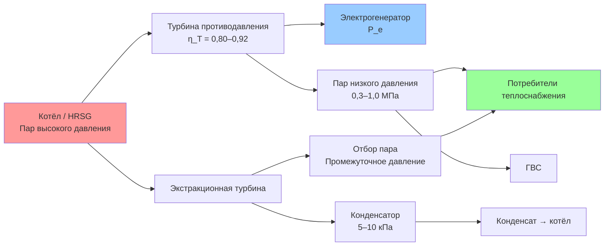

Паровые турбины — классический тип первичных двигателей в системах комбинированного производства тепла и электроэнергии (ТЭЦ). Они преобразуют тепловую энергию пара в механическую работу по циклу Ренкина и применяются для привода электрогенераторов, компрессоров и насосов. В когенерационных системах паровые турбины обеспечивают одновременное производство электроэнергии и подачу полезного тепла потребителям теплоснабжения и ГВС. Коэффициент полезного использования топлива при когенерации на паровых турбинах достигает 60–80 %, что значительно превышает эффективность раздельного производства 35–40 %. Проектирование систем регламентируется ASHRAE Handbook HVAC Systems and Equipment, ASHRAE 90.1, EN 12831 и СП 60.13330.2020.

## Физические принципы и термодинамический цикл Ренкина

Работа паровой турбины основана на адиабатном расширении пара от высокого давления к низкому. В идеальном процессе расширение изоэнтропное (адиабатное и обратимое). Реальный процесс сопровождается необратимостями: трение в лопатках, дросселирование в направляющих аппаратах, утечки пара через зазоры.

Механическая мощность, развиваемая турбиной:


W_T = \dot{m}\, (h_1 - h_2)


где $\dot{m}$ — расход пара, кг/с; $h_1$ — энтальпия на входе, кДж/кг; $h_2$ — энтальпия на выходе, кДж/кг.

Изоэнтропный КПД турбины (isentropic efficiency):


\eta_T = \frac{h_1 - h_2}{h_1 - h_{2s}}


где $h_{2s}$ — энтальпия на выходе при изоэнтропном расширении. Типовые значения: 0,75–0,92 в зависимости от размера и конструкции. КПД возрастает с мощностью: малые машины (100–500 кВт) — 0,75–0,82; крупные промышленные турбины — 0,85–0,92.

Электрическая мощность с учётом КПД генератора:


P_e = \eta_\text{gen} \cdot \dot{m}\, (h_1 - h_2) \cdot \eta_T


где $\eta_\text{gen} = 0{,}95$–$0{,}98$ — КПД электрогенератора.

## Типы паровых турбин в когенерационных системах

### Турбины противодавления (back-pressure turbines)

Турбины противодавления расширяют пар до промежуточного давления 0,3–0,5 МПа (3–5 бар), после чего отработанный пар направляется к потребителям теплоснабжения и ГВС. Эти турбины оптимальны для когенерационных систем с постоянным тепловым спросом. Диапазон параметров:
- давление входного пара: 2–13 МПа;
- температура входного пара: 250–540 °C;
- давление противодавления: 0,1–1,0 МПа.

Удельный расход пара — обратный показатель удельной работы:


d = \frac{3600}{W_T} = \frac{3600}{\eta_T\, (h_1 - h_{2s})}\quad \text{[кг/кВт·ч]}


Типовые значения для турбин противодавления: 4–6 кг/кВт·ч.

### Экстракционно-конденсационные турбины

Турбины с промежуточными отборами пара (extraction-condensation turbines) позволяют гибко регулировать соотношение тепловой и электрической мощности. Часть пара отбирается на промежуточных ступенях при давлении 0,3–2,0 МПа для технологических нужд или теплоснабжения; остальной пар расширяется до давления конденсации ≈ 5–10 кПа. КПД достигает 85–90 % при оптимальном распределении потоков. Удельный расход пара при работе на конденсатор: 2–4 кг/кВт·ч.

### Турбины механического привода

Небольшие паровые турбины мощностью 100–500 кВт применяются для привода насосов, вентиляторов и компрессоров в системах ОВК. Типовые параметры входного пара: 1–4 МПа, 200–350 °C. Экономически целесообразны только при наличии избыточного пара или высокой стоимости электроэнергии — как правило, в промышленных комплексах с собственной котельной.

## Входные и выходные параметры

### Параметры входного пара


| Тип системы | Давление, МПа | Температура, °C | Расход пара, т/ч |
|---|---|---|---|
| Малая ТЭЦ | 2–4 | 250–350 | 5–20 |
| Средняя ТЭЦ | 6–10 | 400–500 | 20–100 |
| Крупная ТЭЦ | 10–13 | 500–540 | > 100 |


Высокое давление и температура увеличивают располагаемый перепад энтальпии $(h_1 - h_{2s})$, но требуют более дорогих конструкционных материалов.

### Давление конденсации

Давление в конденсаторе определяется температурой охлаждающей воды:


P_\text{cond} = P_\text{sat}(T_\text{coolant})


При температуре охлаждающей воды 15–20 °C давление насыщения составляет 1,7–2,3 кПа. На каждый 1 °C повышения температуры охлаждающей воды КПД турбины снижается на 0,3–0,5 % — критически важно учитывать в летний период.

### Давление отбора пара

Давление промежуточного отбора выбирается по потребителю:
- теплоснабжение и ГВС: 0,3–0,6 МПа
- сушильные установки: 0,5–2,0 МПа
- технологические процессы: 0,5–10,0 МПа

## Методика теплового расчёта

Тепловая мощность, отводимая на промежуточном отборе:


\dot{Q}_\text{heat} = \dot{m}_\text{ext} \cdot (h_\text{ext} - h_\text{cond})


где $\dot{m}_\text{ext}$ — расход пара на отбор, кг/с; $h_\text{ext}$ — энтальпия отбираемого пара, кДж/кг; $h_\text{cond} \approx 417$ кДж/кг — энтальпия конденсата при 10 кПа.

**Пример расчёта.** Паровая турбина противодавления: $\dot{m} = 10$ кг/с, $h_1 = 3100$ кДж/кг (пар 6 МПа / 400 °C), $h_{2s} = 2720$ кДж/кг, $\eta_T = 0{,}85$, $\eta_\text{gen} = 0{,}97$:


P_e = 0{,}97 \cdot 10 \cdot (3100 - 2720) \cdot 0{,}85 = 0{,}97 \cdot 10 \cdot 323 = 3133\ \text{кВт}


При давлении противодавления 0,4 МПа (температура насыщения 144 °C, $h_\text{ext} \approx 2740$ кДж/кг) тепловая мощность:


\dot{Q}_\text{heat} = 10 \cdot (2740 - 417) = 23\,230\ \text{кВт} = 23{,}2\ \text{МВт}


Соотношение PHR (Power-to-Heat Ratio):


PHR = \frac{P_e}{\dot{Q}_\text{heat}} = \frac{3133}{23\,230} = 0{,}135


Низкий PHR характерен для турбин противодавления: они максимизируют тепловой выход ценой электрической мощности.

## Регулировочные характеристики

Турбины работают в диапазоне 60–100 % номинальной мощности. При частичных нагрузках КПД снижается на 2–5 % из-за дросселирования в регулировочных клапанах. Экстракционные турбины требуют более сложных систем управления для поддержания заданного давления отбора при изменении нагрузки.

Реакция на ступенчатое изменение отопительного спроса — ключевой показатель для систем теплоснабжения. Паровые турбины благодаря тепловой инерции парового котла реагируют медленнее, чем поршневые двигатели, что при проектировании систем управления требует учёта динамических характеристик паровой системы.

## Применение в системах ОВК

В системах отопления, вентиляции и кондиционирования паровые турбины решают следующие задачи:

1. **Привод центробежных компрессоров тепловых насосов** для утилизации избыточного технологического пара.
2. **Электроснабжение насосов циркуляции** в крупных системах централизованного теплоснабжения (мощность 30–150 кВт).
3. **Привод вентиляторов** систем вентиляции и кондиционирования в промышленных зданиях.
4. **Гибридные системы ТЭЦ** с регулируемым отбором пара к потребителям.

Когенерационные системы с паровыми турбинами широко применяются в регионах с холодным климатом и стабильным тепловым спросом, типичным для России и Скандинавии, где коэффициент использования тепла достигает 70–80 % в течение отопительного сезона.

## Типовые ошибки проектирования

- Недооценка снижения КПД при повышении температуры охлаждающей воды конденсатора в летний период.
- Игнорирование инерционности парового контура при скачках теплового спроса.
- Отсутствие резервного конденсатора для поддержания работы при остановке основного теплопотребителя.
- Выбор давления отбора без анализа температурного графика системы теплоснабжения: давление отбора должно соответствовать $T_\text{supply}$ теплосети с запасом 10–15 °C.

## Нормативные документы

- ASHRAE Handbook — HVAC Systems and Equipment, Chapter 7: Cogeneration Systems
- ASHRAE Standard 90.1: Energy Standard for Buildings
- EN 12831: Системы отопления в зданиях — расчёт проектной тепловой нагрузки
- EN 12952: Водотрубные котлы — требования к конструкции и оборудованию
- IEC 60045-1: Steam turbines — specification
- ГОСТ 28004: Паровые турбины — технические требования
- СП 60.13330.2020: Отопление, вентиляция и кондиционирование воздуха
- СП 41-01-95: Проектирование тепловых пунктов
