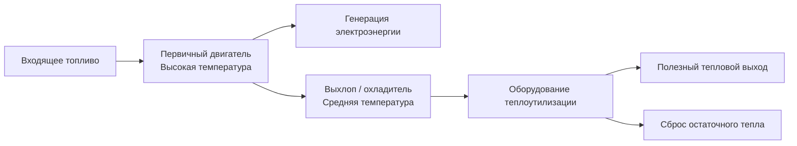
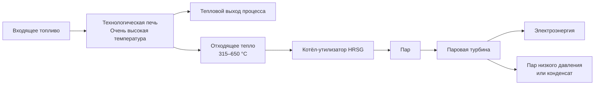
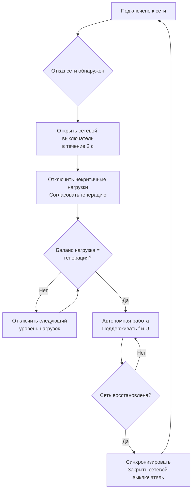

Конфигурации систем когенерации определяют способ интеграции первичных двигателей, оборудования теплоутилизации и электрических систем для обеспечения нагрузок объекта при сохранении надёжности и оптимизации эффективности. Фундаментальное различие между циклами с верхним и нижним уровнем сжигания задаёт термодинамическую логику, а режимы работы устанавливают взаимодействие с энергосистемой и стратегии управления. Правильный выбор конфигурации и её согласование с профилем нагрузок объекта максимизируют экономические и экологические преимущества, соответствуя требованиям ASHRAE Handbook HVAC Systems, ASHRAE 90.1 и СП 60.13330.

## Конфигурации цикла с верхним уровнем сжигания

Циклы с верхним уровнем сжигания (topping cycles) сначала генерируют электроэнергию из высокотемпературной энергии топлива, а затем рекуперируют тепловую энергию более низкого потенциала из процесса генерации. Это доминирующая конфигурация когенерации — на неё приходится более 95 % установленной мощности. Термодинамическое преимущество состоит в извлечении максимальной работы из топлива до деградации качества энергии на тепловых потребителей.

Каскад энергии в цикле с верхним уровнем сжигания:

**Газотурбинный цикл с верхним уровнем.** Топливо сгорает при температурах выше 1300 °C; продукты сгорания расширяются через ступени турбины до атмосферного давления. Температуры выхлопа 480–590 °C позволяют генерировать пар высокого давления или обеспечивать прямой технологический нагрев. Электрический КПД 25–42 %; дополнительная рекуперация тепла — 40–50 % расхода топлива.

**Поршневые двигатели с верхним уровнем** достигают более высокого электрического КПД (32–42 %), но дают тепловой выход более низкого температурного потенциала. Температуры выхлопа 425–540 °C поддерживают выработку пара низкого и среднего давления. Дополнительная рекуперация из рубашки охлаждения (82–110 °C) и масла (71–93 °C) повышает суммарный КПД когенерации.

Соотношение PHR (Power-to-Heat Ratio) характеризует выходные данные цикла с верхним уровнем:


PHR = \frac{W_\text{elec}}{Q_\text{thermal}} = \frac{\eta_\text{elec}}{\eta_\text{thermal}}


Газовые турбины имеют PHR 0,5–1,0; поршневые двигатели — 0,8–1,5; микротурбины — 0,6–1,2.

Суммарный КПД системы:


\eta_\text{total} = \eta_\text{elec} + \eta_\text{thermal} = \frac{W_\text{elec}}{Q_\text{fuel}} + \frac{Q_\text{thermal}}{Q_\text{fuel}}


Типовые циклы с верхним уровнем достигают суммарного КПД 70–85 %; передовые комбинированные циклы — выше 90 %.

## Конфигурации цикла с нижним уровнем сжигания

Циклы с нижним уровнем сжигания (bottoming cycles) меняют энергетическую иерархию: сначала удовлетворяются высокотемпературные технологические потребности, а затем электроэнергия генерируется из потока отходящего тепла. Эти конфигурации применяются в промышленности — производство стали, цемента, стекла.

HRSG в циклах с нижним уровнем преобразует отходящее тепло в пар при давлениях 1–10 МПа. Паровые турбины противодавления поддерживают давление выхлопа 0,1–1,0 МПа для последующего теплового использования; конденсационные турбины максимизируют выработку электроэнергии за счёт расширения до давления ниже атмосферного.

Термодинамический предел КПД — эффективность Карно:


\eta_\text{Carnot} = 1 - \frac{T_\text{cond}}{T_\text{boiler}}


При температурах отходящего тепла 425–650 °C (700–920 К) и температуре конденсации 38–65 °C (310–340 К) теоретический максимум — 55–65 %. Практические паровые турбины нижнего цикла достигают электрического КПД 15–25 %, а выходная мощность:


W_\text{elec} = \dot{m}_\text{steam} \cdot (h_\text{inlet} - h_\text{outlet}) \cdot \eta_\text{turbine} \cdot \eta_\text{gen}


где $\eta_\text{turbine} \cdot \eta_\text{gen} = 0{,}85$–$0{,}92$.

## Конфигурации комбинированного цикла

Системы комбинированного цикла (combined cycle) интегрируют газотурбинный цикл верхнего уровня с паротурбинным циклом нижнего уровня для максимизации электрического КПД:


W_\text{CC} = W_\text{GT} + W_\text{ST}


Паровая турбина обычно производит 30–50 % мощности газовой турбины.


| Конфигурация | Электрический КПД | Тепловой выход | Суммарный КПД | PHR |
|---|---|---|---|---|
| Простой цикл ГТУ | 28–36 % | 50–60 % | 78–90 % | 0,5–0,7 |
| Комбинированный цикл без когенерации | 50–60 % | Минимальный | 52–62 % | > 10 |
| Комбинированный цикл когенерации | 45–52 % | 30–35 % | 75–85 % | 1,3–1,7 |
| Поршневой двигатель | 35–42 % | 40–50 % | 75–85 % | 0,8–1,0 |


Дополнительное сжигание в HRSG (supplemental firing) повышает выработку пара при наличии 15–17 % O₂ в выхлопе без подачи дополнительного воздуха. Это снижает PHR и обеспечивает гибкость при сезонных изменениях теплового спроса.

## Параллельная работа с сетью

Параллельная работа с сетью (grid-parallel operation) поддерживает постоянное электрическое соединение с энергосистемой, обеспечивая двунаправленный поток энергии. Конфигурация максимизирует надёжность (сеть — резервный источник при обслуживании когенерации), позволяя при необходимости экспортировать избыточную генерацию.

### Требования к сетевому взаимодействию (IEEE 1547)

**Защитные реле:**
- защита по напряжению: типовой диапазон 88–110 % номинала;
- защита по частоте: 49,3–50,5 Гц (для систем 50 Гц);
- защита от несанкционированного разделения (anti-islanding protection): обнаружение изоляции в течение 2 с;
- защита от замыкания на землю, согласованная с защитой сетевой организации.

**Требования к синхронизации:**
- разброс напряжения: ±5 %;
- разброс частоты: ±0,1 Гц;
- разброс угла фаз: ±10 °.

**Качество электроэнергии:**
- суммарное гармоническое искажение THD < 5 % (IEEE 519);
- поддержание коэффициента мощности 0,95–1,0;
- регулирование напряжения ±5 % в точке общего подключения.

### Режимы параллельной работы

**Режим следования сети (grid-following):** когенерация работает при постоянном выходе; сеть принимает или выдаёт разницу. Простой режим управления; оптимальный КПД когенерации; ограниченные возможности следования нагрузке.

**Режим следования нагрузке (load-following):** когенерация модулирует выход для минимизации взаимодействия с сетью. Снижает плату за пиковый спрос; может ухудшить КПД при частичных нагрузках.

**Режим снижения пиков (peak shaving):** когенерация работает в периоды максимальной платы за мощность или максимальных тарифов. Экономически оптимизирована по структуре тарифов.

**Режим базовой нагрузки (base load):** непрерывная работа при номинальной мощности. Максимальное использование оборудования; коэффициент использования 85–95 %; минимальная сложность управления.

## Автономный режим работы

Автономный режим (island mode, off-grid) полностью отключает когенерацию от энергосистемы, требуя точного баланса нагрузок при поддержании приемлемого регулирования напряжения и частоты.

Фундаментальное условие в автономном режиме — мгновенный баланс мощности:


P_\text{CHP}(t) = P_\text{load}(t) + P_\text{losses}(t)


Любое несоответствие вызывает отклонение частоты, определяемое инерцией системы:


\frac{df}{dt} = \frac{P_\text{CHP} - P_\text{load}}{2H \cdot S_\text{base}}


где $H$ — постоянная инерции системы (обычно 2–5 с для генераторов когенерации); $S_\text{base}$ — установленная мощность. Поддержание частоты в пределах ±0,5 Гц требует, чтобы скорость изменения нагрузки не превышала 5–10 %/с или применялось быстродействующее управление нагрузкой.

**Управление нагрузкой (load shedding):** автоматическое отключение по приоритетам:
1. Приоритет 1 (критичный): безопасность жизнедеятельности, противопожарные системы, аварийное освещение;
2. Приоритет 2 (важный): системы HVAC, основное освещение, коммуникации;
3. Приоритет 3 (некритичный): розеточные группы, вспомогательные нагрузки.

**Регулирование по статизму (droop control):** при параллельной работе нескольких генераторов:


f = f_\text{rated} - R \cdot \frac{P - P_\text{rated}}{P_\text{rated}}


где $R$ — статизм регулятора (обычно 3–5 %), обеспечивающий пропорциональное распределение нагрузки между параллельно работающими машинами.

**Регулирование напряжения:** автоматический регулятор возбуждения (AVR — Automatic Voltage Regulator) поддерживает напряжение в пределах ±5 % при изменениях нагрузки через регулировку тока возбуждения. Необходимая полная мощность генератора:


S_\text{gen} = \sqrt{P_\text{load}^2 + Q_\text{load}^2}


## Оптимизация соотношения тепловой и электрической мощности

Соотношение TER (Thermal-to-Electric Ratio) — величина, обратная PHR:


TER = \frac{Q_\text{thermal}}{W_\text{elec}} = \frac{1}{PHR}


Переменные во времени электрические и тепловые нагрузки объекта характеризуются кривыми длительности нагрузки. Оптимальный размер когенерации согласует TER системы с характеристиками нагрузок при максимизации часов работы и коэффициента использования.

Текущее соотношение электрических и тепловых нагрузок объекта:


FR(t) = \frac{P_\text{elec}(t)}{Q_\text{thermal}(t)}


### Стратегии определения размеров

**Следование тепловой нагрузке (thermal load following):** когенерация размерами под базовую тепловую нагрузку, непрерывно покрывая тепловой спрос:


W_\text{CHP} = \frac{Q_\text{thermal,base}}{TER_\text{system}}


Оптимально для объектов с высокой стабильной тепловой нагрузкой (больницы, гостиницы, производство). Электроэнергия может частично закупаться из сети.

**Следование электрической нагрузке (electrical load following):** когенерация под базовую электрическую нагрузку, с переменным использованием тепла:


W_\text{CHP} = P_\text{elec,base}


Тепловой аккумулятор или дополнительный котёл компенсирует несоответствие производства и потребления тепла. Оптимально при высоких тарифах на электроэнергию и переменных тепловых нагрузках.

**Экономическая оптимизация:** размер под максимизацию ЧПС (NPV):


NPV = \max_{W_\text{CHP}} \left[\sum_{t=1}^{n} \frac{(\text{экономия энергии} - \text{затраты на ТО})_t}{(1+r)^t} - C_0(W_\text{CHP})\right]


Как правило, оптимальная мощность составляет 60–80 % пикового спроса.


| Конфигурация | Диапазон TER | Применения | Преимущества | Ограничения |
|---|---|---|---|---|
| ГТУ простого цикла | 1,5–2,0 | Технологический пар, ЦТП | Высокий тепловой выход | Низкий электрический КПД |
| ГТУ комбинированного цикла | 0,6–0,8 | Крупные объекты, кампусы | Высокий электрический КПД | Меньший тепловой выход |
| Поршневой двигатель | 0,7–1,2 | Коммерческие здания, лёгкая промышленность | Высокий КПД, гибкость | Низкая температура выхлопа |
| Паровая турбина противодавления | 3,0–6,0 | Объекты с технологическим паром | Максимальный тепловой выход | Малый электрический выход |
| Паровая турбина с отбором | 1,5–4,0 | Переменные тепловые нагрузки | Регулируемый TER | Сложная система управления |
| Микротурбина | 1,0–1,6 | Малые коммерческие объекты | Компактность, низкое ТО | КПД ниже среднего |


## Системная интеграция

Успешные конфигурации когенерации требуют интеграции электрической, тепловой и управляющей подсистем.

**Электрическая интеграция:**
- достаточная мощность короткого замыкания для координации защит;
- THD в соответствии с IEEE 519 (< 5 %);
- регулирование напряжения в пределах ГОСТ 32144 (±10 %) или ANSI C84.1 (±5 %);
- возможность синхронизации для параллельной работы с сетью.

**Тепловая интеграция:**
- теплообменники рассчитаны на полную рекуперацию при проектных условиях;
- аккумулятор тепловой энергии на 4–8 ч для буферизации несоответствия нагрузки и производства;
- распределительная система, рассчитанная на весь тепловой выход когенерации;
- соответствие температурных уровней требованиям потребителей согласно EN 12831.

**Интеграция управления:**
- мониторинг SCADA электрических и тепловых параметров;
- автоматическое управление нагрузками для автономного режима;
- предиктивное управление на основе прогнозов погоды и расписания объекта;
- интеграция с системой автоматизации здания (BAS/BMS).

**Операционная гибкость:**
- минимальная нагрузка 50–70 % от номинала;
- время пуска до номинальной мощности: двигатели — 1–2 мин; турбины — 10–30 мин;
- скорость нарастания нагрузки 5–20 %/мин для следования нагрузке.

## Нормативные документы

- ASHRAE Handbook — HVAC Systems and Equipment, Chapter 7: Cogeneration Systems
- ASHRAE Standard 90.1: Energy Standard for Buildings
- EN 12831: Системы отопления в зданиях — расчёт тепловой нагрузки
- EN 15316: Системы отопления в зданиях — системная энергетическая эффективность
- СП 60.13330.2020: Отопление, вентиляция и кондиционирование воздуха
- IEEE 1547: Standard for Interconnecting Distributed Resources with Electric Power Systems
- DOE Combined Heat and Power Technology Fact Sheets
