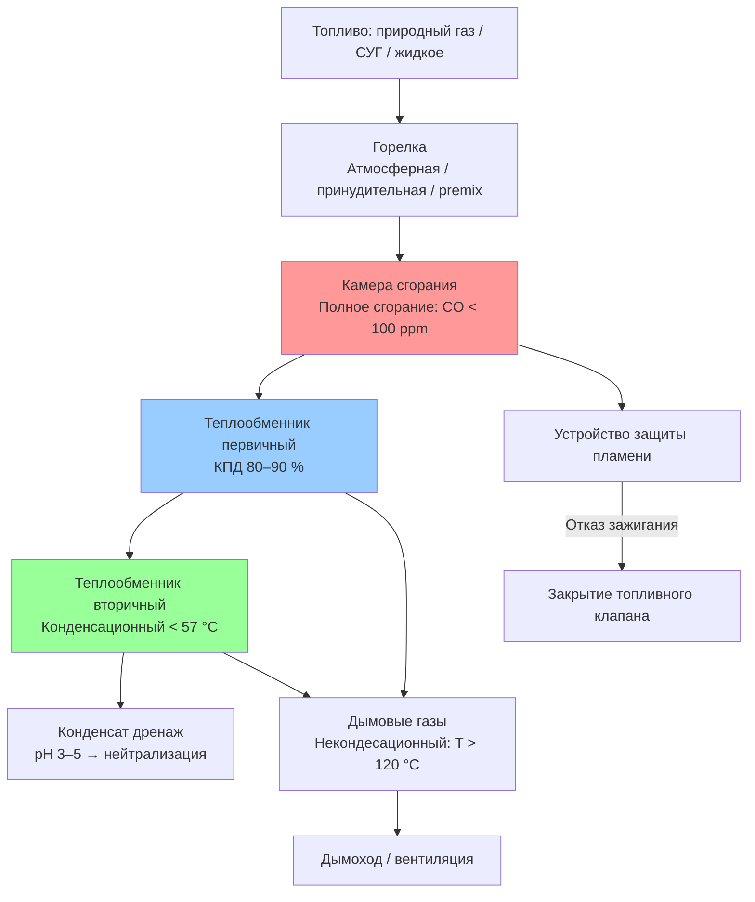

Системы отопления на основе сжигания топлива (combustion heating systems) преобразуют химическую энергию углеводородного топлива в тепловую посредством реакций окисления. Эти системы остаются доминирующей технологией отопления в жилых, коммерческих и промышленных приложениях благодаря высокой плотности энергии топлива, быстрому динамическому отклику и устоявшейся инфраструктуре поставки. Технические требования к оборудованию регламентируются ASHRAE Handbook HVAC Systems and Equipment, ASHRAE 90.1, EN 303-1/-2 и СП 60.13330.2020.

## Основы стехиометрии горения

Полное сгорание происходит при реакции углеводородного топлива с достаточным количеством кислорода. Стехиометрические уравнения для основных топлив:

Метан (основной компонент природного газа):


\text{CH}_4 + 2\,\text{O}_2 \rightarrow \text{CO}_2 + 2\,\text{H}_2\text{O} + 890\ \text{кДж/моль}


Пропан (СНГ):


\text{C}_3\text{H}_8 + 5\,\text{O}_2 \rightarrow 3\,\text{CO}_2 + 4\,\text{H}_2\text{O} + 2220\ \text{кДж/моль}


Лёгкое жидкое топливо (дизельный дистиллят, аппроксимация $\text{C}_{12}\text{H}_{26}$):


\text{C}_{12}\text{H}_{26} + 18{,}5\,\text{O}_2 \rightarrow 12\,\text{CO}_2 + 13\,\text{H}_2\text{O} + 46{,}0\ \text{МДж/кг}


Фактическое сгорание требует избытка воздуха (excess air) сверх стехиометрии для обеспечения полноты сгорания. Недостаток воздуха производит CO и несгоревшие углеводороды, снижает КПД и создаёт опасность. Избыток воздуха разбавляет продукты сгорания, увеличивает объём дымовых газов и снижает КПД за счёт роста потерь в дымовой трубе.

Фактический расход воздуха:


V_\text{air,actual} = V_\text{air,theor} \cdot (1 + EA)


где $EA$ — коэффициент избытка воздуха в виде десятичной дроби. Избыток воздуха определяется по содержанию кислорода в дымовых газах:


EA = \frac{[\text{O}_2]}{20{,}9 - [\text{O}_2]} \times 100\ [\%]


Типовые значения: 10–20 % для горелок природного газа; 15–25 % для пропана; 20–40 % для горелок жидкого топлива.

## Характеристики топлива

### Природный газ

Природный газ состоит преимущественно из метана (85–95 %) с меньшими долями этана, пропана и инертных газов. Теплота сгорания: ВТС (HHV) 37–42 МДж/м³, НТС (LHV) 33–38 МДж/м³ при стандартных условиях (15 °C, 101,3 кПа). Природный газ не требует хранения на объекте, сгорает с минимальными выбросами твёрдых частиц и упрощает техническое обслуживание по сравнению с жидким топливом.

Требование к воздуху горения: примерно 9,5–10 м³ воздуха на 1 м³ топлива при стехиометрическом сгорании.

### Пропан и сжиженный углеводородный газ (СУГ)

Пропан обеспечивает НТС ≈ 88 МДж/м³ (пар) и 24,0 МДж/л (жидкость). Более высокая объёмная теплота сгорания позволяет использовать трубопроводы меньшего сечения. Пропан испаряется при $-42$ °C при атмосферном давлении — пригоден для работы в суровых климатических условиях без внешних испарителей. Хранение в виде сжиженного газа при давлении 690–1380 кПа требует соответствующих ёмкостей и редукторов давления.

### Жидкое топливо

Дистиллятное топливо (No. 2 Fuel Oil, аналог дизельного топлива марки Л по ГОСТ 305-2013) доминирует в жилых и коммерческих применениях с НТС 37,0–37,7 МДж/л. Тяжёлые марки (No. 4, 5, 6) требуют предварительного подогрева для надлежащего распыления. Сгорание жидкого топлива производит твёрдые частицы и оксиды серы, что требует более частого обслуживания и, возможно, систем контроля выбросов.

## Тепловыделение и эффективность

**Высшая теплота сгорания** (ВТС, HHV) — полное выделение энергии, включая скрытую теплоту конденсации водяного пара продуктов сгорания. **Низшая теплота сгорания** (НТС, LHV) — без этой скрытой теплоты. Для природного газа ВТС превышает НТС примерно на 10 %. Стандарты Северной Америки и большинство российских норм ссылаются на ВТС при оценке КПД.

**КПД сгорания** — доля энергии топлива, передаваемой теплообменнику:


\eta_\text{comb} = \frac{\dot{Q}_\text{fuel} - \dot{Q}_\text{stack}}{\dot{Q}_\text{fuel}} \times 100\ [\%]


Потери в дымовой трубе складываются из явной теплоты дымовых газов и потерь от неполного сгорания:


\dot{Q}_\text{stack} = \dot{m}_\text{fg} \cdot c_p \cdot (T_\text{fg} - T_\text{amb}) + \dot{Q}_\text{fuel} \cdot (1 - C_\text{eff})


где $\dot{m}_\text{fg}$ — массовый расход дымовых газов; $T_\text{fg}$ — температура дымовых газов; $T_\text{amb}$ — температура окружающего воздуха; $C_\text{eff}$ — доля полноты сгорания.

**Годовая эффективность использования топлива** AFUE (Annual Fuel Utilization Efficiency) — стандартизированный показатель согласно DOE, учитывающий потери при циклировании и сезонные режимы работы. Федеральные минимумы в США: 80 % AFUE для жилых печей; 90 %+ в северных регионах.

**Конденсационное оборудование** рекуперирует скрытую теплоту, снижая температуру дымовых газов ниже точки росы водяного пара (~54–57 °C для природного газа). Это увеличивает КПД на 8–12 процентных пунктов, обеспечивая AFUE > 95 %. Работа в режиме конденсации требует:
- теплообменников из нержавеющей стали или алюминиевых сплавов (коррозионная стойкость);
- дренажа конденсата с нейтрализацией кислого конденсата (pH 3–5) до значений ≥ 5,5–6,5 (по местным нормам).

## Технология горелок

**Атмосферные горелки** (atmospheric burners) используют давление газа и инжекцию первичного воздуха через эффект Вентури. Простые и надёжные конструкции доминируют в жилых котлах и воздухонагревателях. Производительность зависит от размера сопла, регулировки первичного воздуха и геометрии головки горелки.

**Горелки с принудительной подачей воздуха** (forced draft burners) подают воздух и топливо вентилятором, обеспечивая лучшие коэффициенты модуляции и размещение более высоких тепловых нагрузок в компактных камерах сгорания. Применяются в промышленных и коммерческих котлах.

**Горелки для жидкого топлива** (oil burners) распыляют топливо под давлением 690–2070 кПа с получением капель диаметром менее 100 мкм. Надлежащий угол факела, конус и геометрия камеры сгорания обеспечивают полное выгорание за время пребывания в камере.

**Модулирующие горелки** регулируют тепловую нагрузку в соответствии с потребностью объекта, снижая потери при циклировании. Двухступенчатое управление — простое решение для умеренно переменных нагрузок. Полная модуляция (от минимума до максимума без отключений) оптимизирует производительность на всём диапазоне нагрузок.

**Горелки предварительного смешения** (premix burners) комбинируют топливо и воздух перед камерой сгорания, обеспечивая точный контроль $\lambda$ и ультранизкие выбросы NOₓ. Поверхностные горелки (surface combustion) распределяют реакцию по пористой керамической матрице, снижая пиковую температуру пламени. Выбросы NOₓ менее 20 ppm при высокой стабильности горения.

## Анализ дымовых газов

Портативные анализаторы сгорания измеряют O₂, CO, CO₂ и температуру дымовых газов.

Типовой состав дымовых газов по объёму (сухая основа) для правильно настроенного оборудования на природном газе:


| Компонент | Концентрация | Критерий |
|---|---|---|
| CO₂ | 8–10 % | Максимум при стехиометрии |
| O₂ | 3–6 % | Соответствует EA 15–40 % |
| N₂ | 84–89 % | Баланс |
| CO | < 100 ppm | Признак полноты сгорания |


**Интерпретация результатов:**
- Высокое содержание CO (> 200 ppm) — недостаток воздуха, плохое перемешивание или обдув теплообменника пламенем.
- Высокое содержание O₂ (> 8 %) — чрезмерный избыток воздуха; снижение КПД.
-低кая температура дымовых газов (< 120 °C) при неконденсационном оборудовании — риск конденсации кислот в дымоходе.

**Пример расчёта КПД.** Котёл на природном газе ($H_u = 35{,}6$ МДж/м³): температура дымовых газов $T_\text{fg} = 180$ °C, $T_\text{amb} = 15$ °C, расход дымовых газов 1,1 кг/кг топлива, $c_p = 1{,}05$ кДж/(кг·К), потери при неполном сгорании пренебрежимо малы:


\dot{Q}_\text{stack} = 1{,}1 \cdot 1{,}05 \cdot (180 - 15) = 190{,}6\ \text{кДж/кг\ топлива}



\eta_\text{comb} = \left(1 - \frac{190{,}6}{H_u}\right) \times 100 = \left(1 - \frac{190{,}6}{36\,000}\right) \times 100 \approx 94{,}7\ \%


## Требования к воздуху для горения

NFPA 54 (Национальный кодекс природного газа) устанавливает два метода обеспечения воздуха горения:

1. **Стандартный метод:** 14,2 м³/ч на кВт установленной мощности из ограниченных пространств.
2. **Метод известной инфильтрации:** пониженные требования на основе измеренной герметичности здания (blower door test).

Оборудование с принудительным всасыванием и герметичной камерой сгорания (sealed combustion) подаёт воздух непосредственно из наружной атмосферы, устраняя зависимость от инфильтрации. Это повышает безопасность, предотвращает обратную тягу и позволяет установку в герметичных зданиях без дополнительных вентиляционных решений.

## Контроль выбросов

**NOₓ** образуется по тепловому механизму при температурах пламени выше 1540 °C. Скорость образования возрастает экспоненциально с температурой. Выбросы горелок: 40–150 ppm для природного газа, 80–250 ppm при сжигании жидкого топлива в обычных конструкциях.

Горелки с пониженными выбросами NOₓ (low-NOₓ burners) снижают выбросы через ступенчатое горение (staged combustion), рециркуляцию дымовых газов (FGR — Flue Gas Recirculation) и снижение пиковой температуры пламени. Горелки с ультранизкими NOₓ (ULN — Ultra-Low NOₓ) достигают менее 20 ppm благодаря точному предварительному смешению.

Правило AQMD South Coast 1146.2 (Калифорния) требует NOₓ ≤ 14 ppm для коммерческого нагревательного оборудования — один из наиболее жёстких регуляторных стандартов.

**CO** является результатом неполного сгорания. Правильно настроенное современное оборудование поддерживает CO < 100 ppm; значения > 400 ppm требуют немедленного вмешательства из соображений безопасности.

**Твёрдые частицы** незначительны при сжигании газа, но существенны для жидкого топлива. Число дыма по Бахараху (ASTM D2156) ≤ 1 — приемлемый уровень для оборудования на жидком топливе.

## Безопасность систем сжигания

NFPA 54 (природный газ) и NFPA 31 (жидкое топливо) устанавливают минимальные требования к установке.

**Устройства защиты пламени** (flame safeguard controls) предотвращают накопление несгоревшего топлива при отказе зажигания. Современные системы используют ионизационные датчики пламени или ультрафиолетовые сенсоры для подтверждения розжига в течение нескольких секунд. Потеря сигнала пламени немедленно закрывает топливный клапан.

**Предохранительные ограничители температуры** прерывают подачу топлива при превышении установленных пределов. Двойные верхние ограничители (dual temperature limits) обеспечивают резервную защиту.

**Системы обнаружения горючих газов** контролируют механические помещения. NFPA 72 определяет требования к обнаружению для коммерческих объектов. Датчики срабатывают при концентрациях 20–25 % от НПВ (нижнего предела взрываемости).

**Схемы блокировки** требуют ручного сброса после срабатывания защиты для обеспечения осведомлённости обслуживающего персонала об условиях неисправности.

## Нормативно-правовые требования

ASHRAE 90.1 устанавливает минимальные требования к КПД коммерческого нагревательного оборудования. Федеральные стандарты США (DOE) вводят минимум 80 % AFUE для жилых воздухонагревателей и 90 %+ для северных регионов. В России требования к КПД котлов и горелок регламентируются EN 303-1/-2 и СП 60.13330.2020.

Конденсационные котлы производят кислый конденсат (pH 3–5), требующий нейтрализации до pH ≥ 5,5–6,5 (по местным нормам) перед сбросом в канализацию. Нейтрализаторы используют известняк (CaCO₃) или аналогичные материалы.

## Нормативные документы

- ASHRAE Handbook — HVAC Systems and Equipment, Chapter 26: Combustion Turbines
- ASHRAE Standard 90.1: Energy Standard for Buildings
- EN 303-1: Отопительные котлы — котлы с принудительной тягой
- EN 303-2: Отопительные котлы — котлы с атмосферными горелками
- СП 60.13330.2020: Отопление, вентиляция и кондиционирование воздуха
- NFPA 54: National Fuel Gas Code
- NFPA 31: Standard for the Installation of Oil-Burning Equipment
- NFPA 72: National Fire Alarm and Signaling Code
