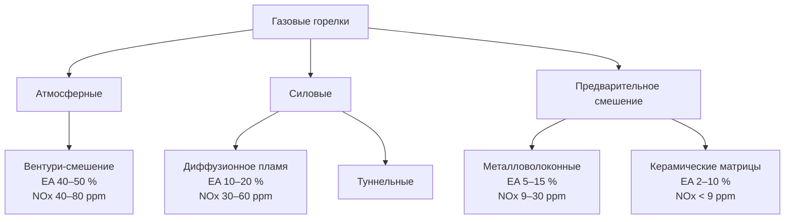

Газовые горелки смешивают газообразное топливо с воздухом горения и стабилизируют пламя для получения контролируемого теплового потока. В отличие от масляных горелок, требующих распыления, газовые горелки обеспечивают молекулярное смешение топлива и воздуха, позволяя достигать высокого КПД горения (85–95 %), низких выбросов (NOx 9–80 ppm, CO < 50 ppm) и широкого диапазона регулирования (3:1–25:1 в зависимости от типа). Нормативная база: ASHRAE Handbook — HVAC Systems and Equipment, EN 303, EN 12831, СП 60.13330.

## Основы газового горения

### Стехиометрические соотношения

**Природный газ (метан):**


\text{CH}_4 + 2\,\text{O}_2 \;\rightarrow\; \text{CO}_2 + 2\,\text{H}_2\text{O} + 802\;\text{кДж/моль}



A_s = \frac{2}{0{,}21} = 9{,}52\;\frac{\text{м}^3_{\text{воздух}}}{\text{м}^3_{\text{CH}_4}}
\quad=\quad
17{,}24\;\frac{\text{кг}}{\text{кг CH}_4}


**Пропан:**


\text{C}_3\text{H}_8 + 5\,\text{O}_2 \;\rightarrow\; 3\,\text{CO}_2 + 4\,\text{H}_2\text{O}
\qquad
A_s = 23{,}8\;\frac{\text{м}^3}{\text{м}^3\;\text{C}_3\text{H}_8}


### Индекс Воббе (Wobbe Index)

Критический параметр взаимозаменяемости горелок:


WI = \frac{HHV}{\sqrt{SG}}


где $HHV$ — высшая теплота сгорания, МДж/м³; $SG$ — удельная плотность относительно воздуха.


| Топливо | WI, МДж/м³ | Критерий замены (±5 %) |
|---|---|---|
| Природный газ | 30–32 | 28,5–33,6 |
| Пропан | 58–60 | 55,1–63,0 |
| Сжиженный природный газ (LNG) | 50–55 | 47,5–57,8 |


Горелка работает правильно, если отклонение $WI$ от проектного не превышает ±5 %.

### Скорость пламени (flame speed)

Определяет конструкцию портальных отверстий горелки:


S_u = \sqrt{\frac{k \cdot \alpha}{\tau_{\text{реакции}}}}


**Ламинарные скорости пламени:**
- Метан-воздух (стехиометр.): 0,10 м/с.
- Пропан-воздух (стехиометр.): 0,12 м/с.
- Водород-воздух (стехиометр.): 2,7 м/с.

Максимальная скорость наблюдается при $\phi = 1{,}05$–$1{,}10$ (слегка обогащённая смесь). Скорость газа через портальное отверстие:
- меньше $S_u$ → обратный огонь (flashback);
- больше $S_u$ → отрыв пламени (flame lift-off).

## Атмосферные горелки (atmospheric burners)

### Принцип работы

Давление газа 8,8–17,6 см вод. ст. создаёт высокоскоростную струю (61–122 м/с) в сужении Вентури, аспирируя первичный воздух (40–60 % стехиометрического). Смесь горит с добавкой вторичного воздуха, вовлекаемого естественной тягой.


\dot{m}_{\text{воздух,первич}} = K \times \dot{m}_{\text{газ}} \times \sqrt{\frac{\Delta P_{\text{газ}}}{P_{\text{атм}}}}


### Конструкция портальных отверстий


A_{\text{порты}} = \frac{\dot{V}_{\text{смесь}}}{V_{\text{порт}}}


Ограничения скорости в портальных отверстиях:
- минимум 6–9 м/с (предотвращение обратного огня);
- максимум 30–46 м/с (предотвращение отрыва);
- проектный диапазон 15–24 м/с.

Диаметр отверстий: 1,3–3,2 мм для природного газа; 1,0–2,5 мм для пропана.

### Регулировка первичного воздуха

- **< 40 %:** жёлтое пламя, сажа, CO.
- **40–60 % (оптимум):** синее пламя, стабильное горение.
- **> 60 %:** риск обратного огня, жёсткое пламя.

### Характеристики атмосферных горелок


| Параметр | Значение |
|---|---|
| Диапазон регулирования | 3:1–4:1 |
| КПД горения | 75–82 % |
| Температура дымохода | 200–315 °C |
| Избыточный воздух | 40–50 % (6–8 % O₂) |
| NOx | 40–80 ppm |
| CO (при настройке) | < 100 ppm |
| Мощность (жилые) | 117–440 кВт |
| Мощность (малые коммерческие) | 293–1 173 кВт |


**Ограничения:** узкий диапазон регулирования; чувствительность к высоте над уровнем моря; КПД ниже силовых горелок; сложность точного контроля EA.

## Силовые горелки (power burners)

### Принцип работы

Вентилятор подаёт принудительный поток воздуха; регулятор давления газа контролирует подачу топлива. Смешение — в смесительной камере горелки (premix) или непосредственно в корне пламени (raw gas). Соотношение воздух-топливо управляется механической связкой (jackshaft) или параллельными электронными приводами.

**Конфигурации:**
- **Горелка с диффузионным смешением (raw gas):** раздельные подводы газа и воздуха; турбулентное диффузионное пламя; давление газа 34–103 кПа. Применение: промышленный нагрев.
- **Горелка с предварительным смешением (premix):** смешение до горелки; компактное синее пламя; давление газа 7,5–25 см вод. ст. Применение: упакованные котлы.
- **Туннельная горелка:** пламя стабилизируется в керамическом туннеле; высокая удельная нагрузка.

### Стабилизация пламени

1. **Отделение пограничного слоя** — тупой объект создаёт зону рециркуляции; горячие продукты воспламеняют входящую смесь.
2. **Стабилизация завихрением (swirl)** — тангенциальная подача воздуха; число завихрения $S = 0{,}3$–$0{,}8$ для оптимальной стабилизации.
3. **Пилотное пламя** — 1–5 % мощности основной горелки; непрерывный или импульсный режим.

### Параллельное позиционирование приводов


\dot{m}_{\text{топливо}} = K \times \dot{m}_{\text{воздух}}


Контроллер поддерживает постоянное соотношение через обратную связь по положению приводов. Перекрёстное ограничение (cross-limiting): при увеличении нагрузки воздух опережает на 90 % целевого значения перед увеличением топлива; при снижении — топливо убывает первым.

### Характеристики силовых горелок


| Параметр | Значение |
|---|---|
| Диапазон регулирования | 5:1–10:1 |
| КПД горения | 82–88 % |
| Температура дымохода | 150–232 °C |
| Избыточный воздух | 10–20 % (1,5–3,5 % O₂) |
| NOx (стандартная) | 30–60 ppm |
| CO | < 50 ppm |
| Мощность (коммерческие котлы) | 146–8 800 кВт |
| Мощность (промышленные) | 293–29 300 кВт |


### Подбор размеров


Q_{\text{горелка}} = \frac{Q_{\text{нагрузка}}}{\eta_{\text{котла}}} \times SF
\quad SF = 1{,}15\text{–}1{,}25


Расход воздуха:


\dot{V}_{\text{воздух}} = \frac{Q_{\text{горелка}}}{HHV_{\text{газ}}} \times A_s \times (1 + EA)


**Пример.** Котёл 500 кВт, $\eta = 0{,}85$, $SF = 1{,}20$, природный газ, $EA = 15\,\%$:


Q_{\text{горелка}} = \frac{500}{0{,}85} \times 1{,}20 = 706\;\text{кВт}



\dot{V}_{\text{воздух}} = \frac{706}{37\,300} \times 9{,}52 \times 1{,}15 = 0{,}209\;\frac{\text{м}^3}{\text{с}} = 753\;\frac{\text{м}^3}{\text{ч}}


## Горелки предварительного смешения (premix burners)

### Принцип работы

Газ и воздух полностью смешиваются до зоны горения, образуя однородную смесь. Пламя стабилизируется поверхностью (горелочная матрица) или геометрией камеры. Низкая пиковая температура пламени — главный фактор снижения NOx.

**Методы смешения:**
- **Вентури-смешение:** давление газа 12,5–37,5 см вод. ст.; принудительная подача воздуха; 100 % первичный воздух.
- **Смешение на входе вентилятора:** газ впрыскивается во всас вентилятора; требуется взрывозащищённый вентилятор.

### Типы горелочных матриц

**Перфорированная поверхность (surface burner):**
- диаметр отверстий 0,5–1,5 мм; скорость через отверстия 3–15 м/с;
- пламя стабилизируется на поверхности с интенсивным лучистым теплообменом;
- применение: инфракрасные обогреватели, промышленный нагрев.

**Металловолоконная матрица (metal fiber burner):**
- плетёная матрица из нержавеющей стали; высокая площадь поверхности;
- температура поверхности 870–1 200 °C; отличная эффективность излучения;
- применение: высокоэффективные коммерческие и конденсационные котлы.

**Керамическая матрица (ceramic matrix burner):**
- пористый материал; распределённое горение;
- температура поверхности 980–1 315 °C; ультранизкие выбросы;
- применение: горелки класса ultra-low-NOx (< 9 ppm).

### Управление температурой пламени


T_{\text{пламени,пик}} = T_{\text{реагенты}} + \frac{HHV \times \phi}{C_p \times (1 + \phi^{-1} \times A_s)}


При $\phi = 0{,}8$ (20 % обеднённая смесь) температура пламени снижается примерно на 120–180 °C относительно стехиометра — ключевой фактор снижения термического NOx.

### Характеристики горелок предварительного смешения


| Параметр | Значение |
|---|---|
| Диапазон регулирования | 8:1–25:1 |
| КПД горения | 85–92 % |
| Температура дымохода | 100–180 °C |
| Избыточный воздух | 5–15 % (0,8–2,5 % O₂) |
| NOx | 9–30 ppm |
| CO | < 30 ppm |
| Мощность | 50–5 000 кВт |


**Требования к управлению:** точность соотношения воздух-топливо ±2 %; кислородный триммер обязателен; вариация индекса Воббе < ±3 %.

## Низконоксные горелки (low-NOx burners)

### Конструктивные особенности

Горелки класса low-NOx (< 30 ppm) и ultra-low-NOx (< 9 ppm) реализуют несколько методов снижения NOx одновременно:

1. **Обеднённое предварительное смешение** — $\phi = 0{,}6$–$0{,}9$; равномерная стехиометрия предотвращает локальные горячие точки; снижение пиковой температуры на 110–220 °C.

2. **Задержанное смешение (delayed mixing)** — потоки топлива и воздуха разделены вдоль начального участка; постепенное перемешивание формирует распределённую зону реакции вместо одной горячей точки.

3. **Несколько зон пламени** — горелка разделена на несколько малых пламён; каждая работает в обеднённом режиме; суммарные пиковые температуры ниже.

4. **Внутренняя FGR (internal flue gas recirculation)** — горелка индуцирует 15–25 % FGR аэродинамикой без внешних воздуховодов; снижает концентрацию O₂ и температуру.


| Класс горелки | NOx, ppm (при 3 % O₂) | CO, ppm | Диапазон | КПД, % |
|---|---|---|---|---|
| Стандартная | 80–150 | < 50 | 5:1 | 82–85 |
| Низконоксная (low-NOx) | 30–60 | < 50 | 5:1–8:1 | 82–88 |
| Минимальный NOx | 9–20 | < 50 | 8:1–15:1 | 85–92 |
| Ultra-low-NOx (< 9 ppm) | < 9 | < 50 | 10:1–20:1 | 85–92 |


## Диаграмма структуры горелочного оборудования

## Сравнение применений


| Применение | Рекомендуемый тип | Мощность, кВт | Приоритет |
|---|---|---|---|
| Жилые печи, водонагреватели | Атмосферная | 50–440 | Простота, низкая стоимость |
| Малые коммерческие котлы | Атмосферная или силовая | 150–600 | Надёжность |
| Коммерческие котлы | Силовая, модулирующая | 300–8 800 | КПД, диапазон |
| Высокоэффективные системы | Предварительного смешения | 50–5 000 | КПД > 90 %, NOx |
| Зоны с ограничениями NOx | Low-NOx, ultra-low-NOx | 150–10 000 | NOx < 30 ppm |
| Промышленный нагрев | Силовая туннельная | 1 000–30 000 | Высокая нагрузка |

