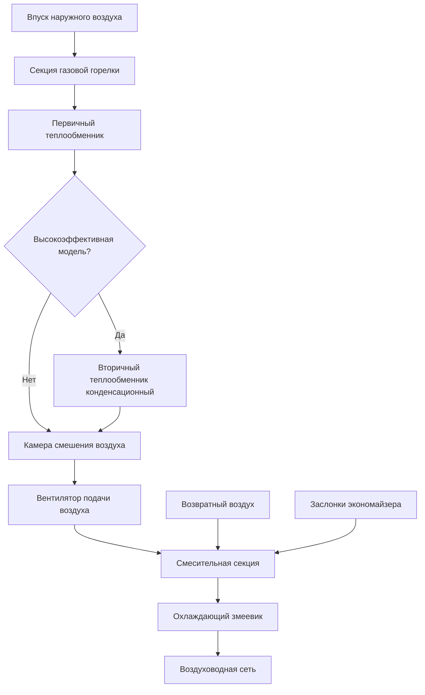
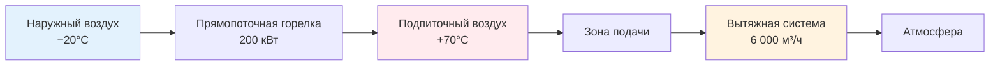

Коммерческие газовые воздушные печи (commercial warm-air furnaces) обеспечивают отопление лёгких коммерческих и промышленных зданий с входной тепловой мощностью от 30 кВт до нескольких мегаватт. Эти агрегаты применяют продвинутые технологии сгорания, высокоэффективные теплообменники и интегрированные системы управления для поддержания надёжного и экономичного отопления. В отличие от жилых печей, коммерческие системы нередко обеспечивают подогрев значительных объёмов наружного воздуха (makeup air heating) и интегрируются с многозонными системами подачи воздуха.

## Физика теплопередачи в коммерческой печи

Работа газовой печи основана на трёх последовательных механизмах теплопередачи.

**Сгорание** высвобождает химическую энергию топлива. Полное уравнение сгорания природного газа:


\text{CH}_4 + 2\text{O}_2 \rightarrow \text{CO}_2 + 2\text{H}_2\text{O} + 891\,\text{кДж/моль}


**Конвективная теплопередача** от горячих газов сгорания к поверхности теплообменника подчиняется закону Ньютона (Newton's law of cooling):


Q = h \, A \, (T_g - T_s)


где $h$ — коэффициент конвективной теплопередачи (50–150 Вт/(м²·К) для газовых потоков в камерах сгорания), $A$ — площадь поверхности теплообменника, $T_g$ — температура дымовых газов, $T_s$ — температура поверхности теплообменника.

**Вторичная конвекция** передаёт энергию от наружной поверхности теплообменника к подаваемому воздуху (supply air); интенсивность процесса определяется геометрией оребрения и скоростью воздушного потока. В типичных коммерческих агрегатах суммарный коэффициент теплопередачи UA составляет 500–5 000 Вт/К в зависимости от мощности и конфигурации теплообменника.

## Интеграция с кровельными установками (rooftop units)

Секции газового отопления в кровельных установках (RTU — rooftop units) компонуются с охлаждающими элементами, экономайзерами и системами вентиляции в единый агрегат. Мощность отопления должна соответствовать холодопроизводительности и требованиям ASHRAE 62.1 по подаче наружного воздуха.

Базовое соотношение для расчёта тепловой мощности:


Q_{\text{heat}} = 1{,}20 \times \dot{V} \times \Delta T


где $\dot{V}$ — объёмный расход воздуха (м³/ч), $\Delta T$ — требуемый прирост температуры (°C), коэффициент 1,20 — произведение плотности воздуха на удельную теплоёмкость при стандартных условиях (кДж/(м³·К)).

### Пример расчёта для кровельной установки

Кровельная установка мощностью 70 кВт, расход воздуха 6 400 м³/ч, требуемый прирост температуры 22°C:


Q_{\text{output}} = 1{,}20 \times 6400 \times 22 = 168\,960\,\text{кДж/ч} = 46{,}9\,\text{кВт}


При КПД горелочного блока 80% входная тепловая мощность:


Q_{\text{input}} = \frac{46{,}9}{0{,}80} = 58{,}6\,\text{кВт}


Фактический расход природного газа при LHV = 35,8 МДж/м³:


\dot{V}_{\text{gas}} = \frac{58{,}6 \times 3600}{35800} \approx 5{,}9\,\text{м}^3/\text{ч}


Секции газового отопления кровельных установок для коммерческих зданий работают с входными тепловыми мощностями от 30 кВт до 1 200 кВт. ASHRAE 90.1-2022 устанавливает минимальные требования к тепловой эффективности горелочных секций кровельных агрегатов в зависимости от мощности и климатической зоны.

## Высокоэффективные конденсационные модели

Высокоэффективные коммерческие печи (high-efficiency condensing furnaces) достигают тепловой эффективности 90–96% благодаря вторичному извлечению теплоты конденсации водяного пара из продуктов сгорания. Скрытая теплота конденсации:


Q_{\text{latent}} = \dot{m}_{H_2O} \times h_{fg}


где $\dot{m}_{H_2O}$ — массовый расход водяного пара в дымовых газах, $h_{fg} \approx 2\,260\,\text{кДж/кг}$ при атмосферном давлении. Сжигание 1 кг природного газа производит ≈ 1,6 кг водяного пара; восстановление теплоты конденсации добавляет ≈ 3 600 кДж/кг топлива к полезному теплоотводу.

Улучшение эффективности при переходе к конденсационному режиму работы:


\eta_{\text{cond}} = \eta_{\text{non-cond}} + \frac{Q_{\text{latent}}}{Q_{\text{HHV}}} \times 100\,\%


где $Q_{\text{HHV}}$ — высшая теплота сгорания топлива. Стандартная печь с КПД 80% повышает эффективность до 92–96% за счёт теплоты конденсации, что даёт прирост 12–16 процентных пунктов.


| Тип печи | Тепловая эффективность | Теплообменник | Температура дымовых газов | Производство конденсата |
|---|---|---|---|---|
| Стандартная неконденсационная | 78–82% | Сталь / алюминизированная сталь | 149–260°C | Нет |
| Средней эффективности | 82–85% | Нержавеющая сталь | 121–177°C | Незначительное |
| Конденсационная | 90–96% | Нержавеющая сталь / AL29-4C | 38–60°C | 7–19 л/сут на 3,5 МВт |
| Ультравысокая эффективность | 95–98% | Специальные сплавы | 27–49°C | 19–30 л/сут на 3,5 МВт |


Согласно EN 303-2:1998+A1, испытания тепловых агрегатов с принудительной тягой проводятся при установившемся режиме сгорания; для конденсационных агрегатов — дополнительно измеряется выработка конденсата и его кислотность.

## Технология модулирующих горелок

Модулирующие газовые клапаны (modulating gas valves) непрерывно регулируют скорость горения от 20–100% номинальной мощности, согласуя теплоотдачу с текущей нагрузкой здания. Степень модуляции (turndown ratio) определяет диапазон управления:


\text{Степень модуляции} = \frac{Q_{\text{max}}}{Q_{\text{min}}}


Агрегат с мощностью 150 кВт и степенью модуляции 5:1 работает в диапазоне 30–150 кВт. Продвинутые системы достигают степени модуляции 10:1 и 20:1, что особенно важно для объектов с широко варьирующимися тепловыми нагрузками (торговые центры, производственные здания, лаборатории).

**Взаимосвязь скорости горения и тепловой эффективности:**


\eta(x) = \eta_{\max} - k(x - x_{\text{opt}})^2


где $x$ — доля от номинальной скорости горения; $\eta_{\max}$ — пиковая эффективность; $x_{\text{opt}}$ — оптимальная доля скорости горения (обычно 0,4–0,6); $k$ — коэффициент деградации эффективности.

**Преимущества модуляции:**

1. **Снижение потерь при циклировании:** непрерывная работа исключает потери при предварительной и послепусковой продувке (pre/post-purge losses).
2. **Улучшение теплового комфорта:** плавное регулирование мощности предотвращает резкие колебания температуры подаваемого воздуха.
3. **Повышение сезонной эффективности:** расширенная работа в режиме частичной нагрузки, где КПД максимален.
4. **Снижение выбросов NO_x:** контролируемое сгорание на пониженных скоростях горения снижает температуру факела и образование термических оксидов азота.

## Установки подпиточного воздуха (makeup air units, MAU)

Установки подпиточного воздуха восполняют воздух, удалённый системами вытяжной вентиляции из коммерческих кухонь, промышленных зон, лабораторных вытяжных шкафов и зон с местными отсосами. Прямопоточные нагреватели (direct-fired MAU) сжигают газ непосредственно в потоке подаваемого воздуха (без теплообменника), достигая КПД 90–92%.

Прирост температуры в прямопоточной системе:


\Delta T = \frac{Q_{\text{input}} \times 0{,}90}{1{,}20 \times \dot{V}}


### Пример расчёта прямопоточной MAU

Прямопоточная установка подпиточного воздуха, входная мощность 200 кВт, расход воздуха 6 000 м³/ч, КПД 90%:


\Delta T = \frac{200 \times 3600 \times 0{,}90}{1{,}20 \times 6000} = \frac{648\,000}{7200} = 90{,}0\,°\text{C}


При температуре наружного воздуха −20°C температура подаваемого воздуха составит −20 + 90 = +70°C. Для снижения до комфортных +18–20°C потребуется частичное рециркуляционное разбавление.

Непрямопоточные установки (indirect-fired MAU) разделяют продукты сгорания и приточный воздух через теплообменник. Они обязательны при подаче воздуха в помещения с требованиями к чистоте воздуха: лаборатории, чистые комнаты, пищевые производства — в соответствии с ASHRAE 62.1 и требованиями IMC (International Mechanical Code) Section 501.


| Тип MAU | Тепловая эффективность | Продукты сгорания в воздухе | Применение | Нормативная ссылка |
|---|---|---|---|---|
| Прямопоточная (direct-fired) | 90–92% | Присутствуют | Промышленность, склады, автосервисы | IMC Section 510 |
| Непрямопоточная (indirect-fired) | 75–85% | Отсутствуют | Лаборатории, чистые комнаты | ASHRAE 62.1 |
| С рекуперацией теплоты | 60–75% (эффективность рекуператора) | Отсутствуют | Энергосберегающие объекты | ASHRAE 90.1 |
| Только кондиционирование (heating-only) | — | — | Мягкий климат | Местные нормы |


## Подбор мощности и ступенчатое управление

Расчёт тепловой нагрузки коммерческих зданий выполняется в соответствии с ASHRAE Handbook — Fundamentals (Chapter 18: Nonresidential Cooling and Heating Load Calculations) и EN 12831:2017 (расчёт тепловых нагрузок зданий). Многоступенчатые или модулирующие горелки обеспечивают значительно лучшее сезонное КПД по сравнению с одноступенчатой работой.

Для систем со ступенчатым управлением тепловая мощность каждой ступени:


Q_{\text{ступень, }i} = \frac{Q_{\text{total}}}{n_{\text{ступеней}}}


Четырёхступенчатый агрегат мощностью 200 кВт работает с шагами 50, 100, 150 и 200 кВт, обеспечивая значительно лучшее соответствие переменной тепловой нагрузке здания, чем двухпозиционное управление.

Расчётный перепад температуры воздуха при известном расходе и мощности:


\Delta T_{\text{факт}} = \frac{Q_{\text{output}}}{1{,}20 \times \dot{V}_{\text{факт}}}


Если $\Delta T_{\text{факт}}$ превышает максимально допустимое значение по документации производителя, риск перегрева теплообменника и его преждевременного выхода из строя. При недостаточном $\Delta T$ — снижается эффективность и комфорт в обслуживаемых помещениях.

## Нормативные требования

Коммерческие газовые воздушные печи должны соответствовать:

- **UL 795**: Commercial-Industrial Gas Heating Equipment — требования к безопасности оборудования
- **ANSI Z83.8/CSA 2.6**: Gas Unit Heaters, Gas Packaged Heaters, Gas Utility Heaters and Gas-Fired Duct Furnaces
- **ASHRAE 90.1-2022**: минимальные значения тепловой эффективности (не менее 80% для большинства коммерческих агрегатов)
- **NFPA 54 (ANSI Z223.1)**: National Fuel Gas Code — требования к установке и технологическому подключению
- **IMC Chapter 9**: специфические требования к установке газовых агрегатов
- **EN 303-2:1998+A1**: котлы и агрегаты с принудительной тягой (в части методологии испытаний)
- **СП 60.13330.2020**: системы отопления, вентиляции и кондиционирования воздуха в части газовых воздушных отопительных агрегатов

Испытания в соответствии с ANSI Z21.47/CSA 2.3 устанавливают установившийся КПД, диапазон допустимого прироста температуры и работоспособность систем безопасности. ASHRAE 90.1-2022 требует применения многоступенчатого или модулирующего управления для агрегатов мощностью свыше 66 кВт.

## Оптимизация производительности

Для поддержания оптимального КПД коммерческих печей в процессе эксплуатации необходимо:

- ежегодно проверять расход воздуха через теплообменник и соответствие $\Delta T$ проектным значениям;
- контролировать состав дымовых газов (анализ CO/CO₂/O₂) с применением калиброванных газоанализаторов;
- очищать теплообменники и оребрение от загрязнений, снижающих UA;
- проверять состояние воздушных фильтров (засорение фильтров — наиболее частая причина недостаточного расхода воздуха);
- калибровать системы управления горелкой — соотношение топлива и воздуха (fuel-air ratio) при отклонении более ±5% от проектного значения снижает КПД и повышает выбросы.

Надлежащий выбор оборудования, монтаж в соответствии с требованиями производителя и применимых нормативных документов, а также регулярное техническое обслуживание обеспечивают надёжную и экономичную работу коммерческих печей на протяжении расчётного срока службы 20–25 лет.
