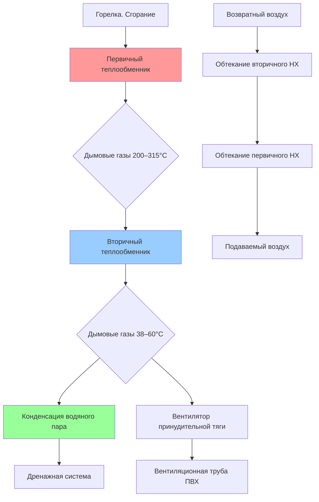

Теплообменник газовой воздушной печи — это критически важная граница между продуктами сгорания и кондиционируемым воздухом. Он одновременно выполняет три функции: обеспечивает максимально возможную передачу тепловой энергии от дымовых газов к подаваемому воздуху, гарантирует полную газовую герметичность (предотвращая проникновение монооксида углерода и других продуктов горения в вентилируемое помещение) и выдерживает циклические термические нагрузки в течение расчётного срока службы 20–30 лет.

По стандарту ASHRAE 103 (Methods of Testing for Determining the Design and Seasonal Efficiencies of Residential Heating and Cooling Equipment) и ANSI Z21.47/CSA 2.3 производители обязаны подтверждать как тепловую производительность, так и целостность теплообменника при нормальных и ненормальных рабочих условиях.

## Основы теплопередачи

Теплопередача в теплообменнике печи осуществляется тремя одновременно действующими механизмами: конвекция от дымовых газов к внутренней поверхности стенки, теплопроводность через металлическую стенку и конвекция от наружной поверхности к подаваемому воздуху (supply air).

Общее тепловое сопротивление для плоской стенки:


\frac{1}{UA} = \frac{1}{h_i A_i} + \frac{t}{k A_m} + \frac{1}{h_o A_o}


где $h_i$ и $h_o$ — коэффициенты конвекции со стороны дымовых газов и воздуха соответственно (Вт/(м²·К)); $t$ — толщина стенки (м); $k$ — теплопроводность металла (Вт/(м·К)); $A_i$, $A_m$, $A_o$ — площади поверхностей теплопередачи.

При типичных условиях работы печи коэффициент конвекции со стороны дымовых газов $h_i = 50–100\,\text{Вт/(м}^2\text{·К)}$ — значительно ниже коэффициента со стороны воздуха $h_o = 100–300\,\text{Вт/(м}^2\text{·К)}$. Следовательно, именно сторона дымовых газов определяет суммарное тепловое сопротивление, и конструктивные меры по её интенсификации (турбулизаторы, увеличение скорости газа) наиболее эффективны.

### Логарифмический среднеарифметический перепад температур (LMTD)

Движущая сила теплопередачи для противотока (counter-flow):


LMTD = \frac{(T_{fg,\text{in}} - T_{a,\text{out}}) - (T_{fg,\text{out}} - T_{a,\text{in}})}{\ln\!\left(\dfrac{T_{fg,\text{in}} - T_{a,\text{out}}}{T_{fg,\text{out}} - T_{a,\text{in}}}\right)}


Суммарный тепловой поток:


Q = UA \times LMTD


Увеличение площади поверхности $A$ или коэффициента теплопередачи $U$ прямо пропорционально увеличивает тепловую мощность при неизменных температурах потоков.

## Конструкции первичных теплообменников

Первичные теплообменники работают при температурах входящих дымовых газов 200–315°C. Применяются три основных конструктивных типа.

### Трубчатые теплообменники (tubular heat exchangers)

В трубчатой конструкции сгорание происходит внутри герметичных цилиндрических секций, а подаваемый воздух обтекает их снаружи. Круглое поперечное сечение минимизирует концентрацию термических напряжений при циклах нагрева-охлаждения.

**Параметры тепловой производительности:**
- Площадь теплопередачи: 0,074–0,139 м² на 3 кВт номинальной мощности
- Скорость дымовых газов внутри трубок: 4,6–7,6 м/с (турбулентный режим, Re > 4 000)
- Скорость воздуха на внешней поверхности: 2,5–4,1 м/с
- КПД теплопередачи для неконденсационных конструкций: 75–82%

Внутренние турбулизаторы или перегородки повышают коэффициент конвекции со стороны газа на 20–40% за счёт интенсификации турбулентности, однако пропорционально возрастают потери давления. Материал — алюминизированная сталь типа 1 (покрытие 10% Al-Si), стойкая к окислению до 650°C и обеспечивающая теплопроводность 43–52 Вт/(м·К).

### Оболочковые теплообменники (clamshell heat exchangers)

Конструкция из формованных листовых металлических секций с продольными сварными или прессованными швами образует закрытые камеры сгорания. Производственная себестоимость ниже, чем у трубчатых конструкций.

**Конструктивные характеристики:**
- Толщина стенки: 0,9–1,1 мм алюминизированная сталь
- Производительность теплопередачи: на 5–10% ниже трубчатой конструкции
- Основной режим отказа: усталостные трещины в зонах швов

Термические напряжения расширения концентрируются в местах швов. Дефекты сварки или прессования — главная причина преждевременного образования трещин, через которые дымовые газы могут проникать в поток подаваемого воздуха. По данным CPSC (Consumer Product Safety Commission), повреждённые теплообменники этого типа являются наиболее распространённой причиной отравления CO в жилых домах.

### Барабанные теплообменники (drum heat exchangers)

Цилиндрические камеры сгорания с радиальным тепловым потоком к окружающим воздушным каналам. Применяются в устаревшем оборудовании и тяжёлых промышленных агрегатах. Сталь толщиной 2,0–2,4 мм обеспечивает длительный срок службы, однако высокие масса и габариты ограничивают применение в современных компактных системах.

## Вторичные конденсационные теплообменники

Конденсационные печи с AFUE 90–98% включают вторичный теплообменник из нержавеющей стали, охлаждающий дымовые газы с 200°C до 38–60°C (ниже точки росы водяного пара — 57–60°C для природного газа).

### Физика конденсационного теплоизвлечения

Природный газ при сгорании производит ≈ 1,6 кг водяного пара на 1 кг топлива. Скрытая теплота водяного пара:


Q_{\text{total}} = Q_{\text{sensible}} + Q_{\text{latent}} = \dot{m}_{fg} \, c_p \, \Delta T + \dot{m}_{\text{cond}} \, h_{fg}


где $h_{fg} \approx 2\,447\,\text{кДж/кг}$ при 60°C. Восстановление скрытой теплоты даёт прирост КПД 10–15% по сравнению с неконденсационными конструкциями.

### Материалы вторичных теплообменников

Конденсат имеет кислотность pH 2,5–4,0 из-за растворения CO₂ и NO_x с образованием угольной и азотной кислот. Выбор материала критически важен для долговечности:


| Материал | Состав | Срок службы | Относительная стоимость | Область применения |
|---|---|---|---|---|
| AL29-4C нержавеющая | 29% Cr, 4% Mo, 2% Ni | 20–25 лет | 2,5× | Премиум конденсационные агрегаты |
| 316L нержавеющая | 18% Cr, 14% Ni, 3% Mo | 15–20 лет | 3,0× | Высокоэффективные жилые системы |
| 439 нержавеющая | 17% Cr, Ti-стабилизированная | 15–18 лет | 2,0× | Стандартные конденсационные агрегаты |
| Алюминизированная с покрытием | Полимерное / керамическое | 12–15 лет | 1,5× | Начальный уровень конденсационных |


AL29-4C доминирует в премиум-сегменте благодаря превосходной стойкости к хлоридной и кислотной атаке. Высокое содержание хрома обеспечивает самовосстановление пассивного оксидного слоя.

### Геометрия вторичных теплообменников

**Трубчатые змеевики (serpentine tube coils):** удлинённый путь потока дымовых газов обеспечивает время пребывания, достаточное для полной конденсации; непрерывный уклон для самотёчного дренажа конденсата; типичная длина пути 4,6–9,1 м при мощности 100 кВт.

**Пластинчато-сотовые конструкции (cellular plate):** штабелированные пластины создают множество узких каналов; компактные размеры; соотношение площади поверхности к объёму 26–39 м²/м³; параллельные каналы снижают гидравлическое сопротивление.

**Оребрённые трубы (finned tubes):** штампованные рёбра, припаянные к трубам из нержавеющей стали; шаг рёбер со стороны воздуха 12–16 рёбер/дюйм; склонность к загрязнению в запылённой среде.

## Тепловая эффективность: метод NTU-ε

Метод эффективности-NTU (effectiveness-NTU method) позволяет оценить производительность теплообменника независимо от конфигурации потока:


\epsilon = \frac{Q_{\text{actual}}}{Q_{\text{max}}} = \frac{T_{a,\text{out}} - T_{a,\text{in}}}{T_{fg,\text{in}} - T_{a,\text{in}}}


Для противоточной конфигурации:


\epsilon = \frac{1 - \exp\!\bigl[-NTU(1-C_r)\bigr]}{1 - C_r \cdot \exp\!\bigl[-NTU(1-C_r)\bigr]}


где:


NTU = \frac{UA}{C_{\min}}, \qquad C_r = \frac{C_{\min}}{C_{\max}}


Первичные неконденсационные теплообменники достигают $\epsilon = 0{,}75$–$0{,}85$; вторичные конденсационные секции — $\epsilon = 0{,}85$–$0{,}95$ за счёт расширенной поверхности и улучшенной теплопередачи при фазовом переходе.

### Пример расчёта по методу NTU-ε

Первичный теплообменник жилой конденсационной печи 24 кВт:
- Входная температура дымовых газов: $T_{fg,\text{in}} = 280$°C
- Входная температура воздуха: $T_{a,\text{in}} = 20$°C
- Выходная температура воздуха: $T_{a,\text{out}} = 55$°C (целевое значение)


\epsilon = \frac{55 - 20}{280 - 20} = \frac{35}{260} = 0{,}135


Значение кажется низким, но корректно: дымовые газы охлаждаются до ~210°C на выходе из первичного теплообменника и затем передают остаточную теплоту во вторичном конденсационном блоке. Суммарная эффективность двухступенчатой системы — 0,85–0,92.

## Термические напряжения и механизмы отказа

Долговечность теплообменника определяется сопротивлением термической усталости (thermal fatigue), коррозии и механическим нагрузкам. Термическое расширение при цикле нагрева создаёт деформацию:


\varepsilon_{\text{thermal}} = \alpha \, \Delta T


где $\alpha$ — коэффициент линейного теплового расширения (для стальных сплавов 7–9·10⁻⁶ К⁻¹), $\Delta T$ — перепад температур. Для первичного теплообменника с $\Delta T = 280$°C деформация расширения составляет 0,35–0,45%, что генерирует значительные напряжения в зонах ограниченного расширения (швы, точки крепления, переходы сечений).

### Характерные режимы отказа

**Трещины от термической усталости:** инициируются в точках концентрации напряжения (швы, зоны изгибов, переходы толщины). Низкоцикловая усталость при ежедневных термических циклах. Инициирование трещины — после 100 000–500 000 циклов (≈ 15–40 лет при нормальной частоте включений). Удар пламени (flame impingement) создаёт локальный перегрев и существенно ускоряет образование трещин.

**Коррозионные отказы:** атака конденсата на первичный теплообменник при холодных пусках до достижения установившегося режима (конденсация образуется на холодных поверхностях); коррозия под напряжением хлоридами в прибрежных районах; точечная коррозия тонкостенных зон.

**Механические нагрузки:** деформация кронштейнов от веса теплообменника и его расширения; пульсации давления при зажигании и гашении горелки; вибрации от вентилятора с индуцированной тягой; неправильный монтаж с созданием дополнительных конструктивных нагрузок.

## Методы обнаружения трещин теплообменника

Трещина в теплообменнике — серьёзная угроза безопасности: монооксид углерода (CO) может проникать в поток подаваемого воздуха и концентрироваться в помещениях. Стандарт ANSI Z21.47/CSA 2.3 устанавливает предельное значение CO в подаваемом воздухе ≤ 9 ppm при нормальных условиях.

### Визуальный осмотр

Прямой осмотр внутренних и внешних поверхностей теплообменника:
- осмотр зеркалом и фонариком через смотровые отверстия;
- бороскопическое обследование (borescope) через отверстия горелки;
- детальный осмотр при снятом вентиляторном блоке;
- поиск следов дымовых газов (копоть, обесцвечивание) на внешних поверхностях.

Видимые трещины обычно указывают на запущенное повреждение. Начальные дефекты — микроскопические трещины, не видимые невооружённым глазом.

### Анализ дымовых газов и воздуха

Измерение содержания CO в подаваемом воздухе откалиброванным газоанализатором:
- CO > 9 ppm в приточном воздухе — показание для немедленного прекращения работы и детальной диагностики;
- CO в дымовых газах > 400 ppm указывает на неполное сгорание, вызванное в том числе подсосом воздуха через трещину;
- сравнение концентраций CO в приточном и вытяжном воздухе — метод качественного обнаружения подсоса.

Анализ содержания O₂ в приточном воздухе: превышение фонового уровня (норма < 21,0%) указывает на подмешивание дымовых газов.

### Испытание перепадом давления (pressure differential test)

1. Блокировка дымового отверстия создаёт избыточное давление в тракте дымовых газов.
2. Вентилятор IDB нагнетает 75–200 Па избыточного давления внутри теплообменника.
3. Нанесение мыльного раствора на внешние поверхности — образование пузырей указывает на пути утечки.
4. Порог обнаружения: трещины шириной > 0,25 мм.

### Тепловизионный анализ (infrared thermography)

ИК-камеры обнаруживают температурные аномалии от горячих дымовых газов, вытекающих через трещины:
- оценка равномерности распределения температуры по поверхности теплообменника при работе;
- «горячие пятна» указывают на удар пламени или утечку газа в точке трещины;
- «холодные пятна» — на внутреннюю блокировку или нарушение потока газа;
- требуется температурный перепад > 11°C для надёжного обнаружения.

### Испытание газом-трассером (tracer gas test)

Наиболее чувствительный метод количественного определения утечки:
1. Введение безвредного трассера (гелий, SF₆) в зону сгорания.
2. Отбор проб из потока подаваемого воздуха.
3. Определение концентрации трассера — количественная оценка тяжести утечки.
Требует специализированного оборудования и квалифицированных специалистов; порог обнаружения на порядок лучше мыльного пузырькового теста.

## Системы управления конденсатом

Конденсационные печи производят 3,8–7,6 л/ч кислого конденсата на каждые 100 кВт тепловой мощности. Нарушение дренажа приводит к затоплению вторичного теплообменника, ускоренной коррозии и снижению КПД.

**Компоненты системы дренажа:**
- внутренние дренажные поддоны с уклоном ≥ 6,4 мм на 300 мм;
- конденсационные гидравлические затворы (condensate traps) с высотой водяного столба 50–75 мм;
- трубопровод дренажа из ПВХ или ХлПВХ (Schedule 40 или SDR-35) — устойчив к pH 2,5–4,0;
- картриджи нейтрализации конденсата (neutralizer cartridges) при наличии требований местных нормативов к сбросу в канализацию;
- поддон или конденсатный насос для принудительного отвода при невозможности самотёка.

Потеря гидравлического затвора позволяет дымовым газам проникать в жилые помещения — критическая угроза безопасности. Ежегодная проверка и промывка конденсатного тракта — обязательная часть регламентного обслуживания.

## Выбор материала для долговременной надёжности


| Материал | Характеристика | Ожидаемый срок службы |
|---|---|---|
| Алюминизированная сталь тип 1 (10% Al-Si) | Стойкость к окислению до 650°C | 15–25 лет |
| Алюминизированная сталь тип 2 (5% Al-Si) | Стандартная стойкость | 12–20 лет |
| 409 нержавеющая | Повышенная коррозионная стойкость | 20–30 лет |
| Углеродистая сталь | Не применяется — быстрое окисление выше 200°C | < 5 лет |


Толщина материала прямо влияет на долговечность: конструкция толщиной 1,1 мм служит на 40–60% дольше, чем аналогичная толщиной 0,9 мм при идентичных условиях эксплуатации. Увеличение толщины повышает массу агрегата и стоимость производства, но значительно снижает стоимость жизненного цикла.

## Протоколы технического обслуживания

Регулярный осмотр теплообменника — основа безопасной эксплуатации согласно ASHRAE Standard 180 (Standard Practice for Inspection and Maintenance of Commercial Building HVAC Systems) и рекомендациям NFPA 54.

**Ежегодный осмотр:**
- визуальный контроль на коррозию, обесцвечивание или деформацию поверхностей;
- анализ дымовых газов (CO, O₂, CO₂) и документирование результатов;
- наблюдение за формой факела горелки (flame pattern): удар о стенки — причина ускоренной термической усталости;
- проверка чистоты вентиляторной секции и сопротивления фильтра;
- проверка системы дренажа конденсата.

**Многолетний осмотр (каждые 5–7 лет или при симптоматических признаках):**
- комплексное испытание целостности теплообменника (давление или трассер);
- тепловизионный анализ при работающей системе;
- анализ тенденций состава дымовых газов для выявления деградации;
- документирование деформаций и изменений геометрии теплообменника.

По требованиям СП 60.13330.2020 и СП 41-01-2006, осмотр газовых отопительных агрегатов проводится не реже 1 раза в год с оформлением акта. При обнаружении нарушений герметичности теплообменника или превышении нормативного уровня CO в помещении эксплуатация оборудования должна быть немедленно прекращена до проведения ремонта.
