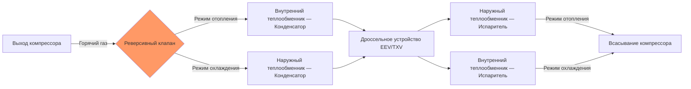
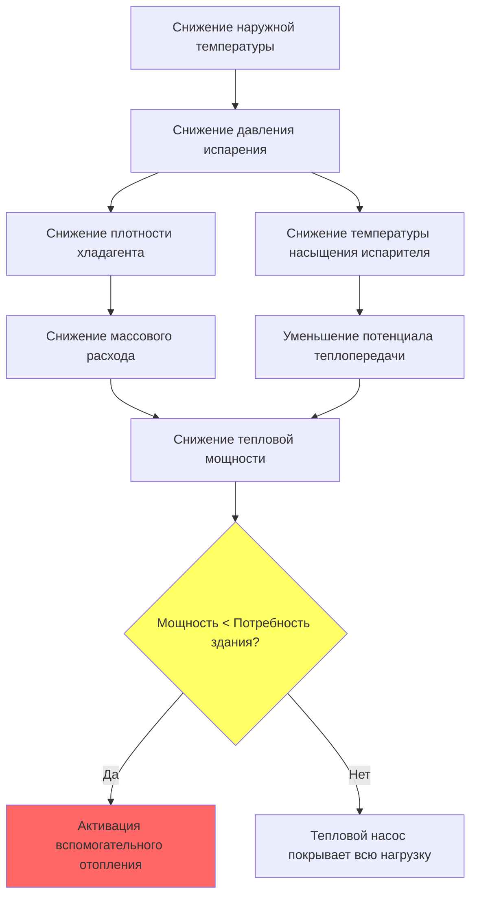

Воздушные тепловые насосы (ASHP — air source heat pump) обеспечивают отопление и охлаждение помещений за счёт переноса тепловой энергии между наружным воздухом и кондиционируемым пространством с применением обратимого парокомпрессионного холодильного цикла. При благоприятных условиях (наружная температура выше 0°C) современные агрегаты достигают эффективности отопления 300–450%, обеспечивая от 3 до 4,5 кВт тепловой мощности на каждый 1 кВт потреблённой электроэнергии.

## Термодинамика воздушного теплового насоса

### Тепловой поток в режиме отопления

Тепловая мощность, подаваемая в помещение:


\dot{Q}_h = \dot{m} \cdot (h_2 - h_3)


где $\dot{m}$ — массовый расход хладагента (кг/с); $h_2$ — удельная энтальпия после сжатия (кДж/кг); $h_3$ — удельная энтальпия после конденсации (кДж/кг).

Работа компрессора:


\dot{W}_{\text{comp}} = \dot{m} \cdot (h_2 - h_1)


COP отопления:


COP_h = \frac{\dot{Q}_h}{\dot{W}_{\text{comp}}} = \frac{h_2 - h_3}{h_2 - h_1}


COP охлаждения:


COP_c = \frac{\dot{Q}_c}{\dot{W}_{\text{comp}}} = \frac{h_1 - h_4}{h_2 - h_1}


где $h_1$ — энтальпия на выходе испарителя, $h_4$ — энтальпия после дроссельного устройства.

Из баланса энергии: $COP_h = COP_c + 1$.

## Четырёхходовой реверсивный клапан

Четырёхходовой переключающий клапан (reversing valve / four-way valve) перенаправляет поток горячего газа нагнетания без изменения направления вращения компрессора.

### Механизм управления клапаном

Соленоидный пилотный клапан управляет подачей давления высокой стороны на один из торцов скользящего поршня. В режиме отопления давление нагнетания прикладывается к левому торцу, выталкивая поршень вправо. Режим охлаждения обращает этот перепад давления. Время переключения: 1–3 секунды.

Клапан вносит гидравлическое сопротивление ≈ 7–14 кПа в линию нагнетания. При переходном процессе оба теплообменника кратковременно получают горячий газ — это учитывается в логике защиты компрессора (задержка следующего запуска после реверсирования не менее 3 минут).

## Тракт хладагента по режимам работы

### Режим отопления

1. Компрессор повышает давление и температуру всасываемого пара.
2. Горячий газ нагнетания через реверсивный клапан поступает во внутренний теплообменник.
3. Внутренний теплообменник работает как конденсатор: температура конденсации $T_{\text{cond}} = 32$–49°C; тепло отдаётся в помещение.
4. Жидкий хладагент высокого давления проходит через дроссельное устройство (EEV или TXV).
5. Наружный теплообменник работает как испаритель: температура испарения $T_{\text{evap}} = -7$–$+10$°C; тепло поглощается из наружного воздуха.
6. Холодный пар через реверсивный клапан возвращается на всасывание компрессора.

### Режим охлаждения

Тракт полностью обращается. Наружный теплообменник — конденсатор ($T_{\text{cond}} = 38$–60°C), внутренний теплообменник — испаритель ($T_{\text{evap}} = 4$–10°C). Некоторые системы используют два дроссельных устройства с обратными клапанами — для оптимизации перепада давления в каждом режиме.

## Зависимость производительности от температуры наружного воздуха

Тепловая мощность и COP снижаются по мере понижения наружной температуры из-за фундаментальных термодинамических ограничений:


\dot{Q}_{\text{available}} \propto (T_{\text{source}} - T_{\text{evap}})


По мере снижения $T_{\text{source}}$ температура испарителя должна снижаться для сохранения движущей силы теплопередачи. Более низкое давление испарения снижает плотность и массовый расход хладагента, что уменьшает тепловую мощность.


| Температура наружного воздуха (°C) | Производительность (% от номинала при +8°C) | COP | Примечания |
|---|---|---|---|
| +8 | 100% | 3,4 | Стандартная точка рейтинга AHRI |
| +2 | 85% | 2,8 | Начало периодических циклов разморозки |
| −8 | 65% | 2,2 | Частые циклы разморозки |
| −15 | 50% | 1,8 | Необходимо вспомогательное отопление |
| −23 | 35% | 1,5 | Предел устойчивой работы стандартных агрегатов |


### Балансная точка (balance point)

Наружная температура, при которой тепловая мощность насоса равна тепловым потерям здания:


\dot{Q}_{\text{HP}}(T_{\text{bal}}) = UA \cdot (T_{\text{indoor}} - T_{\text{bal}})


где $UA$ — коэффициент тепловых потерь здания (кДж/(ч·°C)). Ниже балансной точки активируется вспомогательное отопление.

## Цикл разморозки

Обмерзание наружного теплообменника (frost formation) происходит при $T_{\text{surface}} < 0$°C в присутствии влажного наружного воздуха. Иней блокирует воздушный поток и снижает теплопередачу:


\eta_{\text{HX}} = \frac{1}{1 + R_{\text{frost}} / R_{\text{HX}}}


### Последовательность цикла разморозки

1. Реверсивный клапан переключается в режим охлаждения — горячий газ нагнетания поступает на наружный теплообменник.
2. Наружный вентилятор останавливается — прекращается конвекция холодного воздуха через теплообменник.
3. Внутренний вентилятор работает в зависимости от алгоритма управления: некоторые системы снижают скорость или выполняют циклирование для предотвращения подачи холодного воздуха.
4. Продолжительность: 2–10 минут.
5. Завершение: при достижении температуры теплообменника 16–21°C или по истечении максимального таймера.

Штраф на сезонную эффективность от цикла разморозки: 5–15% в зависимости от климатической влажности и количества часов работы ниже 4°C.

## Рейтинги сезонной эффективности

### HSPF2 (Heating Seasonal Performance Factor 2)

HSPF2 определяет суммарную тепловую мощность за отопительный сезон, делённую на суммарное потребление электроэнергии (включая энергию на циклы разморозки и вспомогательное отопление), согласно AHRI 210/240-2023:


HSPF = \frac{\sum_{i} Q_{h,i}}{\sum_{i} E_i + \sum_{j} E_{\text{defrost},j}}


Текущие нормативные минимумы (DOE, 2023):
- HSPF2 ≥ 7,5 для сплит-систем (северные регионы)
- HSPF2 ≥ 6,7 для сплит-систем (южные регионы)
- ENERGY STAR: HSPF2 ≥ 8,1

### SEER2 (Seasonal Energy Efficiency Ratio 2)

Эффективность охлаждения за сезон:


SEER2 = \frac{\sum_{k} Q_{c,k}}{\sum_{k} E_k}


Минимальные нормативные требования DOE (2023):
- SEER2 ≥ 14,3 (северные регионы)
- SEER2 ≥ 15,2 (южные регионы)
- ENERGY STAR: SEER2 ≥ 16,0

Обновлённые процедуры тестирования DOE (введены с января 2023) применяют более реалистичные условия: повышенное внешнее статическое давление в воздуховодной системе. Ориентировочное соотношение со старыми рейтингами: $SEER2 \approx 0{,}95 \times SEER$; $HSPF2 \approx 0{,}85 \times HSPF$.


| Параметр | Стандартная эффективность | Высокая эффективность | Холодный климат (ccASHP) |
|---|---|---|---|
| HSPF2 | 7,5–8,0 | 9,0–10,0 | 10,0–13,0 |
| SEER2 | 14,0–15,0 | 16,0–20,0 | 16,0–19,0 |
| Тепловая мощность при −15°C | 50–60% номинала | 65–75% номинала | 75–90% номинала |
| COP при +8°C | 2,8–3,2 | 3,4–4,0 | 3,6–4,5 |
| Минимальная рабочая температура | −18°C | −23°C | −32°C |
| Тип компрессора | Одноступенчатый | С инверторным приводом | EVI с инвертором |


## Преимущества инверторного компрессора

Инверторные (variable speed) компрессоры модулируют скорость от 25 до 100% (и выше) номинала путём изменения частоты питающего напряжения через ШИМ-инвертор (PWM inverter). Улучшение KПД при частичных нагрузках обусловлено:

- снижением потерь при циклировании (основная составляющая потерь эффективности)
- оптимизацией перегрева испарителя и переохлаждения конденсатора при переменных нагрузках
- поддержанием адекватного возврата масла на всех режимах работы
- улучшением контроля влажности в режиме охлаждения при продлённом времени работы

Прирост COP при частичных нагрузках:


COP_{\text{part}} = COP_{\text{nom}} \times \left(1 + k \cdot \left(1 - \frac{\dot{Q}_{\text{actual}}}{\dot{Q}_{\text{nom}}}\right)\right)


где $k = 0{,}2$–$0{,}4$ — коэффициент улучшения при частичной нагрузке. Сезонное улучшение эффективности: 30–50% по сравнению с одноступенчатыми системами.

## Технология для холодного климата (ccASHP — cold climate ASHP)

Тепловые насосы для холодного климата применяют технологию усиленного впрыска пара (EVI — enhanced vapor injection) для поддержания производительности при низких наружных температурах:

1. Вспомогательный бак-сепаратор (flash tank) разделяет жидкость и пар при промежуточном давлении.
2. Паровая фаза при промежуточном давлении впрыскивается в полость сжатия компрессора.
3. Дополнительный хладагент увеличивает суммарный массовый расход через конденсатор без роста гидравлического сопротивления испарителя.
4. Охлаждённая жидкость при промежуточном давлении направляется в испаритель — переохлаждение улучшает холодильный коэффициент.

Агрегаты ccASHP при −15°C сохраняют 75–85% номинальной тепловой мощности против 50–60% у стандартных агрегатов.

## Рекомендации по применению

Подбор воздушного теплового насоса включает следующие расчётные этапы:

1. **Анализ балансной точки:** рассчитать тепловые потери здания при расчётной наружной температуре проектирования (99% условие по ASHRAE Handbook Fundamentals или EN 12831). Определить наружную температуру, при которой тепловая мощность насоса сравнивается с нагрузкой здания.

2. **Потребность во вспомогательном отоплении:** определить мощность резервного источника (электрические ТЭНы или резервный газовый котёл) для покрытия нагрузки ниже балансной точки.

3. **Совместимость воздуховодной системы:** проверить пропускную способность системы воздуховодов для обоих режимов работы (отопление и охлаждение имеют разные проектные расходы воздуха).

4. **Стратегия разморозки:** для умеренного климата — разморозка по требованию (demand defrost) с мониторингом перепада давления или температуры испарителя; для холодного климата — временно-температурная логика.

5. **Уровень звука:** AHRI-сертифицированные агрегаты — 50–75 дБА на расстоянии 3 м от наружного блока. Размещение наружного блока должно соответствовать нормативам отдалённости от жилых помещений и соседних участков.

Правильная заправка хладагентом методом перегрева / переохлаждения обеспечивает номинальную производительность. Отклонение на ±10% от паспортной заправки снижает эффективность на 5–20%.

По требованиям EN 303-12:2014 (воздушные тепловые насосы) и EN 14825:2023 (рейтинги эффективности при частичной нагрузке), производители обязаны предоставлять данные производительности при нескольких температурных точках для расчёта SCOP/SSEER.
