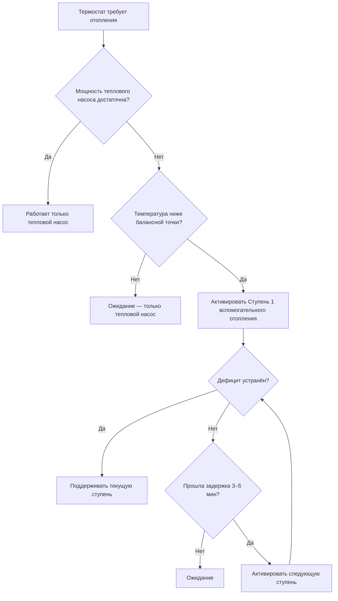

Воздушные тепловые насосы теряют тепловую мощность и КПД при снижении наружной температуры. Когда выработка насоса опускается ниже тепловых потребностей здания, вспомогательное отопление (supplemental heating / backup heating) обеспечивает тепловой комфорт. Правильное проектирование вспомогательного отопления — критически важный аспект для применений в холодном климате, непосредственно влияющий на тепловой комфорт, потребление электроэнергии и сезонную эффективность системы.

## Расчёт балансной точки (balance point)

Балансная точка (BP) — наружная температура, при которой тепловая мощность теплового насоса в точности равна тепловым потерям здания. При температуре ниже BP вспомогательное отопление необходимо для покрытия разницы:


\dot{Q}_{\text{HP}}(T_{\text{oa}}) = \dot{Q}_{\text{load}}(T_{\text{oa}})


### Модели кривых нагрузки и производительности

Тепловая нагрузка здания изменяется линейно с разностью температур:


\dot{Q}_{\text{load}} = UA \cdot (T_{\text{indoor}} - T_{\text{oa}}) + \dot{Q}_{\text{inf}} + \dot{Q}_{\text{vent}}


Тепловая мощность теплового насоса убывает приблизительно линейно в рабочем диапазоне:


\dot{Q}_{\text{HP}}(T_{\text{oa}}) = \dot{Q}_{\text{rated}} \times CF(T_{\text{oa}})


где $CF(T_{\text{oa}})$ — температурный поправочный коэффициент из каталога производителя.

### Расчёт балансной точки: пример

Исходные данные: тепловой насос с номинальной мощностью 10,5 кВт при +8°C; коэффициент тепловых потерь здания $UA = 650\,\text{Вт/°C}$; температура в помещении 21°C; агрегат холодного климата с $\alpha = 0{,}013\,°\text{C}^{-1}$.


T_{BP} = \frac{\dot{Q}_{8,3} \cdot (1 + 8{,}3\alpha) - UA \cdot T_{\text{indoor}}}{\dot{Q}_{8,3} \cdot \alpha + UA}



T_{BP} = \frac{10500 \cdot (1 + 8{,}3 \times 0{,}013) - 650 \times 21}{10500 \times 0{,}013 + 650} = \frac{11633 - 13650}{786} \approx -2{,}6\,°\text{C}


Для данной системы вспомогательное отопление активируется при наружной температуре ниже −2,6°C. Для хорошо утеплённого здания в умеренном климате это означает, что тепловой насос покрывает 90–95% годовой тепловой нагрузки самостоятельно.

## Электрическое резистивное отопление

Электрические нагревательные элементы (electric resistance heating) — наиболее распространённый и простой источник вспомогательного отопления. ТЭНы устанавливаются в воздухообработчике (air handler) или в воздуховоде подачи. КПД 100%: каждый ватт электроэнергии преобразуется в тепло.


\dot{Q}_{\text{elec}} = P_{\text{kW}} \times 3600\,[\text{кДж/кВт·ч}] / 3600 = P_{\text{kW}}\,\text{кВт}


При COP теплового насоса 3,0 и COP электрического сопротивления 1,0 — насос производит тепло в три раза эффективнее. Именно поэтому вспомогательное отопление должно включаться только при реальном дефиците мощности, а не при любом падении температуры.

### Каскадирование нагревательных элементов (staging)

Ступенчатое включение нескольких ТЭНов предотвращает единовременный пиковый электрический спрос (demand spike) и позволяет более точно согласовать тепловую мощность с потребностью.


| Ступень | Мощность | Условие активации | Назначение |
|---|---|---|---|
| Ступень 1 | 5 кВт | Наружная температура ниже BP | Лёгкое дополнение тепловому насосу |
| Ступень 2 | 10 кВт | BP − 3°C | Умеренный дефицит мощности |
| Ступень 3 | 15 кВт | BP − 6°C | Сильный мороз |
| Аварийный режим | Полная мощность | Отказ компрессора | Резервная работа без теплового насоса |


ASHRAE Standard 90.1-2022 требует применения управления с временными задержками между ступенями, предотвращающими одновременную активацию всех элементов. Типичные задержки: 3–5 минут между ступенями.

### Последовательность управления

Ограничение температуры подаваемого воздуха при работе резистивного отопления: максимум 60–70°C для воздуховодов из стандартных материалов. Превышение этого значения вызывает термическую деградацию уплотнений и воздуховодной изоляции.

## Двухтопливные и гибридные системы

Двухтопливные системы (dual-fuel hybrid systems) объединяют электрический тепловой насос с резервным котлом на ископаемом топливе (природный газ, пропан). Управление переключает источники тепла в зависимости от экономических условий или температурного порога.

### Экономическая точка переключения

Оптимальный выбор источника тепла определяется равенством удельных затрат:


COP_{\text{HP}} \times C_{\text{elec}} < \frac{AFUE_{\text{furnace}}}{1{,}0} \times C_{\text{fuel}}


где $C_{\text{elec}}$ — тариф на электроэнергию (руб./кВт·ч), $C_{\text{fuel}}$ — стоимость газа (руб./кВт·ч тепловой энергии). При равенстве обеих частей — безразличие; при $COP \cdot C_{\text{elec}} < AFUE \cdot C_{\text{fuel}}$ — тепловой насос экономичнее.

**Пример при российских тарифах:**
- Электроэнергия: 6,0 руб./кВт·ч
- Природный газ: 1,2 руб./кВт·ч тепловой энергии (≈ 7 руб./м³ при LHV 8,5 кВт·ч/м³)
- AFUE печи: 95%

Переключение экономически обосновано при:


COP_{\text{HP}} = \frac{AFUE_{\text{furnace}} \times C_{\text{fuel}}}{C_{\text{elec}}} = \frac{0{,}95 \times 1{,}2}{6{,}0} = 0{,}19


COP теплового насоса всегда выше 0,19 даже при −30°C. В российских условиях при данных тарифах тепловой насос **экономичнее газовой печи** на всём рабочем диапазоне — переключение на газ оправдано лишь при аварийном отказе компрессора.

При тарифах 10 руб./кВт·ч (электроэнергия) и 1,2 руб./кВт·ч (газ) — точка безразличия COP = 0,11. Тепловой насос по-прежнему предпочтителен. Экономия от двухтопливных систем в России реализуется преимущественно при ночных льготных тарифах.


| Тип системы | Источники тепла | Типичная эффективность | Стоимость монтажа | Рекомендуемое применение |
|---|---|---|---|---|
| ТН + электрические ТЭНы | ASHP + сопротивление | COP 2–4 / 1,0 | Низкая | Умеренный климат, электрические зоны |
| Двухтопливный ТН/газ | ASHP + газовый котёл | COP 2–4 / 95% AFUE | Высокая | Холодный климат, газовые зоны |
| Двухтопливный ТН/пропан | ASHP + пропановый котёл | COP 2–4 / 90% AFUE | Высокая | Удалённые объекты без газа |
| ccASHP (только электрика) | Тепловой насос холодного климата | COP 1,5–3,5 | Средняя | Современный холодный климат |


## Аварийный режим отопления

Аварийный режим (emergency heat mode) отключает компрессор теплового насоса и переводит систему на работу исключительно от вспомогательного отопления. Назначение:

1. **Резервирование при отказе компрессора** — поддержание отопления при неисправности оборудования.
2. **Дополнение цикла разморозки** — предотвращение подачи холодного воздуха при обратном цикле разморозки.
3. **Быстрое восстановление температуры** — при значительном падении температуры в помещении (пуск после длительного отсутствия).

Энергетический штраф аварийного режима:


\text{Штраф} = \frac{COP_{\text{HP}}}{COP_{\text{aux}}} - 1 = \frac{3{,}0}{1{,}0} - 1 = 200\%


Работа в аварийном режиме обходится в три раза дороже нормальной работы теплового насоса. Продолжительное использование аварийного режима — сигнал о неисправности компрессора или управляющей системы, требующий немедленной диагностики.

## Оптимизированные стратегии управления

### Температурное каскадирование по фактическому дефициту

Контроллер измеряет наружную температуру и рассчитывает дефицит тепловой мощности:


\dot{Q}_{\text{aux}} = \dot{Q}_{\text{load}}(T_{\text{oa}}) - \dot{Q}_{\text{HP}}(T_{\text{oa}})


Активация ступеней следует расчётному дефициту, а не простым температурным порогам. Это минимизирует ненужную работу резистивных элементов при умеренных морозах.

### Временно-интегральное управление (integral control)

Интегрирование ошибки термостата по времени:


\int_{t_0}^{t} (T_{\text{set}} - T_{\text{actual}}) \, dt > \text{порог активации}


Подход предотвращает ложные активации при кратких колебаниях температуры, реагируя только на устойчивые дефициты отопления.

### Компенсация по наружной температуре (outdoor reset)

Уставки каскадирования вспомогательного отопления корректируются на основе тренда наружной температуры, что позволяет заблаговременно активировать следующую ступень до того, как температура в помещении значительно упадёт.

## Проектные соображения

При проектировании системы вспомогательного отопления необходимо проверить:

1. **Суммарная мощность:** вспомогательное отопление плюс минимальная производительность теплового насоса при расчётной наружной температуре должны полностью покрывать проектную тепловую нагрузку здания.

2. **Электроснабжение:** электрические резистивные нагреватели требуют значительной установленной мощности — минимум 200 А для полного резервирования дома. Необходимо проверить пропускную способность вводного щита.

3. **Температура подаваемого воздуха:** резистивное отопление даёт более высокую температуру воздуха (до 70°C), чем тепловой насос (40–50°C). Воздуховоды и диффузоры должны быть рассчитаны на эту температуру. Датчики ограничения температуры обязательны.

4. **Логика управления:** каскадирование вспомогательного отопления должно координироваться с циклами разморозки теплового насоса — исключать одновременную работу разморозки и максимального электрического нагрева.

ASHRAE Standard 90.1-2022 и IECC 2021 устанавливают, что вспомогательное отопление не должно активироваться в нормальных рабочих условиях выше балансной точки теплового насоса. Это требование реализуется через логику управления с заблокированными входами для резистивных элементов при наружной температуре выше BP.

По требованиям EN 15316-4-2:2017, при расчёте SCOP системы с вспомогательным отоплением необходимо учитывать долю часов работы на каждом источнике тепла и соответствующие КПД для каждого диапазона наружных температур.

## Влияние на сезонную эффективность

Активация вспомогательного отопления существенно снижает сезонный HSPF2:


HSPF = \frac{Q_{\text{total, сез}}}{E_{\text{HP, сез}} + E_{\text{aux, сез}}}


Чем больше доля тепловой нагрузки покрывается вспомогательным отоплением, тем ниже фактический HSPF. Агрегаты ccASHP с балансной точкой −15°C и ниже обеспечивают значительно более высокий HSPF по сравнению со стандартными агрегатами в том же климате, так как доля часов работы вспомогательного отопления минимальна.

Правильный подбор оборудования, точные расчёты нагрузок и оптимизированные алгоритмы управления позволяют максимизировать долю тепловой энергии, обеспечиваемой высокоэффективной работой теплового насоса, и минимизировать дорогостоящую работу резистивного отопления.
