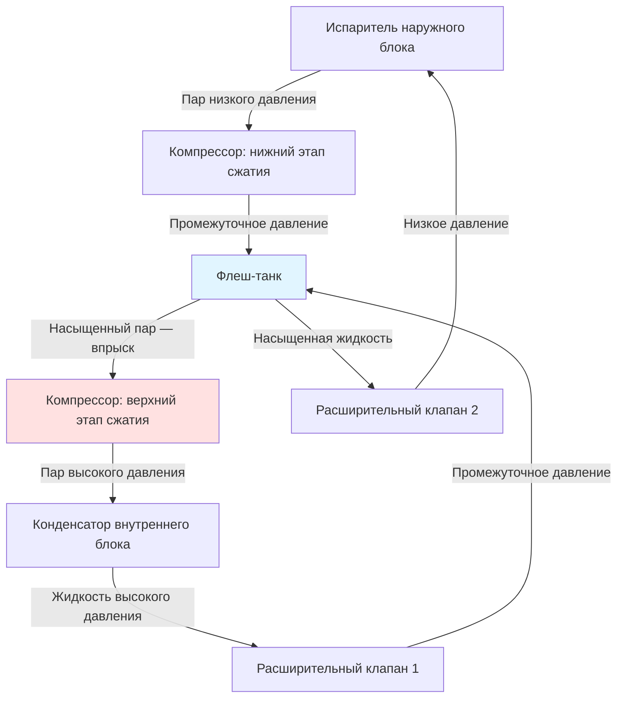
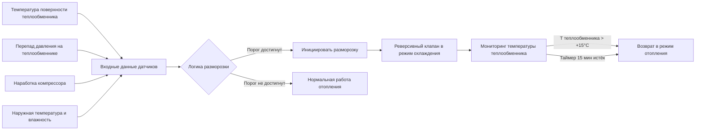

Производительность воздушных тепловых насосов существенно снижается при понижении наружной температуры из-за фундаментальных термодинамических ограничений. Понимание механизмов деградации, принципов технологии EVI (enhanced vapor injection) и методологии расчёта балансной точки обеспечивает правильный подбор оборудования для применений в холодном климате и точный прогноз сезонной эффективности.

## Пределы Карно при низких температурах

Теоретический максимальный COP теплового насоса:


COP_{\text{Carnot}} = \frac{T_{\text{cond}}}{T_{\text{cond}} - T_{\text{evap}}}


где температуры в кельвинах. Для системы, подающей тепло при 54°C и работающей при наружной температуре −12°C:
- Температура конденсации: 54 + 10 = 64°C (337 К) — с учётом расчётного $\Delta T$ в конденсаторе
- Температура испарения: −12 − 11 = −23°C (250 К) — с учётом расчётного $\Delta T$ в испарителе


COP_{\text{Carnot}} = \frac{337}{337 - 250} = \frac{337}{87} = 3{,}87


Реальный COP при этих условиях: ≈ 40–45% от теоретического = **1,5–1,75** — граничный экономически оправданный уровень при большинстве тарифных условий.

## Механизмы деградации производительности

### Механизм 1: снижение массового расхода хладагента

Давление всасывания компрессора падает по мере снижения наружной температуры, что уменьшает плотность пара на входе компрессора. При постоянном геометрическом объёме нагнетания массовый расход снижается пропорционально плотности:


\dot{m} = \rho_{\text{suction}} \cdot V_{\text{displ}} \cdot \eta_{\text{vol}}


Для R-410A: при снижении температуры испарения с −2°C до −15°C плотность пара всасывания падает примерно на 35–40%, что пропорционально снижает массовый расход и тепловую мощность.

### Механизм 2: рост степени давления

Более высокое отношение давлений (pressure ratio) требует большей работы компрессора на единицу циркулирующего хладагента. Температура нагнетания растёт, достигая предельно допустимых значений (107–121°C для большинства компрессоров). При превышении этого предела срабатывает защитный отключатель, прерывая работу.

### Механизм 3: снижение теплопередачи в испарителе

Движущая сила теплопередачи $\Delta T$ между наружным воздухом и хладагентом снижается:


\dot{Q}_{\text{evap}} = UA \cdot \Delta T_{\text{lm}}


При постоянной площади испарителя $UA = \text{const}$ снижение $\Delta T_{\text{lm}}$ прямо уменьшает тепловую мощность. Чтобы поддержать поглощение тепла при меньшем $\Delta T$, давление хладагента (и соответственно температура испарения) должно снижаться дополнительно — это порождает нисходящую петлю обратной связи.


| Температура наружного воздуха (°C) | Сохранение мощности | Типичный COP | Примечания |
|---|---|---|---|
| +8,3 | 100% (номинал) | 3,0–4,0 | Точка рейтинга AHRI |
| +1,7 | 85–90% | 2,5–3,2 | Периодические циклы разморозки |
| −8,3 | 65–75% | 1,8–2,4 | Частые циклы разморозки |
| −15,0 | 45–55% | 1,3–1,8 | Непрерывная работа разморозки |
| −20,6 | 25–35% | 0,9–1,3 | Вблизи отключения стандартных агрегатов |


## Технология усиленного впрыска пара (EVI — enhanced vapor injection)

EVI — наиболее значительная технология улучшения производительности при низких температурах. Она решает проблему деградации путём впрыска дополнительного хладагента при промежуточном давлении в процесс сжатия.

### Цикл с флеш-танком (flash tank economizer cycle)

Флеш-танк работает при промежуточном давлении между испарением и конденсацией. Жидкость высокого давления из конденсатора расширяется до промежуточного давления, образуя:
- насыщенную жидкость при промежуточном давлении → в испаритель;
- насыщенный пар при промежуточном давлении → впрыскивается в компрессор.

### Термодинамические преимущества EVI

**1. Увеличение суммарного массового расхода:**


\dot{m}_{\text{total}} = \dot{m}_{\text{evap}} + \dot{m}_{\text{injection}}


Типичное отношение инжекции: 15–25% от расхода испарителя при −20°C. Дополнительный хладагент через конденсатор увеличивает тепловую мощность без роста нагрузки на испаритель.

**2. Охлаждение процесса сжатия:**

Впрыскиваемый пар охлаждает газ в промежуточной точке цикла сжатия, снижая температуру нагнетания:


T_{\text{discharge}} = T_{\text{suction}} \cdot r_p^{(k-1)/k} \cdot \frac{1}{\eta_{\text{isen}}}


EVI снижает эффективную $T_{\text{suction}}$ для второго этапа сжатия на 10–20°C, уменьшая $T_{\text{discharge}}$ на 17–28°C. Это позволяет работать при более высоких степенях давления без риска превышения допустимой температуры нагнетания.

**3. Улучшение цикловой эффективности:**

Двухэтапное сжатие с промежуточным охлаждением приближается к идеальному изотермическому сжатию, снижая удельную работу на единицу поданного тепла.


| Температура наружного воздуха (°C) | Стандартный ASHP | EVI ccASHP | Прирост мощности |
|---|---|---|---|
| +8,3 | 10,5 кВт (100%) | 10,5 кВт (100%) | Базовое значение |
| −8,3 | 7,0 кВт (67%) | 8,8 кВт (83%) | +25% |
| −15,0 | 5,3 кВт (50%) | 7,6 кВт (72%) | +44% |
| −24,0 | 3,5 кВт (33%) | 5,8 кВт (56%) | +67% |


Данные репрезентативны для высококачественных ccASHP. NEEP (Northeast Energy Efficiency Partnerships) ведёт базу данных квалифицированных агрегатов для холодного климата с верифицированными показателями производительности при −15°C и −25°C.

## Потери в цикле разморозки: детальный анализ

Обмерзание наружного теплообменника при температуре поверхности < 0°C и наличии влажности приводит к прогрессивному ухудшению теплообмена. Нарастающий слой инея снижает $UA$ испарителя и повышает аэродинамическое сопротивление — производительность падает до достижения порога активации разморозки.

### Энергетический баланс цикла разморозки


Q_{\text{defrost}} = Q_{\text{ice melt}} + Q_{\text{coil warmup}} + Q_{\text{loss during fan-off}}


Компоненты:
- Плавление льда: 335 кДж/кг (скрытая теплота плавления воды)
- Прогрев тепловой массы теплообменника: 93–186 кДж/К на 10 кВт номинальной мощности
- Тепловые потери в период останова наружного вентилятора

Типичный цикл разморозки при −8,3°C, 50% относительной влажности:
- Продолжительность: 5–12 минут
- Частота: каждые 30–90 минут в зависимости от температуры и влажности
- Энергетический штраф: 8–15% от тепловой производительности отопительного сезона

### Алгоритмы управления разморозкой

Продвинутые алгоритмы разморозки по требованию (demand defrost) снижают количество ненужных циклов на 20–40% по сравнению с традиционным управлением по времени и температуре, улучшая средний сезонный COP.

## Расчёт балансной точки (детализированная методология)

### Функция тепловых потерь здания


\dot{Q}_{\text{loss}} = UA_{\text{total}} \cdot (T_{\text{indoor}} - T_{\text{outdoor}}) + \dot{Q}_{\text{inf+vent}}


Типичные значения $UA_{\text{total}}$ для жилых домов:
- Хорошо утеплённый дом 150 м² (Пассивхаус): $UA = 120$–$200\,\text{Вт/°C}$
- Дом среднего уровня 150 м²: $UA = 350$–$600\,\text{Вт/°C}$
- Старый дом без утепления 150 м²: $UA = 700$–$1200\,\text{Вт/°C}$

### Функция производительности теплового насоса


\dot{Q}_{\text{HP}}(T_{\text{oa}}) = \dot{Q}_{8,3} \cdot \bigl(1 - \alpha \cdot (8{,}3 - T_{\text{oa}})\bigr)


Коэффициент деградации $\alpha$:
- Стандартный ASHP: $\alpha \approx 0{,}022$ (2,2% на °C)
- ccASHP: $\alpha \approx 0{,}011$–$0{,}014$ (1,1–1,4% на °C)

### Аналитическое решение для балансной точки

При линейной аппроксимации обеих функций:


T_{BP} = \frac{\dot{Q}_{8,3} \cdot (1 + 8{,}3\alpha) - UA \cdot T_{\text{indoor}}}{\dot{Q}_{8,3} \cdot \alpha + UA}


**Пример для Москвы** (расчётная наружная температура −26°C, 99% условие EN 12831):

Исходные данные: ccASHP 12 кВт при +8,3°C ($\alpha = 0{,}013$); $UA = 400\,\text{Вт/°C}$; $T_{\text{indoor}} = 21$°C.


T_{BP} = \frac{12000 \cdot (1 + 8{,}3 \times 0{,}013) - 400 \times 21}{12000 \times 0{,}013 + 400} = \frac{13295 - 8400}{556} \approx +8{,}8\,°\text{C}


Тепловая мощность при расчётной температуре −26°C:


\dot{Q}_{\text{HP}}(-26) = 12{,}0 \cdot (1 - 0{,}013 \times (8{,}3 + 26)) = 12{,}0 \times 0{,}554 = 6{,}65\,\text{кВт}


Тепловая нагрузка здания при −26°C:


\dot{Q}_{\text{load}}(-26) = 0{,}4 \times (21 + 26) = 18{,}8\,\text{кВт}


Дефицит мощности при расчётных условиях: 18,8 − 6,65 = **12,15 кВт** — требуется вспомогательное отопление.

При данной балансной точке +8,8°C вспомогательное отопление необходимо при широком диапазоне зимних температур Москвы. Это указывает на необходимость либо более мощного ccASHP (18–20 кВт при +8,3°C), либо мощного вспомогательного источника (газового котла). Для Москвы ccASHP экономически оправдан в гибридной конфигурации с газовым котлом в качестве вспомогательного источника.

## Интеграция двухтопливной системы

### Экономическая точка переключения

Температура переключения, минимизирующая эксплуатационные затраты:


\frac{C_{\text{elec}}}{COP_{\text{HP}}} = \frac{C_{\text{gas}}}{\eta_{\text{furnace}}}


Решая относительно $T_{\text{switch}}$:


COP_{\text{HP}}(T_{\text{switch}}) = \frac{C_{\text{elec}} \cdot \eta_{\text{furnace}}}{C_{\text{gas}}}


## Рекомендации по проектированию для холодного климата

1. **Подбор мощности 50–80% от расчётной нагрузки:** при проектной наружной температуре избыток мощности насоса снижает эффективность при умеренной погоде. Цель — максимизировать долю часов работы теплового насоса с высоким COP, принимая зависимость от вспомогательного отопления в самые холодные дни.

2. **Верификация производительности при −15°C или −24°C:** не только при стандартной точке AHRI +8,3°C. Спецификация NEEP для ccASHP требует COP ≥ 1,75 при −15°C и тепловую мощность ≥ 70% номинала при −15°C.

3. **Расчёт балансной точки для конкретной системы:** производительность вспомогательного отопления должна покрывать разницу между расчётной тепловой нагрузкой и производительностью насоса при проектной температуре с учётом штрафов разморозки.

4. **Учёт потерь разморозки:** использовать среднюю производительность с учётом штрафов разморозки, а не пиковую производительность между циклами.

5. **Анализ двухтопливной экономики:** на основе реальных местных тарифов и прогнозируемых числа часов работы при каждом источнике тепла с учётом углеродных целей.

Требования NEEP к ccASHP (Cold Climate Air Source Heat Pump Specification): тепловая мощность ≥ 70% номинальной при −15°C; COP ≥ 1,75 при −15°C. Оборудование, удовлетворяющее этим критериям, подтверждает надлежащую производительность в климатических условиях большинства российских городов европейской части.

По требованиям EN 14825:2023 (Кондиционеры воздуха, жидкостные охладители жидкости и тепловые насосы), рейтинг SCOP должен рассчитываться с использованием данных производительности при не менее чем 4 температурных точках для точного учёта реальных климатических условий.
