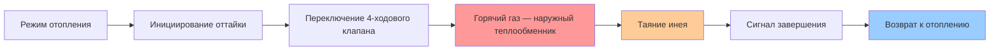
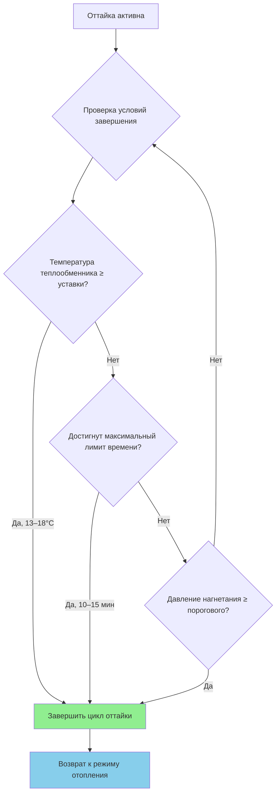

Образование инея на наружном теплообменнике воздушного теплового насоса (air-source heat pump, ASHP) — неизбежное физическое явление при работе в режиме отопления при низких температурах наружного воздуха. Накопленный иней увеличивает аэродинамическое сопротивление теплообменника и снижает интенсивность теплопередачи, что ведет к деградации производительности вплоть до 40 %. Грамотно спроектированная система оттайки восстанавливает работоспособность с минимальным энергетическим штрафом.

## Физика образования инея

### Условия намерзания

Иней формируется на поверхности наружного теплообменника (испарителя в режиме отопления), когда одновременно выполняются три условия:

1. Температура поверхности теплообменника $T_{\text{surf}} < 0\,°C$
2. Точка росы наружного воздуха $T_{\text{dp}} > T_{\text{surf}}$
3. Влагосодержание воздуха $w_{\text{amb}} > 0$

Температура поверхности в режиме отопления определяется балансом потоков:


T_{\text{surf}} = T_{\text{ref}} - \frac{q_{\text{evap}}}{h_{\text{air}} \cdot A_{\text{coil}}}


где $T_{\text{ref}}$ — температура кипения хладагента (°C), $q_{\text{evap}}$ — плотность теплового потока со стороны испарителя (Вт/м²), $h_{\text{air}}$ — коэффициент конвективной теплоотдачи со стороны воздуха (Вт/(м²·К)), $A_{\text{coil}}$ — площадь наружной поверхности теплообменника (м²).

### Массоперенос при намерзании

Скорость накопления инея на единицу площади поверхности:


\dot{m}_f = h_m \cdot (w_{\text{amb}} - w_{\text{sat,surf}})


где $h_m$ — коэффициент массоотдачи (кг/(ч·м²)), $w_{\text{amb}}$ — влагосодержание наружного воздуха (кг/кг с.в.), $w_{\text{sat,surf}}$ — влагосодержание насыщения при температуре поверхности теплообменника.

### Стадии роста инея


| Стадия | Длительность | Характеристика | Снижение производительности | Рост перепада давления |
|--------|-------------|----------------|-----------------------------|------------------------|
| Рост кристаллов | 5–15 мин | Игольчатые кристаллы, ограничение потока минимально | −2…−5 % | +5…+10 % |
| Плотный слой | 15–45 мин | Сплошной слой, перемычки между ребрами | −10…−20 % | +30…+50 % |
| Блокировка | 45+ мин | Полная закупорка межреберных каналов | −25…−40 % | +100…+200 % |


Тепловое сопротивление слоя инея складывается с сопротивлением чистого теплообменника:


\frac{1}{U_{\text{total}}} = \frac{1}{h_{\text{air}}} + \frac{t_f}{k_f} + \frac{1}{h_{\text{ref}}} + R_{\text{tube}}


где $t_f$ — толщина слоя инея (м), $k_f \approx 0{,}4$ Вт/(м·К) — теплопроводность инея (примерно в 5 раз ниже теплопроводности льда из-за воздушных пор).

## Реверсивная оттайка

### Термодинамический принцип

При реверсивной оттайке четырехходовой клапан (four-way reversing valve) переключает тепловой насос в кратковременный режим охлаждения. Горячий газ хладагента из компрессора направляется на наружный теплообменник, нагревая его до температуры выше 0 °C и расплавляя иней.

### Тепловой баланс оттайки

Температура теплообменника в режиме оттайки:


T_{\text{coil}} = T_{\text{cond}} = T_{\text{amb}} + \frac{Q_{\text{cond}}}{h_{\text{air}} \cdot A_{\text{coil}}}


Типичная температура конденсации в режиме оттайки составляет 32–43 °C. Требуемое тепло для расплавления инея:


Q_{\text{defrost}} = m_f \cdot h_{\text{fus}} + m_{\text{coil}} \cdot c_{p,\text{metal}} \cdot \Delta T_{\text{coil}}


где $m_f$ — масса инея на теплообменнике (кг), $h_{\text{fus}} = 334$ кДж/кг — удельная теплота плавления льда, $m_{\text{coil}}$ — тепловая масса теплообменника (кг), $\Delta T_{\text{coil}}$ — повышение температуры металла теплообменника (К).

### Пример расчета

**Исходные данные:** Жилой ASHP мощностью 10 кВт. Масса инея на теплообменнике $m_f = 0{,}8$ кг. Тепловая масса теплообменника $m_{\text{coil}} = 5$ кг, материал — алюминий ($c_p = 0{,}9$ кДж/(кг·К)). Нагрев металла с $-5\,°C$ до $+15\,°C$, т.е. $\Delta T_{\text{coil}} = 20$ К.


Q_{\text{defrost}} = 0{,}8 \times 334 + 5 \times 0{,}9 \times 20 = 267{,}2 + 90 = 357{,}2\,\text{кДж}


При мощности компрессора 3 кВт в режиме оттайки цикл займет около $357{,}2 / 3 = 119$ с ≈ 2 мин, что укладывается в нормативный диапазон 5–15 мин по ASHRAE 37.

### Последовательность операций

1. Компрессор продолжает работу.
2. Четырехходовой клапан переключается: режим отопления → режим охлаждения.
3. Вентилятор внутреннего блока останавливается (предотвращение подачи холодного воздуха в помещение).
4. Вентилятор наружного блока останавливается (снижение тепловых потерь в окружающую среду).
5. Горячий газ поступает на наружный теплообменник.
6. Иней тает и стекает в поддон конденсата.
7. Датчик температуры теплообменника фиксирует завершение оттайки.
8. Система возвращается в режим отопления.

## Алгоритмы управления оттайкой

### Временно-температурное управление

Традиционный алгоритм инициирует оттайку при одновременном выполнении двух условий:


\text{Инициировать оттайку} \iff (t_{\text{runtime}} \geq t_{\text{threshold}}) \;\land\; (T_{\text{coil}} \leq T_{\text{frost}})


Типовые настройки:
- $t_{\text{threshold}}$ = 30, 45, 60 или 90 минут наработки компрессора
- $T_{\text{frost}}$ = −3…0 °C (температура наружного теплообменника как индикатор наличия инея)

**Достоинства:** простота реализации, невысокая стоимость, отсутствие дополнительных датчиков.

**Недостатки:** ложные срабатывания при низкой влажности воздуха; запаздывание при высокой влажности; фиксированные интервалы не адаптируются к текущим условиям.

### Управление оттайкой по требованию (demand defrost)

Алгоритм управления по требованию непрерывно мониторит косвенные показатели засорения теплообменника и инициирует оттайку только при реальной необходимости.


| Параметр | Признак наличия инея | Типовой порог срабатывания |
|----------|----------------------|---------------------------|
| Перепад давления воздуха на теплообменнике | Рост при закупорке ребер | +76…+127 Па выше базовой линии |
| Депрессия температуры теплообменника | Снижение при тепловой изоляции инеем | 3–6 К ниже нормального режима |
| Давление всасывания хладагента | Снижение при уменьшении потока воздуха | 7–10 кПа ниже базовой линии |
| Относительная производительность | Расчет по температурам | Снижение более 15–20 % от номинала |


Условие инициирования оттайки:


\frac{Q_{\text{actual}}}{Q_{\text{baseline}}} < 0{,}80 \quad \text{И} \quad T_{\text{coil}} < 0\,°C


Фактическая производительность оценивается из:


Q_{\text{actual}} = \dot{m}_{\text{air}} \cdot c_{p,\text{air}} \cdot (T_{\text{supply}} - T_{\text{ambient}})


**Достоинства:** сокращение числа ненужных циклов оттайки; адаптация к фактическим погодным условиям; улучшение сезонной эффективности на 5–10 % по сравнению с временно-температурным алгоритмом.

**Недостатки:** более высокая стоимость (дополнительные датчики давления и расхода); необходимость калибровки базовых линий; усложненная диагностика.

## Энергетический штраф оттайки

### Компоненты энергетических потерь

Каждый цикл оттайки вносит несколько составляющих энергетического штрафа:

1. **Потеря отопительной мощности** в течение цикла (5–10 мин)
2. **Продолжающиеся теплопотери здания** без компенсации
3. **Чувствительное тепло для нагрева металла теплообменника**
4. **Скрытое тепло плавления** накопленного инея
5. **Тепловые потери в наружную среду** через горячий теплообменник
6. **Работа резервного электронагревателя**, часто включаемого для компенсации

### Сезонный интегральный штраф

Сезонный COP с учетом всех циклов оттайки:


COP_{\text{seasonal}} = \frac{Q_{\text{heating,delivered}}}{W_{\text{compressor}} + W_{\text{defrost}} + W_{\text{aux}}}



W_{\text{defrost}} = n_d \cdot \bigl(W_{\text{comp}} \cdot t_d + Q_{\text{coil,sens}} + Q_{\text{frost,lat}}\bigr)


где $n_d$ — число циклов оттайки за сезон, $t_d$ — средняя продолжительность цикла (с).


| Климатическая зона | Число циклов в сутки | Сезонный штраф (% от Q отопления) |
|--------------------|----------------------|-----------------------------------|
| Мягкая (ASHRAE Зона 3) | 1–2 | 2–4 % |
| Умеренная (ASHRAE Зоны 4–5) | 2–4 | 4–7 % |
| Холодная (ASHRAE Зоны 6–7) | 4–8 | 7–12 % |


### Конструктивные меры снижения штрафа

1. **Управление по требованию** — сокращение числа ненужных циклов.
2. **Оптимальный шаг оребрения** — 8,7–9,8 ребер на сантиметр для зон с интенсивным намерзанием; 7,9–9,8 для мягкого климата (согласно ASHRAE Handbook HVAC Systems).
3. **Гидрофобные покрытия теплообменника** — снижение адгезии инея.
4. **Низкотемпературный компрессор с переменной скоростью** — поддержание производительности и снижение скорости намерзания.
5. **Байпас горячего газа (hot-gas bypass)** — альтернатива полному реверсу цикла в ряде коммерческих установок.

## Методы завершения цикла оттайки

Завершение цикла оттайки должно обеспечивать полное удаление инея и предотвращать избыточный расход энергии.

### Завершение по температуре

Наиболее распространенный метод — по показанию датчика температуры теплообменника:


T_{\text{coil}} \geq T_{\text{term}}, \quad T_{\text{term}} = 13\ldots18\,°C


Такая уставка гарантирует полное таяние инея и отвод конденсата в поддон.

### Резервное завершение по времени

Максимальная продолжительность цикла оттайки (как правило, 10–15 мин) предотвращает:
- избыточный расход электроэнергии;
- значительное снижение температуры в помещении;
- ложную блокировку при отказе датчика температуры теплообменника.

### Завершение по давлению нагнетания

Рост давления на линии нагнетания хладагента (discharge line) сигнализирует о завершении таяния:


P_{\text{discharge}} \geq P_{\text{term}} \quad (2{,}07\ldots2{,}41\,\text{МПа для R-410A})


## Применимые стандарты

**ASHRAE 37-2009** «Methods of Testing for Rating Electrically Driven Unitary Air-Conditioning and Heat Pump Equipment» устанавливает:
- условия рейтинговых испытаний при высоких (+8,3 °C) и низких (−8,3 °C) температурах наружного воздуха;
- протоколы измерения параметров цикла оттайки;
- расчет коэффициента деградации COP (degradation coefficient $C_D$).

**ASHRAE 206-2013** «Methods of Testing for Rating Multi-Function Heat Pumps» определяет:
- условия испытания при намерзании инея: наружный воздух −1 °C ТС (температура сухого термометра), −0,5 °C ТМ (температура мокрого термометра);
- максимально допустимый интервал оттайки;
- интегральную сезонную производительность с учетом всех эффектов оттайки.

**HSPF (Heating Seasonal Performance Factor)** — основной рейтинговый показатель сезонной эффективности в режиме отопления — напрямую определяется качеством алгоритма оттайки. Системы с управлением по требованию обеспечивают на 8–10 % более высокий HSPF по сравнению с базовым временно-температурным управлением в умеренном климате.

**СП 60.13330.2020** «Отопление, вентиляция и кондиционирование воздуха» в части требований к тепловым насосам в системах отопления жилых и общественных зданий применяется совместно с указанными стандартами ASHRAE.
