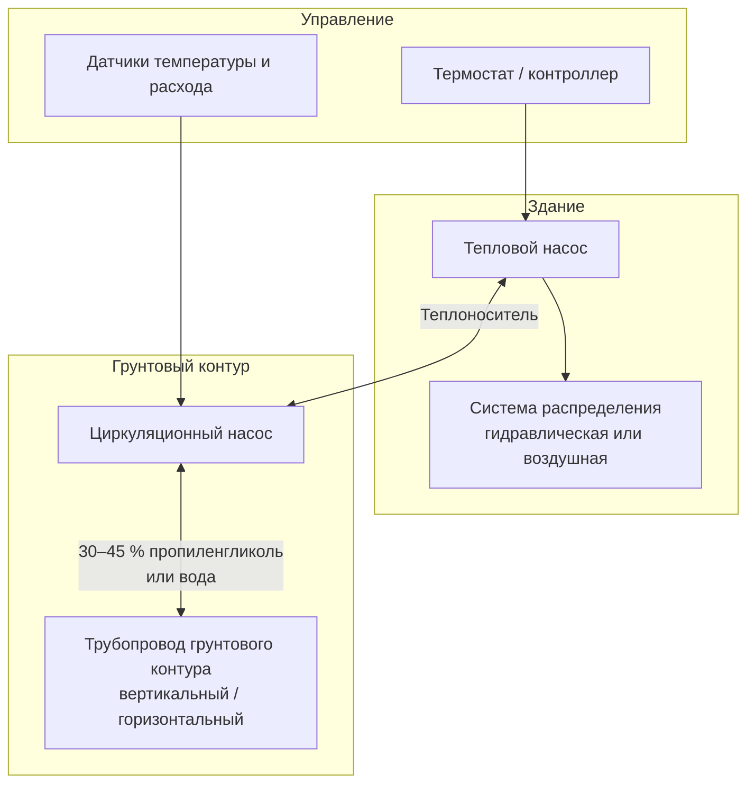

Тепловые насосы грунтового источника (ground-source heat pump, GSHP) используют стабильный температурный режим грунта, формирующийся ниже глубины промерзания, в качестве источника тепла в режиме отопления и поглотителя тепла в режиме охлаждения. В отличие от воздушных тепловых насосов, работающих в условиях значительных сезонных колебаний температуры наружного воздуха, GSHP взаимодействуют с относительно постоянным тепловым резервуаром. Это обеспечивает высокий COP (coefficient of performance) и EER (energy efficiency ratio) при всех климатических условиях.

## Основной механизм теплообмена

Ниже линии промерзания (typically 1,2–2,4 м в умеренном климате) температура грунта примерно соответствует среднегодовой температуре наружного воздуха для данной местности. На глубинах 3–6 м в средней полосе России температуры грунта составляют 8–14 °C с минимальными сезонными отклонениями.

Интенсивность теплообмена между грунтовым контуром и окружающим массивом грунта описывается законом теплопроводности Фурье:


Q = k \cdot A \cdot \frac{\Delta T}{L}


где $Q$ — тепловой поток (Вт), $k$ — коэффициент теплопроводности грунта (Вт/(м·К)), $A$ — площадь поверхности теплообменника (м²), $\Delta T$ — разность температур теплоносителя и нетронутого грунта (К), $L$ — эффективное расстояние теплопередачи (м).


| Тип грунта | Теплопроводность k (Вт/(м·К)) | Температуропроводность α (м²/сут) |
|------------|-------------------------------|-----------------------------------|
| Сухой песок | 0,5–0,8 | 0,010–0,016 |
| Влажный песок | 1,2–2,0 | 0,020–0,041 |
| Сухая глина | 0,5–1,0 | 0,009–0,014 |
| Насыщенная глина | 1,2–1,8 | 0,017–0,031 |
| Скальная порода | 2,0–4,0 | 0,033–0,072 |


## Конфигурации грунтовых контуров

Системы GSHP реализуются в замкнутых (closed-loop) и открытых (open-loop) конфигурациях.

### Замкнутые контуры

В замкнутых системах теплоноситель (вода или водно-антифризная смесь) непрерывно циркулирует через закопанные в грунт трубопроводы.

**Вертикальные контуры**

Вертикальные скважины бурятся на глубину 30–150 м, расстояние между скважинами — 4,5–7,5 м. U-образные трубки из полиэтилена высокой плотности (HDPE, ПЭВП) диаметром 19–32 мм вставляются в скважины и заполняются тампонажным материалом (grout) с повышенной теплопроводностью. Теплообмен происходит по всей длине скважины.

Требуемая суммарная длина скважин:


L_{\text{total}} = \frac{Q_a}{q_{\text{eff}}}


где $L_{\text{total}}$ — суммарная длина скважин (м), $Q_a$ — среднегодовой тепловой поток (Вт), $q_{\text{eff}}$ — эффективный удельный тепловой поток на единицу длины скважины (Вт/м). Типовые значения $q_{\text{eff}}$: 15–35 Вт/м в зависимости от теплофизических свойств грунта.

**Горизонтальные контуры**

Горизонтальные контуры прокладываются в траншеях на глубине 1,2–1,8 м. Возможные конфигурации: одиночная труба, двойная труба в одной траншее, спиральная «slinky»-укладка. Требуемая площадь земли: 37–65 м² на кВт мощности охлаждения в зависимости от конфигурации и свойств грунта.

**Контуры в водоемах**

Погружные теплообменные катушки в прудах и озерах обеспечивают превосходный теплообмен при глубине водоема более 2,4–3 м и достаточной тепловой емкости. Требуемая площадь зеркала воды: 18–28 м² на кВт мощности.

### Открытые контуры

Открытые системы прокачивают грунтовую воду непосредственно через теплообменник теплового насоса, после чего возвращают ее в водоносный горизонт через нагнетательную скважину, поверхностный водоем или дренажное поле. Грунтовая вода поддерживает стабильную температуру 10–16 °C, что обеспечивает высокую интенсивность теплообмена.

Требуемый расход грунтовой воды:


\dot{m} = \frac{Q}{c_p \cdot \Delta T}


Для воды ($c_p = 4{,}18$ кДж/(кг·К)) при проектном температурном перепаде $\Delta T = 5{,}5$ К расход составляет приблизительно 0,044 л/(с·кВт), или около 1,2 л/(с·т) холода.

Открытые системы требуют дебита водоносного горизонта не менее 2–4 л/(с·кВт), приемлемого качества воды (низкое содержание растворенных солей и взвешенных веществ) и разрешений соответствующих водоохранных органов.

## Производительность системы

### Режим отопления

COP теплового насоса в режиме отопления:


COP_{\text{heating}} = \frac{Q_{\text{heating}}}{W_{\text{compressor}}}


Система GSHP с температурой воды на входе (entering water temperature, EWT) 10 °C, подающая теплоноситель температурой 49 °C в гидравлическую систему отопления, достигает COP 3,8–4,2. Для сравнения: воздушный тепловой насос при −7 °C наружного воздуха имеет COP 2,0–2,5.

### Режим охлаждения

EER (energy efficiency ratio) системы GSHP при отводе тепла в грунт температурой 21–27 °C составляет 4,4–7,3 (15–25 в единицах Btu/(Вт·ч)). Воздухоохлаждаемые чиллеры при отводе тепла в воздух +35 °C достигают EER 10–14.

Преимущество GSHP в производительности обусловлено меньшим температурным лифтом компрессора (разностью температур конденсации и испарения):


W_{\text{compressor}} \propto \frac{T_{\text{cond}} - T_{\text{evap}}}{T_{\text{evap}}}


Снижение $T_{\text{cond}}$ при охлаждении (или повышение $T_{\text{evap}}$ при отоплении) непосредственно уменьшает удельную работу компрессора.

## Состав системы

Ключевые компоненты:
- **Блок теплового насоса** — конфигурация «вода–воздух» (water-to-air) или «вода–вода» (water-to-water)
- **Циркуляционный насос** — расчетный расход 1,0–1,2 л/(с·т) холода
- **Насосный узел** — насос, запорно-регулирующая арматура, предохранительный клапан, расширительный бак
- **Теплоноситель** — вода (открытый контур) или водный раствор антифриза (замкнутый контур)
- **Трубопровод ПЭВП** — термически сплавленные соединения SDR-11

## Основы проектирования

Корректное проектирование системы GSHP предполагает точное определение:

1. **Тепловых нагрузок здания** — пиковые требования по теплу/холоду и годовое энергопотребление согласно СП 60.13330, ASHRAE 90.1.
2. **Теплофизических свойств грунта** — теплопроводность и температуропроводность по данным теста теплового отклика (thermal response test, TRT).
3. **Размеров контура** — суммарная длина скважин или площадь горизонтального контура с учетом долгосрочного теплового баланса.
4. **Расхода теплоносителя** — турбулентное течение (Re > 4000) для эффективного теплообмена.
5. **Концентрации антифриза** — защита от замерзания при допустимом штрафе по вязкости.

IGSHPA (International Ground Source Heat Pump Association) публикует стандарты проектирования и расчетное программное обеспечение (EnergyPlus, GLHEPRO), учитывающее тепловое взаимодействие соседних скважин и долгосрочный дрейф температуры грунта.

## Годовое энергопотребление и экономика

Расчетное годовое энергопотребление корректно спроектированной системы GSHP:


E_{\text{annual}} = \frac{Q_{\text{heat,yr}}}{COP_{\text{avg}}} + \frac{Q_{\text{cool,yr}}}{EER_{\text{avg}} / 3{,}412}


**Пример:** Жилой дом площадью 200 м² в умеренном климате. Годовая тепловая нагрузка $Q_{\text{heat,yr}} = 20\,000$ кВт·ч, охладительная $Q_{\text{cool,yr}} = 5\,000$ кВт·ч. Среднесезонные $COP_{\text{avg}} = 3{,}8$, $EER_{\text{avg}} = 18$ (Btu/(Вт·ч)) = 5,27 (Вт/Вт).


E_{\text{annual}} = \frac{20\,000}{3{,}8} + \frac{5\,000}{5{,}27} = 5\,263 + 949 = 6\,212\,\text{кВт·ч/год}


Для сравнения, традиционный газовый котел + кондиционер с EER 12 потребуют (при КПД котла 90 %) около 9 600 кВт·ч газа и 1 420 кВт·ч электроэнергии на охлаждение — суммарно около 11 020 кВт·ч первичной энергии. Экономия: ~44 %.

Жилые установки GSHP обычно обеспечивают 30–50 % экономии энергии по сравнению с традиционными системами HVAC. Простой срок окупаемости с учетом государственных субсидий — 5–10 лет.

## Нормативная база

- ASHRAE Handbook — HVAC Applications, Chapter 34: Geothermal Energy
- IGSHPA Design and Installation Standards (2021)
- ASHRAE Standard 90.1-2022: Energy Standard for Buildings
- СП 60.13330.2020 «Отопление, вентиляция и кондиционирование воздуха»
- СП 41-01-2003 «Геотермальные тепловые насосы» (Россия)
