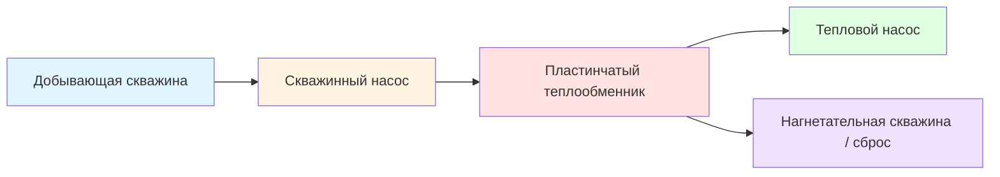
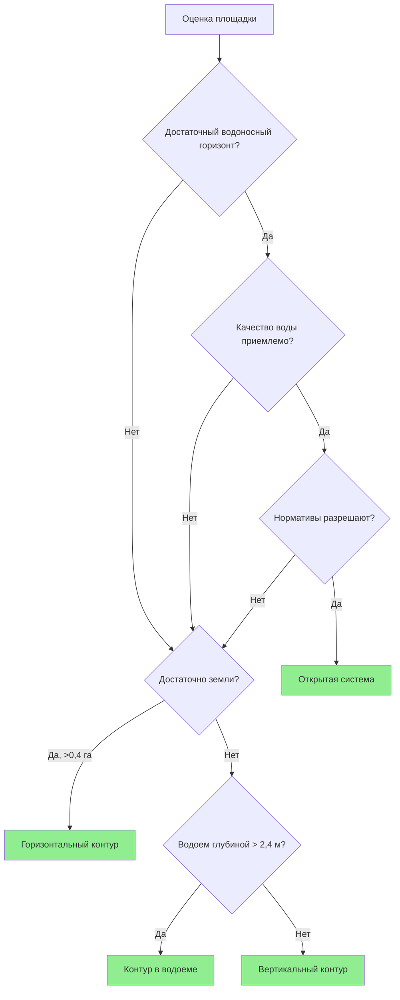

Конфигурация грунтового контура — наиболее критичное проектное решение для системы GSHP, напрямую определяющее стоимость монтажа, тепловую производительность и долгосрочную надежность. Наземный теплообменник (ground heat exchanger) служит тепловым резервуаром: отводит тепло при охлаждении и извлекает его при отоплении. Выбор конфигурации определяется геологией площадки, наличием свободной земли, теплофизическими свойствами грунта и условиями водоносного горизонта.

## Фундаментальные механизмы теплопередачи

Теплообмен между грунтовым контуром и грунтовым массивом реализуется тремя одновременно действующими механизмами.

**Теплопроводность** (conduction) — доминирующий механизм, описываемый законом Фурье:


q = -k_{\text{soil}} \cdot A \cdot \frac{dT}{dx}


где $q$ — тепловой поток (Вт), $k_{\text{soil}}$ — теплопроводность грунта (Вт/(м·К)), $A$ — площадь поверхности теплообмена (м²), $dT/dx$ — температурный градиент (К/м).

**Температуропроводность** (thermal diffusivity) определяет нестационарный отклик грунтового массива:


\alpha = \frac{k_{\text{soil}}}{\rho \cdot c_p}


где $\alpha$ (м²/с) — температуропроводность, $\rho$ — плотность грунта (кг/м³), $c_p$ — удельная теплоемкость (Дж/(кг·К)). Высокая температуропроводность ускоряет рассеивание тепловых возмущений, но снижает тепловую емкость массива.

**Движение подземных вод** (groundwater advection) повышает эффективную теплопроводность на 20–50 % в насыщенных зонах при наличии значимого водотока.

## Замкнутые контуры

### Вертикальная скважина

Вертикальные скважины бурятся на глубину 30–180 м, диаметр 100–150 мм. В скважины устанавливаются U-образные трубки из ПЭВП (HDPE) и выполняется цементация кольцевого пространства термически улучшенным тампонажным материалом.

**Достоинства:**
- минимальная занимаемая площадь (14–19 м² на кВт мощности);
- доступ к стабильным глубинным температурам;
- высокая теплопроводность в консолидированных породах;
- отсутствие сезонной деградации производительности;
- применимость в условиях реконструкции.

**Удельная теплопередача скважины:**


q_{\text{bore}} = \frac{T_{\text{ground}} - T_{\text{fluid}}}{R_{\text{bore}} + R_{\text{grout}} + R_{\text{pipe}}}


Типовые значения удельного теплосъема (по методологии IGSHPA): 15–25 Вт/м в режиме отопления, 18–30 Вт/м в режиме охлаждения — в зависимости от геологии.

### Горизонтальный контур

Горизонтальные контуры прокладываются в траншеях глубиной 1,2–3,0 м с трубами ПЭВП в одно-, двух- или четырехтрубном (slinky) исполнении.

**Достоинства:**
- более низкая стоимость монтажа при наличии достаточной площади;
- простота монтажа без специализированного бурового оборудования;
- возможность расширения и ремонта;
- использование солнечного прогрева поверхностного слоя грунта.

**Недостатки:**
- большая потребность в земле (140–280 м² на кВт);
- сезонная вариация производительности, обусловленная колебаниями температуры поверхности;
- уязвимость к изменениям ландшафта;
- риск промерзания трубопровода в холодных климатах.

**Температурное поле грунта на глубине:**


T_{\text{soil}}(z,t) = T_{\text{mean}} + A_s \cdot e^{-z\sqrt{\frac{\pi}{\alpha P}}} \cos\!\left(\frac{2\pi t}{P} - z\sqrt{\frac{\pi}{\alpha P}}\right)


где $T_{\text{mean}}$ — среднегодовая температура поверхности, $A_s$ — амплитуда сезонных колебаний температуры поверхности, $P$ — период 365 сут, $\alpha$ — температуропроводность грунта.

### Спиральная укладка «slinky»

Перекрывающиеся петли трубопровода увеличивают площадь теплообмена на единицу длины траншеи в 2–4 раза, снижая потребность в земле, но повышая затраты на материалы и насосное оборудование.

**Требования к шагу:**
- расстояние между траншеями: не менее 3–6 м;
- шаг петли: 0,3–0,6 м;
- исключение теплового взаимодействия соседних контуров.

### Контур в водоеме

Погружные замкнутые контуры в прудах и озерах используют высокие теплофизические свойства воды:
- теплопроводность воды 0,6 Вт/(м·К);
- стабильная температурная стратификация;
- естественная конвекция интенсифицирует теплоотдачу.

**Требования к водоему:**
- минимальная глубина 2,4–3,0 м для предотвращения замерзания;
- минимальный объем: 0,019 дм³ на кВт мощности охлаждения;
- укладка на дно для температурной стабильности;
- надежное крепление катушек против всплытия и ледовых нагрузок.

## Открытые системы

Открытые системы прокачивают грунтовую воду непосредственно через теплообменник, после чего сбрасывают ее во вторую скважину или поверхностный водоем.

### Критерии проектирования

**Требуемый расход грунтовой воды:**


\dot{m}_{\text{water}} = \frac{q_{\text{peak}}}{c_p \cdot \Delta T_{\text{water}}}


Типовый $\Delta T_{\text{water}}$ = 3–5 °C через теплообменник.

**Минимальная производительность скважины:**
- 0,09–0,19 л/с на кВт мощности охлаждения;
- возможность непрерывной прокачки при пиковой нагрузке.


| Параметр | Максимально допустимое значение | Последствие превышения |
|----------|---------------------------------|------------------------|
| Железо (Fe) | 0,3 мг/л | Биообрастание, коррозия |
| Марганец (Mn) | 0,05 мг/л | Отложения оксидов |
| Жесткость (CaCO₃) | 250 мг/л | Накипеобразование в теплообменнике |
| pH | 6,5–8,5 | Коррозия или накипь |
| Общий солесодержание (TDS) | < 1 000 мг/л | Снижение теплопередачи |
| H₂S | < 0,05 мг/л | Коррозия, запах |


## Сравнение конфигураций контуров


| Параметр | Вертикальный | Горизонтальный | Водоемный | Открытый |
|----------|-------------|----------------|-----------|----------|
| Стоимость монтажа | Высокая | Низкая | Низкая | Низкая–средняя |
| Занимаемая площадь | Минимальная | Большая | Нет | Минимальная |
| Тепловая стабильность | Отличная | Умеренная | Хорошая | Отличная |
| COP (отопление) | 3,5–4,5 | 3,2–4,0 | 3,5–4,3 | 3,8–5,0 |
| Расчетный срок службы | 50+ лет | 50+ лет | 25–50 лет | 25+ лет |
| Техническое обслуживание | Минимальное | Минимальное | Умеренное | Умеренное–высокое |
| Ограничения | Скальные формации | Площадь участка | Наличие водоема | Качество водоносного горизонта |


## Оценка площадки и выбор конфигурации

### Тест теплопроводности грунта

Полевой тест теплового отклика (thermal response test, TRT) измеряет эффективную теплопроводность:


k_{\text{eff}} = \frac{q}{4\pi m}, \quad m = \frac{dT_{\text{fluid}}}{d(\ln t)}


Продолжительность теста: минимум 48–72 ч. Тест критически важен для точного расчета вертикального контура.


| Тип грунта / породы | Теплопроводность k (Вт/(м·К)) | Пригодность для GSHP |
|----------------------|-------------------------------|----------------------|
| Сухой песок / гравий | 0,4–0,8 | Неудовлетворительная |
| Влажный песок / гравий | 1,5–2,5 | Хорошая |
| Насыщенный песок / гравий | 2,0–3,0 | Отличная |
| Глина сухая | 0,5–1,0 | Удовлетворительная |
| Глина влажная | 1,0–1,8 | Хорошая |
| Известняк | 2,5–3,5 | Отличная |
| Гранит | 2,5–4,0 | Отличная |


### Дерево принятия решений

## Расчет геотермального теплообменника

### Замкнутый контур: гидравлический расчет

**Потери давления по Дарси–Вейсбаху:**


\Delta P = f \cdot \frac{L}{D} \cdot \frac{\rho v^2}{2}


Целевое значение: < 30 кПа на кВт суммарных потерь давления в контуре для сохранения приемлемой мощности насоса.

**Число Рейнольдса:**


Re = \frac{\rho \cdot v \cdot D}{\mu}


Поддерживать Re > 4000 (турбулентный режим) при скоростях теплоносителя 0,6–1,2 м/с.


| Мощность (кВт) | Расход (л/мин) | Диаметр трубопровода |
|----------------|---------------|----------------------|
| 3,5–10,5 | 11–27 | 20 мм |
| 10,5–21 | 27–54 | 25 мм |
| 21–42 | 54–108 | 32 мм |
| 42–70 | 108–170 | 40 мм |


### Тепловое сопротивление скважины

**Суммарное тепловое сопротивление:**


R_{\text{total}} = R_{\text{pipe}} + R_{\text{grout}} + R_{\text{bore}}


**Сопротивление скважины** (метод коэффициентов формы):


R_{\text{bore}} = \frac{1}{2\pi k_{\text{grout}}} \ln\!\left(\frac{r_{\text{bore}}}{\sqrt{2}\,r_{\text{pipe}}}\right)


Типовые значения: 0,10–0,20 м·К/Вт для термически улучшенного тампонажа; 0,30–0,50 м·К/Вт для чистого бентонита.

### Открытый цикл: пластинчатый теплообменник

**Площадь теплообмена:**


UA = \frac{q}{\Delta T_{\text{lm}}}


**Логарифмическая средняя разность температур (LMTD):**


\Delta T_{\text{lm}} = \frac{(T_{w,\text{in}} - T_{l,\text{out}}) - (T_{w,\text{out}} - T_{l,\text{in}})}{\ln\!\left(\dfrac{T_{w,\text{in}} - T_{l,\text{out}}}{T_{w,\text{out}} - T_{l,\text{in}}}\right)}


Рабочее температурное приближение (approach temperature): 0,5–2,8 °C для пластинчатого теплообменника.

## Нормативная база

**IGSHPA Design and Installation Standards** обеспечивают комплексную методологию:
- процедуры теста теплопроводности;
- расчет длины контура;
- спецификации тампонажных материалов;
- требования к сварке трубопроводов.

**ASHRAE Handbook — HVAC Applications, Chapter 34** охватывает:
- процедуры расчета нагрузки;
- оценку температуры грунта;
- параметры проектирования системы;
- прогнозируемые характеристики производительности.

**СП 60.13330.2020** и **СП 41-01-2003** — российская нормативная база для проектирования систем с тепловыми насосами.
