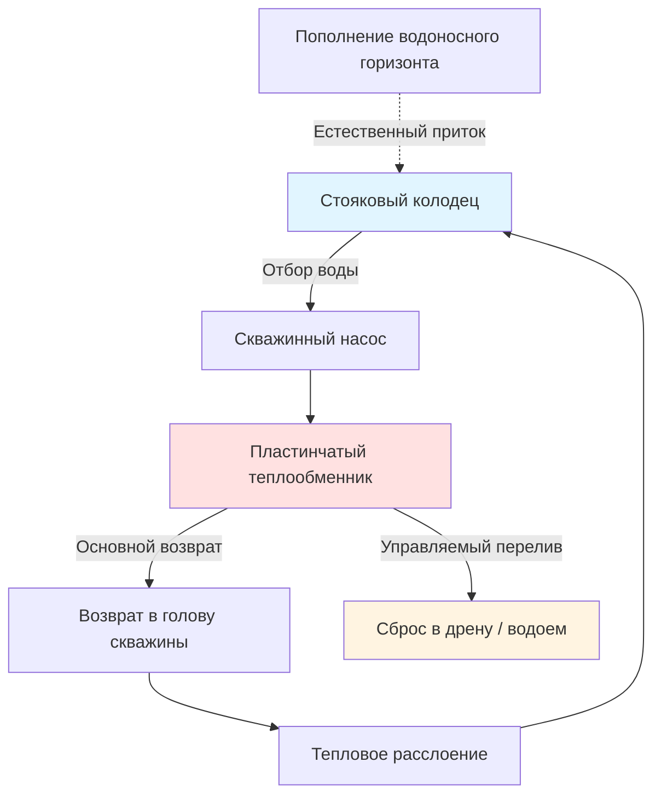

Системы GSHP открытого контура (open-loop ground-source heat pump systems) извлекают грунтовую воду непосредственно из водоносного горизонта, пропускают ее через теплообменник и возвращают обратно в грунт или сбрасывают в поверхностный водоем. Стабильная температура подземных вод (7–24 °C в зависимости от географии и глубины) обеспечивает высокую и постоянную интенсивность теплообмена, что выгодно отличает открытые системы от замкнутых контуров.

## Основной принцип работы

Открытые системы извлекают тепловую энергию из движущейся грунтовой воды, а не из твердого грунта. Скорость теплопередачи определяется расходом воды и температурным перепадом:


Q = \dot{m} \cdot c_p \cdot \Delta T = \rho \cdot \dot{V} \cdot c_p \cdot (T_{\text{in}} - T_{\text{out}})


где $Q$ — мощность теплообмена (Вт), $\dot{m}$ — массовый расход (кг/с), $c_p = 4{,}18$ кДж/(кг·К) — удельная теплоемкость воды, $\dot{V}$ — объемный расход (л/с), $\rho \approx 1000$ кг/м³.

Требуемый расход воды для заданной мощности:


\dot{V}_{\text{л/с}} = \frac{Q_{\text{Вт}}}{c_p \cdot \rho \cdot \Delta T_K \cdot 1000}
= \frac{Q_{\text{Вт}}}{4{,}18 \times 10^3 \times \Delta T}


**Пример:** Система мощностью 20 кВт при $\Delta T = 5$ К:


\dot{V} = \frac{20\,000}{4180 \times 5} = 0{,}96\,\text{л/с}


С коэффициентом запаса 1,25 — минимальный дебит скважины 1,2 л/с.

Типовые проектные значения: $\Delta T$ = 3–4,5 К в режиме отопления и 3–3,7 К в режиме охлаждения.

## Конфигурации систем

### Скважины водозабора и нагнетания

Наиболее распространенная конфигурация — две отдельные скважины: водозаборная (добывающая) и нагнетательная.

**Критерии проектирования:**
- минимальное расстояние между скважинами: 15–30 м для предотвращения теплового «короткого замыкания» (thermal short-circuit);
- глубина водозаборной скважины определяется глубиной залегания водоносного горизонта и статическим уровнем воды;
- нагнетательную скважину располагать по возможности ниже по потоку от водозаборной;
- при увеличении мощности системы и длительном непрерывном режиме расстояние между скважинами увеличивается.

### Стояковый колодец (SCW)

Стояковый колодец (standing column well, SCW) представляет собой одну глубокую скважину (60–450 м) с внутренней рециркуляцией воды. Управляемый перелив (bleed) обеспечивает тепловое восстановление водоносного горизонта.

**Режимы работы SCW:**

1. **Без перелива**: вода полностью рециркулирует внутри колонны скважины.
2. **Частичный перелив**: 1–5 % расхода сбрасывается для поддержания эффективности теплообмена.
3. **Полный перелив**: максимальный сброс при пиковых нагрузках.

Расход перелива:


\dot{V}_{\text{bleed}} = \frac{Q_{\text{deficit}}}{c_p \cdot \rho \cdot \Delta T_{\text{gw}}}


где $Q_{\text{deficit}}$ — тепловая нагрузка, превышающая естественную мощность восстановления скважины (Вт).

**Достоинства SCW:**
- одна скважина снижает затраты на бурение;
- нет требований к разделению скважин;
- эффективен в трещиноватых скальных породах;
- применим на участках с ограниченной площадью.

**Ограничения:**
- требует достаточного пополнения водоносного горизонта;
- при длительных пиковых нагрузках возможен перелив;
- тепловая мощность снижается при продолжительной работе;
- сброс перелива требует разрешительной документации.

## Требования к качеству грунтовой воды

Качество воды непосредственно влияет на производительность теплообменника и долговечность системы.


| Параметр | Предельное значение | Последствие превышения |
|----------|--------------------|-----------------------|
| Общая жесткость (CaCO₃) | 250 мг/л | Накипь в теплообменнике |
| Железо (Fe) | 0,3 мг/л | Биообрастание, коррозия |
| Марганец (Mn) | 0,05 мг/л | Отложения оксидов |
| pH | 6,5–8,5 | Коррозия (низкий pH) / накипь (высокий pH) |
| Общее солесодержание (TDS) | 500 мг/л | Ускоренная коррозия |
| Сероводород (H₂S) | 0,05 мг/л | Коррозия, запах |
| Хлориды | 250 мг/л | Питтинговая коррозия |
| Сульфаты | 250 мг/л | Накипеобразование |


### Индексы накипеобразования и коррозии

**Индекс насыщения Лангелье (LSI):**


LSI = pH - pH_s


где $pH_s$ — pH насыщения карбонатом кальция по химическому составу воды.
- LSI > 0: пересыщение, вероятна накипь;
- LSI = 0: равновесие;
- LSI < 0: ненасыщение, коррозионная среда.

**Индекс стабильности Ризнара (RSI):**


RSI = 2 \cdot pH_s - pH


- RSI < 6,0: интенсивное накипеобразование;
- RSI 6,0–7,5: умеренная накипь или баланс;
- RSI > 7,5: коррозионная среда.

### Изоляция пластинчатым теплообменником

При предельном качестве воды применяется изолирующий пластинчатый теплообменник (plate heat exchanger, PHX): грунтовая вода проходит по одной стороне, тепловой насос подключается к отдельному замкнутому контуру. Это защищает компрессорный агрегат от прямого контакта с агрессивной водой.


\frac{1}{UA} = \frac{1}{h_1 A_1} + \frac{t_{\text{plate}}}{k_{\text{plate}} A} + \frac{1}{h_2 A_2}


Дополнительное тепловое сопротивление снижает суммарную эффективность системы на 5–15 %, однако исключает риск загрязнения внутреннего контура теплового насоса.

## Методы утилизации сбросной воды

### Нагнетательная скважина (injection well)

Закачка воды обратно в тот же водоносный горизонт через нагнетательную скважину. Требования IGSHPA:
- минимальное расстояние 15 м от водозаборной скважины;
- фильтровая зона в том же горизонте;
- ежеквартальный мониторинг давления и расхода закачки.

**Коэффициент фильтрации водоносного горизонта:**


K = \frac{Q}{2\pi H \cdot s}


где $K$ — коэффициент фильтрации (м/сут), $Q$ — расход закачки (м³/сут), $H$ — мощность насыщенной зоны (м), $s$ — изменение уровня воды (м).

### Сброс в поверхностные водоемы

Где разрешено местным законодательством — сброс в ливневую канализацию (температурные ограничения обычно 20–30 °C) или поверхностные водоемы с разрешением на сброс.

Температура сбросной воды:


T_{\text{dischar}} = T_{\text{supply}} \pm \Delta T_{\text{system}}


Большинство нормативных актов ограничивают изменение температуры сбросной воды относительно температуры принимающего водоема значением ±3 °C.

### Нормативные требования

В Российской Федерации открытые системы с отбором и закачкой грунтовых вод регулируются:
- Водным кодексом РФ (статьи о пользовании подземными водами);
- Законом о недрах (лицензирование водопользования);
- СанПиН по охране подземных вод;
- нормами субъектов РФ о строительстве скважин.

**Перечень проектной документации:**
- гидрогеологическая оценка;
- испытание скважины на дебит (не менее 8 ч);
- полный химический анализ воды;
- тепловое моделирование для крупных систем;
- разрешение на водопользование.

## Расчет производительности скважины

Минимальная производительность скважины должна превышать пиковый расход системы с коэффициентом запаса:


\dot{V}_{\text{well,req}} = \dot{V}_{\text{system,peak}} \times 1{,}25


**Пример:** Система охлаждения мощностью 20 кВт при $\Delta T = 5$ К. Расход системы $\dot{V}_{\text{system}} = 0{,}96$ л/с. Минимальный дебит скважины:


\dot{V}_{\text{well,req}} = 0{,}96 \times 1{,}25 = 1{,}2\,\text{л/с}


Суммарный динамический напор (TDH) скважинного насоса:


TDH = H_{\text{static}} + H_{\text{friction}} + H_{\text{system}} + H_{\text{velocity}}


## Характеристики производительности

**Преимущества открытых систем:**
- более высокий COP, чем у замкнутых систем (постоянная температура источника);
- более низкая стоимость монтажа при наличии подходящего водоносного горизонта;
- отсутствие ограничений по площади грунтового контура;
- превосходная производительность в обоих режимах.

**Ограничения:**
- требует водоносного горизонта с достаточным дебитом;
- качество воды определяет режим обслуживания теплообменника;
- необходимость разрешительной документации;
- возможное кольматирование скважины со временем;
- метод утилизации воды должен быть экологически устойчивым.


| Показатель | Значение |
|-----------|---------|
| COP в режиме отопления | 3,5–5,0 |
| EER в режиме охлаждения | 15–25 (COP 4,4–7,3) |
| Стабильность температуры источника | ±1 °C ежегодно |
| Температурный перепад на теплообменнике | 3–5 К |


Открытые системы обеспечивают исключительную эффективность при соответствии условий водоносного горизонта и качества воды требованиям устойчивой эксплуатации. Надлежащее проектирование требует тщательного гидрогеологического обследования, лабораторного анализа воды и соответствия применимым нормам водопользования.

---

**Нормативные ссылки:**
- IGSHPA Design and Installation Standards (2021)
- ASHRAE Handbook — HVAC Applications, Chapter 34
- EPA Underground Injection Control Regulations (40 CFR Parts 144–148)
- NGWA Guidelines for Geothermal Heat Pump Well Construction
- Водный кодекс Российской Федерации
