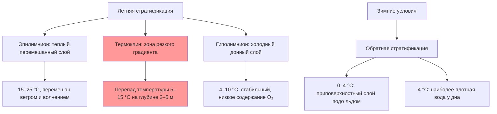
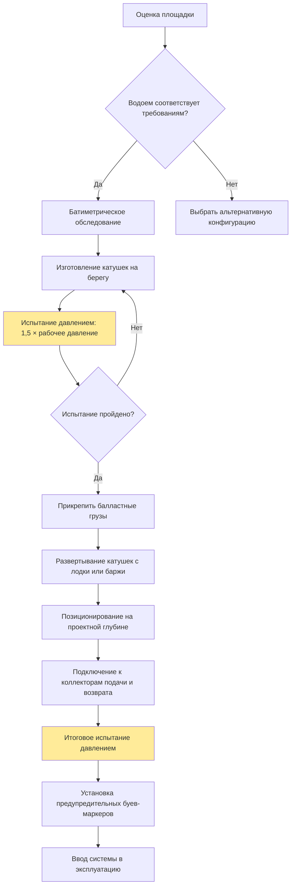

Системы с контурами в водоемах используют погружные теплообменные катушки в прудах и озерах для прямого извлечения или отвода тепловой энергии. Конвективный теплообмен между циркулирующим раствором антифриза и окружающей водой обеспечивает значительно более высокий коэффициент теплоотдачи, чем в грунтовых системах, благодаря превосходным теплофизическим свойствам воды и наличию естественной конвекции.

## Фундаментальные принципы теплопередачи

Скорость теплопередачи от погружной катушки:


Q = h_o \cdot A_o \cdot (T_w - T_{\text{pipe}})


где $h_o$ — коэффициент конвективной теплоотдачи снаружи трубы (150–600 Вт/(м²·К) в зависимости от скорости водяного потока у катушки), $A_o$ — площадь наружной поверхности катушки, $T_w$ — температура воды (°C), $T_{\text{pipe}}$ — температура стенки трубы (°C).

Преимущество воды как теплового резервуара:
- теплопроводность: 0,6 Вт/(м·К)
- объемная теплоемкость: 4,18 МДж/(м³·К) — против 2,0–2,8 МДж/(м³·К) для грунта
- естественная конвекция непрерывно обновляет воду у поверхности катушки

## Требования к тепловой емкости водоема

### Расчет минимального объема

Требуемый объем воды определяется из условия допустимого сезонного изменения температуры:


V_{\min} = \frac{Q_{\text{season}} \cdot t_{\text{op}}}{\rho_w \cdot c_w \cdot \Delta T_{\text{accept}}}


где $Q_{\text{season}}$ — средняя сезонная мощность теплообмена (Вт), $t_{\text{op}}$ — суммарная наработка за сезон (с), $\rho_w = 1000$ кг/м³, $c_w = 4186$ Дж/(кг·К), $\Delta T_{\text{accept}}$ — допустимое сезонное изменение температуры воды (обычно 2–5 °C).

**Пример:** Система мощностью 10,5 кВт (3 т), средняя наработка 1 800 ч/сезон, $\Delta T_{\text{accept}} = 3$ °C.


V_{\min} = \frac{10\,500 \times 1800 \times 3600}{1000 \times 4186 \times 3} = \frac{6{,}80 \times 10^{10}}{1{,}256 \times 10^7} \approx 5\,415\,\text{м}^3



| Тепловая нагрузка | Мин. объем воды | Мин. площадь зеркала | Мин. глубина |
|-------------------|-----------------|---------------------|-------------|
| 3,5 кВт (1 т) | 1 900 м³ | 760 м² | 2,4 м |
| 10,5 кВт (3 т) | 5 700 м³ | 2 280 м² | 2,4 м |
| 17,5 кВт (5 т) | 9 500 м³ | 3 800 м² | 2,4 м |
| 35 кВт (10 т) | 19 000 м³ | 7 600 м² | 2,4 м |


### Требования к глубине

Минимальная глубина водоема:


D_{\min} = D_{\text{ice}} + D_{\text{clear}} + D_{\text{coil}} + D_{\text{bottom}}


где $D_{\text{ice}}$ — максимальная расчетная толщина льда (0–0,6 м), $D_{\text{clear}}$ — зазор над катушками (0,3–0,6 м), $D_{\text{coil}}$ — высота катушки (0,15–0,3 м), $D_{\text{bottom}}$ — зазор до дна (0,3–0,6 м).

IGSHPA рекомендует минимальную глубину водоема 2,4 м с расположением катушек на глубине 1,5–2,1 м от поверхности.

## Сезонная стратификация и термоклин

Естественные водоемы проявляют тепловую стратификацию, особенно в летний период. Слоистая структура температурного поля влияет на производительность теплообменника.

### Влияние термоклина

Глубина термоклина зависит от площади водной поверхности, максимальной глубины водоема, широты и сезона. В умеренном климате термоклин устанавливается на глубине 3–8 м в летний период.

Размещение катушек выше термоклина дает более теплую воду для режима отопления; ниже термоклина — более холодную воду, улучшающую производительность охлаждения.

### События перемешивания (turnover)

Весенний и осенний тепловой оборот перемешивает всю водную толщу, когда температуры поверхности и дна выравниваются вблизи 4 °C (точка максимальной плотности воды). Эти события выравнивают тепловой баланс, но создают кратковременные вариации производительности теплообменника.

## Конструкция и конфигурация катушек

### Геометрия катушек

**Пружинные катушки** (flat plate / slinky): перекрывающиеся петли, уложенные горизонтально на дне.
- диаметр трубы: 19–32 мм
- диаметр петли: 0,6–1,2 м
- шаг витков: 0,15–0,45 м
- удельный теплосъем: 9–16 Вт/м трубы (режим охлаждения)

**Спиральные катушки** (helical coil): вертикальная или наклонная геликоидальная конфигурация.
- лучшее использование площади поверхности
- меньшая занимаемая площадь дна
- удельный теплосъем: 12–19 Вт/м трубы

**Прямые параллельные участки** (straight sections): параллельный трубопроводный массив с коллекторами.
- простой монтаж
- большая занимаемая площадь дна
- удельный теплосъем: 8–13 Вт/м трубы

### Расстояние между трубами

Минимальное расстояние между параллельными трубами:


S_{\min} = 2\sqrt{\frac{\alpha_w \cdot t}{\pi}}


где $\alpha_w = 1{,}43 \times 10^{-7}$ м²/с — температуропроводность воды, $t$ — время непрерывной работы (с). Для непрерывного режима IGSHPA рекомендует минимальное расстояние 1,5–2,4 м между осями труб.

### Выбор материала

| Материал | Достоинства | Недостатки | Применение |
|----------|-------------|------------|-----------|
| ПЭВП (HDPE) | Коррозионная стойкость, гибкость, сварка плавлением | Теплопроводность 0,4 Вт/(м·К) | Стандарт для всех установок |
| Сшитый полиэтилен (PEX) | Гибкость, коррозионная стойкость | Не сваривается плавлением | Небольшие жилые системы |

Труба ПЭВП SDR-11 или SDR-9 — отраслевой стандарт благодаря долговечности, УФ-стойкости и расчетному сроку службы более 50 лет.

## Методология монтажа

### Балластировка

Катушки необходимо утяжелить для предотвращения всплытия и смещения. Требуемая масса балласта:


m_{\text{ballast}} \geq \frac{(\rho_w - \rho_{\text{pipe}}) \cdot V_{\text{pipe,outer}} - m_{\text{fluid}}}{\text{длина}}


Типовые решения:
- бетонные цепи: 15–30 кг/м катушки;
- бетонные блоки через 0,5–1,0 м: 40–80 кг на точку крепления;
- монтаж методом затопления (залить катушки водой при укладке, затем зарядить антифризом).

## Требования к теплоносителю

Контуры в водоемах испытывают более низкие температуры воды зимой, чем грунтовые контуры умеренного климата, поэтому требуют соответствующей концентрации антифриза.

### Определение концентрации

Требуемая точка замерзания раствора:


T_{\text{freeze,sol}} \leq T_{w,\min} - 5\,°C


Для экологической безопасности предпочтителен пропиленгликоль (одобрен FDA, категория GRAS):


| Мин. температура воды | Концентрация (% об.) | Точка замерзания | Вязкость (отн. к воде) |
|-----------------------|---------------------|-----------------|------------------------|
| 10 °C | 10 % | −3,9 °C | 1,2× |
| 5 °C | 15 % | −6,5 °C | 1,4× |
| 0 °C | 25 % | −12,2 °C | 2,1× |


Рост вязкости с концентрацией антифриза повышает мощность насоса: $P_{\text{pump}} \propto \mu_{\text{solution}} / \mu_{\text{water}}$.

## Экологические требования

### Воздействие на экосистему

1. **Тепловое загрязнение**: локальное изменение температуры у катушек.
   - Режим охлаждения: снижение на 0,5–2 °C в радиусе 0,3 м
   - Режим отопления: повышение на 1–3 °C у катушек

2. **Нарушение местообитаний**: физическое препятствие на дне — проектировать компактно, избегать нерестилищ и водной растительности.

3. **Риск утечки антифриза**: использовать пищевой пропиленгликоль (не этиленгликоль); контролировать давление в контуре.

### Разрешительная документация (типовой перечень)

- Разрешение на водопользование от органов управления водными ресурсами.
- Экологическая оценка воздействия на водные биоресурсы.
- Согласование навигационных зазоров с уполномоченным органом.
- Согласование с прибрежными землевладельцами.
- Батиметрическое обследование с сертифицированными промерами глубин.
- Установка предупредительных буев над подводной инфраструктурой.

### Защита качества воды

- Двустенные теплообменники для особо чувствительных водоемов.
- Постоянный мониторинг давления: сигнализация при падении на 3,4 кПа.
- Ежегодное испытание давлением при плановом обслуживании.
- Возможность поиска утечек трассировочным красителем.

## Характеристики производительности


| Сезон | Температура воды | EWT (вход ТН) | COP теплового насоса | Примечание |
|-------|-----------------|---------------|----------------------|-----------|
| Летнее охлаждение | 20–25 °C | 22–27 °C | 4,5–5,5 | Выше, чем у грунтовых контуров |
| Зимнее отопление | 4–8 °C | 2–6 °C | 3,2–3,8 | Лучше воздушных, сопоставимо с грунтовыми |
| Весна / осень | 10–15 °C | 8–13 °C | 4,0–4,8 | Оптимальные условия |


Тепловая масса крупных водоемов обеспечивает высокую стабильность EWT: суточные флуктуации менее 0,5 °C против 2–5 °C у горизонтальных грунтовых контуров.

### Экономическое сравнение

По сравнению с вертикальными скважинными системами контуры в водоемах обеспечивают:
- снижение стоимости монтажа на 30–50 % (без бурения);
- более высокий удельный теплосъем на метр трубы: в 1,5–2 раза;
- упрощенное обслуживание: нет закопанных компонентов (кроме береговых узлов).

Ограничение применимости: наличие водоема достаточного размера и глубины — около 1–2 % строительных площадок.
