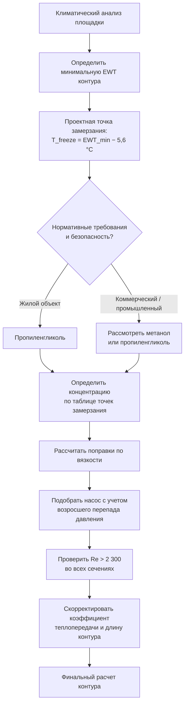

Теплоноситель (heat transfer fluid, HTF) циркулирует через грунтовый теплообменник, транспортируя тепловую энергию между грунтом и тепловым насосом. Выбор теплоносителя уравновешивает четыре группы требований: защиту от замерзания, эффективность теплопередачи, мощность циркуляционного насоса и экологическую безопасность.

## Основы защиты от замерзания

Теплоноситель замкнутого контура должен оставаться жидким при минимальной ожидаемой температуре грунта, предотвращая механическое разрушение трубопровода при замерзании. Понижение температуры кристаллизации раствора подчиняется закономерности коллигативных свойств:


\Delta T_f = K_f \cdot m \cdot i


где $K_f = 1{,}86$ К·кг/моль — криоскопическая постоянная воды, $m$ — моляльность растворенного вещества (моль/кг), $i$ — фактор Вант-Хоффа (учитывает диссоциацию).

**Проектная точка замерзания:** стандарты IGSHPA требуют защиты теплоносителя от замерзания не менее чем на 5,6 °C ниже минимальной ожидаемой температуры жидкости в контуре. Для большинства применений в умеренном и холодном климате это соответствует точке замерзания −18…−23 °C.

## Пропиленгликоль

Пропиленгликоль (propylene glycol, PG) — наиболее распространенный антифриз для жилых и коммерческих систем GSHP благодаря низкой токсичности и экологической безопасности.

### Требования к концентрации


| Концентрация (% об.) | Точка замерзания | Плотность при 20 °C (кг/л) | Теплоемкость (кДж/(кг·°C)) |
|----------------------|-----------------|---------------------------|---------------------------|
| 0 % (вода) | 0 °C | 1,000 | 4,18 |
| 10 % | −3 °C | 1,007 | 4,14 |
| 20 % | −8 °C | 1,015 | 4,05 |
| 25 % | −12 °C | 1,020 | 4,01 |
| 30 % | −18 °C | 1,025 | 3,95 |
| 35 % | −23 °C | 1,030 | 3,89 |
| 40 % | −29 °C | 1,031 | 3,81 |


Типовая проектная концентрация: 20–30 % для большинства климатических условий. Обеспечивает достаточную защиту от замерзания при минимальных штрафах по вязкости и теплопередаче.

### Влияние вязкости на насосную систему

Пропиленгликоль существенно повышает вязкость теплоносителя, что увеличивает потери давления и мощность насоса. Потери давления в цилиндрическом трубопроводе по уравнению Дарси–Вейсбаха:


\Delta P = f \cdot \frac{L}{D} \cdot \frac{\rho v^2}{2}


Коэффициент гидравлического трения $f$ зависит от числа Рейнольдса: $Re = \rho v D / \mu$. Повышенная вязкость снижает Re, потенциально переводя течение из турбулентного в переходный режим.


| Теплоноситель | Вязкость (мПа·с) | Относительно воды |
|---------------|-----------------|-------------------|
| Вода | 1,55 | 1,0× |
| Пропиленгликоль 20 % | 2,85 | 1,8× |
| Пропиленгликоль 30 % | 4,20 | 2,7× |
| Пропиленгликоль 40 % | 6,50 | 4,2× |


**Пример:** Для системы с расходом теплоносителя 0,5 л/с, суммарными потерями давления при чистой воде 40 кПа и КПД насоса 0,60:


P_{\text{pump,water}} = \frac{5 \times 10^{-4} \times 40\,000}{0{,}60} \approx 33\,\text{Вт}


При переходе на пропиленгликоль 30 % (вязкость 2,7× воды) потери давления возрастают приблизительно пропорционально:


P_{\text{pump,PG30}} \approx 33 \times 2{,}7 = 89\,\text{Вт}


Прирост мощности насоса: +56 Вт, что типично для жилых систем 10–14 кВт.

### Влияние на теплопередачу

Повышенная вязкость снижает коэффициент конвективной теплоотдачи. Корреляция Гнилинского для турбулентного течения в трубах (Re > 3 000):


Nu = \frac{(f/8)(Re - 1000) Pr}{1 + 12{,}7 \sqrt{f/8}\,(Pr^{2/3} - 1)}


где $Nu = hD/k$ — число Нусселта, $Pr = c_p \mu / k$ — число Прандтля.

Снижение теплоемкости (на 5–10 % у PG 30 %) требует повышения массового расхода для транспортировки эквивалентной тепловой мощности:


\dot{Q} = \dot{m} \cdot c_p \cdot \Delta T


Суммарный эффект: снижение коэффициента теплопередачи на 10–20 % по сравнению с чистой водой.

## Метанол

Метанол (methanol) обеспечивает превосходную защиту от замерзания при минимальном росте вязкости, однако требования безопасности ограничивают жилые применения.

### Сравнение концентраций и вязкостей


| Точка замерзания | Метанол (% об.) | Вязкость при 4,4 °C (мПа·с) |
|-----------------|----------------|------------------------------|
| −12 °C | 18 % | 1,90 |
| −18 °C | 22 % | 2,05 |
| −23 °C | 27 % | 2,25 |
| −29 °C | 32 % | 2,50 |


**Достоинства:** вязкость примерно в 1,5 раза ниже, чем у пропиленгликоля при эквивалентной точке замерзания; более высокая теплопроводность раствора; меньшая мощность насоса; ниже стоимость за единицу объема.

**Недостатки:**
- токсичность: LD₅₀ (крыса, перорально) = 5 628 мг/кг против 20 000 мг/кг у пропиленгликоля
- легковоспламеняемость: температура вспышки 11 °C — требуются герметичные системы и вентиляция
- более агрессивные коррозионные характеристики — необходимы стойкие ингибиторы
- запрещен для жилых установок в ряде юрисдикций

Стандарты IGSHPA допускают метанол в коммерческих и промышленных применениях при соблюдении надлежащих протоколов безопасности, но рекомендуют пропиленгликоль для жилых объектов.

## Этанол

Этанол (ethanol) занимает промежуточное положение между пропиленгликолем и метанолом: вязкость ниже, чем у PG, при пониженной (по сравнению с метанолом) токсичности.

Концентрация для защиты при −18 °C: около 24 % по объему.

Этанол по-прежнему воспламеняем (температура вспышки 14 °C), требует герметичных систем и надлежащей вентиляции механического помещения.

## Проектирование системы: алгоритм выбора

## Ингибиторы коррозии

Все антифризные растворы требуют пакетов ингибиторов для защиты материалов системы. Типовой состав для растворов пропиленгликоля:

- **Бензоат натрия** — общий ингибитор коррозии
- **Нитрит натрия** — защита черных металлов
- **Нитрат натрия** — защита алюминия
- **Тетраборат натрия** — буфер pH
- **Толилтриазол натрия** — защита меди и медных сплавов

Истощение ингибиторов: измерение pH и концентраций ингибиторов — ежегодно. Диапазон pH для пропиленгликоля: 8,0–10,5. Заменить теплоноситель при снижении pH ниже 7,5 или в плановом порядке — каждые 5–10 лет.

## Экологическая безопасность и нормативные требования

### Пропиленгликоль

Статус FDA (США): GRAS (Generally Recognized As Safe — «Общепризнанно безопасный»). Экологические характеристики:
- LD₅₀ (крыса, перорально) = 20 000 мг/кг — крайне низкая токсичность
- биоразложение: легко разлагается (БПК₅ / ХПК > 0,5)
- LC₅₀ (рыба, 96 ч) > 10 000 мг/л — практически нетоксичен для водных организмов
- допускается в водоохранных зонах и для открытых контуров

### Метанол

Требования строгого обращения:
- LD₅₀ = 5 628 мг/кг — умеренная токсичность
- температура вспышки 11 °C — обязательны герметичные системы и вентиляция
- немедленное локализирование и нейтрализация разливов
- запрет в ряде юрисдикций для жилых наземных контуров

### Мониторинг и обнаружение утечек

Системы грунтовых контуров должны включать:
1. Постоянный мониторинг давления контура — обнаружение утечек
2. Ежегодное измерение расхода теплоносителя
3. Отбор проб и анализ теплоносителя (концентрация, pH)
4. Визуальный осмотр доступных участков трубопровода и соединений

## Матрица выбора теплоносителя


| Критерий | Чистая вода | Пропиленгликоль | Метанол | Этанол |
|----------|-------------|-----------------|---------|--------|
| Защита от замерзания | Плохая | Хорошая | Отличная | Хорошая |
| Экологическая безопасность | Отличная | Отличная | Плохая | Хорошая |
| Эффективность теплопередачи | Отличная | Хорошая | Очень хорошая | Хорошая |
| Мощность насоса | Минимальная | Средняя | Низкая | Низкая |
| Стоимость | Минимальная | Средняя | Низкая | Средняя |
| Жилые применения | Ограничено | Предпочтительно | Ограничено | Допустимо |
| Коммерческие / промышленные | Ограничено | Допустимо | Обычно | Допустимо |


## Протокол обслуживания теплоносителя

**Ежегодный регламент (рекомендации IGSHPA):**

1. **Измерение точки замерзания** — рефрактометром или ареометром
2. **Измерение pH** — целевой диапазон 8,0–10,5 для пропиленгликоля
3. **Визуальная проверка** — обесцвечивание, осадок, посторонний запах
4. **Корректировка концентрации** — добавить антифриз при снижении ниже проектного значения
5. **Полная замена** — каждые 5–10 лет или при невозможности восстановить pH

**Признаки, требующие немедленной замены:**
- pH ниже 7,0
- Значительное потемнение раствора (темно-коричневый или черный цвет — окисление)
- Видимый осадок или взвешенные частицы
- Признаки коррозии оборудования

## Оптимизация производительности

Для минимизации штрафа производительности антифризного раствора:

1. **Использовать минимально необходимую концентрацию** — не перестраховываться сверх проектного запаса 6 °C
2. **Поддерживать проектный расход** — высокое Re улучшает теплопередачу
3. **Выбирать трубопровод большего диаметра** — снижает потери давления при повышенной вязкости
4. **Применять высокоэффективные насосы с ECM-приводом** — минимизация мощности на прокачку
5. **Регулярное обслуживание** — поддержание концентрации ингибиторов и pH в норме
6. **Мониторинг производительности** — фиксация входных/выходных температур и расходов

Растворы пропиленгликоля концентрацией 20–30 % обеспечивают оптимальный баланс для большинства жилых и коммерческих установок GSHP в умеренном климате. Метанол целесообразен для промышленных объектов в суровом климате при строгом соблюдении протоколов экологической безопасности.
