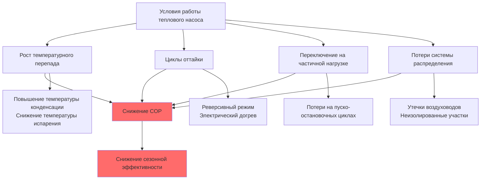

Показатели эффективности тепловых насосов (heat pumps) характеризуют термодинамическую эффективность преобразования электрической энергии в тепловую или холодильную мощность. Понимание этих показателей необходимо для подбора оборудования, энергетического моделирования и соответствия требованиям стандартов ASHRAE 90.1 и DOE 10 CFR Part 430.

## Коэффициент производительности (COP)

COP (Coefficient of Performance) выражает мгновенную термодинамическую эффективность теплового насоса — отношение полезного теплового или холодильного выхода к потребляемой электрической мощности:

$$\text{COP}_{\text{отопление}} = \frac{Q_{\text{конд}}}{W_{\text{эл}}} = \frac{Q_{\text{конд}}}{Q_{\text{конд}} - Q_{\text{исп}}}$$

$$\text{COP}_{\text{охлаждение}} = \frac{Q_{\text{исп}}}{W_{\text{эл}}} = \frac{Q_{\text{исп}}}{Q_{\text{конд}} - Q_{\text{исп}}}$$

где $Q_{\text{конд}}$ — тепло, отдаваемое конденсатором; $Q_{\text{исп}}$ — тепло, поглощаемое испарителем; $W_{\text{эл}}$ — мощность компрессора и вспомогательного оборудования.

### Теоретический цикл Карно

Максимальный COP обратимого теплового насоса между двумя тепловыми резервуарами:

$$\text{COP}_{\text{Карно, отопл.}} = \frac{T_{\text{конд}}}{T_{\text{конд}} - T_{\text{исп}}}$$

$$\text{COP}_{\text{Карно, охл.}} = \frac{T_{\text{исп}}}{T_{\text{конд}} - T_{\text{исп}}}$$

Температуры выражаются в Кельвинах. Реальные тепловые насосы достигают 30–60 % эффективности Карно вследствие необратимостей: потерь в компрессоре, гидравлических сопротивлений, температурных перепадов в теплообменниках, перегрева и переохлаждения хладагента.

### Стандартные точки номинирования

Стандарт AHRI 210/240 устанавливает условия испытаний для определения COP:


| Режим | Наружная температура | Внутренняя температура | Область применения |
|---|---|---|---|
| Отопление H1 | 8 °C DB / 6 °C WB | 21 °C DB | Умеренный климат |
| Отопление H2 | −8 °C DB / −9 °C WB | 21 °C DB | Холодный климат |
| Отопление H3 | −15 °C DB | 21 °C DB | Суровый климат |
| Охлаждение A | 35 °C DB / 24 °C WB | 27 °C DB / 19 °C WB | Стандартное охлаждение |


При наружной температуре 8 °C эффективные тепловые насосы достигают COP 3,0–4,5, то есть на каждый киловатт потреблённой электроэнергии подаётся 3–4,5 кВт тепла. При −8 °C COP снижается до 2,0–3,0 из-за возросшего температурного перепада и уменьшения массового расхода хладагента.

### Пример расчёта COP

Тепловой насос мощностью 12 кВт (отопление) потребляет 3,2 кВт электрической мощности при наружной температуре 7 °C и температуре подачи 45 °C:


\text{COP}_{\text{отопл.}} = \frac{12{,}0\ \text{кВт}}{3{,}2\ \text{кВт}} = 3{,}75


Это соответствует 75 % эффективности Карно для данных температурных условий ($T_{\text{исп}}$ = 280 K, $T_{\text{конд}}$ = 318 K):


\text{COP}_{\text{Карно}} = \frac{318}{318 - 280} = 8{,}37 \quad \Rightarrow \quad \eta = \frac{3{,}75}{8{,}37} \approx 45\,\%


## Сезонные показатели эффективности

Сезонные метрики учитывают работу на частичной нагрузке, переключательные потери, циклы оттайки и изменяющиеся наружные температуры в течение отопительного или охладительного сезона.

### Сезонный коэффициент отопительной производительности (HSPF2)

HSPF2 (Heating Seasonal Performance Factor 2) — суммарная тепловая энергия, отданная за сезон отопления, делённая на суммарное потребление электроэнергии:


\text{HSPF2} = \frac{\sum Q_{\text{отопл., сез.}}}{\sum W_{\text{эл., сез.}}}\ \left[\frac{\text{кДж}}{\text{Вт·ч}}\right]


Стандарт AHRI 210/240 рассчитывает HSPF2 по методу бинов (bin method), взвешивая производительность при различных наружных температурах по часам их наступления в шести климатических регионах (I–VI). Обновлённая метрика HSPF2 (DOE, 2023) использует:

- расчётную внутреннюю температуру 20 °C вместо 21 °C;
- дополнительную испытательную точку при −15 °C;
- обновлённые климатические данные по бинам;
- потери системы распределения.

Значения HSPF2 численно на 15–20 % ниже устаревшего HSPF при том же оборудовании. Минимальные федеральные требования (с января 2023 г.):

- сплит-системы: HSPF2 ≥ 7,5 (≈ HSPF 8,8);
- пакетные системы: HSPF2 ≥ 6,7 (≈ HSPF 8,0).

### Региональные климатические зоны AHRI


| Регион AHRI | Представительный город | Градусо-дни HDD18 | Условия отопления |
|---|---|---|---|
| Регион I | Майами, Флорида | 111 | Минимальные |
| Регион II | Феникс, Аризона | 778 | Умеренные |
| Регион III | Атланта, Джорджия | 1 611 | Стандартные |
| Регион IV | Балтимор, Мэриленд | 2 611 | Основные |
| Регион V | Чикаго, Иллинойс | 3 667 | Продолжительные |
| Регион VI | Миннеаполис, Миннесота | 4 667 | Суровые |


Один и тот же тепловой насос с HSPF2 = 8,5 в регионе IV может показать HSPF2 = 7,0 в регионе VI из-за продолжительной работы при низких наружных температурах, где COP снижается.

### Сезонный коэффициент энергетической эффективности (SEER2)

SEER2 (Seasonal Energy Efficiency Ratio 2) характеризует сезонную эффективность в режиме охлаждения:


\text{SEER2} = \frac{\sum Q_{\text{охл., сез.}}}{\sum W_{\text{эл., сез.}}}


Обновлённая метрика SEER2 (DOE, 2023) применяет более высокое внешнее статическое давление (127 Па вместо 25 Па) и сниженный расход воздуха в помещении. Минимальные требования: северные штаты — SEER2 ≥ 13,4; южные штаты — SEER2 ≥ 14,3. Высокоэффективное оборудование с инверторными компрессорами достигает SEER2 = 18–22.

### Коэффициент энергетической эффективности (EER)

EER (Energy Efficiency Ratio) характеризует установившуюся холодильную эффективность при пиковой нагрузке (35 °C наружный воздух, 27 °C / 19 °C WB внутри):


\text{EER} = \frac{Q_{\text{охл., 35°C}}}{W_{\text{эл., 35°C}}}


EER критичен для снижения пиковой нагрузки на энергосистему. Высокоэффективные системы поддерживают EER ≥ 11–13 при расчётных условиях (ASHRAE 90.1 Таблица 6.8.1).

## Интегральное значение при частичной нагрузке (IPLV)

IPLV (Integrated Part-Load Value) оценивает коммерческую эффективность на четырёх точках нагрузки, взвешенных по типичным часам работы:


\text{IPLV} = 0{,}01\,A + 0{,}42\,B + 0{,}45\,C + 0{,}12\,D


где:
- $A$ — EER при 100 % нагрузки;
- $B$ — EER при 75 % нагрузки;
- $C$ — EER при 50 % нагрузки;
- $D$ — EER при 25 % нагрузки.

Для оборудования с переменной мощностью IPLV превышает полнонагрузочный EER на 15–30 %, отражая высокую эффективность при частичных нагрузках.

## Механизмы снижения производительности

### Влияние температурного перепада

Мощность и COP снижаются с ростом температурного перепада между источником и потребителем тепла. Для воздушных тепловых насосов увеличение перепада на 1 °C снижает COP примерно на 1–2 %:

$$\frac{d(\text{COP})}{d(\Delta T)} \approx -0{,}01 \ldots -0{,}02\ \text{на °C}$$

### Штраф за оттайку

При наружной температуре ниже 4 °C в сочетании с высокой влажностью на наружном теплообменнике нарастает иней, что требует периодической оттайки. За цикл оттайки:

1. Четырёхходовой вентиль переключает контур в режим охлаждения.
2. Горячий хладагент расплавляет иней (2–10 мин).
3. Электрический догреватель компенсирует снижение тепловой мощности.
4. Энергетический штраф составляет 5–15 % от общей отопительной энергии за сезон.

Управление по запросу (demand defrost) на основе разности температур теплообменника существенно сокращает этот штраф по сравнению с оттайкой по таймеру.

## Сравнение показателей эффективности


| Показатель | Единицы | Область применения | Достоинства | Ограничения |
|---|---|---|---|---|
| COP | безразм. | Одна точка работы | Термодинамически точен | Не отражает сезонное использование |
| HSPF2 | кДж/Вт·ч | Сезонное отопление | Учитывает климат и частичные нагрузки | Региональная вариация |
| SEER2 | кДж/Вт·ч | Сезонное охлаждение | Взвешивание по бинам | Фиксированные климатические бины |
| EER | кДж/Вт·ч | Пиковое охлаждение | Расчётное условие | Одна рабочая точка |
| IPLV | кДж/Вт·ч | Коммерческое охлаждение | Акцент на частичную нагрузку | Только 4 точки |


## Соотношения пересчёта

Приблизительные пересчёты между показателями (зависят от оборудования):

$$\text{SEER} \approx 0{,}293 \times \overline{\text{COP}}_{\text{охл.}}$$

$$\text{HSPF} \approx 0{,}293 \times \overline{\text{COP}}_{\text{отопл.}}$$

$$\text{EER} = 0{,}293 \times \text{COP}_{35\text{°C}}$$

Множитель 0,293 переводит безразмерный COP в единицы кДж/Вт·ч. Сезонные показатели включают переключательные, оттаечные потери и потери распределения, не учтённые в установившемся COP.

## Нормативная база

**AHRI 210/240-2023** — процедуры испытаний и минимальные требования к эффективности для унитарных кондиционеров и тепловых насосов.

**DOE 10 CFR Part 430** — федеральные минимальные стандарты эффективности, обновлённые в 2023 году (экономия 0,3 ЭДж за 30 лет на национальном уровне).

**ASHRAE 90.1-2022** — минимальные уровни EER и COP для коммерческого оборудования (Таблица 6.8.1).

При выборе оборудования необходим анализ стоимости жизненного цикла (LCC): более высокие начальные инвестиции в высокоэффективный тепловой насос, как правило, окупаются за счёт снижения эксплуатационных расходов на энергию в течение 5–10 лет в климате с продолжительным отопительным сезоном.
