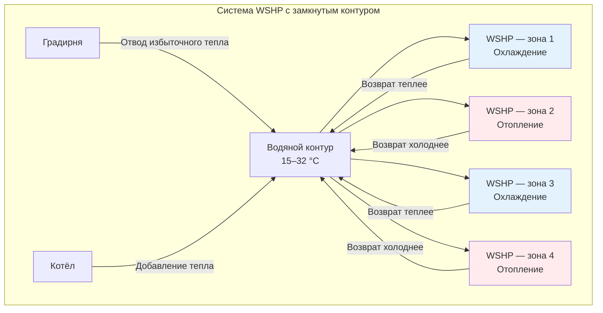

Тепловые насосы с водяным контуром (Water Source Heat Pumps, WSHP) представляют значительный шаг в повышении эффективности HVAC-систем зданий. В отличие от систем с воздушным охлаждением, WSHP поглощают или отдают тепло в центральный водяной контур, поддерживаемый в диапазоне 15–32 °C. Это позволяет одновременно отапливать одни зоны и охлаждать другие с внутренней рекуперацией тепла, которое иначе было бы потеряно.

## Термодинамические основы

Термодинамическое преимущество систем с водяным контуром обусловлено стабильной температурой контура по сравнению с переменной температурой наружного воздуха. COP в режиме охлаждения:


\text{COP}_{\text{охл.}} = \frac{Q_c}{W} = \frac{Q_c}{Q_h - Q_c}


В режиме отопления:


\text{COP}_{\text{отопл.}} = \frac{Q_h}{W} = \frac{Q_h}{Q_h - Q_c}


где $Q_c$ — холодильная мощность, $Q_h$ — тепловая мощность, $W$ — мощность компрессора.

Температура входящей воды (Entering Water Temperature, EWT) непосредственно влияет на эффективность. WSHP при EWT = 29 °C в режиме охлаждения достигает COP 4,0–5,5 против 2,5–3,5 у воздухоохлаждаемой системы при наружной температуре 35 °C. Это объясняется принципом Карно: меньший температурный перепад между источником и потребителем ($T_h - T_c$) обеспечивает более высокую теоретическую и фактическую эффективность.

### Пример расчёта расхода контура

Для здания с суммарной тепловой мощностью 351 кВт при проектной разности температур контура 5,6 К:


\dot{m} = \frac{Q_{\text{total}}}{c_p \,\Delta T} = \frac{351\ \text{кВт}}{4{,}18\ \text{кДж/(кг·К)} \times 5{,}6\ \text{К}} = 15{,}0\ \text{кг/с} = 54\ \text{м}^3/\text{ч}


## Конфигурации систем WSHP

### Замкнутый контур

Наиболее распространённая конфигурация — замкнутый циркуляционный водяной контур, к которому подключены децентрализованные блоки WSHP. Каждый блок работает независимо: поглощает тепло из контура (режим отопления) или отдаёт тепло в контур (режим охлаждения).

Температура контура поддерживается в рабочем диапазоне:

- **Градирня (cooling tower)**: включается при превышении верхней уставки температуры контура (обычно 29–32 °C).
- **Котёл**: включается при падении ниже нижней уставки (обычно 15–18 °C).

### Открытый контур

Конфигурации с открытым контуром забирают воду из природных источников (озеро, река, водоносный пласт) и после теплообмена сбрасывают обратно. Экономическая целесообразность определяется доступностью водного ресурса и нормативными ограничениями на водозабор и сброс.


| Параметр | Замкнутый контур | Открытый контур |
|---|---|---|
| Стабильность температуры воды | Умеренная (15–32 °C) | Высокая (7–24 °C) |
| Капитальные затраты | Выше (трубопровод, градирня, котёл) | Ниже |
| Эксплуатационные затраты | Средние | Низкие (только насос) |
| Нормативная сложность | Низкая | Высокая (разрешения, сброс) |
| EER охлаждения | 13–16 | 16–22 |
| Техническое обслуживание | Плановое (водоподготовка) | Значительное (биообрастание, отложения) |


## Рекуперация тепла и одновременное отопление и охлаждение

Фундаментальное преимущество WSHP — внутренняя рекуперация тепла. Тепло, отводимое охлаждаемыми зонами в контур, напрямую используется отапливаемыми зонами без участия внешних источников или стоков.

Результирующая нагрузка контура:


Q_{\text{net}} = \sum Q_{\text{отопл.}} - \sum Q_{\text{охл.}}


- При $Q_{\text{net}} > 0$ — котёл добавляет тепло в контур.
- При $Q_{\text{net}} < 0$ — градирня отводит избыток тепла.
- При $Q_{\text{net}} \approx 0$ — вспомогательное оборудование не работает, что максимизирует общую эффективность системы.

### Пример: сезонные режимы работы

**Зимнее утро (наружная температура 2 °C)**
- Внутренние зоны: 211 кВт охлаждения (тепло отдаётся в контур).
- Периметровые зоны: 141 кВт отопления (тепло забирается из контура).
- Результирующая нагрузка: −70 кВт → градирня работает на сниженной мощности.

**Весенний день (наружная температура 13 °C)**
- Внутренние зоны: 176 кВт охлаждения.
- Периметровые зоны: 176 кВт отопления.
- Результирующая нагрузка: 0 кВт → вспомогательное оборудование не требуется.

Рекуперация тепла снижает годовое потребление энергии на 20–40 % по сравнению с традиционными системами с раздельными источниками отопления и охлаждения (ASHRAE Handbook — HVAC Systems and Equipment, Chapter 2).

## Интеграция градирни и котла

### Работа градирни

Градирня (cooling tower) отводит тепло за счёт испарительного охлаждения:


Q_{\text{башня}} = \dot{m}_w c_p (T_{\text{вх}} - T_{\text{вых}}) = \dot{m}_a h_{fg} \Delta\omega


где $\Delta\omega$ — изменение влагосодержания воздуха, $h_{fg}$ — теплота парообразования (≈ 2 454 кДж/кг при стандартных условиях).

Подход (approach) — разность между температурой воды на выходе из башни и температурой мокрого термометра наружного воздуха:

$$\text{Подход} = T_{\text{вых, башня}} - T_{wb}$$

Для систем WSHP типичный подход составляет 3,9–5,6 К (против 2,8–3,9 К для традиционных чиллерных систем), поскольку WSHP работают при более высоких температурах контура.

### Подбор котла

Вспомогательный котёл компенсирует дефицит тепла при доминировании отопительных нагрузок. Консервативный метод подбора мощности:


Q_{\text{котёл}} = Q_{\text{отопл., расч.}} - 0{,}5 \times Q_{\text{охл., расч.}}


Коэффициент 0,5 учитывает частичную рекуперацию тепла из внутренних зон при пиковом отопительном режиме. Правильный подбор требует анализа: дисбаланса нагрузок здания, климатических данных (HDD) и внутренних нагрузок (освещение, люди, оборудование).

## Показатели производительности и стандарты

Стандарт AHRI 320 устанавливает условия испытаний WSHP:


| Режим | EWT | Температура выходящей воды | Расход воздуха | Мощность |
|---|---|---|---|---|
| Охлаждение | 29 °C | 35 °C | 0,067 м³/с на кВт | 3,5 кВт |
| Отопление | 21 °C | 16 °C | 0,067 м³/с на кВт | 3,5 кВт |


Современные WSHP достигают:
- EER охлаждения: 13–18 Вт/Вт (по AHRI 320);
- COP отопления: 3,5–4,5 (по AHRI 320).

Стандарт ASHRAE 90.1-2022 устанавливает минимальные уровни производительности:
- WSHP < 5,0 кВт: EER ≥ 12,2, COP ≥ 4,3;
- WSHP ≥ 39,6 кВт: EER ≥ 12,0, COP ≥ 4,2.

## Проектные соображения

### Водоподготовка

Замкнутые контуры требуют:
- контроля pH в диапазоне 7,5–8,5;
- ингибиторов коррозии;
- защиты от накипеобразования;
- биологического контроля.

### Энергия насоса и законы подобия

Регулируемый привод насоса существенно снижает годовое потребление энергии. При снижении расхода до 50 % законы подобия дают:


P_2 = P_1 \left(\frac{\dot{V}_2}{\dot{V}_1}\right)^3 = P_1 \times (0{,}5)^3 = 0{,}125\,P_1


Таким образом, снижение расхода вдвое уменьшает потребляемую мощность насоса на 87,5 %.

### Коэффициент одновременности

Редко все блоки WSHP работают на полной нагрузке одновременно. Типичный коэффициент одновременности 0,6–0,8 позволяет уменьшить диаметр контура и мощность вспомогательного оборудования.

## Область применения

Системы WSHP особенно эффективны в:

- **Многофункциональных зданиях** (гостиницы, больницы, офисы) с одновременными потребностями в отоплении и охлаждении.
- **Реконструируемых объектах**: децентрализованные блоки не требуют центральных машинных залов и вертикальных шахт.
- **Прибрежных объектах**: использование озёрной или речной воды как источника тепла при наличии разрешений.
- **Зданиях с индивидуальным управлением**: каждый блок управляется независимо без сложной центральной автоматики.

Модульный характер системы обеспечивает поэтапное наращивание мощности и встроенное резервирование, что делает WSHP предпочтительными для объектов с критическими требованиями к надёжности.
