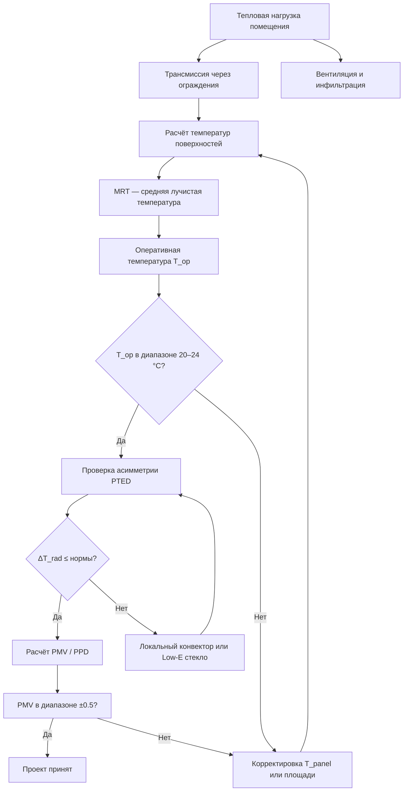

## Обзор

Лучистый теплообмен (radiant heat transfer) представляет собой передачу энергии в форме электромагнитного излучения между поверхностями и объектами через пространство — в отличие от конвективного (движение воздуха) и кондуктивного (прямой контакт) механизмов. Проектирование систем лучистого отопления с учётом физиологических требований человека является ключевым условием обеспечения теплового комфорта согласно ISO 7730:2005 и ASHRAE 55–2020.

Значимость корректного проектирования обусловлена тем, что лучистый теплообмен занимает 40–60 % суммарного теплоотвода с поверхности кожи в условиях типичного помещения. Асимметричное или неравномерное излучение приводит к локальному дискомфорту, существенно снижает воспринимаемую температуру и может вызвать тепловой стресс даже при нейтральной температуре воздуха.

---

## Физические основы лучистого теплообмена человека

### Уравнение теплового баланса

Тепловой баланс человека описывается соотношением:


M - W = Q_c + Q_r + Q_{evap} + Q_{res}


где:
- $M$ — метаболическая теплопродукция, Вт;
- $W$ — полезная механическая работа, Вт;
- $Q_c$ — конвективный теплоотвод, Вт;
- $Q_r$ — лучистый теплоотвод, Вт;
- $Q_{evap}$ — испарение пота, Вт;
- $Q_{res}$ — тепловые потери дыхательным путём, Вт.

Лучистый теплоотвод рассчитывается в линеаризованной форме закона Стефана–Больцмана:


Q_r = A_r \cdot h_r \cdot (T_{sk} - T_{mrt})


где:
- $A_r$ — эффективная лучистая площадь тела ($A_r \approx 0{,}7 \times A_{DuBois}$), м²;
- $h_r$ — коэффициент лучистой теплопередачи (radiant heat transfer coefficient), Вт/(м²·К);
- $T_{sk}$ — температура кожи, °C;
- $T_{mrt}$ — средняя лучистая температура (Mean Radiant Temperature), °C.

Коэффициент $h_r$ определяется выражением:


h_r = 4 \cdot \varepsilon \cdot \sigma \cdot T_{mean}^3


где $\varepsilon \approx 0{,}97$ (излучательная способность кожи человека), $\sigma = 5{,}67 \times 10^{-8}$ Вт/(м²·К⁴), $T_{mean}$ — средняя абсолютная температура, К. Типовое значение при комфортных условиях: $h_r \approx 4{,}7$ Вт/(м²·К).

---

## Средняя лучистая температура (MRT)

Средняя лучистая температура — температура равномерно излучающей воображаемой оболочки, при которой объект обменивает эквивалентное количество тепла излучением:


T_{mrt} = \sqrt[4]{\sum_i F_i \cdot \varepsilon_i \cdot T_i^4}


где $F_i$ — угловой коэффициент видимости (view factor) поверхности $i$ из позиции человека, $\varepsilon_i$ — степень черноты поверхности, $T_i$ — абсолютная температура поверхности, К.

Угловой коэффициент видимости учитывает геометрию помещения и положение человека. Для центра прямоугольного помещения (сидячий человек) ориентировочные значения:


| Поверхность | Угловой коэффициент $F_i$ |
|---|---|
| Потолок (ceiling) | 0,10–0,15 |
| Пол (floor) | 0,10–0,15 |
| Стены (walls), суммарно | 0,70–0,80 |


Точные значения рассчитываются методом конечных элементов или численной интеграцией согласно ISO 7726 и ASHRAE 55. При малой разности температур поверхностей (до 5 К) допустимо упрощённое взвешенное по площади среднее:


T_{mrt} \approx \frac{\sum_i A_i \cdot T_i}{\sum_i A_i}


---

## Оперативная температура

Оперативная температура (operative temperature) $T_{op}$ — интегральный показатель, объединяющий воздействие температуры воздуха и лучистого окружения:


T_{op} = \alpha \cdot T_{air} + (1 - \alpha) \cdot T_{mrt}


Коэффициент $\alpha$ зависит от скорости воздуха:


| Скорость воздуха $v$, м/с | Коэффициент $\alpha$ |
|---|---|
| $< 0{,}2$ | 0,50 |
| $0{,}5$ | 0,60 |
| $> 1{,}0$ | 0,70–0,80 |


При $v < 0{,}2$ м/с (типичные условия помещения) оперативная температура равна среднему арифметическому температуры воздуха и MRT.

---

## Асимметрия лучистой температуры

Асимметрия лучистой температуры (Plane Radiant Temperature Difference, PTED) — разность плоскостных лучистых температур двух противоположных полуплоскостей. Согласно ISO 7730:2005 нормируются следующие предельные значения:


| Направление асимметрии | Максимум $\Delta T_{rad}$, К | Категория ISO 7730 |
|---|---|---|
| Тёплый потолок vs пол | 5 | А |
| Холодная стена vs противоположная | 10 | А |
| Тёплая стена vs противоположная | 23 | A |
| Холодный потолок vs пол | 14 | A |


Нарушение норм асимметрии даже при нейтральном суммарном PMV вызывает локальный дискомфорт и повышает долю неудовлетворённых (PPD) на 5–15 %.

---

## Плотность теплового потока от панелей

Плотность теплового излучения от нагретой поверхности (Вт/м²):


q = \varepsilon \cdot \sigma \cdot \left(T_{panel}^4 - T_{surr}^4\right)


**Пример расчёта.** Потолочная панель с температурой поверхности $T_{panel} = 50$ °C (323,15 К), $\varepsilon = 0{,}95$, температура окружающих поверхностей $T_{surr} = 20$ °C (293,15 К):


q = 0{,}95 \times 5{,}67 \times 10^{-8} \times \left(323{,}15^4 - 293{,}15^4\right) \approx 160 \text{ Вт/м}^2


Типовые диапазоны плотности излучения в помещениях:


| Тип системы | Температура поверхности, °C | Плотность потока, Вт/м² |
|---|---|---|
| Потолочные панели (ceiling panels) | 40–60 | 100–200 |
| Напольное отопление (floor heating) | 25–35 | 40–80 |
| Стеновые панели (wall panels) | 35–45 | 80–140 |


---

## Равномерность распределения MRT

Расстояние между излучающими элементами влияет на равномерность лучистого воздействия. Оптимальный шаг:


L_{opt} \approx 1{,}5 \div 2{,}0 \times H_{room}


где $H_{room}$ — высота от пола до центра панелей. При $L > 3 \times H_{room}$ возникают «холодные зоны» между панелями; при $L < H_{room}$ — избыточная неравномерность вблизи панелей.

Коэффициент неравномерности лучистого воздействия (uniformity ratio):


U = \frac{T_{mrt,max} - T_{mrt,min}}{T_{mrt,avg}} \times 100\%


Нормируемое значение для жилых и офисных помещений: $U \leq 15$–$20\%$.

---

## Индексы теплового комфорта: PMV и PPD

Индекс PMV (Predicted Mean Vote) — прогнозируемая средняя оценка комфорта по семибалльной шкале ASHRAE (от −3 «очень холодно» до +3 «очень жарко»). Индекс учитывает оперативную температуру через $T_{mrt}$ в составляющей $h_r F_{cl}(T_{cl} - T_{mrt})$.

Индекс PPD (Predicted Percentage Dissatisfied) связан с PMV:


PPD = 100 - 95 \cdot e^{-0{,}03353 \cdot PMV^4 - 0{,}2179 \cdot PMV^2}


Диапазон комфорта по ASHRAE 55 (Category B для офисов): $-0{,}5 < PMV < +0{,}5$, что соответствует $PPD < 10\%$.

---

## Методика расчёта систем лучистого отопления

**Этап 1. Определение тепловой нагрузки (EN 12831, СП 60.13330.2020):**


Q_{heat} = Q_{tr} + Q_{vent} + Q_{inf}


где $Q_{tr} = \sum U_i A_i \Delta T$ — трансмиссионные потери через ограждения.

**Этап 2. Выбор температур панелей:**

Для потолочного отопления рекомендуется $T_{panel} = 35$–$50$ °C; для напольного $T_{floor} = 24$–$29$ °C (максимум 29 °C согласно СП 60.13330 для постоянных рабочих зон).

**Этап 3. Расчёт MRT при известных температурах ограждений:**


T_{mrt} = \sqrt[4]{\varepsilon_1 F_1 T_1^4 + \varepsilon_2 F_2 T_2^4 + \cdots}


**Этап 4. Проверка асимметрии:** убедиться, что $\Delta T_{rad} < 10$ К для вертикальных асимметрий и $< 5$ К для асимметрии потолок–пол.

**Этап 5. Расчёт требуемой площади панелей:**


A_{panel} = \frac{Q_{heat}}{h_r \left(T_{panel} - T_{mrt,d}\right) + h_c \left(T_{panel} - T_{air}\right)}


где $h_c$ — коэффициент конвекции ($\approx 1{,}5$–$3$ Вт/(м²·К) для потолочных панелей при нисходящем тепловом потоке).

---

## Типы систем лучистого отопления

### Потолочное лучистое отопление (Radiant Ceiling Heating, RCH)

- Температура панелей 40–50 °C, площадь охвата 30–60 % потолка;
- применяется в офисах, учреждениях, музеях, атриумах;
- требует надёжной теплоизоляции поверх панелей;
- время отклика 15–30 мин (подвесные панели с малой тепловой массой).

### Напольное лучистое отопление (Radiant Floor Heating, RFH)

- Температура поверхности 24–29 °C в жилых зонах, до 33 °C в периметрических зонах и санузлах;
- площадь охвата 50–100 % пола;
- наиболее благоприятный вертикальный градиент температуры воздуха (≤ 2 К / м);
- время теплового отклика 2–6 ч (высокая тепловая масса бетонной плиты).

### Комбинированное отопление

Сочетание потолочных и напольных панелей балансирует асимметрию MRT, снижает требуемую температуру панелей и обеспечивает равномерное поле излучения. Применяется в высоких промышленных цехах (9–15 м), музеях и атриумах.

---

## Численный пример

**Задача.** Проектирование потолочного лучистого отопления для офиса 6 × 8 × 2,8 м, тепловая нагрузка 2 кВт, расчётная температура воздуха $T_{air,d} = 21$ °C.

**Решение.**

Выбираем потолочные панели: $T_{panel} = 45$ °C, площадь 24 м² (50 % потолка 48 м²). Лучистая доля нагрузки $Q_r = 1$ кВт, конвективная $Q_c = 1$ кВт.

Температуры ограждений: стены и пол +18 °C, двойное окно 2 м² в мороз −5 °C (температура внутренней поверхности ≈ +5 °C).

Расчёт MRT (с угловыми коэффициентами):


T_{mrt} \approx \sqrt[4]{0{,}15 \times 318^4 + 0{,}65 \times 291^4 + 0{,}10 \times 285^4 + 0{,}10 \times 278^4} \approx 291{,}5 \text{ К} \approx 18{,}5 \text{ °C}


Оперативная температура (при $v < 0{,}2$ м/с):


T_{op} = 0{,}5 \times 21 + 0{,}5 \times 18{,}5 = 19{,}75 \text{ °C}


Значение $T_{op} \approx 19{,}8$ °C — несколько ниже целевого диапазона 20–24 °C. Решение: увеличить долю лучистой нагрузки до 60 % (повысить $T_{panel}$ до 48 °C) или установить конвекторы под окном для компенсации холодного излучения остекления.

**Проверка асимметрии:** разница между плоскостной лучистой температурой со стороны панели (~45 °C) и со стороны окна (~5 °C) ≈ 40 К — существенно выше нормы 10 К. Требуется либо доводочный конвектор, либо низкоэмиссионное остекление (Low-E glazing) с внутренней поверхностью 12–15 °C.

---

## Нормативная база


| Документ | Область применения |
|---|---|
| ISO 7730:2005 | Эргономика тепловой среды; PMV, PPD, пределы комфорта |
| ISO 7726:1998 | Приборы и методы измерения параметров тепловой среды |
| ASHRAE 55–2020 | Тепловые условия среды, методология оценки комфорта |
| EN 15251:2007 | Параметры микроклимата для проектирования и оценки зданий |
| СП 60.13330.2020 | Отопление, вентиляция, кондиционирование (Россия) |
| ГОСТ 30494–2011 | Показатели микроклимата в жилых и общественных зданиях |


---

## Рекомендации по проектированию


| Параметр | Значение / диапазон | Источник |
|---|---|---|
| Оперативная температура комфорта (зима, офис) | 20–24 °C | ASHRAE 55, ISO 7730 |
| Отклонение MRT от $T_{air}$ при комфорте ($PMV \approx 0$) | ±2 К | ISO 7730 |
| Максимальная асимметрия потолок–пол | 5 К | ISO 7730 |
| Максимальная асимметрия стена–стена | 10 К | ISO 7730 |
| Плотность теплового потока от потолка (норма) | 80–200 Вт/м² | ASHRAE Handbook |
| Максимальная температура пола (постоянные зоны) | 29 °C | СП 60.13330 |
| Число зон управления | 1 зона / 50–80 м² | Практика проектирования |


### Типовые ошибки проектирования

1. **Чрезмерная температура потолочных панелей** (> 60 °C) — вызывает дискомфорт в верхней части тела, риск конденсации на холодных ограждениях.
2. **Недоучёт асимметрии от остекления** — большие холодные окна ($T < 5$ °C) создают асимметрию, требующую дополнительного конвективного нагрева или Low-E стекла.
3. **Неправильный шаг между панелями** — при шаге $> 3 H$ возникают «холодные пятна» с $\Delta T_{mrt} > 3$ К.
4. **Игнорирование влажностного режима** — при $T_{panel} > 50$ °C и относительной влажности воздуха > 60 % возможна конденсация на холодных поверхностях.
5. **Отсутствие датчиков MRT** — проектирование на основе только $T_{air}$ без контроля лучистого поля не обеспечивает нормируемого комфорта.

---

## Диаграмма системы лучистого отопления

