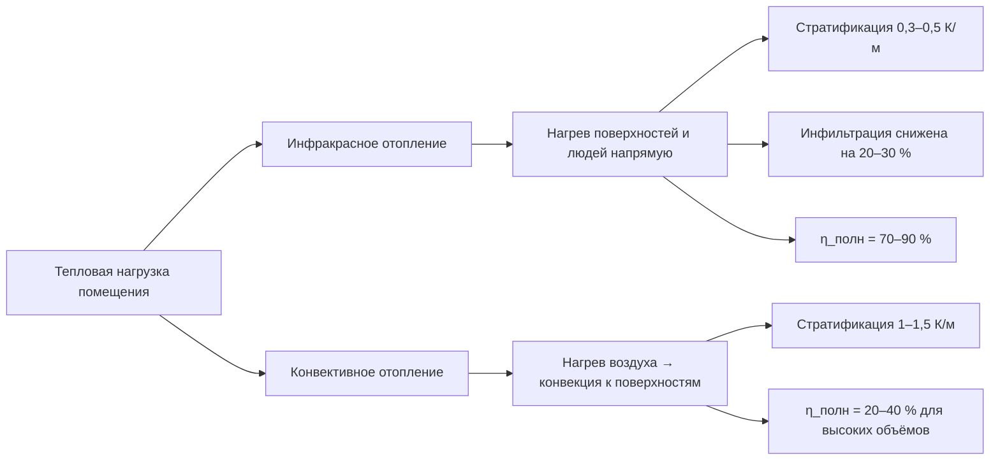

## Обзор

Производительность инфракрасных систем лучистого отопления (infrared radiant heating) определяется совокупностью взаимосвязанных физических и конструктивных факторов, которые принципиально отличаются от параметров конвективных систем. Инфракрасное отопление основано на прямой передаче тепловой энергии от излучателя к поверхностям помещения и людям, минуя нагрев воздушной массы. Понимание этих факторов необходимо для оптимизации энергоэффективности, теплового комфорта и долговечности системы в соответствии с ASHRAE 55, EN 12098-11 и СП 60.13330.2020.

---

## Геометрические и объёмные факторы

### Влияние высоты помещения

Высота потолка $h_п$ оказывает прямое влияние на эффективность распределения тепла. При увеличении высоты возрастает нагреваемый объём и усиливается вертикальная стратификация температур. Оптимальная высота для комфортного инфракрасного отопления составляет 2,4–3,5 м, при которой лучистый поток охватывает зону пребывания людей (0–2 м от пола).

Удельная тепловая нагрузка на единицу площади:


q = \frac{Q}{A_п} = \frac{P_{и}}{A_п}


где $Q$ — тепловая мощность системы, Вт; $A_п$ — площадь потолка, м²; $P_{и}$ — удельная мощность излучателя, Вт/м².

При $h_п > 4$ м потери тепла в верхней зоне объёма возрастают и требуется увеличение мощности системы на 15–25 % для поддержания комфортной температуры на уровне рабочей зоны (0,6–1,8 м от пола). Согласно ASHRAE Handbook — HVAC Applications, при $h_п > 6$ м компенсация составляет 25–40 %.

### Снижение стратификации воздуха

Инфракрасное отопление естественным образом снижает вертикальный градиент температуры воздуха (air temperature stratification). В конвективных системах разница между уровнем потолка и полом достигает 3–5 К; при лучистом отоплении этот градиент снижается до 1–2 К, поскольку тепло поглощается непосредственно поверхностями и людьми, а не воздушной массой.

Расчётная оценка стратификации при лучистом отоплении:


\Delta T_{strat} = T_{верх} - T_{низ} \approx 0{,}3 \div 0{,}5 \text{ К/м}
\quad \text{(vs. 1,0–1,5 К/м при конвекции)}


Согласно ASHRAE 55–2020 допустимый вертикальный перепад температуры воздуха между уровнем головы (1,7 м) и щиколоток (0,1 м) не должен превышать 3 К. Лучистые системы выполняют это требование естественным образом.

---

## Излучательные свойства поверхностей

### Степень черноты (Emissivity)

Степень черноты поверхности $\varepsilon$ — безразмерная величина от 0 до 1, определяющая интенсивность теплоизлучения относительно абсолютно чёрного тела:


q_{рад} = \varepsilon \cdot \sigma \cdot \left(T_s^4 - T_{окр}^4\right)


где $\sigma = 5{,}67 \times 10^{-8}$ Вт/(м²·К⁴) — постоянная Стефана–Больцмана; $T_s$ — абсолютная температура поверхности; $T_{окр}$ — температура окружающих поверхностей.


| Материал / поверхность | Степень черноты $\varepsilon$ | Применение |
|---|---|---|
| Керамика чёрная матовая | 0,95–0,98 | Излучатели, панели |
| Бетон / штукатурка | 0,85–0,92 | Поверхности помещений |
| Дерево / фанера | 0,80–0,88 | Отделка пола, стен |
| Алюминий полированный | 0,04–0,10 | Отражатели |
| Краска белая матовая | 0,90–0,95 | Потолки, стены |
| Нержавеющая сталь окисленная | 0,70–0,85 | Трубчатые обогреватели |


Согласно EN 12098-11 для облицовки потолка рекомендуются матовые поверхности с $\varepsilon \geq 0{,}85$.

### Отражательная способность и рефлекторы

Для непрозрачных материалов $\tau \approx 0$, поэтому:


\varepsilon + \rho = 1


Полированные металлические поверхности ($\rho = 0{,}90$–$0{,}96$ в инфракрасном диапазоне) применяются как тепловые рефлекторы (reflectors) над излучателями для переориентации тепловых потоков в рабочую зону. Размещение рефлектора под углом 45–60° к оси излучателя увеличивает тепловую мощность в направлении рабочей зоны на 40–70 %.

---

## Теплопотери и инфильтрация

### Снижение инфильтрационных потерь

Инфракрасное отопление снижает объёмный расход инфильтрационного воздуха (infiltration airflow) благодаря нагреву ограждающих конструкций и уменьшению температурного перепада между внутренней поверхностью и наружным воздухом. Расход инфильтрации:


G_{инф} = \sqrt{2\rho \left(\frac{\Delta P_{гр} + \Delta P_{вет}}{c_д}\right)}


где $\Delta P_{гр}$ — гравитационный перепад давления; $\Delta P_{вет}$ — ветровое давление; $c_д$ — коэффициент сопротивления.

Повышение температуры внутренней поверхности ограждения на 5–10 К (от 10–12 °C при конвективном отоплении до 15–20 °C при лучистом) снижает инфильтрацию на 20–30 % и, как следствие, сопутствующие теплопотери.

### Исключение конвективных сквозняков

Отсутствие высокоскоростных конвективных потоков воздуха исключает локальное охлаждение участков тела и дискомфорт от сквозняков (draft discomfort). Критерий Архимеда (Archimedes number) для оценки конвективного перемешивания:


Ar = \frac{g \beta \Delta T L}{u_0^2} \gg 1


При лучистом отоплении $Ar \gg 1$ обеспечивает слабую конвекцию и выполнение требований ASHRAE 55 (Category B по скорости воздуха < 0,15 м/с).

---

## Динамические характеристики

### Время теплового отклика

Инфракрасные излучатели характеризуются малой тепловой инерцией (thermal inertia). Время достижения 90 % номинальной мощности:


| Тип излучателя | Время отклика (90 % мощности) |
|---|---|
| Кварцевые лампы (quartz lamps) | 1–5 сек |
| Керамические излучатели (ceramic heaters) | 8–15 мин |
| Инфракрасные панели (radiant panels) | 15–30 мин |
| Напольные системы (floor systems) | 2–6 ч |
| Газовые трубчатые (tube heaters) | 10–20 мин |


Быстрота отклика электрических излучателей позволяет реализовать интеллектуальное управление с временным шагом 1–5 мин, что снижает потребление электроэнергии на 10–15 % при переменных режимах использования (intermittent occupancy).

### Гибкость зонирования

Независимая работа излучателей в различных зонах согласно EN 12098 и ASHRAE 90.1 позволяет:

- создавать микроклиматические зоны с разными уставками (разница до ±2 °C);
- отключать неиспользуемые зоны (экономия 15–25 % потребления);
- настраивать расписание работы по зонам занятости.

Разделение помещения на 3–5 независимых зон типично для офисных и производственных объектов площадью 200–1000 м².

---

## Интегральный коэффициент эффективности

Обобщённый коэффициент эффективности инфракрасной системы:


\eta_{полн} = \eta_{рад} \times \eta_{геом} \times \eta_{упр} \times (1 - k_{инф})



| Коэффициент | Физический смысл | Диапазон значений |
|---|---|---|
| $\eta_{рад}$ — радиационная эффективность | Зависит от $\varepsilon$ и $\rho$ поверхностей | 0,85–0,95 |
| $\eta_{геом}$ — геометрический коэффициент | Функция высоты и площади помещения | 0,90–1,00 |
| $\eta_{упр}$ — эффективность управления | Зонирование, термостатика, уставки | 0,95–1,00 |
| $k_{инф}$ — доля потерь на инфильтрацию | Снижается при нагреве ограждений | 0,05–0,15 |


**Пример расчёта.** Для склада высотой 8 м: $\eta_{рад} = 0{,}88$, $\eta_{геом} = 0{,}92$ (корректировка на высоту), $\eta_{упр} = 0{,}97$, $k_{инф} = 0{,}10$.


\eta_{полн} = 0{,}88 \times 0{,}92 \times 0{,}97 \times (1 - 0{,}10) = 0{,}706


Полная эффективность 70,6 % — против 20–35 % для систем с принудительной циркуляцией воздуха (forced-air systems) в аналогичных высоких помещениях по данным ASHRAE Handbook — HVAC Systems and Equipment.

---

## Сравнение с конвективными системами

---

## Нормативная база


| Документ | Содержание |
|---|---|
| ASHRAE 55–2020 | Тепловой комфорт: стратификация, скорость воздуха, PMV/PPD |
| ASHRAE 90.1–2022 | Энергоэффективность: зонирование, управление, уставки |
| EN 12098-11 | Электрические инфракрасные излучатели: требования к характеристикам |
| ISO 9288:1989 | Теплоизоляция: лучистый теплообмен и свойства материалов |
| СП 60.13330.2020 | Отопление, вентиляция, кондиционирование: тепловые нагрузки |
| ГОСТ Р 51043 | Безопасность нагревательных приборов |


---

## Практические рекомендации

1. **Высота помещения:** при $h_п > 4$ м увеличить расчётную мощность на 20 %, при $h_п > 6$ м — на 35 %; рассмотреть многоуровневое размещение излучателей.
2. **Материалы облицовки:** использовать матовые поверхности с $\varepsilon \geq 0{,}88$ — штукатурка, матовые краски, керамика.
3. **Рефлекторы:** размещать под углом 45–60° к оси обогревателя; применять полированный анодированный алюминий ($\rho = 0{,}88$–$0{,}92$) с ежегодной очисткой.
4. **Управление:** интегрировать термостаты с датчиком температуры пола и воздуха в каждой зоне; применять наружный сброс (outdoor reset) по ASHRAE 90.1.
5. **Изоляция ограждений:** минимизировать $\Delta T$ между внутренней поверхностью и воздухом (< 3 К) для снижения инфильтрации.
6. **Зонирование:** не менее 1 зоны управления на 100–150 м² для производственных объектов; на 50–80 м² для офисов.
