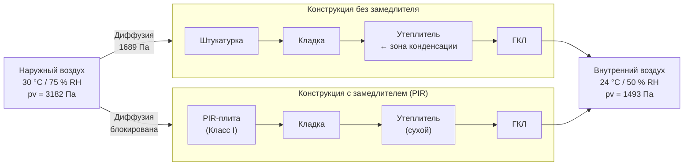

## Принцип: почему замедлитель располагают снаружи

В холодном климате паровой замедлитель (vapor retarder) размещают с тёплой — внутренней — стороны утеплителя, чтобы удержать влажный комнатный воздух от конденсации в холодной части конструкции. В жарко-влажном климате физика обратна: летом наружный воздух теплее и влажнее внутреннего, поэтому диффузионный поток пара направлен **снаружи внутрь**. Системы кондиционирования поддерживают в помещении температуру 22–24 °C, и первая «холодная» поверхность, с которой встречается проникающий пар, — наружная грань стойки или утеплителя. Задача парового замедлителя — перехватить этот поток **до** того, как он достигнет зоны конденсации.

Данный принцип зафиксирован в ASHRAE Fundamentals (2021), гл. 27, и подтверждён гигротермическим стандартом ASHRAE 160-2021.

---

## Физика входящего потока пара

### Парциальное давление пара

Движущей силой диффузии является разность парциальных давлений пара между наружной и внутренней средой:


p_v = p_{\text{sat}}(T) \cdot \frac{\varphi}{100}


где $p_v$ — парциальное давление пара, Па; $p_{\text{sat}}$ — давление насыщения при температуре $T$, Па; $\varphi$ — относительная влажность, %.

Давление насыщения аппроксимируется уравнением Магнуса (диапазон 0–60 °C):


p_{\text{sat}}(T) = 611{,}2 \cdot \exp\!\left(\frac{17{,}62\, T}{243{,}12 + T}\right)


где $T$ — температура в °C.

### Плотность диффузионного потока

Плотность потока пара через плоский слой (закон Фика):


g = \frac{\Delta p_v}{Z}


где $g$ — плотность потока пара, кг/(м²·с); $\Delta p_v$ — разность давлений пара, Па; $Z$ — паросопротивление слоя, м²·ч·Па/мг (или Па·с·м²/кг).

Суммарное паросопротивление многослойной конструкции:


Z_{\text{total}} = \sum_{i} Z_i = \sum_{i} \frac{d_i}{\delta_i}


где $d_i$ — толщина $i$-го слоя, м; $\delta_i$ — коэффициент паропроницаемости, мг/(м·ч·Па).

---

## Числовой пример: Сочи — жарко-влажный приморский климат

Сочи относится к климатическому подрайону II Б (СП 131.13330): жаркое влажное лето, мягкая зима. Рассмотрим стеновую конструкцию без наружного замедлителя и с ним, чтобы сравнить риск конденсации.

**Условия расчёта (июль, наружные / внутренние):**

| Параметр | Наружные | Внутренние |
|---|---|---|
| Температура, °C | +30 | +24 |
| Относительная влажность, % | 75 | 50 |

**Расчёт давлений пара:**

$p_{\text{sat, ext}} = 611{,}2 \cdot \exp(17{,}62 \cdot 30 / 273{,}12) = 4243$ Па

$p_{v,\text{ext}} = 4243 \times 0{,}75 = 3182$ Па

$p_{\text{sat, int}} = 611{,}2 \cdot \exp(17{,}62 \cdot 24 / 267{,}12) = 2985$ Па

$p_{v,\text{int}} = 2985 \times 0{,}50 = 1493$ Па

$\Delta p_v = 3182 - 1493 = 1689$ Па

**Температура точки росы наружного воздуха:**


T_d = \frac{243{,}12 \cdot \ln(p_v / 611{,}2)}{17{,}62 - \ln(p_v / 611{,}2)} = \frac{243{,}12 \cdot \ln(3182/611{,}2)}{17{,}62 - \ln(3182/611{,}2)} \approx 25{,}0~°C


Любая поверхность внутри конструкции с температурой ниже 25 °C является зоной риска конденсации.

**Стеновая конструкция (снаружи внутрь):**

| Слой | Толщина, мм | $\delta$, мг/(м·ч·Па) | $Z_i$, м²·ч·Па/мг |
|---|---|---|---|
| Штукатурка цементная | 20 | 0,025 | 800 |
| Кладка из ячеистого бетона D600 | 200 | 0,110 | 1818 |
| Минераловатная плита | 100 | 0,560 | 179 |
| Гипсокартон ГКЛ | 12,5 | 0,060 | 208 |

$Z_{\text{total}} = 800 + 1818 + 179 + 208 = 3005$ м²·ч·Па/мг

Без замедлителя — плотность потока:

$g = 1689 / 3005 \approx 0{,}562$ мг/(м²·ч)

Наружная грань минеральной ваты имеет температуру около 24,5 °C (ниже $T_d = 25{,}0$ °C) — **конденсация неизбежна**.

**С наружным паровым замедлителем** (полиизоцианурат PIR с фольгой, $Z_{\text{ret}} = 15\,000$ м²·ч·Па/мг, 50 мм):

$Z_{\text{total}} = 15\,000 + 179 + 208 = 15\,387$ м²·ч·Па/мг

$g = 1689 / 15\,387 \approx 0{,}110$ мг/(м²·ч) — снижение потока в 5 раз, конденсация в полости исключена.

---

## Классификация паровых замедлителей

ASHRAE Fundamentals (2021), гл. 26, классифицирует материалы по паропроницаемости (пермь, 1 пермь = 57,4 нг/(Па·с·м²)):


| Класс | Паропроницаемость | Типичные материалы |
|---|---|---|
| I (паронепроницаемый) | ≤ 0,1 пермь | Полиэтиленовая плёнка 0,15 мм, алюминиевая фольга, PIR с фольгой |
| II (полупаронепроницаемый) | 0,1–1,0 пермь | XPS 50 мм, крафт-бумага с асфальтовым покрытием |
| III (полупаропроницаемый) | 1,0–10 пермь | Латексная краска (2 слоя), фанера 12 мм |
| — (паропроницаемый) | > 10 пермь | Диффузионные мембраны, пергамин, штукатурка |


Для климатических зон 1А–2А (жарко-влажных) рекомендован **Класс I** снаружи. Для зон 3А–4А допустим Класс II при условии гигротермического расчёта.

---

## Типовые конструктивные схемы

### Схема А: PIR-плита с фольгой поверх кладки (зоны 1А–2А)

```
[Вентилируемый зазор 20–25 мм]
[Фасадная облицовка]
[Диффузионная мембрана / ветрозащита]
[PIR 50–100 мм, Класс I, Z > 10 000 м²·ч·Па/мг]  ← паровой замедлитель
[Кладка / несущая конструкция]
[Гипсокартон / штукатурка внутри]
```

### Схема Б: XPS снаружи стойчатой стены (зоны 2А–3А)

```
[Вентилируемый зазор 19 мм]
[Фасадный сайдинг]
[XPS 50 мм (Класс II, ~0,3 пермь)]  ← паровой замедлитель
[OSB-обшивка 12 мм]
[Стойки 150 мм + минеральная вата в полости]
[Пароне проницаемая отделка внутри — латексная краска ≥ 1 пермь]
```

### Схема В: Жидкий паровой замедлитель по обшивке (модернизация)

```
[Фасадная облицовка]
[Диффузионная мембрана]
[Жидкий паровой замедлитель (0,05–0,10 пермь)]  ← паровой замедлитель
[Существующая OSB-обшивка]
[Стойки + утеплитель в полости]
[Гипсокартон]
```





---

## Правило соотношения паросопротивлений

Для исключения конденсации в холодной части конструкции паросопротивление наружной части (от наружной поверхности до плоскости возможной конденсации) должно быть существенно выше, чем внутренней:


\frac{Z_{\text{ext}}}{Z_{\text{int}}} \geq 5 \div 10


Это гарантирует, что давление пара у первой холодной поверхности не достигнет $p_{\text{sat}}$.

В российских нормах (СП 23-101-2004, п. 9) аналогичное требование формулируется через проверку плоскости конденсации методом Глейзера: паросопротивление наружной части $R_{\text{п,н}}$ должно быть не менее нормируемого значения.

---

## Вентилируемый зазор как вторичная защита

Вентилируемое воздушное пространство между облицовкой и паровым замедлителем выполняет три функции:

1. **Осушение** — уносит влагу, прошедшую сквозь облицовку.
2. **Температурный буфер** — снижает тепловой поток через конструкцию в жаркий период.
3. **Дренаж** — отводит жидкую воду от дождя или конденсата.

Минимальные параметры зазора по СП 23-101 и ASHRAE:

| Параметр | Значение |
|---|---|
| Ширина зазора | ≥ 10 мм, рекомендуется 20–25 мм |
| Вентиляционные отверстия (снизу и сверху) | ≥ 130 см² на 1 м² стены |
| Скорость воздуха в зазоре (расчётная) | 0,3–1,0 м/с |

---

## Влияние воздушной инфильтрации

Диффузия через материал — лишь один из механизмов переноса влаги. При наличии неплотностей в воздушном барьере перенос влаги конвекцией многократно превышает диффузию.

Ориентировочное соотношение (ASHRAE Fundamentals, гл. 27):

> Отверстие площадью 1 % от площади стены (0,01 м² на 1 м² стены) переносит **в 50–100 раз** больше влаги за счёт воздушного потока, чем диффузия через всю непрерывную стену.

**Следствие:** паровой замедлитель должен быть одновременно воздушным барьером (air barrier), либо совмещаться с отдельным непрерывным воздушным барьером. Герметизация швов, проходок труб и кабелей — обязательна.

---

## Умные (переменно-проницаемые) замедлители в переходных климатах

В климатических зонах 3А–4А (тёплый/смешанный влажный климат) зимой поток пара меняет направление на обратный — изнутри наружу. Жёсткий паровой замедлитель Класса I снаружи в этом случае препятствует высыханию конструкции зимой.

Решение — мембраны переменной паропроницаемости (hygrovariable membrane, торговые марки: MemBrain, Intello Plus):

| Условие | $\varphi$ окружающей среды | Паропроницаемость |
|---|---|---|
| Зимнее отопление (конструкция сухая) | < 50 % | 0,3–0,5 пермь (замедляет) |
| Летнее охлаждение (конструкция влажная) | > 75 % | 3–10 пермь (пропускает) |

Механизм: гигроскопичные полиамидные цепочки набухают при увлажнении, открывая поровую структуру плёнки.

---

## Требования к монтажу

Эффективность парового замедлителя определяется непрерывностью установки:

- **Нахлёсты** полотнищ — не менее 100 мм, проклеиваются совместимой лентой.
- **Проходки** (трубы, кабельные гильзы) — гофрированные манжеты или жидкая герметизирующая масса.
- **Примыкания к перекрытиям и кровле** — перехлёст с горизонтальными гидроизоляционными слоями.
- **Оконные и дверные проёмы** — интеграция с отливом и лентой-флешингом (flashing tape).

Контроль качества на площадке: проверка паропроницаемости образцов (ASTM E96), тест на утечку воздуха (Blower Door, EN 13829) после монтажа.

---

## Нормативная база

| Документ | Область применения |
|---|---|
| ASHRAE 160-2021 | Критерии гигротермического расчёта, плоскость конденсации |
| ASHRAE Fundamentals (2021), гл. 25–27 | Свойства воздуха и пара, тепло- и массоперенос |
| СП 50.13330.2017 (Тепловая защита) | Нормируемые сопротивления теплопередаче, Россия |
| СП 23-101-2004 | Расчёт паросопротивления, плоскость конденсации, Россия |
| ISO 13788:2012 | Метод Глейзера: оценка риска конденсации |
| EN 15026 / ISO 15026 | Численный гигротермический расчёт (WUFI-подобные методы) |

---

## Типичные ошибки проектирования

**Ошибка 1: Паровые замедлители с обеих сторон.**
Результат — «влажный мешок»: влага строительной стадии или случайного попадания воды не может высохнуть ни в каком направлении. Решение: замедлитель только с одной стороны, противоположная сторона — паропроницаема.

**Ошибка 2: Разрывы непрерывности.**
Локальные утечки воздуха сводят на нет диффузионную защиту. Решение: совмещение функций парового замедлителя и воздушного барьера, тщательная проклейка всех стыков.

**Ошибка 3: Применение конструкций холодного климата.**
Внутренний замедлитель в жарко-влажном климате задерживает конденсат от охлаждения. Решение: проектирование в соответствии с климатической зоной ASHRAE или подрайоном по СП 131.

**Ошибка 4: Игнорирование зимнего сезона в зонах 3А–4А.**
Жёсткий замедлитель Класса I снаружи препятствует зимнему высыханию. Решение: умные мембраны или Класс II с гигротермическим подтверждением.

---

## Итоговое сравнение конфигураций


| Материал | Паропроницаемость | Климатические зоны | Дополнительные функции |
|---|---|---|---|
| PIR с фольгой | 0,02–0,05 пермь (Кл. I) | 1А, 2А | Утепление, воздушный барьер |
| XPS 50 мм | ~0,3 пермь (Кл. II) | 2А, 3А | Утепление |
| ПЭ-плёнка 0,15 мм | 0,04–0,06 пермь (Кл. I) | 1А, 2А, 3А | Только замедлитель |
| Умная мембрана | 0,3–10 пермь (переменно) | 3А, 4А | Адаптивная |
| Жидкий барьер | < 0,1 пермь (Кл. I) | 1А–3А | Воздушный барьер, сложная геометрия |

