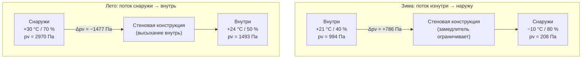

## Проблема смешанного климата

Ограждающая конструкция в смешанном климате работает в условиях **сезонного реверса парового потока**: зимой поток пара направлен изнутри наружу (тёплый влажный воздух помещения — к холодному наружному), летом — снаружи внутрь (тёплый влажный наружный воздух — к охлаждённому помещению). Конструкция должна быть способна высыхать в обоих направлениях и при этом ограничивать накопление влаги в зонах риска.

Это принципиально отличается от однозначных условий: в холодном климате достаточен внутренний паровой замедлитель, в жарко-влажном — наружный. В смешанном климате ни один из них в чистом виде не оптимален — нужен баланс.

---

## Климатические характеристики смешанных зон

В классификации ASHRAE (Fundamentals 2021, гл. 14) смешанный климат соответствует зонам 3–5. Для России ближайшие аналоги по градусо-суткам отопления (ГСО) и охлаждения:


| Зона ASHRAE | ГСО 18 °C, °С·сут | Российский аналог | Особенность |
|---|---|---|---|
| 3А (тёплый влажный) | 1000–2000 | Краснодар, Ростов-на-Дону | Длинное жаркое лето, мягкая зима |
| 4А (смешанный влажный) | 2000–3000 | Москва (юг), Воронеж | Сбалансированный двусторонний поток |
| 4С (морской) | 2000–3000 | Владивосток (побережье) | Высокая влажность круглый год |
| 5А (холодный влажный) | 3000–4000 | Москва, Казань, Нижний Новгород | Доминирует зимний поток, лето умеренное |


Ключевые параметры для расчёта: градиент давления пара $\Delta p_v$ меняет знак дважды в год, и конструкция должна справляться с обоими состояниями.

---

## Физика двустороннего парового потока

### Зимнее состояние (поток изнутри наружу)

Типичные условия для Москвы в январе:

| Параметр | Внутри | Снаружи |
|---|---|---|
| Температура | +21 °C | −10 °C |
| Относительная влажность | 40 % | 80 % |


p_{v,\text{int}} = 611{,}2 \cdot \exp\!\left(\frac{17{,}62 \times 21}{243{,}12 + 21}\right) \times 0{,}40 = 2485 \times 0{,}40 = 994~\text{Па}



p_{v,\text{ext}} = 611{,}2 \cdot \exp\!\left(\frac{17{,}62 \times (-10)}{243{,}12 - 10}\right) \times 0{,}80 = 260 \times 0{,}80 = 208~\text{Па}


$\Delta p_v^{\text{зима}} = 994 - 208 = +786$ Па (поток наружу)

### Летнее состояние (поток снаружи внутрь)

Москва, июль, кондиционирование:

| Параметр | Внутри | Снаружи |
|---|---|---|
| Температура | +24 °C | +30 °C |
| Относительная влажность | 50 % | 70 % |

$p_{v,\text{int}} = 2985 \times 0{,}50 = 1493$ Па

$p_{v,\text{ext}} = 4243 \times 0{,}70 = 2970$ Па

$\Delta p_v^{\text{лето}} = 1493 - 2970 = -1477$ Па (поток внутрь)

### Вывод

Летний обратный градиент превышает зимний прямой в 1,9 раза. Конструкция, правильно спроектированная для смешанного климата, должна обеспечивать:

- **зимой** — ограничение потока наружу, чтобы не переувлажнить наружную обшивку;
- **летом** — возможность высыхания внутрь из полости, если влага накопилась.

---

## Числовой пример: стена для Москвы

**Конструкция** (снаружи внутрь):

| Слой | $d$, мм | $\delta$, мг/(м·ч·Па) | $Z_i$, м²·ч·Па/мг | $R_i$, м²·К/Вт |
|---|---|---|---|---|
| Фасадная плитка + воздушный зазор 20 мм | — | — | — | 0,13 (пов.) |
| Минеральная вата (ветрозащита) | 150 | 0,560 | 268 | 4,17 |
| OSB-обшивка 12 мм | 12 | 0,070 | 171 | 0,10 |
| Стойки 50×150 + минвата в полости | 150 | 0,560 | 268 | 4,17 |
| ГКЛ 12,5 мм | 12,5 | 0,060 | 208 | 0,05 |
| Латексная краска 2 слоя | — | — | 50 (прим.) | — |
| Внутренняя поверхность | — | — | — | 0,13 |

$R_{\text{total}} = 0{,}13 + 4{,}17 + 0{,}10 + 4{,}17 + 0{,}05 + 0{,}13 = 8{,}75$ м²·К/Вт

**Зимняя проверка температуры OSB:**


T_{\text{OSB}} = T_{\text{ext}} + (T_{\text{int}} - T_{\text{ext}}) \cdot \frac{R_{\text{ext} \to \text{OSB}}}{R_{\text{total}}}


$R_{\text{ext}\to\text{OSB}} = 0{,}13 + 4{,}17 = 4{,}30$ м²·К/Вт

$T_{\text{OSB}} = -10 + 31 \times \frac{4{,}30}{8{,}75} = -10 + 15{,}2 = +5{,}2~°C$

Точка росы внутреннего воздуха при 21 °C / 40 % = 7,0 °C.

**5,2 °C < 7,0 °C — OSB в зоне риска конденсации зимой.**

**Решения:**

1. Добавить наружную непрерывную изоляцию (PIR 30 мм, $R = 1{,}25$ м²·К/Вт) → $T_{\text{OSB}} = +8{,}1$ °C > 7,0 °C.
2. Снизить внутреннюю влажность до 35 % → $T_d = 5{,}5$ °C < 5,2 °C (граничный случай).
3. Применить умную мембрану вместо латексной краски — снизить зимний поток пара к OSB.

---

## Стратегии паровых замедлителей для смешанного климата

### Стратегия 1: Паропроницаемый внутренний слой (Класс III)

Наиболее универсальное решение для зон 3А–4А. Латексная краска в два слоя на ГКЛ даёт 5–10 пермей (около 285–570 нг/(Па·с·м²)) — достаточно для умеренного ограничения зимнего потока, но открыто для летнего высыхания.

**Паросопротивление** латексной краски: $Z \approx 50$ м²·ч·Па/мг — в 3–5 раз ниже паросопротивления минераловатной плиты, что оставляет конструкции возможность дышать.

### Стратегия 2: Умная мембрана переменной проницаемости (hygrovariable)

Мембраны на основе полиамида (Intello Plus, MemBrain) меняют паропроницаемость в зависимости от окружающей относительной влажности:

| Состояние | $\varphi$, % | Паропроницаемость | Функция |
|---|---|---|---|
| Зима, сухая конструкция | 30–40 | 0,3–0,5 пермя | Замедлитель, защита OSB |
| Лето, влажная конструкция | 70–80 | 8–15 пермей | Пропускает, высыхание внутрь |

Эта стратегия оптимальна для зон 4А–5А. Требует тщательной герметизации — мембрана должна быть непрерывным воздушным барьером.

### Стратегия 3: Наружная непрерывная изоляция + умеренно проницаемая внутренняя сторона

Добавление наружной жёсткой изоляции (EPS, PIR без фольги) поднимает температуру OSB выше точки росы, снижая зимний риск. Внутри достаточен Класс III.

Минимальное соотношение наружной изоляции к суммарной по ASHRAE:


| Климатическая зона | Доля $R_{\text{ext}}/R_{\text{total}}$ | Для стены R-21 (3,7 м²·К/Вт) |
|---|---|---|
| 3А | ≥ 20 % | R-5 (0,88 м²·К/Вт) |
| 4А | ≥ 24 % | R-7,5 (1,32 м²·К/Вт) |
| 5А | ≥ 30 % | R-10 (1,76 м²·К/Вт) |


---

## Конструктивные схемы

### Схема А: Каркасная стена с умной мембраной (зоны 4А–5А, Москва)

```
[Облицовка вентилируемого фасада]
[Диффузионная ветрозащита > 20 пермей]
[Минеральная вата 150 мм (R 4,17 м²·К/Вт)]
[OSB 12 мм]
[Стойки 150 мм + минвата в полости]
[Умная мембрана (0,3–15 пермей)]  ← паровой замедлитель / воздушный барьер
[ГКЛ 12,5 мм + латексная краска]
```

### Схема Б: Кладочная стена с наружным утеплением (зоны 3А–4А)

```
[Облицовка / штукатурка]
[PIR без фольги 60 мм (R 2,7 м²·К/Вт, ~2 пермя)]
[Кладка газобетон D500, 300 мм]
[Штукатурка внутренняя + латексная краска]
```

Газобетон — паропроницаемый материал (~0,20 мг/(м·ч·Па)), конструкция открыта для высыхания в обоих направлениях.





---

## Влажностный баланс за год

Конструкция смешанного климата приемлема, если годовое накопление влаги компенсируется высыханием. Упрощённая проверка по ASHRAE 160-2021:

**Критерий:** средняя относительная влажность в зоне конденсации за любые 30 последовательных суток не должна превышать 80 % при температуре выше 5 °C (критерий роста плесени).

Для численного подтверждения рекомендуется гигротермическое моделирование (WUFI Pro, DELPHIN) с почасовыми данными климата и свойствами материалов по ISO 15026 / EN 15026.

Входные данные для модели:
- Файл климатических данных (ТМЯ — типичный метеорологический год) для конкретного города.
- Паропроницаемость и изотермы сорбции каждого слоя.
- Граничные условия: дождевая нагрузка, солнечная радиация, коэффициент поглощения фасада.
- Период расчёта: 5–10 лет до стабилизации.

---

## Требования к установке и контролю качества

**Непрерывность воздушного барьера.** В смешанном климате конвективный перенос влаги с воздушным потоком в 50–100 раз превышает диффузионный (ASHRAE Fundamentals, гл. 27). Умная мембрана или иной слой, выполняющий функцию воздушного барьера, должен быть полностью герметичен:

- Нахлёсты ≥ 100 мм, проклейка совместимой лентой.
- Проходки трубопроводов и кабелей — манжеты или жидкая герметизация.
- Примыкания к перекрытиям и кровле — перехлёст с горизонтальной гидроизоляцией.
- Целевая воздухопроницаемость конструкции: ≤ 0,6 л/(с·м²) при 50 Па (аналог 0,6 ACH50 по EN 13829).

**Контроль влажности при строительстве.** Конструкция набирает строительную влагу в зимний период. До закрытия фасадной облицовки влажность древесины не должна превышать 19 % (MC), минераловатных изделий — паспортное значение.

---

## Типичные ошибки

**Ошибка 1: Паровой замедлитель Класса I внутри без наружной изоляции.**
Полиэтиленовая плёнка изнутри зимой защищает OSB, но летом блокирует высыхание полости внутрь. Накопившаяся строительная влага и летняя инфильтрация не могут выйти. Решение: умная мембрана или Класс III с достаточной наружной изоляцией.

**Ошибка 2: Паронепроницаемые обои (винил) изнутри.**
Виниловые обои — фактический замедлитель Класса II с внутренней стороны, который летом блокирует высыхание внутрь. Конденсат накапливается за обоями, создавая условия для плесени. Решение: паропроницаемые отделочные материалы или гигротермическое моделирование перед применением.

**Ошибка 3: Недостаточная наружная изоляция при Классе II изнутри.**
Если OSB остаётся холодной (ниже точки росы) при внутреннем замедлителе Класса II, зимний поток пара, пусть и ослабленный, медленно увлажняет OSB. Через 3–5 лет — начало биологической деградации. Решение: соблюдать соотношения $R_{\text{ext}}/R_{\text{total}}$ из таблицы выше.

---

## Нормативная база

| Документ | Применимость |
|---|---|
| ASHRAE 160-2021 | Критерий 30-суточной влажности, метод проверки |
| ASHRAE Fundamentals (2021), гл. 25–27 | Физика пара, тепло- и массоперенос |
| СП 50.13330.2017 | Нормируемые сопротивления теплопередаче, Россия |
| СП 23-101-2004 | Расчёт паросопротивления, плоскость конденсации, Россия |
| ISO 13788:2012 | Метод Глейзера (стационарный) |
| EN 15026 / ISO 15026 | Нестационарный гигротермический расчёт |
| СП 131.13330.2020 | Климатология, климатические подрайоны России |
