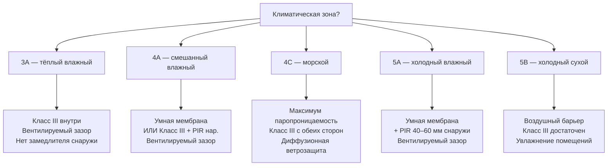

## Смешанный климат: постановка задачи

Климатические зоны 3–5 по классификации ASHRAE характеризуются значимыми сезонами как отопления, так и охлаждения. Это означает, что паровой поток через ограждающую конструкцию меняет направление дважды в год: зимой — изнутри наружу, летом — снаружи внутрь. Требования к паровому замедлителю, подходящие для холодного климата (Класс I/II изнутри), в смешанном климате могут стать источником проблем: замедлитель, защищающий зимой, летом блокирует высыхание полости.

Проектирование для смешанного климата требует понимания конкретных климатических характеристик зоны и выбора решений, обеспечивающих влажностный баланс за годовой цикл.

---

## Климатические зоны и российские аналоги


| Зона ASHRAE | ГСО 18 °C, °С·сут | ГСО охл. 10 °C, °С·сут | Особенность | Российский город-аналог |
|---|---|---|---|---|
| 3А (тёплый влажный) | 1000–2000 | 1000–1400 | Длинное жаркое влажное лето | Краснодар, Ростов-на-Дону |
| 3С (морской) | 1000–2000 | < 600 | Умеренные t°, высокая ОВ | Владивосток (юго-запад) |
| 4А (смешанный влажный) | 2000–3000 | 500–1000 | Оба сезона значимы | Воронеж, южная Москва |
| 4С (морской) | 2000–3000 | < 400 | Частые дожди, умеренные t° | Побережье Приморья |
| 5А (холодный влажный) | 3000–4000 | 330–670 | Длинная зима, тёплое лето | Москва, Казань, Нижний Новгород |
| 5В (холодный сухой) | 3000–4000 | < 330 | Зима холодная, лето сухое | Чита, Улан-Удэ |


Для расчётов по российским нормам климатические данные берутся из СП 131.13330.2020 (Строительная климатология): температура наружного воздуха наиболее холодной пятидневки, средние температуры по месяцам, влажность.

---

## Зона 3А — тёплый влажный климат (аналог: Краснодар)

### Климатические данные Краснодара

| Параметр | Январь | Июль |
|---|---|---|
| Температура наружная, °C | −3 | +30 |
| Относительная влажность, % | 80 | 68 |
| $p_v$ наружная, Па | 408 | 2885 |

Внутренние условия: +21 °C / 40 % (зима), +24 °C / 50 % (лето).

**Зимний поток:** $\Delta p_v = 994 - 408 = +586$ Па (наружу) — умеренный.

**Летний поток:** $\Delta p_v = 1493 - 2885 = -1392$ Па (внутрь) — значительный.

### Стратегия для зоны 3А

Летний обратный поток доминирует. Главный риск — накопление влаги в полости от охлаждённого наружного воздуха. Внутренний паровой замедлитель Класса I/II недопустим — он заблокирует летнее высыхание.

**Рекомендации:**
- Внутренний слой: Класс III (латексная краска, 5–10 пермей).
- Наружная ветрозащита: диффузионная мембрана > 20 пермей (паропроницаемая).
- Вентилируемый фасадный зазор: обязателен.
- Кондиционирование поддерживает ОВ внутри ≤ 50 %.

---

## Зона 4А — смешанный влажный климат (аналог: Воронеж)

### Климатические данные Воронежа

| Параметр | Январь | Июль |
|---|---|---|
| Температура наружная, °C | −10 | +22 |
| Относительная влажность, % | 82 | 68 |
| $p_v$ наружная, Па | 208 | 1547 |

**Зимний поток:** $\Delta p_v = 994 - 208 = +786$ Па (наружу) — значительный.

**Летний поток:** $\Delta p_v = 1493 - 1547 = -54$ Па (внутрь) — слабый (если нет кондиционирования до +24 °C при сухом лете).

Зона 4А в России — наиболее «сбалансированная»: оба потока умеренные.

### Числовой пример: температура OSB зимой

Стена: стойки 150 мм + минвата в полости ($R = 4{,}17$ м²·К/Вт) + OSB 12 мм + фасадная минвата 50 мм ($R = 1{,}39$ м²·К/Вт) + зазор + облицовка.

$R_{\text{total}} = 0{,}13 + 4{,}17 + 0{,}10 + 1{,}39 + 0{,}13 = 5{,}92$ м²·К/Вт

Температура OSB (на границе стойки и наружной минваты):


T_{\text{OSB}} = T_{\text{ext}} + (T_{\text{int}} - T_{\text{ext}}) \cdot \frac{R_{\text{ext}\to\text{OSB}}}{R_{\text{total}}} = -10 + 31 \cdot \frac{1{,}39 + 0{,}13}{5{,}92} = -10 + 7{,}9 = -2{,}1~°C


Точка росы внутреннего воздуха (+21 °C / 40 %): $T_d = 7{,}0$ °C.

$-2{,}1$ °C < $7{,}0$ °C — OSB без наружной изоляции в зоне конденсации. Но здесь наружная минвата 50 мм уже добавлена — пересчитаем температуру на границе полостной минваты и OSB:

$T_{\text{OSB,inner face}} = -10 + 31 \cdot \frac{0{,}13}{5{,}92} = -10 + 0{,}7 = -9{,}3$ °C — это наружная грань, не контактирующая с влажным воздухом помещения.

Температура наружной грани OSB (между полостной минватой и наружной минватой):

$T = -10 + 31 \cdot \frac{0{,}13 + 1{,}39}{5{,}92} = -10 + 7{,}9 = -2{,}1$ °C

Чтобы защитить OSB от конденсации, нужно либо увеличить наружную изоляцию до $R_{\text{ext}} \geq 1{,}76$ м²·К/Вт (PIR 40 мм), либо снизить внутреннюю ОВ до 35 % ($T_d = 5{,}5$ °C).

### Стратегия для зоны 4А

**Вариант А: Умная мембрана внутри + наружная минвата ≥ 50 мм.**
- Зимой умная мембрана ограничивает поток к OSB.
- Летом открывается — высыхание полости внутрь.

**Вариант Б: Латексная краска (Класс III) + PIR 40 мм снаружи без фольги.**
- PIR без фольги (~2 пермя) не блокирует зимнее высыхание наружу.
- Наружная изоляция прогревает OSB выше точки росы.

---

## Зона 4С — морской климат (аналог: прибрежное Приморье)

### Особенности

Умеренные температуры снижают амплитуду паровых потоков, но высокая круглогодичная ОВ (75–85 %) создаёт постоянную нагрузку на конструкцию. Нет доминирующего сезона — нагрузка равномерна.

**Стратегия:**
- Максимально паропроницаемые конструкции с обеих сторон.
- Класс III внутри и наружи.
- Обязателен вентилируемый зазор (частые дожди = постоянное смачивание облицовки).
- Избегать любых непроницаемых слоёв.
- Деревянные элементы из материалов с высокой стойкостью к гниению или с обработкой.

---

## Зона 5А — холодный влажный климат (аналог: Москва)

### Климатические данные Москвы

| Параметр | Январь | Июль |
|---|---|---|
| Температура наружная, °C | −9,3 (ср. янв.) / −28 (расч.) | +23 |
| Относительная влажность, % | 83 | 74 |

**Расчётный зимний поток** (расчётная температура −28 °C):

$p_{v,\text{ext}}(-28~°C) = 611{,}2 \cdot e^{17{,}62 \times (-28) / 215{,}12} \times 0{,}83 = 72 \times 0{,}83 = 60$ Па

$\Delta p_v = 994 - 60 = +934$ Па — существенный зимний поток наружу.

### Минимальная наружная изоляция для защиты OSB

По ASHRAE (Fundamentals 2021, гл. 27) и национальным практикам, для стены с внутренним замедлителем Класса II или III доля наружной изоляции:


\frac{R_{\text{ext}}}{R_{\text{total}}} \geq k_{\text{zone}}



| Зона ASHRAE | $k_{\text{zone}}$ | Для $R_{\text{total}} = 5{,}0$ м²·К/Вт | Примечание |
|---|---|---|---|
| 3А | 0,20 | $R_{\text{ext}} \geq 1{,}00$ м²·К/Вт (PIR 22 мм) | Класс III допустим без расчёта |
| 4А | 0,24 | $R_{\text{ext}} \geq 1{,}20$ м²·К/Вт (PIR 27 мм) | |
| 5А | 0,30 | $R_{\text{ext}} \geq 1{,}50$ м²·К/Вт (PIR 33 мм) | |
| 5В | 0,25 | $R_{\text{ext}} \geq 1{,}25$ м²·К/Вт | Сухой климат, риск ниже |


### Стратегия для зоны 5А (Москва)

**Для типовой каркасной стены с минватой в полости 150 мм:**

Добавить непрерывную наружную изоляцию PIR без фольги 40 мм ($R = 1{,}77$ м²·К/Вт, ~2 пермя):

- $R_{\text{total}} \approx 0{,}13 + 1{,}77 + 0{,}10 + 4{,}17 + 0{,}13 = 6{,}30$ м²·К/Вт
- $R_{\text{ext}}/R_{\text{total}} = 1{,}77 / 6{,}30 = 28\%$ — достаточно для Класса III изнутри при $-28$ °C.
- $T_{\text{OSB}} = -28 + 51 \cdot 1{,}90 / 6{,}30 = -28 + 15{,}4 = -12{,}6$ °C... Нет, пересчитаем: на OSB (между полостной минватой и PIR):

$T_{\text{OSB}} = -28 + 51 \times \frac{0{,}13 + 1{,}77}{6{,}30} = -28 + 51 \times 0{,}302 = -28 + 15{,}4 = -12{,}6$ °C

Точка росы при +21 °C / 40 %: $T_d = 7{,}0$ °C.

$-12{,}6$ °C < $7{,}0$ °C — OSB по-прежнему холоднее точки росы, но паросопротивление умной мембраны зимой (~1000 м²·ч·Па/мг) резко снижает поток к OSB. Давление пара у OSB:

$g = (994 - 60) / Z_{\text{total,пар}}$; $Z_{\text{total}} = 1000 + 268 + 258 + 171 + 143 + 5 \approx 1845$

$g = 934 / 1845 = 0{,}51$ мг/(м²·ч)

$p_{v,\text{OSB}} = 994 - 0{,}51 \times (1000 + 268 + 258) = 994 - 0{,}51 \times 1526 = 994 - 779 = 215$ Па

$p_{\text{sat}}(-12{,}6~°C) \approx 201$ Па — граничный случай. Рекомендуется либо увеличить PIR до 60 мм, либо снизить внутреннюю ОВ до 35 %.

---

## Зона 5В — холодный сухой климат (аналог: Чита)

Низкая ОВ наружного воздуха зимой (<60 %) снижает давление пара снаружи почти до нуля. Основной риск — не конденсация от диффузии, а утечки воздуха. Приоритеты:

1. Непрерывный воздушный барьер — первоочередная мера.
2. Класс III достаточен как внутренний замедлитель.
3. Увлажнение помещений зимой может потребоваться.
4. Летний обратный поток минимален — кондиционирование редкое.

---

## Конструктивные схемы по зонам





---

## Требования к воздушному барьеру

Воздушный барьер (air barrier) и паровой замедлитель — разные системы, хотя могут быть совмещены в одном материале. В смешанном климате воздушный барьер критичнее парового замедлителя: конвективный перенос влаги при утечке воздуха в 50–100 раз превышает диффузию.

Требования к воздухопроницаемости:
- Материал воздушного барьера: ≤ 0,02 л/(с·м²) при 75 Па (EN 12114).
- Система воздушного барьера здания: ≤ 0,2 л/(с·м²) при 75 Па (ASHRAE 90.1, Annex C).
- По СП 50.13330.2017 — воздухопроницаемость ограждающих конструкций нормируется в Приложении Е.

---

## Нормативная база

| Документ | Область применения |
|---|---|
| ASHRAE 160-2021 | Критерии влажности, гигротермический расчёт |
| ASHRAE Fundamentals (2021), гл. 26–27 | Классификация замедлителей, методы расчёта |
| СП 50.13330.2017 | Нормируемые R, воздухопроницаемость (Россия) |
| СП 23-101-2004 | Расчёт паросопротивления, Глейзер (Россия) |
| СП 131.13330.2020 | Климатические данные по городам России |
| ISO 13788:2012 | Стационарный метод (Глейзер) |
| EN 15026 / ISO 15026 | Нестационарный расчёт |
