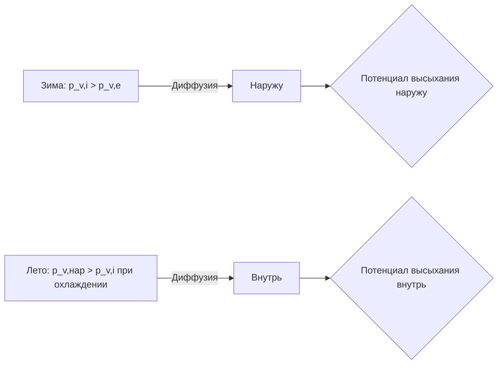

Диффузионное высыхание (diffusion drying) — медленный, но непрерывный механизм удаления влаги из ограждающих конструкций за счёт паровой диффузии по градиенту парциального давления. В отличие от вентиляционного высыхания, диффузия не требует воздушных полостей и действует через любые паропроницаемые слои. Типичные скорости диффузионного потока — 0,01–0,10 г/(м²·ч) — на порядок ниже вентиляционного высыхания, однако диффузия является единственным механизмом высыхания в герметичных заполненных конструкциях.

Нормативная основа: ISO 13788 (метод Глазера), ISO 15026 / EN 15026 (нестационарный анализ), ASHRAE 160, ASHRAE Fundamentals гл. 25, СП 50.13330.

---

## Физика диффузии пара

### Первый закон Фика

Плотность потока водяного пара через слой материала:


g = -\delta_p \cdot \frac{dp_v}{dx} = \delta_p \cdot \frac{p_{v,1} - p_{v,2}}{d} \quad \text{[кг/(м²·с)]}


где δ\_p — коэффициент паропроницаемости материала, кг/(м·с·Па); p\_{v,1}, p\_{v,2} — парциальные давления пара на противоположных поверхностях слоя; d — толщина слоя, м.

### Эквивалентная диффузионная толщина

Паросопротивление удобно выражать через эквивалентную диффузионную толщину (equivalent air layer thickness):


s_d = \mu \cdot d \quad \text{[м]}


где μ — безразмерный коэффициент сопротивления паровой диффузии материала (μ-value, water vapour diffusion resistance factor); δ\_0 = 1,85×10⁻¹⁰ кг/(м·с·Па) — паропроницаемость неподвижного воздуха.

Поток пара через один слой:


g = \frac{\delta_0 \cdot (p_{v,1} - p_{v,2})}{s_d}


### Многослойная конструкция

Суммарное паросопротивление:


Z_{\text{total}} = \sum_k \frac{s_{d,k}}{\delta_0} \quad \text{[м²·с·Па/кг]}


Суммарный поток пара:


g = \frac{p_{v,i} - p_{v,e}}{Z_{\text{total}}} = \frac{(p_{v,i} - p_{v,e}) \cdot \delta_0}{S_d}


где S\_d = Σ s\_{d,k} — суммарная эквивалентная диффузионная толщина конструкции, м.

---

## Паропроницаемость строительных материалов


| Материал | μ | s\_d при d = 100 мм, м | Класс по IRC |
|---|---|---|---|
| Воздух (неподвижный) | 1 | 0,10 | — |
| Минеральная вата | 1 | 0,10 | Нет барьера |
| Открытоячеистая ППУ | 3–5 | 0,30–0,50 | Нет барьера |
| Гипсокартон 12,5 мм | 8–10 | (≈ 0,10) | Нет барьера |
| Целлюлозная изоляция | 2–3 | 0,20–0,30 | Нет барьера |
| ЭПС (пенополистирол) | 30–70 | 3,0–7,0 | Класс II–III |
| ЭППС (экструдир.) | 80–200 | 8,0–20 | Класс II |
| Закрытоячеистая ППУ | 60–200 | 6,0–20 | Класс II |
| Крафт-бумага с покрытием | 45–75 | (≈ 0,06) | Класс II |
| ОСП 12 мм | 50–200 | (≈ 1,2–2,4) | Класс II–III |
| Фанера берёзовая 12 мм | 150–350 | (≈ 1,8–4,2) | Класс II |
| Полиэтилен 0,2 мм | ≥ 10 000 | ≥ 2,0 | Класс I |
| Алюминиевая фольга | ≥ 10⁶ | > 100 | Класс I |
| Кирпич керамический | 5–15 | 0,5–1,5 | Нет барьера |
| Бетон плотный | 70–150 | 7,0–15 | Класс II |


Паропроницаемость гигроскопичных материалов (древесина, ячеистый бетон) нелинейно возрастает с влажностью: при φ > 70% значение μ снижается в 2–5 раз — это учитывается только в нестационарных HAM-моделях.

---

## Пути диффузионного высыхания

### Высыхание наружу (cold-climate strategy)

В холодном климате зимой p\_v,i >> p\_v,e: паровой поток направлен изнутри наружу. Для беспрепятственного высыхания наружу необходимо:
- Минимальное паросопротивление наружной части конструкции (паропроницаемые утеплитель и ветрозащитная мембрана, s\_d < 0,3 м).
- Паробарьер или паровой замедлитель на тёплой (внутренней) стороне утеплителя: не препятствует высыханию наружу, но ограничивает поступление пара из помещения зимой.

Правило ISO 13788: S\_{d,нар} < 0,2 · S\_{d,вн} для обеспечения баланса высыхания > накопления.

### Высыхание внутрь

При наружной изоляции здания (утеплитель снаружи несущей стены) или в тёплый сезон, когда наружный воздух насыщен влагой, высыхание идёт изнутри, в сторону помещения. Требуется:
- Паропроницаемая внутренняя отделка (гипсокартон без паронепроницаемых красок, s\_d,отд < 0,5 м).
- Отсутствие плёночных пароизоляций изнутри.

Недопустимо устанавливать закрытоячеистую ППУ снаружи + полиэтиленовую плёнку изнутри — конструкция герметична с обеих сторон, высыхание невозможно.

### Двустороннее высыхание

Оптимальная конфигурация для переходного климата (Москва, зоны ASHRAE 5–6): паропроницаемые материалы с обеих сторон утеплителя или «умный» паробарьер с переменным μ.





---

## Численный пример: диффузионный баланс для стены в Москве

### Конструкция (снаружи → внутрь)

1. Штукатурка: d = 20 мм, μ = 25 → s\_d = 0,50 м
2. Кирпич: d = 380 мм, μ = 10 → s\_d = 3,80 м
3. Минвата: d = 100 мм, μ = 1 → s\_d = 0,10 м
4. Полиэтилен (пароизоляция): d = 0,2 мм, μ = 10 000 → s\_d = 2,00 м
5. ГКЛ: d = 12,5 мм, μ = 8 → s\_d = 0,10 м

S\_d,total = 6,50 м.

### Январь: накопление влаги

T\_i = +20°C, φ\_i = 50% → p\_v,i = 1169 Па.
T\_e = −26°C, φ\_e = 84% → p\_v,e = 61 Па.

Распределение давления пара пропорционально накопленному s\_d:


| Граница | Σs\_d, м | p\_v, Па | T, °C | p\_sat, Па | Конденсация? |
|---|---|---|---|---|---|
| Внутр. поверхность (ГКЛ) | 0 | 1169 | 18,3 | 2104 | Нет |
| ГКЛ / полиэтилен | 0,10 | 1152 | ≈18,0 | 2063 | Нет |
| Полиэтилен / минвата | 2,10 | 822 | ≈9,0 | 1148 | Нет |
| Минвата / кирпич | 2,20 | 805 | ≈7,0 | 1002 | Нет |
| Кирпич / штукатурка | 6,00 | 166 | ≈−22,0 | 95 | **Да** |


На границе «кирпич/штукатурка» p\_v > p\_sat — межслойная конденсация. Полиэтиленовая пароизоляция расположена правильно (s\_d = 2,0 м на тёплой стороне >> s\_{d,нар} = 4,4 м наружной части), но в данном примере суммарное наружное сопротивление всё равно слишком велико: весь кирпич (s\_d = 3,8 м) блокирует высыхание наружу.

### Соотношение диффузионных сопротивлений


\frac{S_{d,\text{нар}}}{S_{d,\text{вн}}} = \frac{4{,}30}{2{,}20} = 1{,}95


Рекомендуемое соотношение S\_{d,нар} / S\_{d,вн} ≤ 1/5 (ISO 13788 приложение). Данная конструкция не удовлетворяет условию. Решение: добавить вентилируемый зазор между штукатуркой и кирпичом либо применить паропроницаемую наружную штукатурку (μ ≤ 5) и перфорированную облицовку.

### Расчёт потока высыхания в апреле

T\_e = +3°C, φ\_e = 80% → p\_v,e = 575 Па.
T\_i = +20°C, φ\_i = 50% → p\_v,i = 1169 Па.

Поток изнутри наружу — конденсация отсутствует. Диффузионный поток через конструкцию:


g = \frac{(1169 - 575) \cdot \delta_0}{S_d} = \frac{594 \cdot 1{,}85 \times 10^{-10}}{6{,}50} = 1{,}69 \times 10^{-11}\ \text{кг/(м²·с)} \approx 0{,}0015\ \text{г/(м²·ч)}


Очень медленное высыхание: требуется наружный вентилируемый зазор для ускорения.

---

## Правила проектирования диффузионного высыхания

### Правило соотношения S\_d (ISO 13788)


\frac{S_{d,\text{нар}}}{S_{d,\text{вн}}} \leq 0{,}2 \quad \text{(высыхание наружу)}


или


\frac{S_{d,\text{вн}}}{S_{d,\text{нар}}} \leq 0{,}2 \quad \text{(высыхание внутрь)}


Суть: потенциал высыхания в разрешённом направлении должен быть значительно выше сопротивления с той же стороны.

### Запрет двойных паробарьеров

Недопустимо размещение двух слоёв с μ > 1000 по обе стороны теплоизоляции — конструкция становится «ловушкой влаги» (moisture trap).

### Учёт строительной влаги

Начальная влажность кирпичной кладки — 6–15% по массе, бетона — 4–8%. Время высыхания строительной влаги до равновесного уровня при диффузии через кирпич 510 мм (S\_d ≈ 5 м):


\tau \approx \frac{M_{\text{строит}} \cdot S_d}{\delta_0 \cdot \overline{\Delta p}} \approx \frac{30 \cdot 5}{1{,}85 \times 10^{-10} \cdot 500} \approx 1{,}6 \times 10^9\ \text{с} \approx 50\ \text{лет}


Только диффузия через кирпич без вентиляции неприемлема для удаления строительной влаги — обязательна активная вентиляция или вентилируемый зазор.

---

## Типовые конфигурации

### Каркасная стена, высыхание наружу (холодный климат)

Внутрь → наружу: ГКЛ (s\_d = 0,1 м) → паробарьер крафт (s\_d = 0,06 м) → минвата (s\_d = 0,15 м) → ОСП 12 мм (s\_d = 2,0 м) → паропроницаемая ветрозащита (s\_d = 0,05 м) → вентзазор → облицовка.

S\_{d,нар} = 0,05 м, S\_{d,вн} = 0,16+0,15 = 0,31 м. Отношение 0,05/0,31 = 0,16 < 0,2. Потенциал высыхания наружу обеспечен.

### Стена с наружной изоляцией (СФТК / ETICS), высыхание внутрь

Снаружи → внутрь: штукатурка (s\_d = 0,15 м) → ЭППС (s\_d = 10 м) → кирпич (s\_d = 3,8 м) → гипсовая штукатурка (s\_d = 0,2 м).

S\_{d,нар} = 10,15 м >> S\_{d,вн} = 4,0 м — высыхание внутрь затруднено, но строительная влага кирпича может выходить только через стяжку. Необходима пауза между устройством ЭППС и внутренней отделкой для предварительного высыхания кладки.

---

## Нормативные ссылки

- ISO 13788:2012: Hygrothermal performance — Glaser method
- ISO 15026-2:2012: Hygrothermal performance — Assessment by numerical simulation
- EN 15026:2007: Hygrothermal performance — Assessment by numerical simulation
- ISO 10456:2007: Building materials — Procedures for determining declared and design values
- ASHRAE Standard 160-2021: Criteria for Moisture-Control Design Analysis in Buildings
- ASHRAE Handbook — Fundamentals, Chapter 25: Heat, Air, and Moisture Control
- EN 13859-1:2014: Flexible sheets for waterproofing — Underlays for discontinuous roofing
- СП 50.13330.2017: Тепловая защита зданий
- СП 131.13330.2020: Строительная климатология
