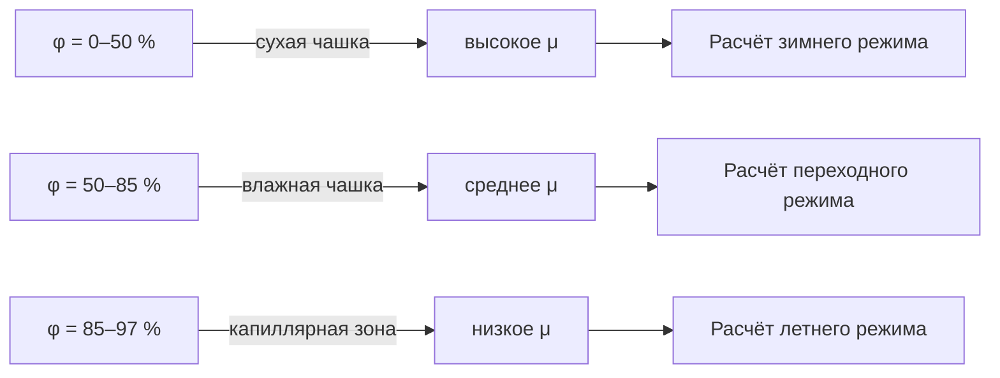

Показатель паропроницаемости (perm rating) — численная характеристика скорости переноса водяного пара через единицу площади плоского материала при заданном перепаде парциального давления. Это свойство является основным критерием при выборе пароизоляционных и паропропускающих слоёв в ограждающих конструкциях.

## Определения и единицы измерения

### Паропроницаемость и паропропускание

Необходимо различать два взаимосвязанных, но разных понятия.

**Коэффициент паропроницаемости** (water vapour permeability), обозначается δ — свойство самого материала, не зависящее от толщины:


\delta = \frac{g \cdot d}{\Delta p_v} \quad \left[\frac{\text{кг}}{\text{м} \cdot \text{с} \cdot \text{Па}}\right]


где g — плотность потока пара [кг/(м²·с)], d — толщина слоя [м], Δpv — перепад парциального давления [Па].

**Паропропускание** (water vapour permeance), обозначается W — характеристика конкретного образца заданной толщины:


W = \frac{\delta}{d} \quad \left[\frac{\text{кг}}{\text{м}^2 \cdot \text{с} \cdot \text{Па}}\right]


**Сопротивление паропроницанию** (vapour resistance factor) R_v:


R_v = \frac{1}{W} = \frac{d}{\delta} \quad \left[\frac{\text{м}^2 \cdot \text{с} \cdot \text{Па}}{\text{кг}}\right]


### Коэффициент сопротивления диффузии μ

В европейской и российской практике широко применяется безразмерный коэффициент μ (mu-value) — отношение паропроницаемости неподвижного воздуха к паропроницаемости материала при той же температуре:


\mu = \frac{\delta_{\text{воздух}}}{\delta_{\text{материал}}}


При 23 °C δ_воздух ≈ 2,0 × 10⁻¹⁰ кг/(м·с·Па). Чем выше μ, тем сильнее материал препятствует диффузии пара.

### Эквивалентная толщина диффузии sd

Параметр s_d [м] — толщина слоя неподвижного воздуха с таким же сопротивлением паропроницанию, что и рассматриваемый материал:


s_d = \mu \cdot d


Параметр s_d удобен для сравнения слоёв разных материалов и толщин. При s_d > 1500 м слой считается пароизоляцией по критерию EN ISO 10456.

### Соотношение единиц


| Величина | Система СИ | Американская (Imperial) | Коэффициент пересчёта |
|----------|-----------|------------------------|-----------------------|
| Паропропускание W | нг/(Па·с·м²) | perm (gr/h·ft²·inHg) | 1 perm = 57,4 нг/(Па·с·м²) |
| Коэффициент δ | кг/(м·с·Па) | perm·inch | 1 perm·inch = 1,46 × 10⁻¹² кг/(м·с·Па) |
| Сопротивление R_v | м²·с·Па/кг | — | — |


## Методы испытаний

### ISO 12572 — основной международный стандарт

Стандарт ISO 12572:2016 «Теплофизические свойства строительных материалов — определение свойств переноса водяного пара» устанавливает два метода:

**Метод A — «сухая чашка»** (dry cup): в чашу помещают силикагель, создаётся градиент ОВ 0–50 %. Применяется для материалов с μ > 100 (полимерные плёнки, ЭППС, ПИР).

**Метод B — «влажная чашка»** (wet cup): в чашу наливают воду, создаётся градиент ОВ 50–100 %. Применяется для гигроскопичных материалов (дерево, газобетон, кирпич).

Стандартные условия испытания: температура (23 ± 1) °C, атмосферное давление 101,3 кПа.

### ГОСТ 25898 — российский стандарт

ГОСТ 25898-2012 «Материалы и изделия строительные. Методы определения паропроницаемости и сопротивления паропроницанию» гармонизирован с ISO 12572. Метод чашки: образец герметично закрепляется над раствором с заданной ОВ, через равные промежутки взвешивается. Паропроницаемость вычисляют по формуле:


\delta = \frac{\Delta m \cdot d}{A \cdot \tau \cdot \Delta p_v}


где Δm — изменение массы [кг], d — толщина [м], A — площадь испытания [м²], τ — время [с], Δpv — перепад давления пара [Па].

## Классификация материалов по паропроницаемости

СП 23-101 и ASHRAE Fundamentals (глава 26) используют близкие, но не идентичные классификации. Ниже приведена классификация по функции слоя в конструкции.

### Пароизоляционные материалы (s_d > 100 м, μ > 10 000)


| Материал | Толщина, мм | μ | s_d, м | Примечания |
|----------|------------|---|--------|-----------|
| Алюминиевая фольга | 0,05 | > 300 000 | > 15 | Практически нулевая проницаемость |
| Полиэтиленовая плёнка (ПЭ) | 0,2 | 200 000 | 40 | ГОСТ Р 55009, стандартная пароизоляция |
| Листовой металл (сталь) | 0,5 | > 10⁶ | > 500 | Панели, воздуховоды |
| ПИР-плита с фольгой | 80 | — | > 1500 | Суммарный s_d фольгированных граней |
| Битумно-полимерная мембрана (APP/SBS) | 3–4 | ≥ 50 000 | 150–200 | Подземная гидроизоляция |


### Пароретардирующие материалы (1 м < s_d ≤ 100 м, 200 ≤ μ ≤ 10 000)


| Материал | Толщина, мм | μ | s_d, м | Стандарт |
|----------|------------|---|--------|---------|
| ЭППС (XPS) | 50 | 80–200 | 4–10 | ISO 10456 |
| ПСБ-С (EPS) | 50 | 30–70 | 1,5–3,5 | ГОСТ 15588 |
| ОСП-3 (OSB) | 12 | 50–150 | 0,6–1,8 | EN 13986 |
| Фанера хвойная | 12 | 100–150 | 1,2–1,8 | ГОСТ 3916 |
| Крафт-облицовка минваты | 0,1 | 1000–5000 | 0,1–0,5 | — |
| Краска алкидная (2 слоя) | 0,2 | 1000–5000 | 0,2–1,0 | — |


### Паропропускающие материалы (s_d ≤ 1 м, μ < 200)


| Материал | Толщина, мм | μ | s_d, м | Примечания |
|----------|------------|---|--------|-----------|
| Минеральная вата (MW) | 100 | 1–2 | 0,1–0,2 | ГОСТ 31924 |
| Газобетон D400 | 300 | 8–12 | 2,4–3,6 | ГОСТ 31360 |
| Керамический кирпич | 120 | 8–16 | 0,96–1,9 | СП 15.13330 |
| Гипсокартон (ГКЛ) | 12,5 | 8–10 | 0,1–0,125 | ГОСТ 6266 |
| Цементно-стружечная плита | 12 | 15–30 | 0,18–0,36 | — |
| Древесина (поперёк волокон) | 50 | 20–50 | 1,0–2,5 | ГОСТ 24544 |
| Диффузионная мембрана | 0,3 | 1–10 | 0,003–0,003 | s_d ≤ 0,02 м |


## Влияние влажности и температуры на паропроницаемость

### Зависимость δ от относительной влажности

Гигроскопичные материалы (дерево, газобетон, кирпич) показывают нелинейный рост δ при повышении ОВ. Причина — заполнение пор жидкой фазой, что активирует капиллярный транспорт. ISO 12572 требует проводить испытания при нескольких ступенях ОВ и строить зависимость δ(φ).





### Зависимость от температуры

Паропроницаемость воздуха δ_air пропорциональна T^(1,81)/P. Паропроницаемость большинства твёрдых материалов также растёт с температурой. Для расчётов по СП 23-101 используют значения при температуре условной зоны материала.

## Переменные пароретарданты (smart vapor retarders)

Переменные пароретарданты (variable permeance vapour retarder) — материалы, у которых μ снижается при повышении ОВ (μ-φ-зависимость). Это обеспечивает двунаправленное высыхание конструкции:

- в зимний период (ОВ у холодной поверхности 30–50 %) — высокое μ, задерживает пар;
- в летний период (ОВ у тёплой поверхности 70–90 %) — низкое μ, пропускает пар к интерьеру.


| ОВ контактирующего воздуха, % | s_d, м | Функция слоя |
|-------------------------------|--------|-------------|
| 30 | 5–10 | Пароретардант (ограничивает диффузию) |
| 50 | 1–3 | Умеренный ретардант |
| 75 | 0,1–0,5 | Паропропускающий |
| 95 | < 0,1 | Высокопроницаемый |


## Многослойные конструкции: расчёт сопротивления паропроницанию

Для плоской многослойной конструкции сопротивления паропроницанию складываются:


R_{v,\text{общ}} = \sum_{i=1}^{n} R_{v,i} = \sum_{i=1}^{n} \frac{d_i}{\delta_i}


Суммарный s_d конструкции:


s_{d,\text{общ}} = \sum_{i=1}^{n} \mu_i \cdot d_i


### Числовой пример: стена с наружным утеплением (СФТК)

**Состав конструкции (изнутри наружу):**


| № | Слой | Материал | d, мм | μ | s_d, м |
|---|------|----------|-------|---|--------|
| 1 | Внутренняя штукатурка | Цементно-песчаная | 15 | 18 | 0,27 |
| 2 | Несущий слой | Газобетон D500 | 300 | 10 | 3,00 |
| 3 | Клей+утеплитель | Минеральная вата (MW) | 120 | 1 | 0,12 |
| 4 | Базовый слой | Штукатурка по сетке | 6 | 25 | 0,15 |
| 5 | Финишная штукатурка | Силикатная | 3 | 40 | 0,12 |


**Расчёт:**


s_{d,\text{общ}} = 0{,}27 + 3{,}00 + 0{,}12 + 0{,}15 + 0{,}12 = 3{,}66 \text{ м}


Критерий невлагонакопления по СП 23-101: конденсационная плоскость должна находиться в слое с достаточной паропропускающей способностью снаружи от неё. Поскольку газобетон (s_d = 3,0 м) расположен изнутри, а наружный утеплитель (s_d = 0,12 м) обладает значительно меньшим сопротивлением, пар свободно выходит через утеплитель наружу. Данная конструкция удовлетворяет условию:


s_{d,\text{наружные слои}} \ll s_{d,\text{внутренние слои}}
\Rightarrow 0{,}39 \text{ м} \ll 3{,}27 \text{ м} \quad \checkmark


Конструкция способна высыхать в наружную сторону, риск накопления влаги минимален.

## Нормативные требования

### СП 50.13330.2017 и СП 23-101-2004

СП 50.13330 (актуализированная редакция СНиП 23-02) устанавливает требование проверки паронакопления в конструкциях ограждающих конструкций. СП 23-101-2004 (пособие к СНиП 23-02) содержит методику расчёта и нормативные значения μ для типовых материалов (таблицы 9–11).

Условие отсутствия влагонакопления за годовой цикл:


\Delta W_{\text{год}} = \Delta W_{\text{нак}} - \Delta W_{\text{исп}} \leq 0


### ISO 13788 — стационарный (Glaser) метод

Метод Глейзера используется для базовой проверки: строится распределение температур и давлений насыщенного пара по толщине конструкции, затем накладывается распределение парциального давления. Конденсация прогнозируется там, где фактическое давление пара превышает давление насыщения.

Метод консервативен: не учитывает капиллярный транспорт, гигроскопическое накопление и испарение в летний период. Для детального анализа применяется WUFI (динамическое гигротермическое моделирование по EN 15026).

## Практические рекомендации по выбору материалов

Правило «внутреннее сопротивление > наружного» для холодного климата (Москва, Санкт-Петербург, Новосибирск):


\frac{s_{d,\text{внутр}}}{s_{d,\text{наружн}}} \geq 5


Это соотношение обеспечивает, что при диффузии пара в наружную сторону давление пара не достигнет точки росы внутри теплоизоляционного слоя.

Для жаркого влажного климата (Краснодар, Сочи, Владивосток летом) направление диффузии преобладающе снаружи внутрь. Внутренние слои должны быть паропроницаемыми, наружные — паростойкими.

## Литература и нормативные документы

- ASHRAE Handbook — Fundamentals 2021, Chapter 26: Heat, Air, and Moisture Control in Building Assemblies
- ISO 12572:2016 — Hygrothermal performance of building materials — Determination of water vapour transmission properties
- ISO 12571:2021 — Hygrothermal performance of building materials — Determination of hygroscopic sorption properties
- EN ISO 10456:2007 — Building materials and products — Hygrothermal properties — Tabulated design values
- СП 50.13330.2017 — Тепловая защита зданий
- СП 23-101-2004 — Проектирование тепловой защиты зданий
- ГОСТ 25898-2012 — Материалы и изделия строительные. Методы определения паропроницаемости
- ГОСТ Р 55523-2013 — Мембраны паропропускающие для строительства
