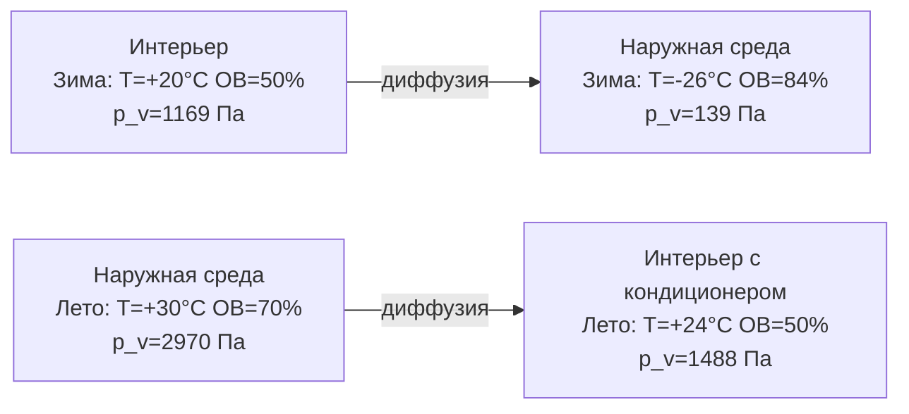

Пароретарданты (vapor retarders) — материалы или системы, снижающие скорость диффузии водяного пара через ограждающие конструкции. Их основная задача — предотвратить накопление влаги (межслойную конденсацию) в стенах, кровлях и полах, которое приводит к коррозии, деградации утеплителя, росту плесени и потере несущей способности.

Выбор и размещение пароретардантов определяются климатической зоной, составом конструкции, направлением преобладающего влагопотока и требованиями к летнему высыханию.

## Физические основы

### Механизмы переноса влаги

Водяной пар переносится через строительные материалы тремя механизмами:

1. **Диффузия пара** (vapor diffusion) — молекулярный перенос по градиенту концентрации (закон Фика первый). Управляется разницей парциальных давлений Δp_v.
2. **Конвективный перенос с воздухом** (air leakage moisture) — перенос влаги воздушными потоками через щели и проходки. По данным ASHRAE Fundamentals (глава 26), в 10–100 раз превышает диффузионный перенос в большинстве конструкций.
3. **Капиллярный транспорт** (capillary liquid water transport) — движение жидкой воды по порам при ОВ > 95 %. Описывается уравнением Ричардса.

Пароретарданты специально противодействуют механизму (1). Для механизма (2) требуется воздушный барьер (air barrier).

### Движущая сила диффузии

Плотность потока пара через слой:


g = W \cdot \Delta p_v = \frac{\delta}{d} \cdot (p_{v,1} - p_{v,2}) \quad \left[\frac{\text{кг}}{\text{м}^2 \cdot \text{с}}\right]


Перепад парциального давления водяного пара:


\Delta p_v = \varphi_{\text{int}} \cdot p_{sat}(T_{\text{int}}) - \varphi_{\text{ext}} \cdot p_{sat}(T_{\text{ext}})


В зимний период (отопление): T_int > T_ext, p_v,int > p_v,ext — поток направлен изнутри наружу.
В летний период при кондиционировании: p_v,ext > p_v,int — поток направлен снаружи внутрь.





## Классификация пароретардантов

### Классификация по ASHRAE / ASTM E1745

ASHRAE Fundamentals (глава 26) и ASTM E1745 делят материалы на три класса по паропропусканию W:


| Класс | W, perm | W, нг/(Па·с·м²) | Описание | Типичные материалы |
|-------|---------|-----------------|----------|--------------------|
| Класс I | ≤ 0,1 | ≤ 5,7 | Паробарьер (vapor barrier) | ПЭ-плёнка, алюминиевая фольга, листовой металл, стекло |
| Класс II | 0,1–1,0 | 5,7–57 | Паростойкий ретардант | Крафт-облицовка минваты, OSB, ПСБ-С, крафт-бумага с битумом |
| Класс III | 1,0–10 | 57–575 | Паропропускающий ретардант | Латексная краска (2 слоя), гипсокартон, диффузионные мембраны |


Материалы с W > 10 perm (> 575 нг/(Па·с·м²)) — паропроницаемые (vapor permeable): минеральная вата, открытопористый пенополиуретан.

### Классификация по российским нормам (СП 23-101, СП 50.13330)

В российской практике вместо трёхуровневой системы применяют параметр s_d (эквивалентная диффузионная толщина):


| s_d, м | Функция | Применение |
|--------|---------|-----------|
| > 100 | Пароизоляция | Полы по грунту, холодный климат |
| 10–100 | Пароретардант высокой стойкости | Зоны 1 и 2 климатического районирования РФ |
| 1–10 | Пароретардант умеренной стойкости | Конструкции с расчётным контролем |
| < 1 | Паропропускающий слой | Наружные слои, диффузионные мембраны |


## Материалы классов I–III: свойства и применение

### Класс I — паробарьеры (vapor barriers)

**Полиэтиленовая плёнка (ПЭ, LDPE/LLDPE)**

Наиболее распространённый паробарьер для жилого строительства в холодном климате. Параметры:
- Толщина: 0,15–0,20 мм (6–8 mil)
- μ ≈ 200 000, s_d = 30–40 м
- W ≈ 0,001 нг/(Па·с·м²) — W ≈ 0,06 perm
- Стандарт: ГОСТ Р 55009, ASTM E1745 Type I

Требования к монтажу: непрерывность полотна, перекрытие швов ≥ 150 мм с проклейкой бутилкаучуковой лентой, герметизация всех проходок (электрические коробки, трубы), примыкание к верхней обвязке и перекрытию.

**Алюминиевая фольга и металлизированные мембраны**

W ≈ 0 — практически нулевая проницаемость. Применяется как облицовка ПИР/ПСБ-плит и в отражающих тепловых экранах. Уязвима к механическим повреждениям и потере герметичности в стыках.

**Битумно-полимерные мембраны (APP, SBS)**

μ ≥ 50 000, s_d = 150–200 м. Применяются для подземной гидро- и пароизоляции, кровельных покрытий с высоким сопротивлением диффузии.

### Класс II — пароретарданты умеренной стойкости


| Материал | μ | s_d при типичной толщине, м | Примечания |
|----------|---|----------------------------|-----------|
| Крафт-облицовка минеральной ваты | 1500–3000 | 0,15–0,30 | Зависит от ОВ (переменная!) |
| ОСП-3 (OSB), 12 мм | 100 | 1,2 | ГОСТ Р 56309 |
| Фанера хвойная, 12 мм | 130 | 1,56 | ГОСТ 3916 |
| Асфальтированная крафт-бумага | 500–1000 | 0,05–0,10 | — |
| ЭППС (XPS) 50 мм | 150 | 7,5 | EN 13164 |


### Класс III — паропропускающие ретарданты


| Материал | μ | s_d, м | Примечания |
|----------|---|--------|-----------|
| Латексная краска, 2 слоя | 2000 | 0,40 | Зависит от состава |
| Гипсокартон (ГКЛ) 12,5 мм | 8 | 0,10 | ГОСТ 6266 |
| Цементно-стружечная плита 12 мм | 25 | 0,30 | — |
| Диффузионная плёнка (Sd ≈ 0,02 м) | 5–15 | 0,01–0,02 | ГОСТ Р 55523 |


## Переменные пароретарданты

### Принцип действия

Переменные (умные) пароретарданты (smart / variable permeance vapor retarders) — материалы с μ-φ-зависимостью: μ резко снижается при повышении ОВ. Это обеспечивает:

- **Зима** (ОВ у холодной поверхности 30–50 %): высокое μ → задерживает пар → класс I–II.
- **Лето** (ОВ у тёплой поверхности 70–90 %): низкое μ → пропускает пар к интерьеру → класс III.


| ОВ воздуха у мембраны, % | s_d, м | Класс по ASTM | Функция |
|--------------------------|--------|--------------|---------|
| 30 | 8–12 | I–II | Зимняя защита |
| 50 | 2–4 | II | Переходный режим |
| 75 | 0,3–0,8 | III | Летнее высыхание |
| 95 | < 0,1 | Паропроницаемый | Максимальный потенциал сушки |


Переменные пароретарданты оптимальны для смешанного климата (Москва, Минск, Варшава), где требуется защита от диффузии зимой и высыхание летом.

## Размещение в конструкции

### Холодный климат (зимний режим доминирует)

Принцип: пароретардант располагается с **тёплой** (внутренней) стороны утеплителя. Наружные слои должны быть паропроницаемыми для обеспечения летнего высыхания.

Рекомендуемое соотношение s_d по СП 23-101:


\frac{s_{d,\text{внутр}}}{s_{d,\text{наружн}}} \geq 5{:}1


**Типовой порядок слоёв** (изнутри наружу) для деревянного каркаса в климате Москвы:


| № | Слой | Материал | s_d, м | Назначение |
|---|------|----------|--------|-----------|
| 1 | Внутренняя отделка | ГКЛ 12,5 мм | 0,10 | — |
| 2 | Пароретардант | ПЭ-плёнка 0,2 мм | 40 | Класс I |
| 3 | Утеплитель | Минеральная вата 150 мм | 0,15 | — |
| 4 | Обшивка | ОСП-3 12 мм | 1,2 | Класс II |
| 5 | Ветрозащита | Диффузионная мембрана | 0,02 | Класс III |
| 6 | Вент. зазор | Воздух 20 мм | — | Высыхание наружу |
| 7 | Облицовка | Вагонка/кирпич | — | — |


Суммарный s_d внутренних слоёв (ГКЛ + ПЭ) = 40,10 м. Наружных (ОСП + мембрана) = 1,22 м. Соотношение 33:1 >> 5:1 — условие выполнено.

### Смешанный климат (умеренный)

Рекомендуется класс II или переменный ретардант. Размещение — на внутренней поверхности, но с меньшим s_d (5–15 м). Наружные слои должны обеспечивать свободное высыхание.

Вариант: крафт-облицованная минеральная вата (без дополнительной ПЭ-плёнки) + ОСП (класс II) + диффузионная мембрана.

### Жаркий влажный климат (летний режим доминирует)

Паробарьер (класс I) на внутренней стороне стены **противопоказан**: он блокирует летнее высыхание, когда пар движется снаружи внутрь. Внутренние слои должны быть паропроницаемыми.

Рекомендуется: непокрашенный ГКЛ (W ≈ 50 нг/(Па·с·м²)) или паропропускающая краска.

## Нормативные требования

### СП 50.13330.2017 — Тепловая защита зданий

Приложение Д СП 50.13330 требует расчёта паронакопления для всех непрозрачных ограждающих конструкций. Условие отсутствия недопустимого влагонакопления:


\Delta w_{\text{год}} \leq 0 \quad \text{или} \quad \Delta w_{\text{зима}} \leq \Delta w_{\text{доп}}


где Δw_год — изменение влажности материала за годовой цикл, Δw_доп — допустимое приращение влажности (для минеральной ваты — не более 3 % по массе).

### СП 23-101-2004 — Методика расчёта

Раздел 8 устанавливает метод расчёта паропроницания по Глейзеру в двух расчётных периодах: зимнем (накопление) и летнем (высыхание). Таблица 9 СП 23-101 содержит нормативные значения μ для 60+ материалов.

### ISO 13788:2012 — Метод Глейзера

Европейский стандарт (гармонизирован с EN 13788) описывает стационарный расчёт риска конденсации. Алгоритм:

1. Построить температурный профиль по толщине конструкции (ISO 6946).
2. Определить p_sat(T_i) на каждой границе слоёв.
3. Построить линейный профиль p_v(x) пропорционально s_d(x).
4. Конденсация прогнозируется там, где p_v(x) ≥ p_sat(T(x)).

Метод Глейзера консервативен и не учитывает:
- гигроскопическое накопление (буферный эффект);
- капиллярный перенос жидкой воды;
- динамическое изменение климатических условий.

Для точного анализа применяют численное моделирование по EN 15026 (программы WUFI, Delphin, MOISTURE-EXPERT).

### ASHRAE Fundamentals Chapter 26

ASHRAE рекомендует класс I или II для климатических зон 5–8 (Северная Америка), размещение на тёплой стороне утеплителя. Зоны 1–4 — предпочтительны классы II–III или переменные мембраны. Стандарт ASHRAE 160-2009 описывает вероятностный метод оценки риска конденсации.

## Числовой пример: проверка ограждающей конструкции на паронакопление

**Исходные данные:** каркасная стена 150 мм минеральной ваты + ОСП 12 мм снаружи. Расчётный зимний период — Новосибирск (T_int = 20 °C, ОВ = 45 %; T_ext = −20 °C, ОВ = 80 %).

**Парциальные давления:**
- p_v,int = 0,45 × 2338 = 1052 Па
- p_v,ext = 0,80 × 103 = 82 Па
- Δp_v = 1052 − 82 = 970 Па

**Конструкция (без пароретарданта) и сопротивления:**


| Слой | d, мм | μ | s_d, м | Z, 10⁹ м²·с·Па/кг |
|------|--------|---|--------|-------------------|
| ГКЛ 12,5 мм | 12,5 | 8 | 0,10 | 0,52 |
| Минеральная вата | 150 | 1 | 0,15 | 0,78 |
| ОСП-3 | 12 | 100 | 1,20 | 6,22 |
| Диффузионная мембрана | 0,3 | 5 | 0,0015 | 0,008 |


Z_общ = (0,52 + 0,78 + 6,22 + 0,008) × 10⁹ ≈ 7,53 × 10⁹ м²·с·Па/кг

Давление пара на внутренней поверхности ОСП:


p_{v,\text{ОСП}} = 1052 - \frac{(0{,}52 + 0{,}78) \times 10^9}{7{,}53 \times 10^9} \times 970 = 1052 - 167 = 885 \text{ Па}


Температура внутренней поверхности ОСП (по теплотехническому расчёту) ≈ −12 °C → p_sat(−12 °C) = 218 Па.

Так как p_v = 885 Па >> p_sat = 218 Па, прогнозируется конденсация на внутренней поверхности ОСП.

**Решение — добавить ПЭ-плёнку 0,2 мм** (s_d = 40 м, Z = 207 × 10⁹ м²·с·Па/кг):

Z_новый = (0,52 + 207 + 0,78 + 6,22 + 0,008) × 10⁹ ≈ 214,5 × 10⁹ м²·с·Па/кг

Давление пара на внутренней поверхности ОСП:


p_{v,\text{ОСП}} = 1052 - \frac{(0{,}52 + 207 + 0{,}78) \times 10^9}{214{,}5 \times 10^9} \times 970 = 1052 - 957 = 95 \text{ Па}


p_v = 95 Па < p_sat = 218 Па → конденсация отсутствует. Конструкция с ПЭ-плёнкой удовлетворяет требованиям СП 23-101.

## Монтаж и контроль качества

### Критические требования к установке

**Непрерывность:** пароретардант должен образовывать сплошную плоскость. Разрывы, проколы и неплотные стыки резко снижают эффективность — одна щель площадью 1 см² при перепаде давления создаёт поток пара, сопоставимый с диффузией через 100 м² цельного полотна (ASHRAE Fundamentals, Ch. 26).

**Герметизация проходок:** все точки пересечения плёнки трубами, кабелями, электрокоробками герметизируют саморасширяющимися манжетами или бутилкаучуковой лентой.

**Перекрытие швов:** минимум 150 мм, с двусторонней проклейкой на горизонтальных и вертикальных стыках.

**Примыкания:** к плитам перекрытий, балкам и каркасу — с дополнительными полосами шириной ≥ 100 мм.

### Типичные дефекты и последствия


| Дефект | Влияние на паропропускание | Возможные последствия |
|--------|--------------------------|----------------------|
| Щель 5 мм × 200 мм у розетки | Конвективный перенос ≈ 50–100 г/сут | Намокание утеплителя за зиму |
| Непроклеенный стык 3 м | Диффузионный ток в 5–10 раз выше нормы | Локальная конденсация на ОСП |
| Прокол 2 мм при монтаже | Минимален при одиночном проколе | — |
| Отсутствие примыкания к перекрытию | Сквозной воздушный путь | Критическое намокание в зоне примыкания |


## Сравнение воздушного барьера и пароретарданта

Принципиальное различие: воздушный барьер (air barrier) останавливает конвективный перенос влаги, пароретардант — диффузионный. В большинстве конструкций конвективный перенос доминирует, поэтому воздушный барьер важнее пароретарданта.

Некоторые материалы выполняют обе функции одновременно: полиэтиленовая плёнка, ЭППС-плиты со склеенными стыками, фольгированные PIR-плиты. При проектировании необходимо убедиться, что функции не конфликтуют (например, внутренний паробарьер не должен блокировать аварийное высыхание).

## Литература и нормативные документы

- ASHRAE Handbook — Fundamentals 2021, Chapter 26: Heat, Air, and Moisture Control in Building Assemblies
- ASHRAE Standard 160-2009: Criteria for Moisture Control Design Analysis in Buildings
- ASTM E1745: Standard Specification for Plastic Water Vapor Retarders Used in Contact with Soil or Granular Fill under Concrete Slabs
- ASTM E96/E96M: Standard Test Methods for Water Vapor Transmission of Materials
- ISO 13788:2012 — Hygrothermal performance of building components — Assessment of moisture transfer by numerical simulation
- EN 15026:2007 — Hygrothermal performance of building components — Assessment of moisture transfer by numerical simulation
- СП 50.13330.2017 — Тепловая защита зданий (Приложение Д)
- СП 23-101-2004 — Проектирование тепловой защиты зданий (раздел 8, таблицы 9–11)
- ГОСТ 25898-2012 — Материалы строительные. Методы определения паропроницаемости
- ГОСТ Р 55523-2013 — Мембраны паропропускающие для строительства. Технические условия
