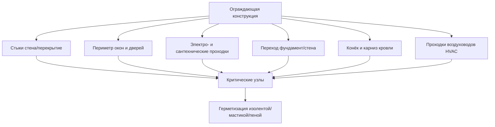

Воздухопроницаемость (air permeability) строительных материалов — характеристика, определяющая объёмный расход воздуха через единицу площади материала при заданном перепаде давления. Это свойство принципиально важно для контроля конвективного переноса влаги, который в типичных конструкциях в 10–100 раз превышает диффузионный перенос водяного пара.

## Физические определения

### Коэффициент воздухопроницаемости k_a

Коэффициент воздухопроницаемости k_a [м²/(Па·с)] — интенсивное свойство материала, не зависящее от толщины:


k_a = \frac{Q \cdot d}{A \cdot \Delta P} \quad \left[\frac{\text{м}^2}{\text{Па} \cdot \text{с}}\right]


где Q — объёмный расход воздуха [м³/с], d — толщина материала [м], A — площадь [м²], ΔP — перепад давления [Па].

### Воздухопропускание L_a

Воздухопропускание (air permeance) L_a [м³/(м²·с·Па)] — характеристика конкретного образца заданной толщины d:


L_a = \frac{k_a}{d} = \frac{Q}{A \cdot \Delta P} \quad \left[\frac{\text{м}^3}{\text{м}^2 \cdot \text{с} \cdot \text{Па}}\right]


Удобная единица в международной практике: л/(с·м²) при 75 Па. Критерий воздушного барьера по ASHRAE 90.1: L_a ≤ 0,02 л/(с·м²) при 75 Па.

### Зависимость расхода от давления

Реальный поток воздуха через строительные материалы подчиняется степенному закону:


Q = C \cdot \Delta P^n


где C — коэффициент воздухопропускания, n — показатель потока (0,5 для ламинарного, 1,0 для турбулентного потока). Для большинства строительных материалов n = 0,5–0,75 (переходный режим).

## Нормативные критерии

### Трёхуровневая система ASHRAE 90.1


| Объект нормирования | Макс. L_a при 75 Па | Стандарт испытания |
|--------------------|--------------------|--------------------|
| Материал воздушного барьера | 0,02 л/(с·м²) | ASTM E2178 |
| Система воздушного барьера | 0,20 л/(с·м²) | ASTM E2357 |
| Ограждающая конструкция здания | 2,0 л/(с·м²) | ASTM E779 / ISO 9972 |


### EN 12114 — европейский стандарт

EN 12114:2000 «Воздухопроницаемость строительных компонентов и элементов» устанавливает метод испытания при перепаде давления 50, 100, 150 и 200 Па. Результат — зависимость Q/A = f(ΔP). Категории по EN 1026 / EN 12207 для окон: от класса 1 (Q ≤ 50 м³/(ч·м²) при 100 Па) до класса 4 (Q ≤ 3 м³/(ч·м²) при 100 Па).

## Коэффициенты воздухопроницаемости материалов


| Материал | k_a, м²/(Па·с) | Классификация | Метод |
|----------|---------------|--------------|-------|
| Полиэтиленовая плёнка 0,2 мм | < 10⁻¹⁵ | Воздушный барьер | ASTM E2178 |
| Жидкая воздухоизоляция (мембрана) | < 10⁻¹⁵ | Воздушный барьер | ASTM E2178 |
| Монолитный железобетон | 10⁻¹³–10⁻¹² | Воздушный барьер | — |
| ЭППС (XPS) склеенные стыки | 10⁻¹³–10⁻¹² | Воздушный барьер | — |
| ОСП-3 (OSB), несклеенные стыки | 10⁻¹¹–10⁻¹⁰ | Воздушный замедлитель | ASTM E2178 |
| Фанера, несклеенные стыки | 10⁻¹¹–10⁻¹⁰ | Воздушный замедлитель | ASTM E2178 |
| Гипсокартон (ГКЛ) крашеный | 10⁻¹²–10⁻¹¹ | Воздушный замедлитель | — |
| Минеральная вата | 10⁻⁷–10⁻⁶ | Воздухопроницаемый | — |
| Целлюлозный утеплитель | 10⁻⁸–10⁻⁷ | Воздухопроницаемый | — |
| Кладка из пустотного блока | 10⁻⁹–10⁻⁸ | Воздухопроницаемый | — |
| Диффузионная мембрана (ветрозащита) | 10⁻¹³–10⁻¹² | Воздушный барьер | EN 12114 |


Граница воздушного барьера — k_a < 10⁻¹² м²/(Па·с) или L_a < 0,02 л/(с·м²) при 75 Па.

## Конвективный перенос влаги

### Сравнение с диффузионным переносом

Поток влаги с воздухом через щель сечением A_щель и скоростью v [м/с]:


g_{\text{конв}} = \rho_{\text{воздух}} \cdot v \cdot A_{\text{щель}} \cdot \Delta \omega \quad [\text{кг/с}]


где Δω — разность влагосодержаний [кг_воды/кг_возд].

Диффузионный поток через стену площадью A_стена:


g_{\text{диф}} = W_{\text{стена}} \cdot A_{\text{стена}} \cdot \Delta p_v \quad [\text{кг/с}]


### Числовой пример: щель у розетки vs. диффузия

**Условия:** Москва, зима. T_int = 20 °C / ОВ 50 % (p_v = 1169 Па), T_ext = −20 °C / ОВ 80 % (p_v = 82 Па).
- Δp_v = 1087 Па
- Δω = 0,00725 − 0,00063 = 0,00662 кг/кг

**Щель у розетки:** 2 мм × 100 мм = 2 × 10⁻⁴ м². Скорость воздуха при ΔP = 10 Па и n = 0,65:

Q ≈ 1,5 × 10⁻⁴ м³/с (оценочно). g_конв = 1,2 × 1,5 × 10⁻⁴ × 0,00662 ≈ 1,19 × 10⁻⁶ кг/с = **103 г/сут**.

**Диффузия через стену 10 м²** с ПЭ-плёнкой (W = 5 × 10⁻¹³ кг/(м²·с·Па)):

g_диф = 5 × 10⁻¹³ × 10 × 1087 ≈ 5,4 × 10⁻⁹ кг/с = **0,47 г/сут**.

Конвективный перенос через одну щель в 220 раз превышает диффузионный через 10 м² стены. Этот расчёт подтверждает приоритет воздушного барьера над пароретардантом.

## Типовые пути утечки воздуха

Утечка воздуха концентрируется в узлах, а не через тело материала.





## Характеристика воздушной плотности здания

### Испытание нагнетанием воздуха (blower door test)

Стандарт ISO 9972:2015 (аналог ASTM E779) — испытание на воздухопроницаемость всего здания. Создаётся перепад давления 50 Па, измеряется расход воздуха Q_50.

Основные показатели:


n_{50} = \frac{Q_{50}}{V_{\text{здания}}} \quad [\text{ч}^{-1}]



q_{50} = \frac{Q_{50}}{A_{\text{ограждения}}} \quad [\text{м}^3/(\text{ч} \cdot \text{м}^2)]



| Стандарт / Норматив | Показатель | Предельное значение |
|--------------------|-----------|---------------------|
| Пассивный дом (Passivhaus) | n_50 | ≤ 0,6 ч⁻¹ |
| ASHRAE 90.1-2019 | q_50 | ≤ 2,0 л/(с·м²) ≈ 7,2 м³/(ч·м²) |
| EN 13829 / ISO 9972 | q_50 (жилые) | ≤ 3 м³/(ч·м²) (класс A) |
| СП 50.13330.2017 | Δ (кратность воздухообм.) | зависит от типа здания |


## Соотношение воздухопроницаемости и паропроницаемости

Воздухопроницаемость и паропроницаемость — независимые свойства. Комбинации:


| Тип | Воздухо- | Паро- | Пример материала | Применение |
|-----|---------|-------|-----------------|-----------|
| Воздухо- и паробарьер | Непроницаем | Непроницаем | ПЭ-плёнка, алюминиевая фольга | Внутренняя пароизоляция |
| Воздухобарьер / паропропускающий | Непроницаем | Проницаем | Диффузионная мембрана (ветрозащита) | Наружный слой |
| Воздухопроницаемый / паронепроницаемый | Проницаем | Непроницаем | — | Нецелесообразно |
| Оба проницаемы | Проницаем | Проницаем | Минеральная вата, ПСБ-С | Утеплитель |


Оптимальная стратегия для холодного климата: внутренний паробарьер (ПЭ-плёнка) + наружная диффузионная мембрана (воздухобарьер / паропропускающий) + непрерывная герметизация всех стыков.

## Герметизирующие материалы для стыков

ASTM C920 классифицирует строительные герметики (sealants) по способности к деформации: ±12,5 %, ±25 %, ±50 %. Для воздушных барьеров используют:

- **Бутилкаучуковая лента** — для нахлёстов ПЭ-плёнок и мембран; ψ ≤ −30 °C. Адгезия к дереву, бетону, металлу.
- **Акриловая дисперсионная мастика** — для примыканий к каркасу, заполнения щелей у коробок.
- **Полиуретановая монтажная пена** — для проходок труб и кабелей ≤ 50 мм, с последующим уплотнением манжетой.
- **Эластомерный герметик (силикон/полисульфид)** — для движущихся стыков (деформационные швы).

## Методы испытаний

### ASTM E2178 — воздухопропускание материала

Лабораторный метод: образец ≥ 305 × 305 мм герметично закрепляют в испытательной камере. Поддерживают перепад давления 75 Па, измеряют объёмный расход воздуха. Условия: T = (21 ± 3) °C, ОВ = (50 ± 10) %. Критерий воздушного барьера: L_a ≤ 0,02 л/(с·м²).

### ASTM E2357 — воздухопропускание системы барьера

Испытание собранного фрагмента стены с реальными узлами, стыками и проходками. Критерий: L_a ≤ 0,20 л/(с·м²) при 75 Па.

### ISO 9972 / ASTM E779 — воздухопроницаемость здания

Нагнетание/разрежение (blower door). Измерения при 5 ступенях давления (10–70 Па), обработка методом наименьших квадратов. Результат: n_50 [ч⁻¹] или q_50 [м³/(ч·м²)].

## Практические рекомендации

Непрерывность воздушного барьера важнее материальных характеристик. Единичный дефект (щель, незаделанная розетка) локально повышает воздухопропускание в тысячи раз относительно цельного материала.

Алгоритм проектирования воздушного барьера:

1. Выбрать плоскость барьера (внутренняя ПЭ-плёнка или наружная мембрана).
2. Определить все проходки и стыки на чертежах.
3. Специфицировать герметизирующие материалы для каждого узла.
4. Предусмотреть инспекцию перед закрытием (фотофиксация).
5. Провести blower door тест в конце монтажа ограждения.

## Литература и нормативные документы

- ASHRAE Handbook — Fundamentals 2021, Chapter 26: Heat, Air, and Moisture Control
- ASHRAE Standard 90.1-2019: Energy Standard for Buildings — Air Barrier Requirements
- ASTM E2178: Standard Test Method for Air Permeance of Building Materials
- ASTM E2357: Standard Test Method for Determining Air Leakage of Air Barrier Assemblies
- ASTM E779: Standard Test Method for Determining Air Leakage Rate by Fan Pressurization
- ISO 9972:2015: Thermal performance of buildings — Determination of air permeability of buildings — Fan pressurization method
- EN 12114:2000: Thermal performance of buildings — Air permeability of building components and building elements
- СП 50.13330.2017 — Тепловая защита зданий (приложение по воздухопроницаемости)
- СП 60.13330.2020 — Отопление, вентиляция и кондиционирование воздуха
