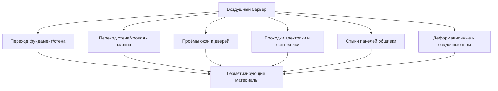

Воздухопроницаемые материалы (air-permeable materials) пропускают воздух под действием перепада давления через взаимосвязанные поры, волокнистые матрицы или щели. Понимание их характеристик критично для проектирования систем воздушного барьера: воздухопроницаемый материал не может выполнять функцию барьера самостоятельно и требует интеграции с воздухонепроницаемым слоем.

Принципиальное отличие от паропроницаемости: воздухопроницаемость описывает объёмный поток газа, а не молекулярную диффузию. Транспорт влаги с потоком воздуха в 50–100 раз превышает диффузионный — при тех же перепадах давления.

## Физика потока воздуха через пористые среды

### Закон Дарси

Для ламинарного течения через пористую среду при малых числах Рейнольдса (Re < 10):


Q = \frac{k_a \cdot A \cdot \Delta P}{\mu \cdot d} \quad [\text{м}^3/\text{с}]


где k_a — внутренняя проницаемость материала [м²], A — площадь сечения [м²], ΔP — перепад давления [Па], μ — динамическая вязкость воздуха = 1,81 × 10⁻⁵ Па·с (при 20 °C), d — толщина в направлении потока [м].

### Уравнение Форхгеймера (переходный режим)

При Re > 10 нелинейные инерционные эффекты существенны:


\frac{\Delta P}{d} = \frac{\mu}{k_a} \cdot v + \beta \cdot \rho \cdot v^2


где v — скорость поверхностного фильтрационного потока [м/с], β — коэффициент Форхгеймера [1/м], ρ — плотность воздуха [кг/м³].

Для большинства строительных материалов применяется степенная модель с n = 0,6–0,7:


Q/A = C \cdot (\Delta P)^n


### Число Рейнольдса для пористой среды


\text{Re}_p = \frac{\rho \cdot v \cdot d_p}{\mu}


где d_p — характерный диаметр поры [м].

## Воздухопроницаемость волокнистых утеплителей

### Минеральная вата и стекловата

Волокнистые утеплители (минеральная вата, MW; стекловата, GW) — наиболее воздухопроницаемые строительные материалы. Их k_a определяется плотностью, диаметром волокна и ориентацией.


| Материал | Плотность, кг/м³ | k_a, м²/(Па·с) | L_a при 75 Па, л/(с·м²) |
|----------|-----------------|----------------|------------------------|
| Стекловата (MW) рулонная | 10–15 | 10⁻⁷–10⁻⁶ | 200–500 |
| Стекловата повышенной пл. | 30–50 | 10⁻⁸–10⁻⁷ | 50–150 |
| Каменная вата (MW) | 40–80 | 5×10⁻⁹–5×10⁻⁸ | 30–120 |
| Каменная вата фасадная | 80–150 | 10⁻⁹–10⁻⁸ | 5–50 |
| Целлюлозный утеплитель (насыпной) | 35–55 | 3×10⁻⁹–3×10⁻⁸ | 20–80 |
| Целлюлоза (плотная укладка) | 55–70 | 10⁻⁹–10⁻⁸ | 10–40 |


Ни один из этих материалов не достигает критерия воздушного барьера (L_a ≤ 0,02 л/(с·м²)). Они требуют сплошного воздухонепроницаемого слоя в составе конструкции.

**Ветровые потери (wind washing):** при движении воздуха через волокнистый утеплитель конвекция разрушает слой неподвижного воздуха в порах. R-значение снижается на 20–40 % при скорости фильтрационного потока v ≥ 0,01 м/с.

### Ячеистые и пористые твёрдые материалы


| Материал | k_a, м²/(Па·с) | L_a при 75 Па, л/(с·м²) | Примечание |
|----------|----------------|------------------------|-----------|
| Газобетон D400, 300 мм | 10⁻⁸–10⁻⁷ | 100–400 | Без штукатурки |
| Газобетон D400 + штукатурка 2 стороны | 10⁻¹²–10⁻¹¹ | < 0,05 | Может быть барьером |
| Кирпич керамический полнотелый | 5×10⁻⁹–5×10⁻⁸ | 5–25 | Без заделки швов |
| Кирпич + цементно-песч. штукатурка | 10⁻¹²–10⁻¹¹ | < 0,05 | Замедлитель |
| Пустотелый бетонный блок | 5×10⁻⁸–2×10⁻⁷ | 50–200 | Без заполнения |
| ОСП-3, несклеенные стыки | 10⁻¹¹–10⁻¹⁰ | 10–60 | Воздушный замедлитель |
| ОСП-3, стыки заклеены | 10⁻¹³–10⁻¹² | < 0,02 | Барьер (граничный) |


## Влияние на конвективный влагоперенос

### Сравнение конвективного и диффузионного потоков

Поток влаги с утечкой воздуха через щель сечением A_щель при скорости v:


\dot{m}_{\text{конв}} = \rho_{\text{возд}} \cdot Q \cdot \Delta\omega \quad [\text{кг/с}]


Диффузионный поток через стену площадью A_стена с ПЭ-плёнкой (W = 5 × 10⁻¹³ кг/(м²·с·Па)):


\dot{m}_{\text{диф}} = W \cdot A_{\text{стена}} \cdot \Delta p_v \quad [\text{кг/с}]


### Числовой пример: сравнение потоков влаги

**Условия:** Новосибирск, зима. T_int = 20 °C / ОВ 45 % (ω_int = 0,00672 кг/кг), T_ext = −20 °C / ОВ 80 % (ω_ext = 0,00063 кг/кг). Δω = 0,00609 кг/кг. Δp_v = 952 Па.

**Конвективный перенос через щель** 2 мм × 200 мм = 4 × 10⁻⁴ м² при ΔP = 5 Па (тепловой напор):


v \approx \sqrt{\frac{2 \cdot \Delta P}{\rho}} = \sqrt{\frac{2 \times 5}{1{,}2}} \approx 2{,}9 \text{ м/с}



Q = C_d \cdot A_{\text{щель}} \cdot v = 0{,}6 \times 4 \times 10^{-4} \times 2{,}9 \approx 7 \times 10^{-4} \text{ м}^3/\text{с}



\dot{m}_{\text{конв}} = 1{,}2 \times 7 \times 10^{-4} \times 0{,}00609 \approx 5{,}1 \times 10^{-6} \text{ кг/с} = 441 \text{ г/сут}


**Диффузионный перенос через стену 15 м²** с ПЭ-плёнкой (W = 5 × 10⁻¹³ кг/(м²·с·Па)):


\dot{m}_{\text{диф}} = 5 \times 10^{-13} \times 15 \times 952 \approx 7{,}1 \times 10^{-9} \text{ кг/с} = 0{,}61 \text{ г/сут}


**Вывод:** конвективный перенос через одну щель (4 × 10⁻⁴ м²) в 720 раз превышает диффузионный поток через 15 м² стены с пароизоляцией. Это подтверждает приоритет воздушного барьера.

## Влияние воздухопроницаемости на тепловые потери

### Снижение R-значения волокнистого утеплителя

При движении воздуха через волокнистый утеплитель эффективное R-значение снижается:


R_{\text{эфф}} = R_{\text{номин}} \cdot (1 - f_{\text{air}})


где f_air = 0,20–0,40 в зависимости от скорости воздуха и типа материала.

Для минеральной ваты в ненасыщенном каркасе без внешнего воздушного барьера при v = 0,02 м/с (умеренный ветер, ΔP ~ 5 Па): снижение R на 15–25 %.

### Дополнительные потери тепла на инфильтрацию

Годовые потери тепла на нагрев инфильтрационного воздуха:


Q_{\text{инф}} = 0{,}33 \cdot n_{\text{nat}} \cdot V \cdot \text{ГСОП} \cdot 24 \quad [\text{кВт·ч/год}]


где n_nat — кратность воздухообмена при естественных условиях [ч⁻¹], V — объём здания [м³], ГСОП — градусо-сутки отопительного периода [°С·сут], 0,33 — объёмная теплоёмкость воздуха [Вт·ч/(м³·°С)].

Для здания 300 м³, n_nat = 0,5 ч⁻¹, ГСОП = 4800 °С·сут (Москва):


Q_{\text{инф}} = 0{,}33 \times 0{,}5 \times 300 \times 4800 \times 24 = 57{\ }024 \text{ кВт·ч/год}


Это более 50 % от типичного годового потребления тепла на отопление для такого здания.

## Стратегии интеграции воздухопроницаемых материалов с воздушным барьером

### Правила размещения воздушного барьера

Воздушный барьер может располагаться в любом месте по толщине конструкции, но его позиция влияет на гигротермическое поведение:

**Снаружи от утеплителя (предпочтительно в холодном климате):**
- Утеплитель сохраняется тёплым → снижается риск конденсации в порах.
- Пример: ЭППС-плиты с заклеенными стыками снаружи каркаса.
- Риск: барьер должен быть паропроницаемым (диффузионная мембрана), иначе блокируется летнее высыхание.

**Изнутри от утеплителя (традиционный подход в холодном климате):**
- ПЭ-плёнка на тёплой стороне: совмещает воздушный барьер и пароретардант.
- Требует особого внимания к проходкам (электрика, вентиляция).

**В середине конструкции (специальные случаи):**
- Актуально для двойных каркасных стен и конструкций с раздельной изоляцией.
- Требует численного гигротермического анализа.

### Требования к непрерывности





Щель 1 мм² при ΔP = 10 Па пропускает Q ≈ 0,6 × 10⁻⁶ × √(2 × 10 / 1,2) ≈ 0,9 × 10⁻⁶ м³/с = 3,2 л/ч. Суммирование всех щелей в типовом доме даёт n_50 > 5 ч⁻¹, что в 8 раз выше норматива Passivhaus.

## Практические рекомендации по монтажу

### Волокнистые утеплители

1. Полное заполнение полостей без пустот: доля незаполненного сечения 2 % снижает R на 25 %.
2. Обжатие изнутри ≤ 10 % от номинальной толщины.
3. Разрезка вокруг проводки и труб без сжатия основного слоя.
4. Установка воздушного барьера до монтажа утеплителя.
5. Предотвращение ветрового омывания: внешняя ветрозащитная мембрана с L_a < 0,05 л/(с·м²).

### Кладочные стены

1. Полное заполнение растворных швов без пустот.
2. Нанесение сплошной штукатурки на внутреннюю поверхность (цементно-песчаная, 15 мм).
3. Герметизация всех проходок через кладку.
4. При необходимости — жидкая воздухозащитная мембрана по штукатурке.

### Контроль качества

- Тепловизионная съёмка при нагнетании (50 Па) для выявления зон утечки.
- Blower door тест на стадии черновой отделки и после завершения.
- Целевые значения: n_50 < 3 ч⁻¹ для нового жилого строительства (типовые требования).

## Режимы деградации


| Механизм | Затронутые материалы | Результат |
|----------|---------------------|----------|
| Усадка и оседание | Целлюлоза насыпная | +10–30 % воздухопропускания |
| Намокание | Минеральная вата, целлюлоза | Потеря R до 50 %, риск плесени |
| Ветровое уплотнение | Все волокнистые | Изменение k_a с ростом плотности |
| Трещинообразование кладки | Газобетон, кирпич | Резкий рост L_a в зоне трещин |
| Биодеградация | Целлюлоза без антисептика | Потеря прочности, рост k_a |


## Нормативная база

- ASHRAE Handbook — Fundamentals 2021, Chapter 26: Heat, Air, and Moisture Control in Building Assemblies
- ASHRAE Standard 90.1-2019: Energy Standard for Buildings — Air Barrier Requirements
- ASTM C522: Standard Test Method for Airflow Resistance of Acoustical Materials
- ISO 9972:2015: Thermal performance of buildings — Fan pressurization method
- EN 12114:2000: Thermal performance of buildings — Air permeability of building components
- ГОСТ 31924-2011: Изделия из минеральной ваты. Технические условия
- СП 50.13330.2017: Тепловая защита зданий
