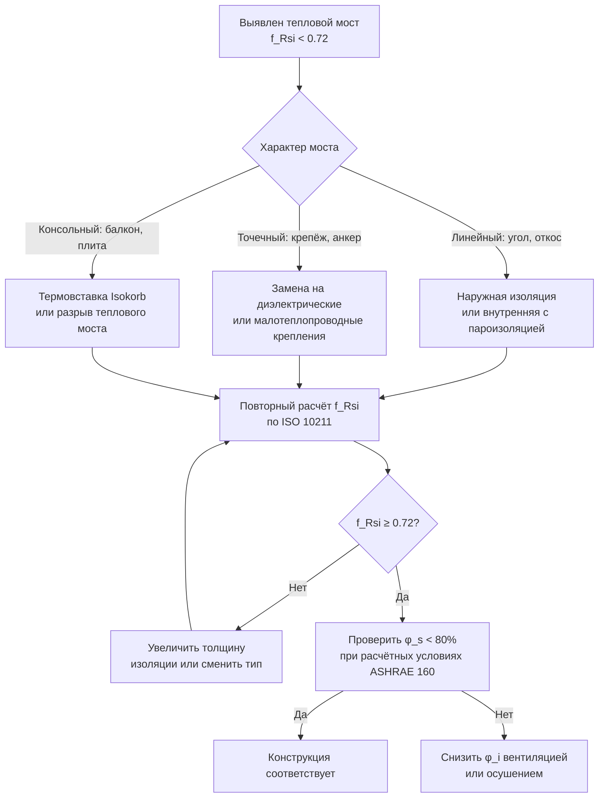

Температура модулирует кинетику роста плесени, но не является абсолютным ограничивающим фактором в диапазоне, типичном для зданий. В отличие от активности воды, которая при снижении ниже видового минимума полностью останавливает рост, температура лишь ускоряет или замедляет биологические процессы. Это разграничение определяет приоритеты инженерных решений: влажностный контроль — первичный, температурный — вторичный.

## Температурные категории видов плесени

Плесени классифицируют по температурным предпочтениям на три группы:


| Категория | $T_{\min}$, °C | $T_{\text{opt}}$, °C | $T_{\max}$, °C | Типичные места в зданиях |
|---|---|---|---|---|
| Психрофильные (psychrophilic) | −5 до 5 | 12–18 | 20–25 | Холодные склады, зоны конденсации зимой |
| Мезофильные (mesophilic) | 5–15 | 25–30 | 35–47 | Большинство жилых и офисных помещений |
| Термофильные (thermophilic) | 20–30 | 40–55 | 50–62 | Камеры АВС-установок, плохо вентилируемые чердаки |


Большинство строительных патогенов — мезофилы. Их оптимальный диапазон роста (25–30 °C) перекрывается с комфортными условиями для человека, что делает влажностный контроль главным инструментом защиты от плесени в отапливаемых зданиях.

## Видоспецифичные температурные характеристики

### Минимальные температуры роста


| Вид | $T_{\min}$, °C | $T_{\text{opt}}$, °C | $T_{\max}$, °C | Место риска в здании |
|---|---|---|---|---|
| *Cladosporium herbarum* | 0–2 | 18–22 | 32–35 | Наружные поверхности, зоны конденсации зимой |
| *Penicillium expansum* | 2–4 | 20–25 | 35 | Охлаждаемые склады, подвалы |
| *Stachybotrys chartarum* | 2–5 | 25–30 | 37–40 | Холодные влажные конструкции |
| *Alternaria alternata* | 3–5 | 24–28 | 35 | Конденсация на откосах окон |
| *Aspergillus versicolor* | 4–8 | 23–27 | 40 | Прохладные подвалы, скрытые полости |
| *Penicillium chrysogenum* | 5 | 23–26 | 37–40 | Все жилые помещения |
| *Aspergillus niger* | 10 | 30–35 | 45–47 | Тёплые помещения, чердаки летом |
| *Aspergillus fumigatus* | 12 | 40–45 | 52–55 | Механические помещения, компостирование |


При температурах, приближающихся к $T_{\min}$, время прорастания резко возрастает. Вид, прорастающий за 8 ч при 25 °C, при 5 °C может требовать 72–96 ч — это снижает риск, но не устраняет его при длительном воздействии.

### Температурно-зависимая скорость роста

Зависимость скорости роста мицелия от температуры в VTT-модели (Hukka & Viitanen, 1999) описывается через квадратичную аппроксимацию, близкую к модели Ратковского (Ratkowsky). Нормированные скорости роста (единица = оптимум):


| Температура, °C | *A. niger* | *P. chrysogenum* | *Cladosporium* spp. |
|---|---|---|---|
| 5 | 0,05 | 0,10 | 0,30 |
| 10 | 0,12 | 0,25 | 0,60 |
| 15 | 0,30 | 0,50 | 0,85 |
| 20 | 0,60 | 0,75 | 0,95 |
| 25 | 0,90 | 1,00 | 1,00 |
| 30 | 1,00 | 0,90 | 0,80 |
| 35 | 0,75 | 0,40 | 0,15 |
| 40 | 0,30 | 0,05 | 0 |


Снижение температуры на 5 °C (например, с 25 до 20 °C) продлевает время видимой колонизации примерно вдвое — с 7 до 14 сут при прочих равных. Это даёт практический запас для обнаружения и устранения проблемы.

**Q10-коэффициент** (удвоение скорости на каждые 10 °C) для большинства строительных патогенов равен 1,5–3,0 в диапазоне 5–30 °C.

## Температура прорастания спор

Прорастание требует несколько более высокого температурного минимума и более узкого оптимума, чем последующий вегетативный рост:


| Вид | $T_{\min}$ прорастания, °C | $T_{\text{opt}}$ прорастания, °C | Время прорастания при оптимуме, ч |
|---|---|---|---|
| *Aspergillus niger* | 10 | 30–35 | 6–8 |
| *Penicillium chrysogenum* | 5 | 25–28 | 8–12 |
| *Stachybotrys chartarum* | 8 | 25–30 | 12–18 |
| *Cladosporium herbarum* | 2 | 20–25 | 10–14 |
| *Alternaria alternata* | 5 | 24–28 | 8–12 |


Краткосрочное воздействие субоптимальных температур в фазе прорастания может задержать инфицирование даже при достаточной влажности. Это основа стратегии весеннего проветривания: снижение $T_i$ при низкой $\varphi_i$ исключает одновременное соблюдение влажностного и температурного критериев.

## Взаимодействие температуры и влажности

Температура и относительная влажность взаимодействуют через активность воды на поверхности материала. При постоянной абсолютной влажности $x$ (г/кг) поверхностная ОВ вычисляется как:


\varphi_s = \frac{x \cdot p_{atm}}{(0{,}622 + x) \cdot p_s(T_{surf})} \times 100\,\%


С ростом $T_{surf}$ при постоянном $x$ давление $p_s$ увеличивается и $\varphi_s$ снижается. Это означает, что нагрев поверхности снижает поверхностную ОВ — основной механизм защиты, реализуемый через теплоизоляцию тепловых мостов.

**Практический вывод:** 30 °C при 50 % ОВ безопаснее, чем 20 °C при 70 % ОВ — хотя точка росы одинакова, при более высокой температуре поверхность остаётся дальше от насыщения.

## Сезонные риски в ограждающих конструкциях

### Зимний период

Низкие наружные температуры формируют зоны конденсации на тепловых мостах, оконных рамах, примыканиях балконных плит. Поверхностные температуры 0–10 °C благоприятствуют психрофильным видам (*Cladosporium*, *Penicillium expansum*). Хотя скорость роста снижена, непрерывный источник влаги компенсирует замедленную кинетику: при $T_{surf} = 5\ °C$ и $\varphi_s = 90\%$ видимая колонизация *Cladosporium* развивается за 21–30 сут.

Внутренние поверхности в зоне тепловых мостов могут быть на 5–15 °C холоднее воздуха в помещении — именно здесь формируется $\varphi_s > 80\%$ при объёмной ОВ 50–60 %.

### Летний период

Высокие температуры ускоряют кинетику роста при наличии влаги. Во влажном климате недостаточное осушение создаёт $a_w \geq 0{,}80$ при 25–30 °C — оптимум для большинства мезофильных патогенов. Чердачные пространства могут нагреваться до 50–65 °C, что выходит за предел $T_{\max}$ большинства видов, однако в переходный час утром/вечером условия ненадолго попадают в оптимальный диапазон и при наличии влаги инициируют прорастание.

### Переходные сезоны

Весна и осень создают суточные циклы конденсации: ночное охлаждение поверхностей до точки росы, дневное испарение. При этом температура поверхности попадает в оптимальный диапазон 15–25 °C одновременно с повышенной $\varphi_s$. Переходные сезоны часто дают наиболее интенсивный рост плесени.

## Числовой пример. Влияние теплового моста на кинетику роста

**Условие.** Металлический Z-профиль перекрывает утеплитель в стене типа «навесной фасад». Температурный фактор узла $f_{Rsi} = 0{,}60$. Внутренний воздух: $T_i = 20\ °C$, $\varphi_i = 55\%$, $T_{dp,i} = 10{,}5\ °C$. Наружная температура: $T_e = -15\ °C$.

**Шаг 1. Температура поверхности в зоне теплового моста:**


T_{surf} = T_i - f_{Rsi} \cdot (T_i - T_e) \cdot \frac{R_{si}}{R_{total}}


Для $f_{Rsi} = 0{,}60$ и при использовании определения ISO 13788: $T_{surf} = T_i + f_{Rsi} \cdot (T_e - T_i) = 20 + 0{,}60 \cdot (-15 - 20) = 20 - 21 = -1\ °C$.

Поверхность находится ниже 0 °C — конденсация и возможное обледенение. При пересчёте с $T_e = -5\ °C$ (среднеяварский минимум для Москвы): $T_{surf} = 20 + 0{,}60 \cdot (-5 - 20) = 5\ °C$.

**Шаг 2. Поверхностная ОВ при $T_{surf} = 5\ °C$:**


\varphi_s = \frac{p_s(T_{dp,i})}{p_s(T_{surf})} = \frac{p_s(10{,}5)}{p_s(5{,}0)} = \frac{1\,272}{872} \approx 146\,\%


Поверхность находится в режиме конденсации ($\varphi_s > 100\%$). При температуре $T_{surf} = 5\ °C$ активны психрофильные виды (*Cladosporium*, *Penicillium expansum*).

**Шаг 3. Оценка по VTT-модели.** Для *Cladosporium herbarum* при $T = 5\ °C$ и $\varphi_s = 95\%$ (после частичного испарения конденсата): скорость нарастания Mold Index $\approx 0{,}03$–$0{,}05$ ед/сут. За декабрь–февраль (90 сут) MI достигнет значения 2,7–4,5 (видимый рост — колонизация). Требуется устранение теплового моста до $f_{Rsi} \geq 0{,}72$ (норматив ISO 13788 §6 для предотвращения поверхностной конденсации).

## Рекомендации для проектирования HVAC

**Стабилизация температуры.** Поддерживать $T_i = 20$–24 °C круглогодично без ночного сброса ниже 18 °C во влажном климате. Ночной сброс увеличивает перепад температур через ограждение и усиливает конденсацию на тепловых мостах.

**Управление температурой поверхности.** Проектный критерий: температура всех внутренних поверхностей ограждения не ниже $T_{dp} + 3\ °C$ при расчётных условиях ($f_{Rsi} \geq 0{,}72$ по ISO 13788). Достигается непрерывной теплоизоляцией, устранением консольных элементов, воздухонепроницаемостью.

**Размер оборудования.** Переосушённые системы создают чрезмерное охлаждение испарителей, вызывая локальную конденсацию во внутреннем блоке. Правильный подбор по ASHRAE Handbook — Fundamentals исключает короткие циклы и недоосушение при частичной нагрузке.

**Термографический контроль.** При вводе в эксплуатацию провести тепловизионное обследование при перепаде температур не менее 10 °C для выявления тепловых мостов и зон риска. Тепловизионный контроль регламентирован ГОСТ Р 54852 и EN 13187.

## Температурный коэффициент минимальной поверхности: нормативный подход

ISO 13788 §6 вводит безразмерный температурный фактор $f_{Rsi}$ для оценки риска поверхностной конденсации:


f_{Rsi} = \frac{T_{surf} - T_e}{T_i - T_e}


Минимально допустимое значение для предотвращения поверхностной конденсации:


f_{Rsi,\min} = \frac{T_{dp} - T_e}{T_i - T_e}


Для предотвращения роста плесени (при $\varphi_{crit} = 80\%$ вместо 100 % конденсации) используется модифицированная «температура плесени» $T_{mould}$ — температура, при которой $p_s(T_{mould}) / p_s(T_i) = \varphi_{crit} / \varphi_i$:


T_{mould} = \frac{237{,}3 \cdot \ln(p_m/610{,}5)}{17{,}269 - \ln(p_m/610{,}5)}, \quad p_m = \frac{\varphi_{crit}}{100} \cdot \frac{p_s(T_i)}{\varphi_i/100}


Для $T_i = 20\ °C$, $\varphi_i = 55\%$, $\varphi_{crit} = 80\%$:

$p_m = 0{,}80 \times (p_s(20)/0{,}55) = 0{,}80 \times (2487/0{,}55) = 3616\ \text{Па}$ — превышает $p_s(20) = 2487$ Па. Это означает, что критерий плесени (80 % поверхностной ОВ) при данных условиях внутреннего воздуха более жёсткий, чем риск конденсации, — температура поверхности должна быть выше точки росы. При $\varphi_i = 55\%$ точка росы $T_{dp} = 10{,}5\ °C$, а для $\varphi_{s,crit} = 80\%$:


T_{surf,mould} = \frac{p_s^{-1}(0{,}80 \times p_s(T_i))} = p_s^{-1}(0{,}80 \times 2487) = p_s^{-1}(1989\ \text{Па}) \approx 17{,}5\ °C


Требование: $T_{surf} \geq 17{,}5\ °C$ при внутренних условиях 20 °C / 55 % для поддержания $\varphi_s \leq 80\%$.


| $T_i$, °C | $\varphi_i$, % | $T_{surf,mould}$, °C | $f_{Rsi,mould}$ | $f_{Rsi}$ по ISO 13788 |
|---|---|---|---|---|
| 20 | 50 | 16,2 | 0,90 | 0,73 |
| 20 | 55 | 17,5 | 0,92 | 0,76 |
| 20 | 60 | 18,6 | 0,95 | 0,79 |
| 21 | 50 | 17,2 | 0,90 | 0,74 |
| 22 | 50 | 18,1 | 0,90 | 0,76 |


Из таблицы видно, что критерий «80 % поверхностной ОВ для плесени» систематически жёстче, чем критерий конденсации ISO 13788. Нормативный $f_{Rsi} = 0{,}72$ достаточен для предотвращения конденсации, но недостаточен для исключения роста *Aspergillus versicolor* при ОВ воздуха выше 55 %.

## Управление температурным режимом в типичных узлах

### Балконная плита (консольный элемент)

Наиболее распространённый тепловой мост в многоэтажных зданиях. Без термоизоляционного вставки $f_{Rsi}$ в зоне примыкания плиты к стене составляет 0,50–0,60. Применение специализированных термовставок (Schöck Isokorb, аналоги) повышает $f_{Rsi}$ до 0,72–0,80 при сохранении несущей способности.

### Окно (примыкание рамы к стене)

Температурный мост в зоне откоса окна — типичная зона роста *Aspergillus* в жилых зданиях. Тепловизионная практика показывает $T_{surf} = 8$–12 °C в этой зоне при $T_e = -15\ °C$ и $T_i = 20\ °C$, что соответствует $\varphi_s = 82$–95 % при $\varphi_i = 55\%$. Решение: наружная четверть откоса + увеличение глубины оконной коробки + монтажная пена с пароизоляционной обклейкой.

### Перекрытие над холодным подвалом

Снизу перекрытие контактирует с воздухом подвала ($T_{podv}$ зимой 2–8 °C). Температура нижней поверхности перекрытия при $T_i = 20\ °C$ и $\varphi_i = 55\%$:


T_{slab,bot} = T_i - \frac{R_{si}}{R_{total}} \cdot (T_i - T_{podv})


При $T_{podv} = 5\ °C$ и $R_{total} = 0{,}25\ \text{м}^2\text{К/Вт}$ (бетонная плита без утеплителя): $T_{slab,bot} = 20 - (0{,}13/0{,}25) \times 15 = 12{,}2\ °C$. Поверхностная ОВ: $\varphi_s = p_s(10{,}5)/p_s(12{,}2) \times 100 = 1272/1415 \times 100 = 89{,}9\%$ — высокий риск. Требуется утеплитель снизу перекрытия (не менее 60 мм PIR) или активная вентиляция подвала.

## Суммарная схема управления температурным риском плесени





Схема наглядно показывает приоритеты: конструктивное устранение теплового моста — первичная мера; снижение $\varphi_i$ через системы HVAC — вторичная компенсирующая мера при невозможности полного устранения моста. Одновременное применение обоих инструментов обеспечивает наибольший запас безопасности.
