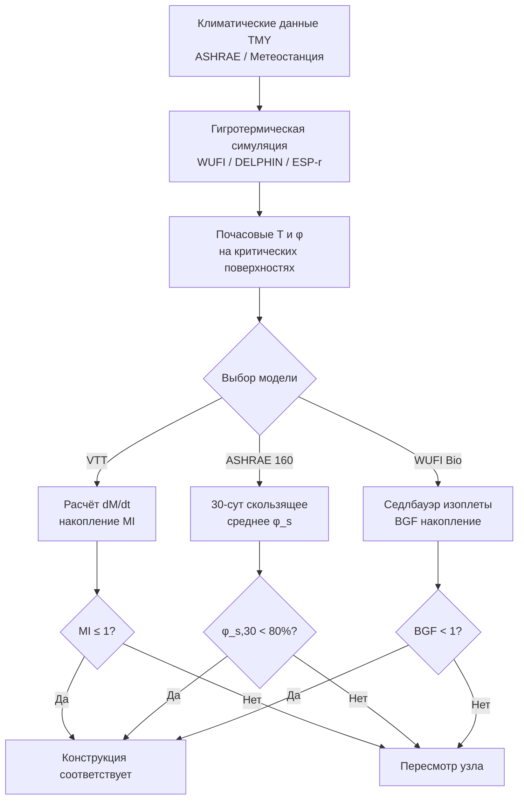

Математические модели роста плесени преобразуют результаты гигротермического анализа в количественные показатели биологического риска. Это позволяет инженеру сравнивать проектные решения до строительства, устанавливать пороговые значения для систем контроля влажности и демонстрировать соответствие нормативным требованиям.

## Обзор основных моделей

Существующие инженерные модели можно разделить на три класса по подходу к описанию биологического процесса:


| Модель | Основа | Выходной параметр | Типичное ПО |
|---|---|---|---|
| VTT (Hukka & Viitanen, 1999) | Эмпирическая, хвойная древесина | Mold Index 0–6 | WUFI, расчёты вручную |
| Седлбауэр (Sedlbauer, 2001) | Изоплеты + биологические кривые | Время до прорастания, ч | WUFI Bio |
| ASHRAE 160 | 30-суточное скользящее среднее | Соответствие/несоответствие | Любой гигротермический решатель |
| ESP-r Mold | Детерминированная, видоспецифичная | Потенциал прорастания, ч | ESP-r |
| ISO 13788 | Метод Глазера (упрощённый) | Конденсат г/м² | Ручной расчёт |


Метод ISO 13788 (метод Глазера) рассматривает только диффузионный перенос пара в стационарном режиме и не пригоден для прогнозирования роста плесени — он лишь оценивает риск конденсации. Для биологической оценки необходимы динамические модели.

## VTT-модель: структура и уравнения

VTT-модель (Технологический исследовательский центр Финляндии, разработана Hukka & Viitanen) — наиболее широко валидированный эмпирический инструмент для оценки риска плесени на строительных материалах. Модель рассчитывает безразмерный Индекс плесени (Mold Index, MI) от 0 до 6.

### Уравнение роста MI

При условиях выше критического порога ($\varphi_s > \varphi_{crit}(T)$, $T > 0\ °C$):


\frac{dM}{dt} = \frac{1}{7 \cdot \exp\!\bigl(-0{,}68\ln T - 13{,}9\ln\varphi + 0{,}14W - 0{,}33\,SQ + 66{,}02\bigr)}


где:
- $T$ — температура поверхности, °C;
- $\varphi$ — относительная влажность поверхности, %;
- $W$ — коэффициент субстрата: 0 для класса SEN1 (очень чувствительный), 1 для SEN2, 2 для RES1 (умеренно стойкий);
- $SQ$ — поверхностное качество: 0 для свежеспиленной/необработанной поверхности, 1 для строганой.

### Уравнение спада MI

При сухих условиях ($\varphi_s < \varphi_{crit}$):


\frac{dM}{dt} = \begin{cases} -0{,}032 & \text{при } M > 1 \\ 0 & \text{при } M \leq 1 \end{cases}


Спад происходит медленнее роста (гистерезис). Полного обратного развития до MI = 0 не происходит — жизнеспособные споры сохраняются даже при длительном высыхании.

### Критическая ОВ поверхности

Порог $\varphi_{crit}(T)$ для каждого класса материала по VTT (при $T = 5$–50 °C):


\varphi_{crit} = -0{,}00267\,T^2 + 0{,}160\,T + 100 - k_{SEN}


где $k_{SEN}$ = 0 для класса SEN1, 5 для SEN2, 10 для RES1 (ориентировочные значения; Viitanen, 2007).

### Классы чувствительности материалов по VTT


| Класс VTT | Критическая ОВ, % (20 °C) | Примеры материалов | Коэффициент W |
|---|---|---|---|
| SEN1 (очень чувствительный) | 80 | Заболонь сосны, необработанная поверхность | 0 |
| SEN2 (чувствительный) | 85 | Строганая хвойная древесина, ОСП | 1 |
| RES1 (умеренно стойкий) | 85–90 | Бетон с добавками, гипсовые плиты | 2 |
| RES2 (стойкий) | 95 | Кирпич, стекло, металл | не применяется |


### Шкала Индекса плесени


| MI | Визуальная характеристика | Инженерная интерпретация |
|---|---|---|
| 0 | Нет роста | Приемлемые условия |
| 1 | Начало прорастания (только под микроскопом) | Пороговый риск, критическое окно вмешательства |
| 2 | Редкий рост, < 10 % поверхности (микроскоп) | Раннее обнаружение инструментальными методами |
| 3 | Видимый рост, < 10 % поверхности | Начало видимых повреждений |
| 4 | Покрытие 10–50 % поверхности | Явная деградация субстрата |
| 5 | Покрытие 50–100 % поверхности | Обширное повреждение |
| 6 | Обильный тяжёлый рост | Полная колонизация субстрата |


Проектный критерий ASHRAE 160 допускает MI ≤ 1 на критических поверхностях в течение расчётного года.

## Системы изоплет Седлбауэра

Биогигротермические изоплеты (Sedlbauer, 2001; WUFI Bio) описывают условия начала роста плесени в координатах температура — ОВ поверхности. Система изоплет разработана на основе нижних предельных кривых (Lower Isopleth for Mold, LIM) для нескольких биологических групп.

**Нижняя изоплета прорастания (LIM 0).** Граничная кривая условий, ниже которых прорастание невозможно при любой продолжительности воздействия. Уравнение аппроксимации для температурного диапазона 5–30 °C:


\varphi_{LIM}(T) = a_0 - a_1 \cdot T + a_2 \cdot T^2


Коэффициенты зависят от биологической группы субстрата (Substrate Class I–IV по Седлбауэру). Например, для класса I (питательные субстраты: хлеб, картон): $\varphi_{LIM} \approx 0{,}81 - 0{,}0006\,T$ при $T = 5$–25 °C.

**Применение изоплет в WUFI Bio.** Программа сравнивает почасовые результаты гигротермического расчёта с LIM-кривыми и накапливает биологическое время роста (Biological Growth Factor). При превышении LIM 0 начисляется время, при нахождении ниже — возможна инактивация, параметризованная экспериментально.

**Преимущества системы изоплет** перед VTT-моделью: применимость к широкому спектру субстратов, включая пищевые и нестроительные материалы; наглядность при графическом анализе проектных условий.

## Стандарт ASHRAE 160: метод 30-суточного среднего

ASHRAE 160 «Criteria for Moisture-Control Design Analysis in Buildings» — нормативный документ для гигротермического проектирования в США и всё шире используемый в международной практике.

**Критерий соответствия.** 30-суточное скользящее среднее поверхностной ОВ должно быть менее 80 % при $T_{surf} \geq 5\ °C$.

**Требования к моделированию:**
- минимум 3 года почасового моделирования для учёта межгодовой изменчивости;
- климатические данные типичного метеорологического года (TMY);
- учёт солнечного излучения, ветровых осадков и воздухопроницаемости узла;
- моделирование начальной влажности строительных материалов и периода высыхания.

**Точки оценки:** все стыки разнородных материалов, подверженные риску конденсации; поверхности наружной оболочки; слой пароизоляции; узлы кровельного настила; стены фундамента и перекрытия над грунтом.

**Критерии приёмки:** ни один 30-суточный период не должен превышать пороговую ОВ для соответствующего класса материала; начальная влажность после строительства должна снизиться до нормативных уровней в течение первого года.

## Числовой пример. Расчёт MI по VTT-модели для угловой зоны кровли

**Условие.** Холодная невентилируемая кровля, деревянный кровельный настил OSB класса SEN2 ($W = 1$, $SQ = 0$). По результатам WUFI-симуляции за январь–март (90 сут) среднечасовые условия OSB: $T = 3\ °C$, $\varphi_s = 88\%$.

**Шаг 1. Проверка критического порога.** $\varphi_{crit}$ для SEN2 при $T = 3\ °C$:


\varphi_{crit} \approx -0{,}00267 \cdot 9 + 0{,}160 \cdot 3 + 100 - 5 = -0{,}024 + 0{,}48 + 95 = 95{,}5\,\%


Подождите — значение выше фактической ОВ 88 %. Используем нормативные табличные значения VTT: при $T = 3\ °C$ для SEN2 $\varphi_{crit} \approx 82\%$. Условие $88 > 82$ — рост разрешён.

**Шаг 2. Скорость нарастания MI.**


\frac{dM}{dt} = \frac{1}{7 \cdot \exp(-0{,}68\ln 3 - 13{,}9\ln 88 + 0{,}14 \times 1 - 0{,}33 \times 0 + 66{,}02)}



= \frac{1}{7 \cdot \exp(-0{,}68 \times 1{,}099 - 13{,}9 \times 4{,}477 + 0{,}14 + 66{,}02)}



= \frac{1}{7 \cdot \exp(-0{,}747 - 62{,}23 + 0{,}14 + 66{,}02)} = \frac{1}{7 \cdot \exp(3{,}183)} = \frac{1}{7 \times 24{,}1} \approx 0{,}0059\ \text{ед/ч}


**Шаг 3. Накопление MI за 90 сут = 2160 ч.**


M = 0{,}0059 \times 2160 \approx 12{,}7 \Rightarrow \text{ограничено } M_{\max} = 6


MI достигает максимума (6) приблизительно за 17 сут непрерывного воздействия. **Вывод:** конструкция не соответствует ни критерию ASHRAE 160 (MI ≥ 1 уже через 2–3 сут), ни требованиям СП 50.13330. Необходима вентилируемая кровля (зазор ≥ 50 мм) или замена OSB на пароизолированный настил.

## Неопределённости и коэффициенты безопасности

Все существующие модели несут присущие неопределённости:

**Источники неопределённости:**
1. Изменчивость состава субстрата и поверхностного загрязнения.
2. Биологическая вариабельность — состав спорового сообщества в здании неизвестен.
3. Микроклиматические эффекты — локальные отклонения температуры/ОВ от результатов 1D-моделирования.
4. Упрощения модели — не учитываются истощение питательных веществ, конкуренция видов, сукцессия.

**Рекомендуемые коэффициенты безопасности:**
- снижение проектного критического порога ОВ на 5 п.п.;
- использование класса чувствительности на ступень выше ожидаемого при неизвестном составе материала;
- оценка минимум 3 климатических лет для учёта межгодовой изменчивости.

## Интеграция с гигротермическим анализом

Модели роста плесени требуют точных входных данных от динамического гигротермического расчёта (WUFI, EN 15026, DELPHIN):

**Граничные условия:** почасовые температура и ОВ снаружи; интенсивность солнечного излучения по ориентации; ветровые осадки; внутренние условия (расписание температуры и нагрузки по влаге).

**Свойства материалов:** функции сорбции и накопления влаги; коэффициенты переноса жидкой и паровой влаги; теплопроводность, зависящая от влагосодержания; начальное влагосодержание (строительная влажность).

**Требования к расчётной сетке:** дискретизация не крупнее 5 мм на стыках материалов; временной шаг 1–60 мин для гигротермического ядра, постобработка — почасовые средние; минимальная продолжительность расчёта — 3 года.

**Рабочий процесс:**





Точное прогнозирование роста плесени позволяет принимать количественно обоснованные проектные решения: сравнивать альтернативы расположения утеплителя, оценивать влияние пароизоляции, устанавливать требования к системе вентиляции и документировать соответствие нормативным требованиям до строительства.
