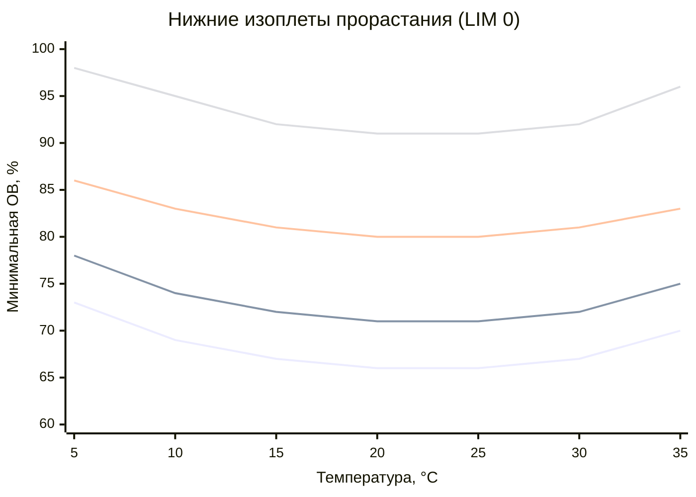

Системы изоплет — графические модели, отображающие границы роста плесени в координатах «температура — относительная влажность». Концепция восходит к работам Ayerst (1969) по активности воды и была систематически развита Клаусом Зедлбауэром (Sedlbauer, 2001) для строительных применений. Результирующая система реализована в программе WUFI Bio (Fraunhofer IBP) как основа для биогигротермической оценки ограждающих конструкций.

## Фундаментальные принципы

Изоплета (isopleth) — линия на диаграмме T–$\varphi$, соединяющая точки одинаковой биологической активности. В контексте роста плесени изоплеты разграничивают области допустимых и недопустимых условий для конкретного вида или группы видов на конкретном субстрате.

Диаграмма изоплет содержит три типа линий:
1. **LIM 0** (Lower Isopleth for Mold, начало прорастания) — граница, ниже которой прорастание невозможно при любой продолжительности воздействия.
2. **LIM n** (изоплеты равного времени до прорастания) — время до 50 % вероятности прорастания при данных $T$ и $\varphi$.
3. **GR-изоплеты** (Growth Rate) — линии равной скорости роста мицелия после прорастания.

## Кривые LIM: математическая формулировка

**Нижняя изоплета прорастания.** Для строительных материалов Класса I (целлюлозосодержащие) в диапазоне $T = 0$–40 °C:


\varphi_{LIM}(T) = a_0 + a_1\,T + a_2\,T^2


Коэффициенты зависят от биологической группы субстрата и вида (Sedlbauer, 2001, Tabelle 4). Для группы «строительные материалы умеренной питательности» ориентировочная аппроксимация:


\varphi_{LIM}(\%) \approx 80 + 0{,}12\,(T - 20)^2 \quad \text{при } 0 < T < 40\ °C


Кривая имеет минимум при $T \approx 20$–25 °C (оптимальный температурный диапазон) и возрастает при отклонении в обе стороны.

**Изоплеты равного времени до прорастания.** Время $t_g$ (в сутках) до прорастания при условиях $(T, \varphi)$ вычисляется из уравнения:


\ln(t_g) = \alpha_0 + \alpha_1\,T + \alpha_2\,\varphi + \alpha_3\,T\varphi + \alpha_4\,T^2 + \alpha_5\,\varphi^2


Коэффициенты $\alpha_i$ получены аппроксимацией экспериментальных данных (контролируемые климатические камеры, инокулированные образцы, наблюдение по ASTM D7789).

## Классификация субстратов по Зедлбауэру

Зедлбауэр разработал четыре категории субстратов, смещающие LIM-кривые относительно биологического оптимума (лабораторная среда):


| Категория | Описание | Примеры материалов | Смещение LIM, п.п. |
|---|---|---|---|
| 0 | Биологически оптимальный субстрат | Лабораторная среда, остатки пищи | 0 (эталон) |
| I | Биоразлагаемый пористый | Хвойная древесина, бумага, картон, ОСП | +2–5 |
| II | Пористый с ограниченной питательностью | Гипс без облицовки, минеральная вата, бетон | +5–10 |
| III | Биологически инертный | Стекло, металл, керамическая плитка, ПВХ | +15–20 |


**Практический смысл:** гипсовый сердечник без бумажной облицовки (Категория II) требует $\varphi_{LIM} \approx 90\%$, тогда как бумажная облицовка гипсокартона (Категория I) даёт $\varphi_{LIM} \approx 80\%$. Это обосновывает применение гипсокартона без бумажной облицовки во влажных помещениях.

## Видоспецифичные характеристики изоплет

### Stachybotrys chartarum (гидрофильный)

- LIM 0: $\varphi_{min} \geq 90$–95 % при $T = 20$–25 °C;
- оптимум: 95–100 % ОВ, 25–30 °C;
- критический субстрат: Категория I (бумажная облицовка гипсокартона, хвойная древесина);
- характеристика изоплеты: кривая LIM круто возрастает при $T < 15\ °C$ и $T > 35\ °C$ — узкий температурный «коридор»;
- клиническое значение: производит трихотецены (сатратоксины, роридины), опасные микотоксины при ингаляции.

*Stachybotrys* не может прорасти ниже 88 % ОВ ни при каком сочетании температур. Его присутствие однозначно указывает на длительное смачивание или аварийное замачивание.

### Aspergillus versicolor (мезофил, основной строительный патоген)

- LIM 0: $\varphi_{min} = 78$–80 % при $T = 20$–25 °C;
- оптимум: 85–95 % ОВ, 20–28 °C;
- диапазон роста: $T = 4$–40 °C;
- характеристика изоплеты: широкая область роста, относительно плоская кривая LIM при 15–30 °C — минимальная температурная зависимость в этом диапазоне;
- индикаторное значение: присутствие свидетельствует о хронически повышенной ОВ (75–80 %) с периодическими пиками.

### Penicillium chrysogenum (широко распространённый колонизатор)

- LIM 0: $\varphi_{min} = 79$–81 %;
- оптимум: 85–92 % ОВ, 20–25 °C;
- диапазон роста: $T = 5$–37 °C (психротолерантность сильнее, чем у *Aspergillus*);
- быстрое прорастание (1–2 сут при оптимуме) создает плотно упакованные изоплеты скорости роста вблизи оптимальных условий.

### Aspergillus restrictus / Eurotium spp. (ксерофилы)

- LIM 0 для *A. restrictus*: $\varphi_{min} = 70$–72 %;
- LIM 0 для *Eurotium* spp.: $\varphi_{min} = 65$–68 % (нижний предел для строительных грибков);
- очень медленный рост (недели до месяцев даже при оптимуме);
- индикаторное значение: обнаружение в отсутствие видимых проблем с влажностью — хроническая умеренная влажность (ОВ 70–75 %).

## Сводная диаграмма LIM для нескольких видов





Зоны на диаграмме интерпретируются следующим образом:
- ниже кривой *Eurotium* — рост невозможен;
- между *Eurotium* и *A. versicolor* — только ксерофилы (хроническая умеренная влажность);
- выше *A. versicolor* — основные строительные патогены активны;
- выше *Stachybotrys* — критическое водяное повреждение.

## Взаимосвязи время–температура–влажность

### Кратковременное воздействие

Система изоплет времени до прорастания позволяет оценить вероятность колонизации при известной длительности воздействия:


| Время воздействия | Превышение над LIM 0, п.п. |
|---|---|
| 1 сут | > 10 |
| 3 сут | > 5 |
| 7 сут | > 2–3 |
| 14 сут | > 1 |
| ≥ 30 сут | асимптотически → 0 |


### Компенсация температурой

В мезофильном диапазоне (15–30 °C) более высокая температура частично компенсирует более низкую ОВ:

- 18 °C, 88 % ОВ ≈ 25 °C, 85 % ОВ (эквивалентная скорость роста *A. versicolor*);
- 20 °C, 90 % ОВ ≈ 28 °C, 86 % ОВ.

Компенсация нарушается при $T < 10\ °C$ и $T > 35\ °C$, где доминируют метаболические ограничения.

### Циклические условия

При суточных/сезонных колебаниях интегрирование биологического эффекта ведётся через накопление «биологического времени роста» (Biological Growth Factor, BGF):


BGF = \int_0^{t_{end}} f\bigl(T(\tau),\,\varphi(\tau)\bigr)\,d\tau


Критическое эмпирическое правило: если условия превышают LIM 0 более 6–8 ч/сут систематически, рост считается устойчивым.

## Числовой пример. Оценка времени до прорастания по изоплетам

**Условие.** Угол наружной стены жилого здания. По результатам мониторинга: $T_{surf} = 16\ °C$, $\varphi_s = 82\%$. Материал — хвойная древесина (Категория I субстрата). Целевой вид — *A. versicolor* (LIM 0 = 80 % при 16 °C).

**Превышение над LIM 0:**


\Delta\varphi = 82 - 80 = 2\,\text{п.п.}


По таблице выше: при превышении 2–3 п.п. прорастание ожидается через $\approx$ 7 сут при постоянных условиях.

**Проверка по VTT-модели.** Для SEN2 ($W = 1$, $SQ = 0$):


\frac{dM}{dt} = \frac{1}{7 \cdot \exp(-0{,}68\ln 16 - 13{,}9\ln 82 + 0{,}14 \cdot 1 + 66{,}02)}



= \frac{1}{7 \cdot \exp(-0{,}68 \times 2{,}773 - 13{,}9 \times 4{,}407 + 0{,}14 + 66{,}02)}



= \frac{1}{7 \cdot \exp(-1{,}886 - 61{,}26 + 0{,}14 + 66{,}02)} = \frac{1}{7 \cdot \exp(3{,}014)} = \frac{1}{7 \times 20{,}4} \approx 0{,}007\ \text{ед/ч}


MI = 1 (начало видимой колонизации) достигается через: $t = 1 / 0{,}007 \approx 143$ ч $\approx 6$ сут. **Результат согласуется** с оценкой по изоплетам (7 сут). Конструкция требует вмешательства для снижения $\varphi_s$ ниже 78 % (с запасом 2 п.п. по ASHRAE 160) или повышения $T_{surf}$ выше 18 °C.

## Ограничения систем изоплет

1. **Стационарные условия.** Большинство экспериментальных данных получено при постоянных $T$ и $\varphi$. Применение к циклическим условиям требует интегрирования BGF.
2. **Идеализация субстрата.** Реальные материалы различаются по составу, состоянию поверхности и наличию загрязнений. Категоризация даёт лишь ориентировочный сдвиг LIM.
3. **Двумерное упрощение.** Скорость воздуха, освещённость, pH субстрата и концентрация CO₂ не учитываются.
4. **Лабораторные штаммы.** Полевые изоляты могут иметь иные пороги — обычно более низкие из-за адаптации.
5. **Видимый рост как конечная точка.** Микроскопическая колонизация (MI ≥ 1) предшествует видимому росту на 7–21 сут.

## Интеграция с WUFI Bio

В WUFI Bio система изоплет Зедлбауэра реализована следующим образом:

1. Гигротермический расчёт (WUFI Pro) даёт почасовые $T$ и $\varphi$ на критической поверхности.
2. WUFI Bio проверяет каждый час: находится ли точка $(T, \varphi)$ выше LIM 0 для выбранного субстрата.
3. При нахождении выше LIM накапливается BGF с поправкой на скорость роста.
4. При нахождении ниже LIM возможна инактивация (по параметрам, калиброванным для каждого вида).
5. Результат — временная зависимость BGF за год или несколько лет.

Критерий соответствия: BGF остаётся ниже 1,0 в течение всего расчётного периода. BGF = 1,0 соответствует достижению условий начала видимого роста.
