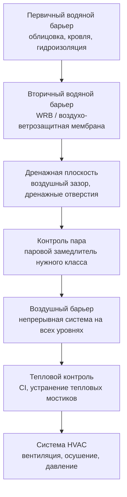

Предотвращение плесени — системная задача, не сводящаяся к выбору одного «правильного» материала или одной детали. Эффективное проектирование опирается на интеграцию тепловой защиты ограждающих конструкций, систем вентиляции и кондиционирования (HVAC) и качества строительства. Каждый из этих элементов в отдельности необходим, но недостаточен; их взаимодействие определяет реальную стойкость здания к плесени на протяжении всего жизненного цикла.

## Интегрированный подход к проектированию

Риск плесени определяется тремя одновременно присутствующими факторами: доступной влагой, подходящей температурой и органической подложкой. Устранение хотя бы одного фактора делает рост плесени невозможным. На практике полностью исключить органические субстраты в строительных конструкциях нереалистично, поэтому стратегия сводится к управлению влагой и температурой поверхностей.

Проектные решения, принятые на ранней стадии, определяют большинство рисков и практически не несут дополнительных затрат. Устранение тепловых мостиков, правильное расположение паровых замедлителей и непрерывность воздушного барьера — всё это закладывается в чертежах и спецификациях задолго до начала монтажа. Стоимость последующего устранения ошибок увлажнения в жилых зданиях типично составляет 300 000–3 000 000 руб. (зависит от объёма поражения), а в коммерческих — на порядок больше.

### Взаимодействие ограждения и систем HVAC

Тепловые характеристики ограждения определяют температуры поверхностей и тем самым — максимальную безопасную влажность внутреннего воздуха. Система HVAC управляет внутренней влажностью, поддерживает избыточное давление и обеспечивает вентиляцию, разбавляющую источники влаги. Герметичность ограждения влияет на обе стороны: плотные конструкции требуют механической вентиляции по ASHRAE 62.2 (для жилых зданий) или ASHRAE 62.1 (для общественных), а также принудительного контроля влажности.

Неконтролируемая инфильтрация в дырявых ограждениях летом вводит наружную влажность непосредственно в полости конструкции, а зимой выносит тёплый внутренний воздух в холодные зоны, где он конденсирует. Оба процесса ведут к развитию плесени в скрытых полостях.

## Климатически адаптированные стратегии

Направление и интенсивность паропереноса (vapour drive) определяются климатом. Ошибочный выбор стратегии — например, размещение паронепроницаемого слоя не с той стороны конструкции — может превратить систему защиты в ловушку для влаги.

### Холодный климат (Москва, Санкт-Петербург, Новосибирск)

В холодном климате зимой тёплый влажный внутренний воздух стремится диффундировать наружу через конструкцию. Ключевые меры:

- Паровой замедлитель класса I или II (по ASHRAE 2021 Fundamentals, гл. 26) с внутренней стороны утеплителя.
- Внешний слой конструкции — паропроницаемый (паропроницаемость не менее 23 нг/(м·с·Па) по ГОСТ, что соответствует примерно 1,5 US perm), обеспечивающий высыхание наружу.
- Непрерывная теплоизоляция (continuous insulation, CI) снаружи, исключающая локальные мосты холода у стоек.
- Герметичная конструкция (воздушный барьер) для предотвращения конвективного выноса влажного воздуха.
- Ограничение расчётной зимней влажности помещения: не более 40–45 % ОВ при −10 °C снаружи, не более 30–35 % ОВ при −25 °C снаружи (СП 60.13330.2020, приложение Г).

### Жаркий и влажный климат

Летом наружный горячий влажный воздух диффундирует внутрь в сторону кондиционированного помещения. Ключевые меры:

- Наружный паровой замедлитель или ограничение паропроницаемости внешних слоёв.
- Вентилируемый фасад или дренажная плоскость для отвода осадочной влаги без попадания в полость конструкции.
- Поддержание избыточного давления в кондиционируемых зонах — препятствует инфильтрации горячего влажного воздуха.
- Системы HVAC с достаточной осушающей мощностью: целевая влажность помещения не более 60 % ОВ (ASHRAE 62.1-2022, раздел 5.18).

### Смешанный климат

Паровой напор меняет направление по сезонам. Решение:

- Умные паровые замедлители (smart vapour retarder) с переменной паропроницаемостью: низкая при сухом воздухе (зима), высокая при влажном (лето). Такие материалы регулируются согласно классу IV по ASHRAE 2021 Fundamentals.
- Полупроницаемые узлы, допускающие двустороннее высыхание.
- Сезонное переключение режимов HVAC.

## Принцип многоуровневой защиты

Ни одна строительная деталь не работает идеально в течение всего срока службы здания. Принцип многоуровневой (многоэшелонной) защиты — defense-in-depth — предполагает, что отказ одного уровня не приводит к аварийному повреждению конструкции.





Каждый уровень обеспечивает независимую функцию. При протечке через первичный барьер вторичный барьер и дренажная плоскость выводят воду наружу до проникновения в полость. Воздушный барьер предотвращает конвективный перенос влаги. Тепловой контроль не допускает конденсации на холодных поверхностях. Система HVAC управляет влажностью в объёме помещения.

## Целевые показатели эффективности

Количественные критерии позволяют верифицировать проектные решения расчётом и контролировать результат после постройки.


| Параметр | Стандартное строительство | Высокоэффективное | Нормативный источник |
|---|---|---|---|
| Воздухопроницаемость ограждения | ≤ 3 ACH₅₀ | ≤ 1,5 ACH₅₀ | ASHRAE 90.1 / СП 50.13330 |
| Пассивный дом | — | ≤ 0,6 ACH₅₀ | PHI |
| Зимняя ОВ помещения (Москва) | 30–45 % | 35–45 % | СП 60.13330, ASHRAE 62.2 |
| Летняя ОВ помещения | ≤ 60 % | ≤ 55 % | ASHRAE 62.1, ISO 7730 |
| Температура внутренней поверхности | t_surf ≥ t_dp + 2 °C | t_surf ≥ t_dp + 4 °C | ISO 13788, ASHRAE 160 |
| Коэффициент температурного фактора f | ≥ 0,70 | ≥ 0,80 | ISO 13788 |
| Влажность деревянного каркаса | < 19 % | < 16 % | ASHRAE 160 |
| Индекс плесени VTT | M < 3 | M < 1 | ASHRAE 160 |


Коэффициент температурного фактора (temperature factor) f определяется как:


f = \frac{T_{si} - T_e}{T_i - T_e}


где T_si — температура внутренней поверхности (°C), T_i — температура внутреннего воздуха (°C), T_e — температура наружного воздуха (°C). При f < 0,70 поверхность попадает в зону критического конденсационного риска для большинства климатов умеренного пояса (ISO 13788:2012, пункт 6.3).

## Числовой пример: оценка защитного запаса для стены в климате Москвы

Задача: определить максимально допустимую относительную влажность помещения, при которой температурный фактор угловой зоны стены f = 0,72 обеспечивает RH_surf < RH_crit для гипсокартона (класс чувствительности 2).

Исходные данные: T_e = −26 °C (расчётная зимняя температура, СП 131.13330.2020, Москва), T_i = 20 °C.

Температура внутренней поверхности угловой зоны:


T_{si} = T_e + f \cdot (T_i - T_e) = -26 + 0{,}72 \cdot (20 - (-26)) = -26 + 33{,}1 = 7{,}1\,°C


Давление насыщенных паров при T_si = 7,1 °C:


p_{sat}(7{,}1\,°C) \approx 1011\,\text{Па}


Чтобы RH_surf ≤ 81 % (RH_crit при ≈ 14 °C для класса 2; при 7 °C RH_crit ≈ 79 %), парциальное давление паров у поверхности не должно превышать:


p_v^{\max} = 0{,}79 \cdot 1011 \approx 799\,\text{Па}


Максимально допустимая ОВ помещения:


RH_i^{\max} = \frac{p_v^{\max}}{p_{sat}(20\,°C)} = \frac{799}{2338} \approx 34\,\%


Вывод: при расчётной зимней температуре −26 °C и угловой зоне с f = 0,72 допустимая ОВ помещения не превышает 34 %. Это означает, что без улучшения термического качества угла необходимо применять вытяжную вентиляцию, осушение или ограничивать источники влагопоступления — в противном случае M = 3 будет достигнут за один отопительный сезон.

## Конструктивность и контроль качества

Сложные детали, требующие безупречного монтажа, выходят из строя статистически чаще, чем простые. Проектировщик должен отдавать предпочтение решениям, в которых типичные монтажные ошибки не ведут к катастрофическому накоплению влаги.

Программа поэтапного контроля качества (QA/QC) включает проверку на критических стадиях:

- Фундамент и подземная часть: гидроизоляция, капиллярный разрыв, дренаж.
- Монтаж каркаса: непрерывность воздушного барьера, отсутствие зазоров в теплоизоляции.
- Грубый монтаж (rough-in): интеграция проходок, примыкания оконных блоков.
- Пуско-наладка: испытание воздухопроницаемости (blower door test), тепловизионный контроль.

Тепловизионный контроль (thermography) в соответствии с ISO 6781 выявляет тепловые мосты и дефекты утеплителя до завершения отделочных работ. Независимая экспертиза на этих этапах обходится в 1–3 % от стоимости строительства, при этом устраняет риски, ликвидация последствий которых стоит на порядок дороже.

## Документирование и эксплуатационный регламент

Проектная документация должна фиксировать принятые влагозащитные решения таким образом, чтобы они были понятны строителям, эксплуатационному персоналу и возможным будущим владельцам. Минимальный состав документации:

- Разрезы узлов с обозначением всех функциональных слоёв (гидроизоляция, WRB, воздушный барьер, паровой замедлитель, CI).
- Узлы проходок и примыканий с указанием последовательности выполнения работ.
- Эксплуатационный регламент для систем HVAC: сезонные уставки влажности, интервалы технического обслуживания.

Критические задачи по техническому обслуживанию:


| Задача | Периодичность | Норматив |
|--------|--------------|---------|
| Проверка и восстановление герметика примыканий | 5–10 лет | ASTM C1193 |
| Осмотр дренажной системы и продухов | Ежегодно | СП 23-101-2004 |
| Замена фильтров HVAC | 1–3 месяца | ASHRAE 62.1 |
| Балансировка системы вентиляции | Ежегодно | ASHRAE 62.2 |
| Мониторинг влажности помещений | Непрерывно / сезонно | ASHRAE 160 |
| Тепловизионный контроль ограждения | Раз в 3–5 лет | ISO 6781 |


Цифровая документация с фотофиксацией скрытых конструктивных узлов особенно ценна при реконструкции и расследовании причин повреждений — она позволяет восстановить принятые проектные решения спустя десятилетия.
