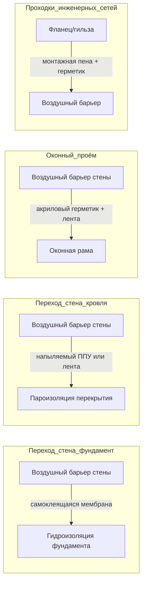

Конструктивные детали — ключевое звено, где замыслы проектировщика превращаются в реальную влагозащиту или, напротив, в скрытые ловушки для влаги. Около 70–80 % случаев плесени в зданиях обусловлено дефектами именно в деталях: оконных примыканиях, угловых зонах, переходах стена–фундамент и стена–кровля. Правильная детализация предотвращает три механизма увлажнения: поверхностную конденсацию (из-за тепловых мостиков), диффузионную миграцию пара (из-за отсутствия или неправильного расположения парового замедлителя) и инфильтрацию воздуха с влагой (из-за разрывов воздушного барьера).

## Устранение тепловых мостиков

### Физика явления

Тепловой мостик (thermal bridge) — участок конструкции с повышенной теплопередачей по сравнению с рядовым сечением. В холодном климате тепловые мостики снижают температуру внутренней поверхности, увеличивая относительную влажность у этой поверхности вплоть до точки росы и выше.

Температурный фактор f (по ISO 13788:2012) количественно характеризует термическое качество узла:


f_{Rsi} = \frac{T_{si} - T_e}{T_i - T_e}


где T_si — температура внутренней поверхности (°C), T_i — расчётная внутренняя температура (°C), T_e — расчётная наружная температура (°C).

По ISO 13788 значение f_Rsi < 0,70 является критическим для большинства европейских климатов при нормальных уровнях влагопоступления. СП 50.13330.2017 задаёт аналогичное требование через коэффициент теплотехнической однородности r и нормируемый перепад температур Δt_n.

### Типы тепловых мостиков и меры устранения


| Тип мостика | Причина | Мера устранения | Эффект по f |
|---|---|---|---|
| Металлические стойки каркаса | Высокая теплопроводность стали (50 Вт/(м·К)) | Непрерывная наружная теплоизоляция (CI) ≥ 50 мм | f +0,10–0,20 |
| Угловая зона стен | Двумерный теплопоток, уменьшенное сечение | CI + скругление угла изнутри, теплоизоляционные вставки | f +0,05–0,15 |
| Оконная рама | Алюминий без терморазрыва | Рама с терморазрывом, стеклопластик, дерево-алюминий | f +0,10–0,25 |
| Переход стена–фундамент | Разрыв теплоизоляции у обреза фундамента | Вертикальная теплоизоляция цоколя до глубины промерзания | f +0,08–0,18 |
| Балкон–перекрытие | Консольный железобетон | Термовставка (Schöck, Halfen) | f +0,15–0,30 |


Непрерывная теплоизоляция снаружи (continuous insulation, CI) — наиболее универсальная мера. Она устраняет тепловые мосты у стоек каркаса и одновременно повышает температуру обшивки (sheathing) выше точки росы, снижая риск конденсации в полости стены.

### Числовой пример: угловая зона наружной стены, Москва

Исходные данные: T_i = 20 °C, T_e = −26 °C (расчётная зимняя температура по СП 131.13330.2020 для Москвы), RH_i = 45 %.

Температура точки росы внутреннего воздуха при T_i = 20 °C, RH_i = 45 %:


T_{dp} \approx 7{,}7\,°C


Минимально допустимая температура внутренней поверхности (при f_Rsi = 0,70):


T_{si}^{\min} = T_e + 0{,}70 \cdot (T_i - T_e) = -26 + 0{,}70 \cdot 46 = 6{,}2\,°C


Значение 6,2 °C меньше точки росы 7,7 °C — значит, при f = 0,70 конденсация в расчётную зиму ещё возможна. Требуется f ≥ 0,75:


T_{si}^{\min}(f = 0{,}75) = -26 + 0{,}75 \cdot 46 = 8{,}5\,°C > 7{,}7\,°C \quad \checkmark


Вывод: угловая зона наружной стены в Москве при RH_i = 45 % должна иметь f_Rsi ≥ 0,75. Это достигается применением наружной CI из ПСБ-С или минеральной ваты толщиной от 80 мм при стандартном кирпичном ограждении.

## Непрерывный воздушный барьер

Утечка воздуха переносит влагу с интенсивностью, на порядок превышающей диффузию пара при типичных градиентах давления. По данным ASHRAE Fundamentals 2021 (глава 27), через отверстие 1 мм² при перепаде давления 5 Па в год проходит около 0,8 г воды в форме воздуховлажности — при той же площади паропроницаемость мембраны класса I обеспечивает лишь 0,01–0,03 г за тот же период.

### Принципы детализации

Воздушный барьер (air barrier) должен образовывать непрерывную плоскость вокруг теплового контура здания. Разрывы барьера в местах примыканий — главный источник неконтролируемой инфильтрации.





**Переход стена–фундамент.** Бетонный фундамент и деревянный каркас имеют разный коэффициент теплового расширения и допускают взаимное смещение. Гибкая самоклеящаяся мембрана (например, акриловая на флисовой основе) с нахлёстом ≥ 100 мм на каждую сторону обеспечивает герметичность при деформациях. Уплотнительная пенолента (sill gasket) под нижней обвязкой — первый рубеж; мембрана — второй.

**Переход стена–кровля (zone d'appui).** Наружные стены используют воздушный барьер по обшивке, кровля — по пароизоляции перекрытия. В зоне мауэрлата (верхней обвязки) напыляемый пенополиуретан (ППУ) класса 2 закрывает нерегулярные полости, недоступные для рулонных материалов. Приклеенная лента связывает оба слоя.

**Оконные и дверные проёмы.** Система герметизации проёма включает: акриловый герметик в шве рама–обшивка (сжатый шов по ГОСТ 30971), самоклеящуюся мембрану по четырём сторонам проёма (с перехлёстом на воздушный барьер стены не менее 75 мм), уголки из мембраны в четырёх углах проёма.

**Проходки инженерных сетей.** Монтажная пена заполняет зазор ≤ 25 мм; при большем зазоре — жёсткая манжета (гильза) плюс герметик по периметру. Электрические коробки в наружных стенах устанавливаются герметичного исполнения или уплотняются бутиловой лентой по периметру.

## Гидроизоляция и дренаж

### Принципы черепичной укладки

Все элементы гидроизоляции выполняются с соблюдением принципа черепичности (shingle principle): верхний элемент перекрывает нижний, исключая встречный capillary path. Минимальный нахлёст — 100 мм для горизонтальных швов, 150 мм для вертикальных.

### Ключевые узлы

**Гидроизоляция над окном (head flashing).** Отводит воду, просочившуюся за облицовку, наружу, не допуская её попадания в полость стены. Металлическая или полимерная отлётная гидроизоляция должна выходить за плоскость WRB (водоветрозащитной мембраны) и иметь капельник с отгибом не менее 15 мм.

**Подоконник (sill pan flashing).** Наклонный лоток (уклон ≥ 10° к наружи) под оконным блоком собирает воду, попадающую на подоконник, и отводит её через дренажные отверстия диаметром ≥ 6 мм. Торцевые плотины (end dams) высотой ≥ 20 мм предотвращают выход воды в боковые полости.

**Гидроизоляция, проходящая сквозь стену (through-wall flashing).** Применяется в кирпичных облицованных стенах выше оконных и дверных перемычек, выше консольных элементов и у обреза фундамента. Обеспечивает отвод воды, накопившейся в полости, наружу через капельные отверстия (weep holes) с шагом не более 600 мм.

**Отметание от стен (kickout flashing).** В местах пересечения наклонной кровли с вертикальной стеной концентрируется значительный водосток. Отметающая деталь перенаправляет сток от плоскости стены. Отсутствие этого элемента — одна из наиболее частых причин скрытого замачивания полости стены.

### Дренажная плоскость

Вентилируемый фасад или дренажная полость шириной ≥ 10 мм обеспечивает отвод воды, прошедшей через облицовку, не допуская её контакта с WRB более кратковременного периода. Нижние продухи (weep vents) — не реже чем каждые 600 мм — обеспечивают дренаж и вентиляцию полости.

## Конструкции без влагозамыкания

### Ловушки влаги и их причины

Влагозамыкающие конструкции (moisture-trapping assemblies) — узлы, в которых влага накапливается без возможности высыхания. Типичные ошибки:

- Паровой замедлитель класса I (полиэтилен) с обеих сторон конструкции: блокирует высыхание в обоих направлениях.
- EIFS (External Insulation and Finish System) без дренажного зазора: вода, просочившаяся через трещины в штукатурке, не может выйти наружу.
- Виниловые обои на наружных стенах в жарком климате: блокируют высыхание внутрь при летнем диффузионном потоке снаружи.
- Закрытые (unvented) кровельные полости с нижним поясом из паронепроницаемого материала без достаточной CI.

### Обеспечение потенциала высыхания


| Материал | Паропроницаемость, нг/(м·с·Па) | Класс (ASHRAE) | Направление высыхания |
|---|---|---|---|
| Полиэтилен 0,15 мм | < 0,03 | I | Блокирует оба направления |
| Крафт-бумага (паровой замедлитель) | 0,06–0,17 | II | Блокирует при низкой ОВ |
| «Умный» паровой замедлитель (при сухом воздухе) | 0,06–0,17 | II–IV | Переменная |
- «Умный» паровой замедлитель (при влажном воздухе) | > 2,3 | IV | Открыт |
| Паропроницаемая WRB-мембрана | 23–115 | > IV | Открыт наружу |
| Гипсокартон окрашенный | 5–20 | III | Умеренно открыт |
| OSB 12 мм | 0,9–2,6 | II–III | Частично открыт |


В холодном климате потенциал высыхания конструкции обеспечивается снаружи: WRB-мембрана с паропроницаемостью > 23 нг/(м·с·Па) позволяет влаге, накопившейся за зиму, улетучиться летом в сторону наружного воздуха.

В смешанном климате применяют «умные» паровые замедлители, меняющие паропроницаемость в зависимости от относительной влажности у поверхности, что допускает двустороннее высыхание сезонно.

## Мониторинг и доступ для проверки

Конструктивные детали должны предусматривать возможность контроля за влажностным состоянием критических зон на протяжении всего срока службы здания.

**Люки доступа** в технические пространства (чердаки, подполья, вентилируемые фасады) — минимальный размер 410×410 мм. Размещаются у зон высокого риска: под оконными проёмами, у прохождений трубопроводов, у балконных примыканий.

**Встроенные датчики влажности.** В конструкциях с повышенным риском (деревянный каркас под непрерывной наружной изоляцией, конструкции плоских кровель) рекомендуется установка датчиков электрического сопротивления или ёмкостных датчиков влажности на границах слоёв. Пороговое значение сигнализации: влажность древесины > 18 % (порог активации плесени по ASHRAE 160) или ОВ у поверхности > 80 % в течение более 72 часов подряд.

**Фотодокументирование скрытых узлов.** До закрытия конструкции отделочными слоями фиксируются: установка гидроизоляции, непрерывность воздушного барьера, установка теплоизоляции в полостях. Снимки хранятся в составе исполнительной документации — они незаменимы при расследовании повреждений через 10–20 лет после строительства.

**Тепловизионный контроль.** Проводится в соответствии с ISO 6781-3 при перепаде температур ≥ 10 °C между внутренним и наружным воздухом. Позволяет выявить тепловые мосты, дефекты теплоизоляции и зоны повышенной влажности до появления визуальных признаков плесени.
