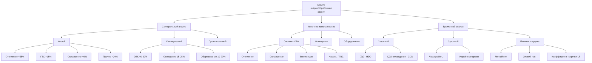

Паттерны (закономерности) энергопотребления зданий определяют взаимосвязь между проектными решениями, режимом эксплуатации и расходом энергоресурсов. Знание этих паттернов позволяет целенаправленно повышать энергоэффективность, обосновывать инвестиции в реконструкцию и выполнять требования ФЗ-261 «Об энергосбережении», СП 50.13330 и стандарта ASHRAE 90.1.

## Место зданий в общем энергобалансе

По данным Международного энергетического агентства (МЭА, IEA), здания потребляют около 30 % первичной энергии в мире; с учётом выработки электроэнергии для нужд зданий — около 40 % (IEA, World Energy Outlook 2023). В России доля зданий (жилых и общественных) составляет около 33 % конечного энергопотребления по данным Минэнерго РФ.

Системы ОВК занимают наибольшую долю энергобаланса здания: 40–60 % в зависимости от типа, климатической зоны и характеристик ограждающих конструкций.

## Показатель удельного энергопотребления (EUI)

Основная метрика для сравнительного анализа — удельное энергопотребление (УЭП, англ. EUI, energy use intensity):


EUI = \frac{E_{annual}}{A_{floor}}


Где:
- $E_{annual}$ — годовое суммарное потребление энергии, кВт·ч (или МДж);
- $A_{floor}$ — общая площадь здания, м².

Нормализованная метрика позволяет сопоставлять здания разных размеров и назначений. В российской нормативной практике аналогом служит показатель «удельный расход тепловой энергии на отопление и вентиляцию» по СП 50.13330-2012.


| Тип здания | Диапазон EUI, кВт·ч/м²·год | Доля ОВК | Главные факторы |
|---|---|---|---|
| Жилой МКД | 90–160 | 55–65 % | Отопление, ГВС, качество ограждающей конструкции |
| Офисный | 100–180 | 40–55 % | Освещение, IT-нагрузки, вентиляция |
| Торговый центр | 150–260 | 35–50 % | Освещение, холодильное оборудование, вентиляция |
| Больница | 300–500 | 45–60 % | Круглосуточная работа, строгие требования к воздуху |
| Учебное заведение | 80–150 | 40–50 % | Вентиляция, сезонность нагрузки |
| Складской комплекс | 40–90 | 20–35 % | Минимальный климат-контроль |


## Потребление энергии по секторам

### Жилой сектор

Многоквартирные и частные жилые здания потребляют энергию главным образом на кондиционирование воздуха (отопление + охлаждение). По данным Росстата и Минэнерго за 2022 год, в суммарном балансе жилого сектора России доминирует теплоснабжение — около 55–60 % (с учётом ГВС), а охлаждение не превышает 5–8 % вследствие преобладания холодного климата.

Годовая потребность в тепловой энергии на отопление определяется через градусо-дни отопления (ГДО, heating degree days, HDD):


Q_{heat} = \frac{(UA)_{building} \cdot HDD \cdot 86400}{\eta_{sys}}


Где:
- $(UA)_{building}$ — суммарный коэффициент теплопередачи ограждающих конструкций, Вт/°C;
- $HDD$ — градусо-дни отопления, °C·сут;
- $86400$ — перевод суток в секунды;
- $\eta_{sys}$ — КПД системы теплоснабжения, д. е.

### Числовой пример: жилой дом в Москве

Жилое здание с $(UA) = 1\,500$ Вт/°C, $HDD_{Moscow} = 4\,943$ °C·сут (СНИП 23-01-99, базовая температура $+8\,°C$), $\eta_{sys} = 0{,}92$ (централизованное ТС).

$$Q_{heat} = \frac{1500 \times 4943 \times 86400}{0{,}92} \approx 694\,\text{ГДж/год} = 193\,\text{МВт·ч/год}$$

При площади здания $A = 2\,500\,\text{м}^2$: $EUI_{heat} = 193\,000 / 2\,500 \approx 77\,\text{кВт·ч/м}^2\text{·год}$ — только тепло на отопление.

### Коммерческий сектор

Коммерческие здания отличаются значительными внутренними тепловыделениями от людей, оборудования и освещения. Это смещает баланс: нагрузка охлаждения нередко превышает нагрузку отопления даже в умеренных климатах при интенсивном использовании здания.

Отношение охлаждения к отоплению (CHR, cooling-to-heating ratio):


CHR = \frac{E_{cooling}}{E_{heating}}


Типичные значения: 0,2–0,5 — для Москвы, Санкт-Петербурга; 0,8–1,5 — для Краснодара, Сочи; более 2,0 — для Ташкента, Астаны в летний период.

## Профили конечного использования энергии

Разбивка потребления по видам конечного использования (end-use breakdown) позволяет выявить наиболее затратные статьи и приоритизировать меры повышения эффективности.


| Статья конечного использования | Доля в энергобалансе |
|---|---|
| Отопление помещений | 25–35 % |
| Охлаждение помещений | 15–25 % |
| Вентиляция (вентиляторные агрегаты) | 8–12 % |
| Насосы | 3–6 % |
| Горячее водоснабжение | 5–10 % |
| Освещение | 15–25 % |
| Оргтехника / plug loads | 10–20 % |
| Прочее | 2–5 % |


Соотношение нагрузок отопление/охлаждение (HCR, heating-to-cooling ratio):


HCR = \frac{E_{heating}}{E_{cooling}} \approx \frac{HDD \cdot (UA / \eta_h)}{CDD \cdot (Q_{int} + Q_{sol}) / EER}


Где $CDD$ — градусо-дни охлаждения; $Q_{int}$, $Q_{sol}$ — внутренние и солнечные теплопоступления, кВт; $EER$ — холодильный коэффициент (Energy Efficiency Ratio) системы охлаждения.

## Временные паттерны потребления

### Сезонные вариации

Сезонный паттерн отражает влияние наружной температуры на нагрузки ОВК. В России пиковое потребление тепловой энергии приходится на декабрь–февраль; пиковая электрическая нагрузка на охлаждение — на июль–август.

Коэффициент сезонной нагрузки (SLF, seasonal load factor):


SLF = \frac{E_{avg,month}}{E_{peak,month}}


Значения SLF обычно составляют 0,35–0,65; низкие значения характерны для регионов с резким континентальным климатом (Сибирь, Урал).

### Суточные профили нагрузки

Коммерческие здания демонстрируют выраженный суточный профиль: пик нагрузки приходится на 10:00–16:00 в рабочие дни. Жилые здания имеют двугорбый профиль с утренним (07:00–09:00) и вечерним (19:00–22:00) пиками.

Коэффициент суточной нагрузки (DLF, daily load factor):


DLF = \frac{P_{avg,day}}{P_{peak,day}}


Коэффициент нагрузки (LF, load factor) — отношение среднего потребления к пиковому за расчётный период:


LF = \frac{E_{total} / t}{P_{peak}}


Годовые значения LF: 0,50–0,70 — коммерческие здания; 0,30–0,50 — жилые. Низкие значения указывают на высокую долю пиковой мощности в общем балансе и экономическую целесообразность систем накопления или управления нагрузкой (demand response).





## Метрики энергетической интенсивности

**Удельное первичное энергопотребление (SEI, source energy intensity):**


SEI = \frac{E_{prim}}{A_{floor}} = \frac{\sum_i E_{site,i} \cdot f_{prim,i}}{A_{floor}}


Позволяет учесть реальное воздействие на первичный топливно-энергетический баланс страны.

**EUI, нормализованный по климату:**


EUI_{norm} = EUI_{act} \cdot \frac{HDD_{ref} + CDD_{ref}}{HDD_{act} + CDD_{act}}


Нормализация устраняет погодный шум и позволяет корректно сравнивать энергоэффективность здания в разные годы или с зданиями в других климатических зонах.

### Числовой пример: нормализация EUI

Офисное здание потребило $EUI_{act} = 145\,\text{кВт·ч/м}^2$ в холодную зиму ($HDD_{act} = 5\,300$, $CDD_{act} = 120$). Нормативный год: $HDD_{ref} = 4\,943$, $CDD_{ref} = 110$.

$$EUI_{norm} = 145 \times \frac{4943 + 110}{5300 + 120} = 145 \times \frac{5053}{5420} \approx 135\,\text{кВт·ч/м}^2$$

Снижение EUI на 7 % — результат аномально холодной зимы, а не реального ухудшения энергоэффективности здания.

## Базы данных и источники информации

Для России и СНГ:
- **ФСГС (Росстат)**: данные баланса ТЭР по субъектам РФ.
- **Минэнерго РФ**: отраслевые балансы и прогнозы.
- **ГИС ЖКХ**: паспортизация МКД, фактическое потребление.
- **СП 50.13330-2012**: нормативные показатели теплозащиты и расчётные методы.

Для международных сравнений:
- **IEA World Energy Outlook 2023**: глобальные балансы по секторам.
- **IRENA Renewable Power Generation Costs 2023**: данные по ВИЭ.
- **EIA CBECS / RECS**: детализированные данные по коммерческим и жилым зданиям США.

Понимание паттернов потребления направляет приоритеты при проектировании, реконструкции и управлении эксплуатацией: оно позволяет определить, где и когда потребляется энергия, и сосредоточить инвестиции на наиболее эффективных мерах.

## Связанные разделы

- Профили конечного использования: охлаждение, отопление, вентиляция, ГВС
- Секторальное потребление: коммерческий и промышленный секторы
