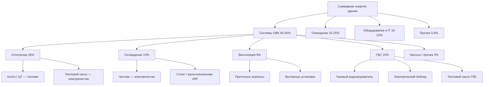

Профили конечного использования энергии (end-use profiles) позволяют количественно описать, какая доля суммарного энергопотребления здания расходуется на каждый компонент системы ОВК. Этот анализ — основа целевого повышения энергоэффективности, калибровки энергетических моделей и проведения энергоаудитов по EN 16247 и ГОСТ Р 57272.

## Суммарный баланс конечного использования

Полный энергетический баланс здания:


E_{total} = E_{heat} + E_{cool} + E_{vent} + E_{dhw} + E_{light} + E_{equip} + E_{other}


Доля систем ОВК:


f_{HVAC} = \frac{E_{heat} + E_{cool} + E_{vent} + E_{dhw}}{E_{total}}


В типовых коммерческих зданиях $f_{HVAC} = 0{,}40$–$0{,}60$; в жилых — $0{,}55$–$0{,}75$ в зависимости от климатической зоны и теплозащитных характеристик ограждающих конструкций.

## Отопление помещений

Теплопотребление на отопление — наибольшая статья в климатах с длительным отопительным периодом. Расчёт через суммарные нагрузки по периодам:


E_{heat} = \sum_{i=1}^{n} \frac{Q_{heat,i}}{\eta_{sys,i}}


Где:
- $Q_{heat,i}$ — тепловая нагрузка в $i$-й расчётный период, кВт·ч;
- $\eta_{sys,i}$ — КПД системы теплоснабжения (котёл, ЦТ, тепловой насос).

Доля отопления в суммарном энергопотреблении по климатическим зонам:


| Климатическая зона | HDD, °C·сут | Доля отопления |
|---|---|---|
| Арктическая (Якутск, Магадан) | > 8 000 | 55–70 % |
| Холодная (Новосибирск, Екатеринбург) | 5 500–8 000 | 40–55 % |
| Умеренная (Москва, Казань) | 4 000–5 500 | 30–45 % |
| Мягкая (Краснодар, Ростов) | 1 500–3 000 | 15–30 % |
| Субтропическая (Сочи) | < 1 500 | 5–15 % |


### Числовой пример: здание офисного типа в Новосибирске

Площадь $A = 3\,000\,\text{м}^2$, $(UA) = 2\,000\,\text{Вт/°C}$, $HDD = 6\,500\,\text{°C·сут}$, система ЦТ с $\eta_{sys} = 0{,}85$.

$$E_{heat} = \frac{2000 \times 6500 \times 24}{0{,}85 \times 10^6} \approx 367\,\text{МВт·ч/год}$$

$$EUI_{heat} = \frac{367\,000}{3000} \approx 122\,\text{кВт·ч/м}^2\text{·год}$$

## Охлаждение помещений

Потребление электроэнергии на охлаждение зависит от внутренних тепловыделений, солнечных поступлений и наружной температуры:


E_{cool} = \sum_{i=1}^{n} \frac{Q_{cool,i}}{COP_i}


Где $COP_i$ — холодильный коэффициент оборудования при рабочих условиях периода $i$.

Нагрузка охлаждения:


Q_{cool} = Q_{env} + Q_{sol} + Q_{int} + Q_{vent,cool}


Где:
- $Q_{env}$ — теплопоступления через ограждающие конструкции;
- $Q_{sol}$ — солнечные теплопоступления через остекление;
- $Q_{int}$ — внутренние тепловыделения (люди, оборудование, освещение);
- $Q_{vent,cool}$ — энтальпийная нагрузка от наружного воздуха.


| Тип здания | Климат Краснодара | Климат Москвы | Климат Новосибирска |
|---|---|---|---|
| Офис | 20–30 % | 8–15 % | 5–10 % |
| Торговый центр | 25–35 % | 12–20 % | 8–14 % |
| Гостиница | 18–28 % | 8–15 % | 5–10 % |
| Дата-центр | 50–65 % | 45–60 % | 35–55 % |


В высоконагруженных коммерческих зданиях (open-plan офисы, ЦОД) охлаждение может превышать отопление даже в холодном климате из-за значительных внутренних тепловыделений.

## Вентиляция

Энергопотребление вентиляции — суммарная мощность всех вентиляторных агрегатов подачи, рециркуляции, вытяжки и притока наружного воздуха:


E_{vent} = \sum_{i=1}^{n} P_{fan,i} \cdot t_i


Где:
- $P_{fan,i}$ — электрическая мощность $i$-го вентилятора, кВт;
- $t_i$ — время работы, ч.

Мощность вентилятора через гидравлические параметры:


P_{fan} = \frac{\dot{V} \cdot \Delta p}{\eta_{fan} \cdot \eta_{motor}}


Где:
- $\dot{V}$ — объёмный расход воздуха, м³/с;
- $\Delta p$ — полное давление, Па;
- $\eta_{fan}$ — КПД вентилятора (0,60–0,80);
- $\eta_{motor}$ — КПД двигателя (0,90–0,97).

Вентиляция составляет 5–15 % от суммарного потребления ОВК. Применение частотно-регулируемых приводов (ЧРП, variable frequency drive, VFD) и систем вентиляции с переменным расходом воздуха (VAV) снижает потребление на 20–50 %.

### Числовой пример: вентиляторный агрегат

Приточный агрегат с $\dot{V} = 3{,}0\,\text{м}^3/\text{с}$, $\Delta p = 800\,\text{Па}$, $\eta_{fan} = 0{,}72$, $\eta_{motor} = 0{,}95$:

$$P_{fan} = \frac{3{,}0 \times 800}{0{,}72 \times 0{,}95} \approx 3\,508\,\text{Вт} \approx 3{,}5\,\text{кВт}$$

При 2 500 ч/год: $E_{vent} = 3{,}5 \times 2\,500 = 8\,750\,\text{кВт·ч/год}$.

## Горячее водоснабжение (ГВС)

ГВС — значимая статья в жилых зданиях, гостиницах, больницах и предприятиях общественного питания. Теоретическая потребность в тепловой энергии:


E_{dhw} = \frac{\dot{m}_{dhw} \cdot c_p \cdot (T_{hot} - T_{cold}) \cdot t_{annual}}{\eta_{WH}}


Где:
- $\dot{m}_{dhw}$ — средний расход ГВС, кг/с;
- $c_p = 4{,}186$ кДж/(кг·°C);
- $T_{hot} = 60\,°C$ (нормируемая температура в системе, СП 30.13330);
- $T_{cold}$ — температура холодной воды (5–15 °C в зависимости от сезона);
- $t_{annual}$ — годовой фонд времени, с;
- $\eta_{WH}$ — КПД водонагревателя или бойлерной установки.


| Тип здания | Доля ГВС в суммарном потреблении |
|---|---|
| МКД | 15–25 % |
| Гостиница (3–5 звёзд) | 18–30 % |
| Больница | 12–20 % |
| Ресторан, столовая | 20–35 % |
| Офисное здание | 3–8 % |
| Склад | 1–3 % |


## Сводная таблица конечного использования по типам зданий


| Статья | Офис | ТРЦ | Больница | МКД | Школа | Склад |
|---|---|---|---|---|---|---|
| Отопление | 25 | 20 | 18 | 38 | 28 | 35 |
| Охлаждение | 12 | 15 | 14 | 8 | 10 | 5 |
| Вентиляция | 8 | 6 | 12 | 4 | 9 | 4 |
| ГВС | 4 | 4 | 14 | 18 | 5 | 2 |
| Освещение | 25 | 30 | 18 | 10 | 22 | 18 |
| Оборудование | 21 | 20 | 20 | 16 | 21 | 28 |
| Прочее | 5 | 5 | 4 | 6 | 5 | 8 |


*Данные скорректированы под российские условия эксплуатации и климат умеренной зоны (HDD 4 000–5 500).*

## Диаграмма потоков энергии ОВК





## Интенсивность конечного использования (end-use EUI)

Удельная интенсивность по статье конечного использования:


EUI_{eu} = \frac{E_{eu}}{A_{floor}}, \quad \left[\frac{\text{кВт·ч}}{\text{м}^2\text{·год}}\right]



| Тип здания | Отопление | Охлаждение | Вентиляция | ГВС | Итого ОВК |
|---|---|---|---|---|---|
| Малый офис | 45–75 | 15–30 | 10–20 | 5–10 | 75–135 |
| Крупный офис | 35–55 | 20–40 | 15–25 | 4–8 | 74–128 |
| ТРЦ | 55–85 | 25–45 | 8–15 | 6–12 | 94–157 |
| Школа | 65–105 | 15–30 | 12–22 | 8–15 | 100–172 |
| Больница | 80–130 | 30–60 | 25–45 | 30–55 | 165–290 |
| МКД | 60–120 | 10–25 | 6–12 | 25–45 | 101–202 |


## Факторы, определяющие структуру конечного использования

**Климатическая зона.** Отопление доминирует в климатах с HDD > 4 000. Охлаждение растёт с увеличением CDD и плотности внутренних нагрузок.

**Ограждающая конструкция.** Высокое термическое сопротивление ($R$-value) снижает долю отопления и охлаждения, увеличивая относительный вес вентиляции и внутренних нагрузок.

**Плотность занятости.** Высокая плотность (офисы open-plan, конференц-залы) увеличивает внутренние тепловыделения, смещая баланс к охлаждению.

**КПД оборудования.** Устаревшее оборудование с низким КПД потребляет большую долю энергии на отопление или охлаждение при той же полезной нагрузке.

**Режим работы.** Круглосуточная работа (больницы, ЦОД, гостиницы) увеличивает абсолютное потребление всех статей, но выравнивает суточный профиль.

## Применение при энергоаудите

Анализ профилей конечного использования — обязательный элемент энергоаудита по EN 16247-1 и ГОСТ Р 57272.1. Экономия от мероприятий:


\Delta E_{eu} = E_{base,eu} - E_{post,eu}


ASHRAE Guideline 14 и IPMVP (Протокол измерения и верификации) требуют согласования модели с измеренными данными в пределах ±5 % (ежемесячно) или ±10 % (годовых) для достоверной верификации экономии.

Понимание профилей конечного использования позволяет:
- обоснованно приоритизировать меры энергосбережения на наиболее весомых статьях;
- корректно проектировать мощность оборудования для конкретных типов зданий и климата;
- устанавливать реалистичные целевые показатели EUI на основе статистики фактического потребления.

## Связанные разделы

- Охлаждение: энергопотребление на хладоснабжение
- Отопление: расчёт нагрузок и систем теплоснабжения
- Вентиляция: потребление энергии вентиляторными системами
- ГВС: горячее водоснабжение в зданиях
