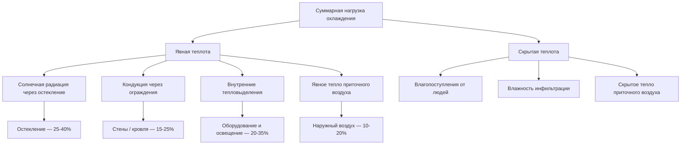

Потребление энергии на охлаждение — один из наиболее быстро растущих компонентов энергетического баланса зданий. По данным IEA (World Energy Outlook 2023), глобальное потребление энергии кондиционерами превысило 2 000 ТВт·ч/год и продолжает расти на 3–4 % ежегодно под влиянием роста благосостояния, урбанизации и изменения климата. В России охлаждение пока занимает меньшую долю, чем отопление, однако в южных регионах и плотно застроенных городах нагрузка на охлаждение устойчиво возрастает.

## Составляющие нагрузки охлаждения

Холодильная нагрузка здания складывается из нескольких одновременных теплопоступлений, которые система ОВК должна отводить для поддержания нормируемых параметров микроклимата:


Q_{cool} = Q_{env} + Q_{sol} + Q_{int} + Q_{vent} + Q_{inf}


Где:
- $Q_{env}$ — кондуктивные теплопоступления через непрозрачные ограждающие конструкции (стены, кровля, перекрытия);
- $Q_{sol}$ — солнечные теплопоступления через остекление;
- $Q_{int}$ — внутренние тепловыделения (люди, освещение, оборудование);
- $Q_{vent}$ — энтальпийная нагрузка от приточного наружного воздуха;
- $Q_{inf}$ — теплопоступления от инфильтрации.





## Градусо-дни охлаждения (CDD)

Градусо-дни охлаждения (CDD, cooling degree days) — интегральная климатическая характеристика, связывающая наружную температуру со спросом на охлаждение. Стандартная базовая температура по ASHRAE — 18,3 °C (65 °F); в российской практике и EN ISO 15927 чаще применяют 22 °C:


CDD = \sum_{i=1}^{n} \max\left(T_{avg,i} - T_{base},\; 0\right)


Где:
- $T_{avg,i}$ — среднесуточная температура в $i$-й день, °C;
- $T_{base}$ — базовая температура (18,3 °C или 22 °C);
- $n$ — число дней в расчётном периоде.

Приближённая линейная зависимость потребления от CDD:


E_{cool} = E_0 + k \cdot CDD


Где $E_0$ — базовое потребление независимо от охлаждения (МВт·ч); $k$ — коэффициент климатической чувствительности (МВт·ч/CDD), определяемый по данным субсчётчиков.


| Город | CDD (база 22 °C) | Пиковые месяцы |
|---|---|---|
| Краснодар | 550–700 | июнь–август |
| Ростов-на-Дону | 480–620 | июнь–август |
| Астрахань | 600–750 | июнь–сентябрь |
| Москва | 100–200 | июль–август |
| Санкт-Петербург | 50–120 | июль–август |
| Ташкент (Узбекистан) | 1 000–1 300 | май–сентябрь |
| Алматы (Казахстан) | 700–900 | июнь–сентябрь |


## Коэффициенты энергоэффективности охлаждения

**EER (Energy Efficiency Ratio)** — холодильный коэффициент при стационарных условиях:


EER = \frac{Q_{cool}}{W_{el}}


Где $Q_{cool}$ — холодопроизводительность, кВт; $W_{el}$ — электрическая мощность на входе, кВт. Стандартные условия испытания: наружный воздух 35 °C, внутренний 27 °C / 19 °C (сухой / влажный термометр).

**SEER (Seasonal Energy Efficiency Ratio)** — сезонный коэффициент, учитывающий переменные условия эксплуатации и частичные нагрузки:


SEER = \frac{\sum_i Q_{cool,i}}{\sum_i W_{el,i}} \times PLF


Где $PLF$ (part load factor) — коэффициент частичной нагрузки, учитывающий потери при цикловании компрессора.

**SCOP / ESEER** — европейские эквиваленты для тепловых насосов и чиллеров соответственно, регулируемые Регламентом ЕС 2016/2281 (EcoDesign).


| Период / Класс | SEER | EER (при 35/27 °C) | Относительная экономия энергии |
|---|---|---|---|
| До 1995 г. (устаревшее) | 7–9 | 6,5–8,0 | базовый уровень |
| 1995–2010 (стандартное) | 10–13 | 8,5–11 | 20–35 % |
| 2010–2020 (инверторное) | 14–20 | 11–14 | 40–55 % |
| 2020–н.в. (высокоэффективное) | 20–30 | 13–18 | 55–70 % |
| Геотермальный тепловой насос (охлаждение) | — | 15–25 | 60–75 % |


## Числовой пример: расчёт потребления на охлаждение

Торговый центр, г. Краснодар:
- Общая площадь $A = 15\,000\,\text{м}^2$;
- Пиковая нагрузка охлаждения $Q_{peak} = 1\,400\,\text{кВт}$;
- $CDD = 620\,\text{°C·сут}$ (база 22 °C);
- Чиллер с $EER_{full} = 5{,}2$, $ESEER = 6{,}8$;
- Эквивалентные часы полной нагрузки $t_{EFLH} \approx CDD \times 24 / \Delta T_{design}$, где $\Delta T = 10\,\text{К}$:

$$t_{EFLH} = \frac{620 \times 24}{10} = 1\,488\,\text{ч/год}$$

Потребление электроэнергии на охлаждение:

$$W_{cool} = \frac{Q_{peak} \times t_{EFLH}}{ESEER} = \frac{1400 \times 1488}{6{,}8} \approx 306\,\text{МВт·ч/год}$$

$$EUI_{cool} = \frac{306\,000}{15\,000} \approx 20{,}4\,\text{кВт·ч/м}^2\text{·год}$$

## Характеристики пикового спроса

### Жилые здания

- **Время пика:** 15:00–19:00 в жаркие дни;
- **Удельная мощность:** 0,05–0,15 кВт/м² при температуре наружного воздуха 35 °C;
- **Коэффициент разнообразия:** 0,6–0,8 (не все квартиры выходят на пик одновременно);
- **Чувствительность к температуре:** +2–4 % мощности охлаждения на каждый °C сверх 28 °C.

### Коммерческие здания

- **Время пика:** 12:00–17:00 в рабочие дни;
- **Удельная мощность:** 50–150 Вт/м² — офисы; 80–200 Вт/м² — ТРЦ;
- **Коэффициент нагрузки LF:** 0,30–0,55;
- **Финансовое воздействие:** плата за мощность (demand charge) может составлять 30–50 % общего счёта за электроэнергию при тарификации по пику.

## Стратегии управления нагрузкой охлаждения

**Тепловые аккумуляторы (TES, thermal energy storage).** Накопление льда или холодной воды в ночные часы позволяет снизить пик на 30–60 % и сократить суммарные затраты при тарификации по времени суток (ToU).

**Фрикулинг (free cooling / economizer).** При температуре наружного воздуха ниже расчётной точки (обычно $T_{out} < T_{supply} + \Delta T_{hx}$) охлаждение обеспечивается наружным воздухом или через теплообменник без компрессора. Годовая экономия в Москве — 20–35 % от потребления чиллера.

**Частичная нагрузка и инверторное регулирование.** Компрессоры с переменной частотой вращения (VFD, variable frequency drive) снижают потребление на 15–35 % при неполной нагрузке.

**Программы управления спросом (demand response).** Временное снижение уставки температуры или подъём задания при сигнале диспетчера ЭС позволяет сократить мощность на 10–30 % без ощутимого дискомфорта.

**Предварительное охлаждение (pre-cooling).** Снижение температуры тепловой массы здания в ночные или утренние часы (до начала пика) позволяет сдвинуть электрическую нагрузку в непиковое время.

## Влияние изменения климата

По сценариям МГЭИК (IPCC AR6), к 2050 году среднегодовые температуры в России вырастут на 2–4 °C. Для южных регионов (Краснодарский край, Ростовская область) это означает:
- рост CDD на 15–30 % относительно базового периода 1981–2010;
- увеличение продолжительности сезона охлаждения на 3–5 недель;
- рост годового потребления энергии на охлаждение на 20–40 %.

Стратегия адаптации включает: повышение класса энергоэффективности оборудования, тепловую защиту ограждающих конструкций по требованиям СП 50.13330, применение TES и VRF.

## Измерение и верификация экономии

Контроль потребления на охлаждение согласно IPMVP (Option C — Whole Building):


\Delta E_{cool} = E_{base,cool}(T_{out}) - E_{post,cool}(T_{out})


Базовая линия строится по регрессии на наружную температуру или CDD на основе не менее 12 месяцев измерений. Допустимая погрешность калибровки модели по ASHRAE Guideline 14: CV(RMSE) ≤ 15 % при ежемесячных данных.

Ключевые метрики полевого мониторинга:
- фактический $EER_{field}$ по показаниям счётчика энергии и расходомера холодоносителя;
- удельный показатель $kW/RT$ (кВт на тонну охлаждения, 1 RT = 3,517 кВт) для чиллеров;
- $SCOP$ по европейскому стандарту EN 14825 для тепловых насосов.

## Перспективные направления

- **Хладагенты с низким GWP**: переход с R-410A (GWP 2088) на R-32 (GWP 675), R-454B (GWP 467) и пропан (R-290, GWP 3) в соответствии с Кигальской поправкой к Монреальскому протоколу.
- **Лучистые системы охлаждения**: снижение нагрузки на вентиляторы при поддержании теплового комфорта через конвективно-лучистые потолки.
- **Адсорбционные осушители**: разделение явной и скрытой нагрузки для повышения общей эффективности в жарко-влажном климате.
- **Grid-interactive efficient buildings (GEB)**: интеграция систем охлаждения в управление спросом электросети с ВИЭ.
