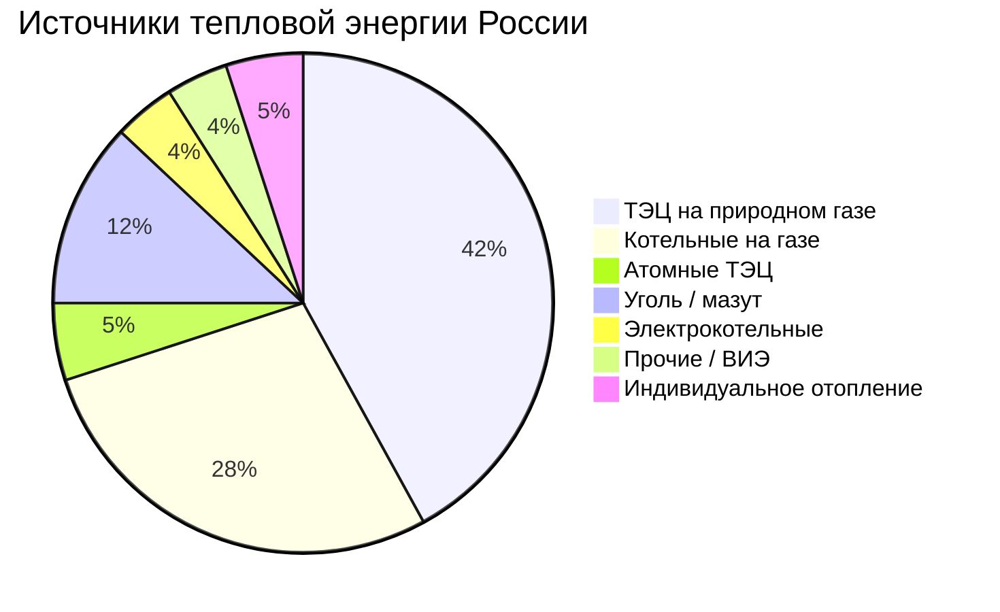

Отопление помещений — наибольшая статья конечного энергопотребления зданий в регионах с умеренным и холодным климатом. По данным Минэнерго РФ, жилищно-коммунальный сектор России потребляет около 35–40 % суммарной тепловой энергии страны, причём около 65 % этого тепла поставляется централизованными теплосетями. Профиль теплопотребления отличается резко выраженной сезонностью, сильной зависимостью от климата и разнообразием источников тепловой энергии.

## Расчёт тепловой нагрузки

Мгновенная тепловая нагрузка здания:


Q_h = (UA)_{env} \cdot (T_{in} - T_{out}) + \dot{m}_{vent} \cdot c_p \cdot (T_{in} - T_{out})


Где:
- $(UA)_{env}$ — суммарный коэффициент теплопотерь через ограждающие конструкции, Вт/К;
- $\dot{m}_{vent}$ — массовый расход вентиляционного воздуха, кг/с;
- $c_p = 1\,005$ Дж/(кг·К) — теплоёмкость воздуха;
- $T_{in}$, $T_{out}$ — расчётные температуры внутри и снаружи, К.

Годовой расход тепловой энергии через градусо-дни отопления (ГДО, HDD):


E_{heat} = \frac{(UA)_{env} \cdot HDD \cdot 86\,400}{\eta_{sys}}


Где $HDD = \sum_{i=1}^{n} \max(T_{base} - T_{avg,i},\; 0)$, базовая температура $T_{base} = +8\,°C$ по СП 131.13330 (метеорология); $\eta_{sys}$ — КПД системы теплоснабжения.

## Градусо-дни отопления по городам России


| Город | HDD, °C·сут | Продолжительность отопительного периода, сут |
|---|---|---|
| Якутск | 11 800 | 247 |
| Новосибирск | 6 600 | 220 |
| Екатеринбург | 5 800 | 212 |
| Казань | 5 200 | 204 |
| Москва | 4 943 | 205 |
| Санкт-Петербург | 4 400 | 213 |
| Нижний Новгород | 5 100 | 207 |
| Краснодар | 2 200 | 147 |
| Сочи | 1 100 | 100 |


## Виды топлива и системы отопления


| Энергоноситель | Типовые системы | Диапазон КПД | Ориентировочные затраты (Россия) | Выбросы CO₂ |
|---|---|---|---|---|
| Природный газ | Котёл, централизованное ТС | 80–98 % (AFUE) | 2 000–4 000 руб./Гкал | 56 кг CO₂/ГДж |
| Электросопротивление | Конвектор, тёплый пол | 100 % (на объекте) | 8 000–15 000 руб./Гкал | 430–480 г CO₂/кВт·ч |
| Тепловой насос (воздух–вода) | Моноблок, сплит | 250–420 % (COP) | 3 000–7 000 руб./Гкал | 115–160 г CO₂/кВт·ч |
| Мазут / дизельное топливо | Котёл | 82–87 % | 8 000–14 000 руб./Гкал | 74 кг CO₂/ГДж |
| Пеллеты / биомасса | Котёл | 80–90 % | 4 000–7 000 руб./Гкал | ~0 (CO₂-нейтральная) |
| Централизованное ТС (ЦТ) | Тепловой ввод, ИТП | 88–95 % (на нагрузке) | 1 500–4 000 руб./Гкал | зависит от источника |


В России централизованное теплоснабжение (ЦТ) покрывает около 43 % суммарного теплопотребления страны (IEA, 2022) — самая высокая доля в мире. Природный газ обеспечивает около 70 % производства тепла на ТЭЦ и котельных.





## Показатели КПД систем отопления

**AFUE (Annual Fuel Utilization Efficiency)** — годовой КПД газовых и жидкотопливных котлов и печей:


AFUE = \frac{Q_{useful,seasonal}}{E_{fuel,seasonal}} \times 100\,\%


Учитывает потери в режиме ожидания, цикловые потери и пуск/останов горелки. Конденсационные котлы достигают $AFUE = 90$–$98\,\%$ за счёт рекуперации скрытой теплоты дымовых газов.

**HSPF (Heating Seasonal Performance Factor)** — сезонный коэффициент отопительной производительности воздушных тепловых насосов (США):


HSPF = \frac{Q_{heat,season}}{W_{el,season}}, \quad \left[\frac{\text{кДж}}{\text{Вт·ч}}\right]


Современные холодноклиматические тепловые насосы достигают $HSPF = 10$–$13$, что соответствует среднесезонному $COP = 2{,}9$–$3{,}8$.

**Годовое потребление:**


E_{annual} = \frac{Q_{seasonal}}{\eta_{seasonal}}


### Числовой пример: сравнение газового котла и теплового насоса

Жилой дом в Москве, $Q_{seasonal} = 60\,\text{ГДж/год}$ (потребность в тепле).

**Газовый котёл**, $AFUE = 0{,}92$:
$$E_{gas} = \frac{60}{0{,}92} = 65{,}2\,\text{ГДж} = 18\,111\,\text{м}^3 \text{ газа при теплотворности 34,0 МДж/м}^3$$

При тарифе 7 500 руб./1000 м³: **135 850 руб./год**.

**Воздушный тепловой насос**, $COP_{seasonal} = 2{,}8$ (Москва, температурный режим с преобладанием $-5$–$0\,°C$):
$$W_{el} = \frac{60 \times 10^3}{2{,}8 \times 3{,}6} = 5\,952\,\text{кВт·ч}$$

При тарифе 6{,}5 руб./кВт·ч (одноставочный, Москва): **38 690 руб./год**.

Разница составляет около 97 000 руб./год в пользу теплового насоса при указанных тарифах. При расчёте по первичной энергии (газ: $f_{prim} = 1{,}05$; электроэнергия: $f_{prim} = 3{,}0$):
- Котёл: $65{,}2 \times 1{,}05 = 68{,}5$ ГДж первичной энергии;
- ТН: $5{,}952 \times 3{,}6 \times 3{,}0 = 64{,}3$ ГДж первичной энергии.

При $COP = 2{,}8$ и $f_{prim}^{el} = 3{,}0$ тепловой насос лишь незначительно выигрывает по первичной энергии. Безубыточность $COP_{break-even}$ при котле $AFUE = 0{,}92$:

$$COP_{be} = \frac{f_{prim}^{el}}{f_{prim}^{gas} / AFUE} = \frac{3{,}0}{1{,}05 / 0{,}92} \approx 2{,}63$$

Тепловой насос с $COP > 2{,}63$ снижает потребление первичной энергии относительно конденсационного газового котла.

## Пиковая нагрузка отопления

Соотношение пиковой и средней нагрузки в отопительный период:


\frac{Q_{peak}}{Q_{avg}} = \frac{T_{in} - T_{design}}{T_{in} - \overline{T}_{heating}}


Для Москвы: $T_{design} = -26\,°C$ (СНИП, обеспеченность 0,92), $T_{in} = +20\,°C$, $\overline{T}_{heating} = -3{,}1\,°C$:

$$\frac{Q_{peak}}{Q_{avg}} = \frac{20 - (-26)}{20 - (-3{,}1)} = \frac{46}{23{,}1} \approx 2{,}0$$

Пиковая нагрузка вдвое превышает среднесезонную. Это определяет мощность котлов и размер тепловых пунктов.

## Стратегии снижения теплопотребления

**1. Теплозащита ограждающих конструкций.** Повышение приведённого сопротивления теплопередаче до требований СП 50.13330-2012 («базовое» или «повышенное требование») снижает тепловые нагрузки на 25–50 %.

**2. Модернизация оборудования.** Замена котлов с AFUE 70 % на конденсационные с AFUE 96 % сокращает расход газа на 37 % при неизменной нагрузке. Переход на тепловой насос с $COP = 3{,}0$ при том же источнике тепла снижает затраты на отопление в 2–3 раза.

**3. Ночное снижение температуры.** Автоматическое снижение уставки на 3–5 °C в ночной период (23:00–06:00) экономит 8–15 % тепловой энергии.

**4. Зональное управление.** Разделение здания на тепловые зоны с индивидуальными регуляторами (термостатические клапаны, комнатные термостаты) снижает теплопотребление на 10–20 %.

**5. Рекуперация тепла вентиляционного воздуха.** Теплоутилизаторы (роторные, пластинчатые, с промежуточным теплоносителем) с КПД 60–85 % снижают вентиляционную нагрузку на отопление на 50–70 %.

## Тенденция электрификации отопления

По сценариям МЭА (Net Zero Emissions by 2050), к 2030 году продажи тепловых насосов должны занять не менее 50 % рынка нового отопительного оборудования. В Европе доля тепловых насосов среди новых жилых зданий достигла 45 % в 2023 году (EHPA). В России рынок тепловых насосов пока невелик (~30 тыс. ед./год), но ежегодно растёт на 15–20 %.

Ключевые технические требования к успешной электрификации отопления:
- тепловые насосы для холодного климата с паспортной мощностью при $-15\,°C$ (стандарт EN 14825);
- низкотемпературные системы распределения тепла (тёплые полы, конвекторы с увеличенной поверхностью);
- интеграция с ВИЭ (солнечные коллекторы, ФЭС) для снижения первичного энергопотребления.

## Связанные разделы

- Энергопотребление на охлаждение
- Вентиляция: потребление энергии
- Горячее водоснабжение
- Паттерны энергопотребления: секторальный анализ
