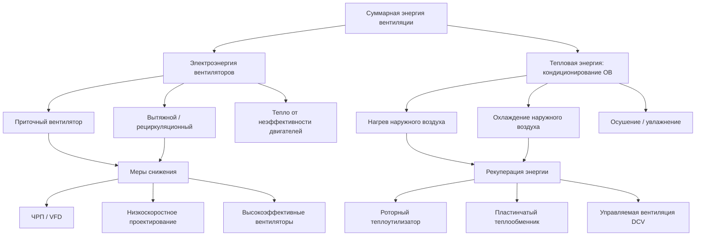

Потребление энергии на вентиляцию (электроэнергия вентиляторов плюс тепловые нагрузки от подачи наружного воздуха) составляет 15–35 % от суммарного потребления систем ОВК в коммерческих зданиях. В учебных заведениях, больницах и зданиях с требованием 100 % наружного воздуха эта доля достигает 40–50 %. Грамотная оптимизация вентиляции — один из наиболее экономически эффективных инструментов снижения энергопотребления в зданиях.

## Расчёт мощности вентилятора

Теоретическая электрическая мощность вентиляторного агрегата:


P_{fan} = \frac{\dot{V} \cdot \Delta p_{total}}{\eta_{fan} \cdot \eta_{motor} \cdot \eta_{drive}}


Где:
- $\dot{V}$ — объёмный расход воздуха, м³/с;
- $\Delta p_{total}$ — полное давление, развиваемое вентилятором, Па;
- $\eta_{fan}$ — КПД вентилятора (0,55–0,82 в зависимости от типа);
- $\eta_{motor}$ — КПД электродвигателя (0,88–0,97);
- $\eta_{drive}$ — КПД привода: ременной — 0,93–0,97; прямой — 1,00.

Годовое потребление энергии при переменном расходе (ЧРП, variable frequency drive, VFD):


P_{VFD} = P_{rated} \cdot \left(\frac{\dot{V}_{actual}}{\dot{V}_{design}}\right)^3


Кубическая зависимость мощности от расхода делает частотное регулирование исключительно эффективным: снижение производительности на 20 % уменьшает мощность почти в 2 раза ($0{,}8^3 \approx 0{,}51$).

## Составляющие потерь давления в системе


\Delta p_{total} = \Delta p_{filters} + \Delta p_{coils} + \Delta p_{duct} + \Delta p_{fittings} + \Delta p_{dampers} + \Delta p_{terminals}


Потери давления на трение в воздуховодах (уравнение Дарси–Вейсбаха):


\Delta p_{duct} = \lambda \cdot \frac{L}{D_h} \cdot \frac{\rho \cdot v^2}{2}


Где:
- $\lambda$ — коэффициент гидравлического трения (0,018–0,035 для стальных воздуховодов);
- $L$ — длина участка, м;
- $D_h$ — гидравлический диаметр воздуховода, м;
- $\rho \approx 1{,}2$ кг/м³ — плотность воздуха;
- $v$ — скорость воздуха, м/с.

Проектировочные скорости для минимизации потерь:
- главные магистральные воздуховоды: 6–10 м/с;
- ответвления: 4–7 м/с;
- распределительные воздуховоды: 2,5–5 м/с.





## Ограничения по удельной мощности вентиляторов

### ASHRAE 90.1-2022


| Тип системы | Wmax, Вт/(м³/ч) | Вт/cfm |
|---|---|---|
| CAV с электронагревом | 0,93 | 0,40 |
| CAV с иным источником тепла | 1,16 | 0,50 |
| VAV с регулированием | 1,51 | 0,65 |
| Однозонная VAV / CAV | 1,04 | 0,45 |
| Система с рекуперацией | 2,10 | 0,90 |
| Лабораторные вытяжные системы | 3,03 | 1,30 |


### СП 60.13330-2020 (Россия)

СП 60.13330 нормирует удельную установленную мощность вентиляторов (УУМВ) в Вт/(м³/ч) в зависимости от класса системы. При реализации проектов, претендующих на класс энергоэффективности «А» или «А+» по ФЗ-261, удельная мощность должна соответствовать наиболее жёстким значениям, установленным в приказе Минстроя.

## Удельное потребление по типам систем


| Конфигурация системы | Диапазон, кВт·ч/м² | Доля в ОВК | Ключевая оптимизация |
|---|---|---|---|
| VAV с концевым подогревом | 8–15 | 25–35 % | Сброс статического давления |
| CAV однозонная | 12–20 | 30–40 % | Расписание по занятости |
| DOAS (100 % наружный воздух) | 5–10 | 15–25 % | Рекуперация + DCV |
| Напольная вентиляция | 6–12 | 20–30 % | Низкое давление |
| Вентиляция вытеснением | 4–8 | 15–20 % | Естественная конвекция |
| Лабораторная вытяжка (100 % ОВ) | 25–40 | 40–50 % | VAV вытяжные шкафы + DCV |


## Управляемая вентиляция по потребности (DCV)

DCV (demand-controlled ventilation, управляемая вентиляция по потребности) модулирует подачу наружного воздуха на основе фактической занятости помещений (датчики CO₂, PIR, счётчики посетителей). Потребление энергии при DCV:


E_{DCV} = E_{base} \cdot \left(\frac{OA_{min} + OA_{var} \cdot f_{occ}}{OA_{design}}\right)


Где:
- $OA_{min}$ — минимальный расход наружного воздуха при отсутствии людей, м³/с;
- $OA_{var}$ — расход, зависящий от занятости, м³/с;
- $f_{occ}$ — средневзвешенная доля занятости в рабочие часы (0,3–0,8).


| Тип помещения | Средняя занятость | Экономия электроэнергии вентиляторов | Экономия тепловой энергии |
|---|---|---|---|
| Конференц-залы | 30–40 % | 15–30 % | 25–45 % |
| Учебные аудитории | 40–65 % | 10–25 % | 20–35 % |
| Торговые залы | 50–70 % | 8–18 % | 15–28 % |
| Офисные помещения | 60–80 % | 5–15 % | 10–22 % |
| Спортивные залы | 25–50 % | 20–35 % | 30–50 % |


Срок окупаемости DCV: 2–5 лет в зависимости от сложности монтажа и тарифов. Наибольший эффект — в помещениях с высокой изменчивостью занятости и в климатах с экстремальными температурами.

## Тепловая нагрузка от подачи наружного воздуха

Кондиционирование наружного воздуха (ОВ, outdoor air) нередко является доминирующей статьёй вентиляционной нагрузки, особенно в холодном климате и в системах с высоким требованием по расходу ОВ:


Q_{OA} = \rho_{air} \cdot \dot{V}_{OA} \cdot c_p \cdot \left|T_{OA} - T_{supply}\right|


### Числовой пример: вентиляция офиса в Москве

Офис на 120 сотрудников, норма ОВ по ГОСТ 30494 — 60 м³/ч на человека, итого $\dot{V}_{OA} = 7\,200\,\text{м}^3/\text{ч} = 2{,}0\,\text{м}^3/\text{с}$.

Зимняя нагрузка: $T_{OA} = -26\,°C$ (расчётная), $T_{supply} = +18\,°C$:
$$Q_{OA,heat} = 1{,}2 \times 2{,}0 \times 1{,}005 \times (18 - (-26)) \approx 106\,\text{кВт}$$

Это тепловая нагрузка вентиляции при расчётной температуре. При наличии роторного теплоутилизатора с КПД 80 %: $Q_{OA,recovered} = 0{,}80 \times 106 = 84{,}8\,\text{кВт}$, дополнительный нагрев — только $21{,}2\,\text{кВт}$.

**Электрическая мощность вентилятора** (приточный агрегат): $\Delta p = 750\,\text{Па}$, $\eta_{fan} = 0{,}72$, $\eta_{motor} = 0{,}95$:
$$P_{fan} = \frac{2{,}0 \times 750}{0{,}72 \times 0{,}95} \approx 2\,193\,\text{Вт} \approx 2{,}2\,\text{кВт}$$

При 2 500 ч/год: $E_{fan} = 2{,}2 \times 2\,500 = 5\,500\,\text{кВт·ч/год}$.

## Эффективность теплоутилизаторов

Эффективность рекуперации тепла:


\varepsilon_t = \frac{T_{OA,after} - T_{OA,before}}{T_{exhaust} - T_{OA,before}}



| Тип теплоутилизатора | Теплообмен | КПД по теплу | Передача влаги | Типичный перепад давления |
|---|---|---|---|---|
| Роторный (энтальпийный) | явное + скрытое | 70–85 % | да | 100–250 Па |
| Пластинчатый перекрёстный | только явное | 50–75 % | нет | 100–200 Па |
| Пластинчатый противоточный | только явное | 75–90 % | нет | 150–300 Па |
| Тепловые трубки | только явное | 45–65 % | нет | 50–150 Па |
| Промежуточный гликолевый контур | только явное | 50–65 % | нет | 100–200 Па |


Рекуперация экономически обоснована, когда $\dot{V}_{OA} > 1\,500$–$2\,500\,\text{м}^3/\text{ч}$ и установка работает более 4 000 ч/год. Дополнительные потери давления (100–300 Па) должны быть перекрыты тепловой экономией.

## Пределы по EN 16798

Европейский стандарт EN 16798-3 вводит удельную мощность вентиляции (SFP, specific fan power):


SFP = \frac{P_{fan}}{\dot{V}_{design}}, \quad \left[\frac{\text{Вт}}{\text{м}^3/\text{с}}\right] = \left[\text{Па}\right]


Классификация по EN 16798: SFP1 (< 500 Па) — наивысший класс; SFP2 (500–750 Па); SFP3 (750–1 250 Па); SFP4 (> 1 250 Па). Рекомендуемый минимум для новых зданий — SFP2 или лучше.

## Стратегии оптимизации вентиляции

**Снижение электропотребления вентиляторов:**
- Высокоэффективные вентиляторы с назад загнутыми лопатками или аэродинамическими профилями ($\eta_{fan} \geq 0{,}72$);
- ЧРП на всех вентиляторах мощностью более 1 кВт (требование Директивы EcoDesign 640/2009/EC; в России рекомендуется ФЗ-261);
- Сброс уставки статического давления (supply air pressure reset) на основе положения концевых VAV-блоков;
- Уменьшение скоростей в воздуховодах ниже 8 м/с в магистралях.

**Управление подачей наружного воздуха:**
- DCV с датчиками CO₂ в помещениях с переменной занятостью;
- Режим экономайзера: бесплатное охлаждение при $T_{OA} < T_{supply}$ (как по температуре, так и по энтальпии);
- Системы DOAS (dedicated outdoor air systems): разделение вентиляции и нагрузок комфорта;
- Ночное доохлаждение (night purge) в жаркий сезон для сброса тепловой массы здания.

**Комплексная оценка:**

При анализе энергосберегающего потенциала мер по вентиляции необходимо учитывать как электропотребление вентиляторов, так и тепловые нагрузки от наружного воздуха. Оптимальное решение определяется балансом между нормативным качеством воздуха (ГОСТ 30494, EN 16798, ASHRAE 62.1) и энергетическими затратами на его обеспечение.
