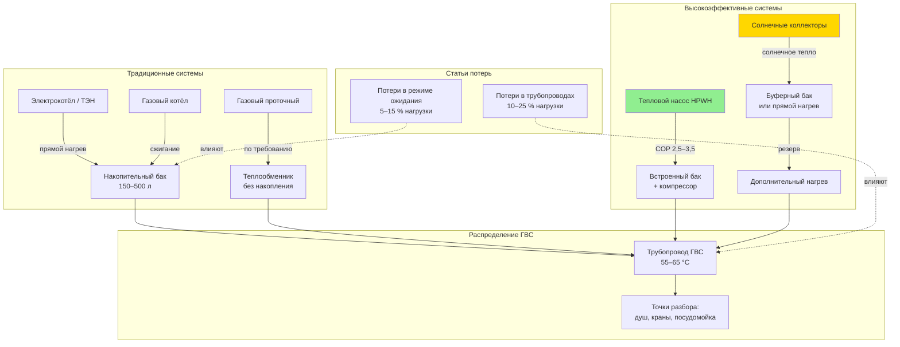

Горячее водоснабжение (ГВС) — вторая по значимости статья конечного энергопотребления в жилых зданиях и существенная нагрузка в гостиницах, больницах, предприятиях общественного питания и спортивных объектах. По данным Минстроя России, в типовом многоквартирном доме ГВС занимает 15–25 % суммарного теплопотребления. В коммерческих зданиях эта доля ниже, но в отдельных объектах (прачечные, пищеблоки) может достигать 30–40 %.

## Расчёт тепловой нагрузки ГВС

Мгновенная тепловая мощность системы ГВС:


Q_{dhw} = \dot{m}_{dhw} \cdot c_p \cdot (T_{hot} - T_{cold})


Где:
- $\dot{m}_{dhw}$ — массовый расход горячей воды, кг/с;
- $c_p = 4{,}186$ кДж/(кг·К);
- $T_{hot}$ — нормируемая температура в точке разбора (СП 30.13330: не ниже +60 °C для открытой схемы ЦТС; не ниже +55 °C для закрытой);
- $T_{cold}$ — температура холодной воды на вводе (5–15 °C в зависимости от сезона и региона).

Суточное энергопотребление:


E_{dhw,day} = \frac{Q_{dhw,useful}}{\eta_{sys}} + Q_{standby} \cdot t_{standby}


Где $\eta_{sys}$ — КПД системы нагрева; $Q_{standby}$ — тепловые потери бака-аккумулятора и трубопроводов ЦГВ в режиме ожидания.

### Числовой пример: жилой МКД в Москве

МКД на 80 квартир. Норматив расхода горячей воды по СП 30.13330: $75$ л/(чел·сут). Средняя заселённость — 2,5 чел./кв., итого $n = 200$ человек.

$$\dot{V}_{dhw} = \frac{200 \times 75}{1\,000 \times 24 \times 3\,600} = 1{,}736 \times 10^{-4}\,\text{м}^3/\text{с}$$

При $\Delta T = 60 - 5 = 55\,°C$:

$$Q_{dhw,avg} = 1{,}736 \times 10^{-4} \times 1\,000 \times 4{,}186 \times 55 \approx 39{,}9\,\text{кВт}$$

Годовая тепловая энергия ГВС (с учётом среднегодовой $T_{cold} \approx 8\,°C$ и $\eta_{sys} = 0{,}90$):

$$E_{dhw,year} = \frac{200 \times 75 \times 365 \times 4{,}186 \times (60 - 8)}{0{,}90 \times 3{,}6 \times 10^6} \approx 246\,\text{МВт·ч/год} = 211\,\text{Гкал/год}$$

## Технологии водонагрева и их КПД


| Тип системы | EF / UEF | КПД / COP | Ориентировочные расходы на ГВС (руб./Гкал) | Применение |
|---|---|---|---|---|
| Электронагреватель (сопротивление) | 0,88–0,93 | 1,0 | 12 000–18 000 | ИЖС, резервный |
| Газовый накопительный | 0,59–0,67 | 0,62–0,70 | 3 500–6 000 | ИЖС, малые здания |
| Газовый проточный конденсационный | 0,87–0,96 | 0,90–0,98 | 2 500–4 500 | Малые здания |
| Тепловой насос (HPWH) | 2,2–3,8 | 2,5–3,5 | 4 000–7 000 | Жилые, коммерческие |
| ЦТС / бойлерная установка | — | 0,85–0,94 | 1 500–4 000 | МКД, гостиницы |
| Солнечный коллектор + резерв | 1,5–2,5 | — | 1 000–3 000 | Юг России, ИЖС |


*Тарифные диапазоны отражают региональную вариацию в России (2023–2024 гг.).*

Унифицированный коэффициент энергии (UEF, unified energy factor):


UEF = \frac{E_{dhw,delivered}}{E_{input,annual}}


Учитывает реальные профили потребления, потери в режиме ожидания и циклы включения/выключения.

## Тепловые насосы для ГВС (HPWH)

Тепловой насос для ГВС (heat pump water heater, HPWH) извлекает теплоту из окружающего воздуха, достигая $COP = 2{,}5$–$3{,}5$ — экономия 50–65 % по сравнению с электросопротивлением.

Энергетический баланс:


Q_{dhw} = COP \cdot W_{comp} = W_{comp} + Q_{air}


Зависимость $COP$ от температуры воздуха:


COP(T_{air}) \approx COP_{ref} \cdot \left(1 - k \cdot (T_{ref} - T_{air})\right)


Где $k \approx 0{,}015$–$0{,}025$ (°C)$^{-1}$; $T_{ref} = 20\,°C$ — нормативная температура; $COP_{ref}$ — паспортный COP.

Особенности применения HPWH в России:
- Требует воздушного объёма ~0{,}5–1{,}0 м³ вокруг агрегата для теплообмена;
- Охлаждает и осушает воздух помещения (может использоваться как вспомогательное охлаждение летом);
- При $T_{air} < +5\,°C$ включается резервный ТЭН, $COP$ снижается до 1,0–1,5;
- Больший пиковый ток при включении компрессора — учитывать при проектировании электроснабжения.

## Солнечные тепловые системы ГВС

Солнечная доля (SF, solar fraction) — доля нагрузки ГВС, покрываемая солнечной тепловой энергией:


SF = \frac{Q_{solar}}{Q_{total}}


Тепловая производительность коллектора:


Q_{solar} = A_c \cdot \eta_{col} \cdot I_T \cdot \tau


Где:
- $A_c$ — площадь апертуры коллектора, м²;
- $\eta_{col}$ — мгновенный КПД коллектора (0,40–0,75 — плоский; 0,55–0,80 — вакуумный);
- $I_T$ — суммарная солнечная радиация на плоскость коллектора, Вт/м²;
- $\tau$ — расчётный интервал.


| Тип коллектора | КПД при $\Delta T = 30$ К | КПД при $\Delta T = 50$ К | Пригодность для зимы |
|---|---|---|---|
| Плоский остеклённый | 45–60 % | 30–45 % | ограниченно |
| Вакуумный трубчатый | 55–75 % | 45–65 % | умеренная |
| Концентрирующий | 50–70 % | 40–60 % | только прямая радиация |


Типичная солнечная доля по регионам России (система 4–6 м²/домохозяйство):
- Краснодарский край: SF = 60–80 % (летом), 50–65 % (среднегодовой);
- Москва: SF = 25–40 % среднегодовой;
- Новосибирск: SF = 15–30 % среднегодовой.

## Схемы ГВС и потери в системе





## Потери в режиме ожидания (standby losses)

Накопительный бак непрерывно теряет тепло через теплоизоляцию:


Q_{standby} = (UA)_{tank} \cdot (T_{tank} - T_{amb})


Где $(UA)_{tank}$ — суммарная тепловая проводимость корпуса, кВт/К. Для современных баков с полиуретановой изоляцией 50–80 мм: $(UA)_{tank} \approx 0{,}003$–$0{,}006$ кВт/К.

### Пример

Бак 200 л, $T_{tank} = 60\,°C$, $T_{amb} = 20\,°C$, $(UA) = 0{,}005$ кВт/К:
$$Q_{standby} = 0{,}005 \times (60 - 20) = 0{,}20\,\text{кВт} = 4{,}8\,\text{кВт·ч/сут}$$

Потери в режиме ожидания составляют ~14 % от полезного теплопотребления при суточном разборе 300 л ($\Delta T = 50\,°C$): $300 \times 4{,}186 \times 50 / 3\,600 = 17{,}4$ кВт·ч.

Снижение достигается улучшенной изоляцией (RSI ≥ 3,5 — толщина 80–100 мм ПУ-пены) и термоизоляцией подводящих трубопроводов ≥ 25 мм по СП 61.13330.

## Потери в трубопроводах ЦГВ

Потери тепла в распределительных трубопроводах:


q_{pipe} = \frac{\pi \cdot \Delta T}{R_{ins} + R_{wall} + R_{conv}}


В ЦГВ-системах с постоянной циркуляцией потери трубопроводов составляют 15–25 % от суточного теплопотребления. Меры: изоляция по СП 61.13330, автоматика включения циркуляционного насоса по расписанию или по сигналу датчика.

## Профили суточного потребления

Типичные пиковые периоды водоразбора:
- **Жилые здания:** утро (06:00–09:00) и вечер (19:00–22:00);
- **Гостиницы:** утро (07:00–10:00);
- **Рестораны:** подготовка (10:00–12:00) и уборка (20:00–23:00);
- **Больницы:** равномерная нагрузка с пиком в первую половину дня.


| Тип объекта | Норматив, л/(чел·сут) | Температура, °C |
|---|---|---|
| МКД | 75–105 | 55–65 |
| Гостиница (3–4 звезды) | 120–180 | 60–65 |
| Больница | 200–250 | 60–65 |
| Школа | 25–40 | 55–60 |
| Ресторан, кафе | 12–18 (на порцию) | 60 |
| Спортивный комплекс | 100–150 | 60 |


## Инновационные технологии

**Рекуперация тепла сточных вод (DWHR, drain water heat recovery).** Теплообменник на сливном трубопроводе возвращает 30–60 % тепла из тёплых сточных вод (душ, посудомоечные машины). Срок окупаемости — 3–6 лет.

**Использование отходящего тепла чиллера (desuperheating).** В летний период компрессор чиллера работает при высоком перегреве: отбор тепла из горячего газа в промежуточном теплообменнике позволяет получить «бесплатное» ГВС при $T_{hw} = 45$–$55\,°C$.

**Умное управление HPWH.** Оптимизация цикла нагрева по тарифам ВПЭ (время пиковой энергии): предзаряд бака в ночное время при минимальном тарифе.

**Grid-interactive водонагреватели.** Участие в программах спроса электросети: снижение или остановка нагрева в пиковые часы с использованием теплоёмкости бака как виртуального аккумулятора.

## Меры повышения энергоэффективности ГВС

1. Оптимальная температура хранения — 60 °C (минимум по санитарным нормам СанПиН 2.1.4.2496 против легионеллы, оптимум по потерям).
2. Изоляция бака и подводящих трубопроводов по СП 61.13330.
3. Водосберегающая арматура (душевые насадки с расходом ≤ 8 л/мин против стандартных 12–15 л/мин).
4. Автоматика циркуляционного насоса ЦГВ — по расписанию или датчику занятости.
5. Переход на HPWH при проектировании новых зданий и реконструкции.

Совокупная экономия от комплекса мер — 25–45 % от исходного теплопотребления на ГВС с простым сроком окупаемости 3–7 лет.
