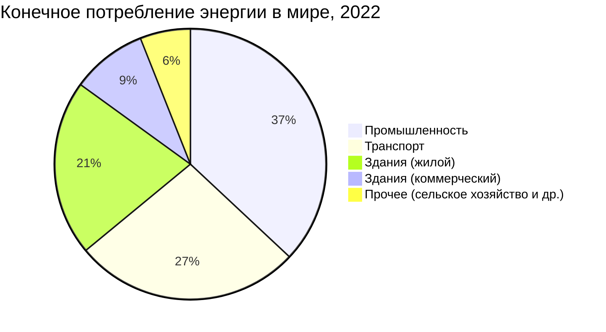
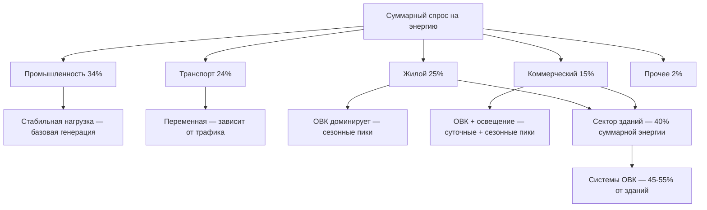

Понимание структуры энергопотребления по секторам экономики — исходная точка для целеориентированного проектирования систем ОВК, обоснования инвестиций в энергоэффективность и соответствия требованиям ФЗ-261 «Об энергосбережении». Для специалистов ОВК ключевой является доля секторов зданий (жилой + коммерческий), потребляющих около 30–40 % первичной энергии страны.

## Глобальный энергетический баланс по секторам

По данным IEA (World Energy Outlook 2023), конечное потребление энергии по секторам распределяется следующим образом:





## Энергобаланс России по секторам

По данным Минэнерго РФ (Энергетическая стратегия России до 2035 года, 2020) и Росстата:


| Сектор | Потребление, Мтнэ | Доля, % | Роль ОВК |
|---|---|---|---|
| Промышленность | 280–310 | 33–36 | 15–25 % в заводских зданиях |
| Транспорт | 190–210 | 22–24 | < 5 % (HVAC транспортных средств) |
| Жилой сектор | 200–230 | 24–27 | 55–70 % (отопление + ГВС) |
| Коммерческий / общественный | 120–150 | 14–17 | 40–55 % |
| Сельское хозяйство | 30–40 | 3–5 | 20–30 % (теплицы, хранилища) |


*1 Мтнэ = 1,163 ТВт·ч = 41,87 ПДж.*

Суммарная доля зданий (жилой + коммерческий + общественный) — около 40–44 % конечного энергопотребления. ОВК формирует большую часть этой нагрузки, особенно в климатически сложных регионах.

## Жилой сектор

Жилые здания (МКД и ИЖС) потребляют около 50 % тепловой энергии, производимой системами централизованного теплоснабжения России. Основные статьи потребления:


| Статья | Доля |
|---|---|
| Отопление | 52–60 % |
| Горячее водоснабжение | 15–22 % |
| Бытовые электроприборы | 10–15 % |
| Освещение | 5–8 % |
| Охлаждение | 3–7 % |
| Прочее | 3–5 % |


### Удельное энергопотребление (EUI) жилого сектора

По регионам России удельное потребление тепловой энергии на отопление варьируется от 40–80 кВт·ч/(м²·год) для новостроек класса «А» до 150–250 кВт·ч/(м²·год) для жилфонда 1960–1980-х годов постройки.

Средняя энергоинтенсивность по жилому парку России:


EUI_{res} = \frac{E_{res,total}}{A_{floor,total}}


По оценке Минстроя РФ: $EUI_{res} \approx 110$–$150$ кВт·ч/(м²·год) по суммарному потреблению на отопление, ГВС и электричество. Это в 1,5–2 раза выше среднеевропейских показателей — потенциал снижения через повышение теплозащиты (СП 50.13330) и модернизацию ОВК огромен.

### Сезонная вариация

Коэффициент сезонной нагрузки ($SLF = E_{avg,month}/E_{peak,month}$) для жилого сектора в Москве составляет около 0,35–0,45: потребление в январе–феврале в 2,2–2,8 раза выше, чем в апреле–мае.

## Коммерческий и общественный сектор

Коммерческие здания (офисы, ТРЦ, гостиницы) и общественные здания (больницы, школы, административные учреждения) формируют более равномерный по режимам нагрузки профиль потребления.


| Тип здания | EUI, кВт·ч/(м²·год) | Доля ОВК |
|---|---|---|
| Офисное | 100–200 | 40–55 % |
| ТРЦ | 150–280 | 35–50 % |
| Гостиница | 200–350 | 40–55 % |
| Больница / поликлиника | 280–550 | 45–60 % |
| Школа | 80–160 | 40–52 % |
| Спортивный объект | 120–220 | 40–55 % |


Коммерческие здания характеризуются высокими внутренними тепловыделениями (люди, IT-оборудование, освещение), из-за чего нагрузка охлаждения нередко преобладает над отоплением даже в умеренном климате:


CHR = \frac{E_{cool}}{E_{heat}}


Значения CHR: 0,3–0,7 — Москва; 0,8–1,5 — Краснодар; > 2,0 — ЦОД вне зависимости от климата.

## Промышленный сектор

Промышленность — крупнейший потребитель первичной энергии. Применение ОВК в промышленности:
- Климатизация производственных помещений и офисной части (15–20 % потребления промышленных зданий);
- Технологическое охлаждение (холодильные установки, прецизионные кондиционеры);
- Вентиляция взрывоопасных зон, вытяжные системы (специализированные требования).

Сезонная вариация промышленного потребления низкая: производственные графики и технологические процессы — основные факторы, а не климат.

Энергоинтенсивность промышленного сектора — ключевой показатель конкурентоспособности:


I_{ind} = \frac{E_{ind}}{GDP_{ind}}, \quad \left[\frac{\text{кДж}}{\text{руб.}}\right]


Снижение $I_{ind}$ на 1 % при объёме промышленного потребления 300 Мтнэ эквивалентно экономии 3 Мтнэ = ~3,5 ТВт·ч/год.

## Транспортный сектор

ОВК транспортных средств составляет 3–7 % потребления топлива для легковых автомобилей при +35 °C на улице. Для электробусов и электровозов система климатизации — значимая нагрузка на тяговую аккумуляторную батарею (10–15 % дальности пробега в жаркую погоду).

## Взаимодействие секторов с электросетью





Пиковый спрос на электроэнергию в России определяется прежде всего жилым и коммерческим секторами:
- Зимний пик (декабрь–январь): электрическое отопление, освещение, бытовая техника;
- Летний пик (июль–август): кондиционирование воздуха, холодоснабжение.

По мере электрификации отопления (тепловые насосы) зимний пик будет возрастать, требуя управления спросом (demand response) и интеграции накопителей энергии.

## Влияние ФЗ-261 и энергетической политики

ФЗ-261 «Об энергосбережении» устанавливает обязательные требования для всех секторов:
- обязательная энергетическая паспортизация зданий;
- обязательная установка приборов учёта (электроэнергии, тепла, газа, воды);
- целевые показатели снижения энергоёмкости ВВП.

Программа «Энергосбережение и повышение энергетической эффективности» (Постановление Правительства РФ № 1234) предусматривает снижение энергоёмкости ВВП на 30 % к 2030 году относительно уровня 2007 года.

Потенциал сокращения суммарного потребления через меры в ОВК:
- жилой сектор: −25–40 % при модернизации теплозащиты и систем теплоснабжения;
- коммерческий сектор: −20–35 % через современные системы ОВК с BMS и VFD;
- промышленный сектор: −10–20 % через утилизацию отходящего тепла и прецизионное управление климатом.

## Выводы для проектирования ОВК

1. В секторе зданий ОВК — доминирующая нагрузка; высокоэффективное оборудование имеет наибольший системный эффект.
2. Сезонные и суточные профили нагрузок определяют требования к управлению пиковым спросом и экономическую эффективность накопителей энергии.
3. Декарбонизация требует одновременного улучшения теплозащиты и перехода на электрифицированные источники тепла (тепловые насосы, ВИЭ).
4. Секторальная энергетическая статистика — основа для базовых расчётов при энергоаудите по EN 16247 и выбора приоритетных мер.

## Связанные разделы

- Коммерческий сектор: детальный анализ
- Промышленный сектор: специфика промышленных ОВК
- Паттерны энергопотребления: временные профили нагрузки
