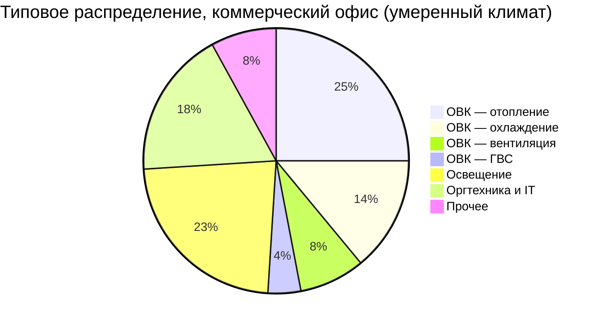

Коммерческий и общественный сектор — второй по величине потребитель энергии в секторе зданий после жилого. По данным Минэнерго РФ, нежилые здания потребляют 120–150 Мтнэ/год, причём системы ОВК формируют 40–55 % этой нагрузки. Детальный анализ энергопотребления по типам зданий необходим для обоснования мер энергосбережения, энергоаудита по EN 16247 и соответствия требованиям ФЗ-261.

## Структура конечного потребления коммерческих зданий





Доля ОВК варьируется от 35 % (склады) до 60 % (больницы), определяя приоритет инвестиций в энергоэффективность.

## Удельное энергопотребление (EUI) по типам зданий

EUI нормализует потребление по площади:


EUI = \frac{\sum_i E_i \cdot f_{prim,i}}{A_{floor}}


Где $E_i$ — потребление $i$-го энергоносителя (кВт·ч/год); $f_{prim,i}$ — коэффициент перехода к первичной энергии; $A_{floor}$ — площадь, м².


| Тип здания | Медиана EUI, кВт·ч/м²·год | 75-й перц., кВт·ч/м² | Доля ОВК | Ключевой фактор |
|---|---|---|---|---|
| ЦОД (дата-центр) | 1 000–2 000 | 2 000–4 000 | 40–50 % | Постоянное охлаждение |
| Ресторан, кафе | 600–900 | 900–1 300 | 30–38 % | Кухонная вытяжка, ГВС |
| Продуктовый гипермаркет | 500–750 | 750–1 100 | 28–35 % | Холодильное оборудование |
| Больница, клиника | 300–550 | 550–800 | 45–60 % | Круглосуточная работа, ОВ |
| Гостиница (3–5 звёзд) | 200–380 | 380–550 | 38–48 % | Номера, ГВС |
| ТРЦ, торговый центр | 180–300 | 300–450 | 35–50 % | Освещение, кондиционирование |
| Офис крупный | 130–220 | 220–330 | 38–48 % | IT-нагрузки, вентиляция |
| Офис малый | 100–200 | 200–320 | 40–50 % | Зависимость от ограждения |
| Школа, учебный центр | 90–180 | 180–280 | 40–52 % | Высокая вентиляция |
| Спортивный объект | 120–240 | 240–380 | 40–55 % | Бассейны, вентиляция зала |
| Складской комплекс | 40–100 | 100–180 | 20–35 % | Минимальный климат |


*Данные скорректированы под российские условия. Для ЦОД применяется коэффициент PUE (Power Usage Effectiveness); EUI приведён без учёта IT-нагрузки.*

## Методология бенчмаркинга

### Нормализация по климату

Погодная поправка EUI:


EUI_{norm} = EUI_{meas} \times \frac{HDD_{ref} + k \cdot CDD_{ref}}{HDD_{act} + k \cdot CDD_{act}}


Где $k$ — отношение энергоинтенсивности охлаждения к отоплению (0,8–1,2 в зависимости от типа здания). Нормативный год определяется из СП 131.13330 (климатология).

### Первичная энергия при нескольких источниках


EUI_{source} = \frac{E_{el} \cdot f_{el} + E_{gas} \cdot f_{gas} + E_{CT} \cdot f_{CT}}{A_{floor}}


Где $f_{el} = 2{,}9$–$3{,}1$ (ЕЭС России), $f_{gas} = 1{,}05$, $f_{CT} = 1{,}4$–$1{,}6$ (централизованное теплоснабжение).

### Числовой пример: офисное здание в Москве

Офисное здание площадью $A = 5\,000\,\text{м}^2$. Годовое потребление:
- электроэнергия: $E_{el} = 400\,000\,\text{кВт·ч}$;
- тепловая энергия ЦТС: $E_{CT} = 350\,\text{Гкал} = 407\,000\,\text{кВт·ч}$.

Сайт-EUI:
$$EUI_{site} = \frac{(400\,000 + 407\,000)}{5\,000} = 161{,}4\,\text{кВт·ч/м}^2\text{·год}$$

Первичная EUI:
$$EUI_{source} = \frac{400\,000 \times 3{,}0 + 407\,000 \times 1{,}5}{5\,000} = \frac{1\,200\,000 + 610\,500}{5\,000} = 362\,\text{кВт·ч/м}^2\text{·год}$$

По нормативу СП 50.13330, для данного типа здания в Москве целевой показатель — EUI по теплу ≤ 80–100 кВт·ч/м²·год (только отопление). Комплексный EUI 162 кВт·ч/м² (сайт) соответствует уровню «хорошего» здания в умеренном климате.

## Распределение ОВК по типам зданий


| Тип здания | Доля ОВК | Доминирующая нагрузка | Режим работы |
|---|---|---|---|
| ЦОД | 40–50 % | Охлаждение (постоянно) | 8 760 ч/год |
| Больница | 45–60 % | Вентиляция + охлаждение | 8 760 ч/год |
| Школа | 40–52 % | Вентиляция + отопление | 1 500–2 000 ч/год |
| Офис | 38–50 % | Отопление + охлаждение | 2 000–2 500 ч/год |
| Гостиница | 38–48 % | Отопление + ГВС | 6 000–7 000 ч/год |
| Торговый центр | 35–50 % | Вентиляция + охлаждение | 3 500–5 000 ч/год |
| Склад (без климата) | 20–35 % | Вентиляция (минимум) | 500–1 500 ч/год |


**Здания с высокой долей ОВК (45–60 %)**

Школы и университеты: высокие нормы наружного воздуха (ГОСТ 30494: 60 м³/ч на человека в классе), большая плотность занятости. Больницы: круглосуточная работа, строгий контроль давления и влажности, 100 % наружный воздух в операционных.

**Здания с умеренной долей ОВК (38–45 %)**

Офисные здания: значительные внутренние тепловыделения от IT-оборудования снижают нагрузку отопления, но увеличивают потребность в охлаждении. Гостиницы: непрерывная работа ОВК в занятых номерах с индивидуальным управлением по зонам.

**Здания с низкой долей ОВК (30–38 %)**

Продуктовые магазины: освещение и холодильные установки доминируют. Склады: минимальный климат-контроль или его отсутствие.

## Влияние климатической зоны

Соотношение охлаждение/отопление меняется радикально:


| Климатическая зона | Отопление | Охлаждение | Вентиляция | ГВС |
|---|---|---|---|---|
| Арктика (Якутск) | 60–70 % | 2–5 % | 20–25 % | 5–8 % |
| Холодная (Новосибирск) | 45–55 % | 8–15 % | 22–28 % | 5–8 % |
| Умеренная (Москва) | 35–45 % | 12–20 % | 25–30 % | 5–8 % |
| Мягкая (Краснодар) | 20–30 % | 22–35 % | 25–30 % | 5–8 % |
| Субтропическая (Сочи) | 10–18 % | 30–45 % | 25–35 % | 5–8 % |


## Возможности снижения EUI

Меры с наибольшим потенциалом в коммерческом секторе:

**1. Оптимизация систем ОВК (−15–30 % EUI ОВК)**

Сброс уставки статического давления, управляемая вентиляция (DCV), оптимальное расписание пуска/останова, режим экономайзера.

**2. Правильный подбор мощности оборудования (−10–25 %)**

Завышенная мощность снижает сезонный КПД из-за работы при малой частичной нагрузке. Расчёт по ASHRAE Manual J (жилой) или Manual N (коммерческий), СП 60.13330.

**3. Теплозащита ограждений (−20–40 %)**

Повышение сопротивления ограждающих конструкций, замена остекления на низкоэмиссионное, воздушная герметизация снижают нагрузки отопления и охлаждения.

**4. Управление нагрузкой (−15–35 %)**

Ночное снижение температуры в нерабочее время, предварительное охлаждение/нагрев тепловой массы здания (thermal flywheel), регулирование в зависимости от занятости.

Экономическое обоснование зависит от $EUI$ здания относительно медианы по типу, местных тарифов и специфики объекта. Здания с $EUI > P_{75}$ — приоритетные кандидаты для полного энергоаудита по EN 16247 с последующей реализацией мероприятий.

## Инструменты бенчмаркинга

- **ENERGY STAR Portfolio Manager (EPA, США)**: онлайн-инструмент для нормализованного сравнения с базой > 800 000 зданий.
- **GIS ЖКХ (Россия)**: реестр потребления МКД; для коммерческих зданий — ГИС «Энергоэффективность».
- **ASHRAE Building EQ**: инструмент оценки и целеполагания EUI.
- **EN ISO 52120 / ISO 50001**: система энергетического менеджмента с обязательным мониторингом EUI.

Понимание распределения EUI по типам зданий позволяет:
- ставить реалистичные цели при проектировании и реконструкции;
- обосновывать капитальные вложения в энергоэффективность;
- соответствовать требованиям ФЗ-261 и СП 50.13330 в части целевых показателей.
