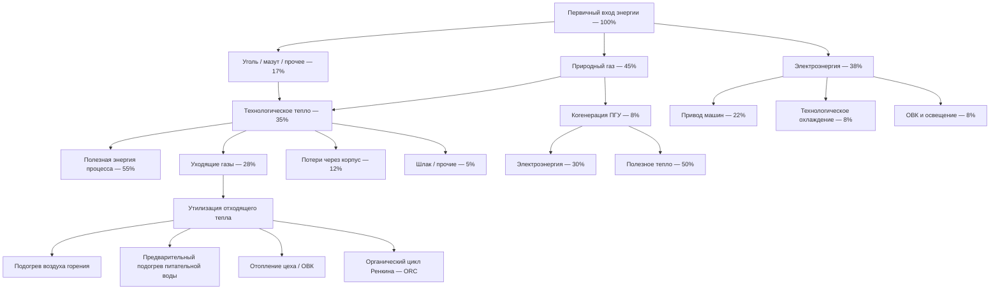

Промышленный сектор — крупнейший потребитель первичной энергии как в России, так и в мире. По данным IEA (World Energy Outlook 2023), на промышленность приходится около 37 % мирового конечного энергопотребления. В России Минэнерго оценивает долю промышленности в 33–36 % конечного потребления (~280–310 Мтнэ/год). При этом ОВК производственных зданий занимает лишь 10–15 % суммарной промышленной нагрузки — доминируют технологические тепловые процессы.

## Структура промышленного энергопотребления


| Статья конечного использования | Доля | Основные приложения |
|---|---|---|
| Технологическое тепло | 38–45 % | Печи, сушилки, реакторы, выпаривание |
| Привод машин (электромоторы) | 20–25 % | Насосы, вентиляторы, компрессоры, конвейеры |
| Технологическое охлаждение | 8–12 % | Промышленные чиллеры, холодильные камеры |
| ОВК и освещение зданий | 10–15 % | Климатизация цехов и офисов |
| Электрохимические процессы | 5–10 % | Электролиз Al, Cl₂, производство H₂ |
| Прочие технологические нагрузки | 3–7 % | Погрузочно-разгрузочные, вспомогательные |






## Энергоёмкость промышленных подотраслей


| Подотрасль | Удельный расход, ГДж/т продукции | Основной энергоноситель |
|---|---|---|
| Нефтепереработка | 2–4 ГДж/т нефти | Природный газ, технологическое топливо |
| Производство аммиака | 28–35 ГДж/т NH₃ | Природный газ |
| Производство стали (доменный путь) | 18–22 ГДж/т стали | Кокс, природный газ |
| Производство алюминия | 55–65 МДж/кг Al (электроэнергия) | Электроэнергия |
| Производство цемента | 3,2–4,5 ГДж/т клинкера | Природный газ, уголь |
| Целлюлоза и бумага | 12–20 ГДж/т | Биомасса, газ |
| Производство продуктов питания | 2–8 ГДж/т | Природный газ, электроэнергия |


## Расчёты технологических тепловых нагрузок

Потребность в тепловой энергии для нагрева материала:


Q_{proc} = m \cdot c_p \cdot \Delta T + m \cdot h_{ph}


Где:
- $m$ — масса материала, кг;
- $c_p$ — теплоёмкость, кДж/(кг·К);
- $\Delta T$ — перепад температуры процесса, К;
- $h_{ph}$ — скрытая теплота фазового перехода (плавление, испарение), кДж/кг.

Расход топлива с учётом КПД агрегата:


\dot{Q}_{fuel} = \frac{Q_{proc}}{\eta_{furnace} \cdot t_{proc}}


Где $\eta_{furnace}$ — тепловой КПД печи или реактора (0,40–0,85); $t_{proc}$ — время процесса, с.

### Числовой пример: нагревательная печь металлургического завода

Нагрев стальных заготовок: $m = 20\,000$ кг/ч, $c_p = 0{,}50$ кДж/(кг·К), $\Delta T = 800 - 25 = 775$ К, фазовых переходов нет.

$$Q_{proc} = \frac{20\,000 \times 0{,}50 \times 775}{3\,600} = 2\,153\,\text{кВт}$$

При КПД печи $\eta = 0{,}65$: $\dot{Q}_{fuel} = 2\,153 / 0{,}65 = 3\,312\,\text{кВт}$.

Расход природного газа ($Q_{low} = 34{,}0$ МДж/м³): $\dot{V}_{gas} = 3\,312 / (34\,000/3\,600) \approx 350$ м³/ч.

## Утилизация отходящего тепла (heat recovery)

Отходящее тепло промышленных предприятий — крупнейший внутренний резерв энергосбережения. Рекуперируемая мощность от уходящих газов:


\dot{Q}_{rec} = \dot{m}_{exh} \cdot c_{p,gas} \cdot (T_{exh} - T_{min}) \cdot \eta_{HX}


Где:
- $\dot{m}_{exh}$ — массовый расход дымовых газов, кг/с;
- $T_{exh}$ — температура уходящих газов, К;
- $T_{min}$ — минимально достижимая температура рекуперации (≥ точки росы), К;
- $\eta_{HX}$ — КПД рекуператора, 0,60–0,85.


| Диапазон температур | Технология | Применения |
|---|---|---|
| > 650 °C | Рекуператоры, регенераторы | Подогрев воздуха горения |
| 250–650 °C | Трубчатые теплообменники, экономайзеры | Подогрев питательной воды котла |
| 120–250 °C | Пластинчатые теплообменники | ОВК, горячее водоснабжение |
| < 120 °C | Тепловые насосы, ORC | Отопление зданий, выработка электроэнергии |


### Числовой пример: рекуперация тепла в цементном производстве

Линия обжига клинкера, уходящие газы: $\dot{m}_{exh} = 5{,}0$ кг/с, $T_{exh} = 320\,°C$, $T_{min} = 150\,°C$, $c_{p,gas} = 1{,}10$ кДж/(кг·К), $\eta_{HX} = 0{,}78$.

$$\dot{Q}_{rec} = 5{,}0 \times 1{,}10 \times (320 - 150) \times 0{,}78 = 728\,\text{кВт}$$

При 7 500 ч/год: $E_{rec} = 728 \times 7\,500 / 1\,000 = 5\,460\,\text{МВт·ч/год}$.

Стоимость тепла из природного газа при 8 000 руб./1000 м³: эквивалент $5\,460 / 0{,}30 \times 8 = 145\,600\,\text{тыс. руб./год}$ экономии (с учётом КПД котла 0,90). Простой срок окупаемости теплообменника стоимостью 15 млн руб. — около 0,5 года.

## Когенерация (ТЭЦ промышленного предприятия)

Системы комбинированной выработки тепла и электроэнергии (КГТ, англ. CHP, combined heat and power) обеспечивают суммарный КПД 65–85 % против 40–55 % при раздельной генерации.


\eta_{CHP} = \frac{W_{el} + Q_{heat,useful}}{Q_{fuel,in}}


Где $W_{el}$ — электрическая мощность, кВт; $Q_{heat,useful}$ — утилизируемое тепло, кВт; $Q_{fuel,in}$ — тепловая мощность топлива, кВт.


| Тип установки | Диапазон мощности | Электрический КПД | Суммарный КПД | Соотношение теплота/электричество |
|---|---|---|---|---|
| Газовая турбина + котёл-утилизатор (ГТУ-ТЭЦ) | 5–200 МВт | 28–38 % | 70–85 % | 2,0–4,0 |
| ПГУ (комбинированный цикл) | 50–400 МВт | 48–58 % | 75–88 % | 0,8–1,5 |
| Поршневой двигатель (ГПУ) | 0,5–10 МВт | 38–46 % | 75–88 % | 1,0–2,0 |
| Микротурбина | 30–600 кВт | 25–33 % | 65–78 % | 2,0–4,0 |
| Паровая турбина (противодавление) | 0,5–50 МВт | 10–25 % | 75–90 % | 3,0–8,0 |


Когенерация экономически целесообразна при:
- числе часов работы > 5 000–6 000 ч/год;
- совмещённых электрической и тепловой нагрузках;
- ценовом соотношении газ/электроэнергия < 1:3 (в энергетических единицах).

## ОВК в промышленных зданиях: специфика

### Большие объёмы

Производственные здания с высотой 8–25 м требуют специального подхода к распределению воздуха:
- тепловая стратификация — вертикальный градиент температуры 0,5–1,5 °C/м;
- воздушные тепловые завесы у въездных ворот;
- инфракрасные обогреватели для локального обогрева рабочих зон вместо общего отопления.

### Высокие нормы воздухообмена

В производственных зонах с выделением вредных веществ нормы воздухообмена по ГОСТ 12.1.005 и СП 60.13330 могут составлять 10–50 крат/ч. Нагрев подпиточного воздуха в холодном климате становится значимой тепловой нагрузкой:


Q_{makeup} = \rho \cdot \dot{V}_{makeup} \cdot c_p \cdot (T_{in} - T_{OA})


### Числовой пример: нагрев подпиточного воздуха в цеху

Производственный цех, воздухообмен $L = 50\,000$ м³/ч ($= 13{,}9$ м³/с), $T_{in} = +16\,°C$, $T_{OA} = -26\,°C$:

$$Q_{makeup} = 1{,}2 \times 13{,}9 \times 1{,}005 \times (16 - (-26)) \approx 706\,\text{кВт}$$

Для снижения этой нагрузки применяются рекуператоры тепла (роторные или пластинчатые) с КПД 65–75 %.

### Контроль производственной среды

Ряд производств (фармацевтика, микроэлектроника, пищевая промышленность) требует прецизионного контроля:
- температура: ±0,5–1,0 °C;
- относительная влажность: ±3–5 %;
- чистота воздуха: классы чистоты ISO 14644-1 (ISO 5–8).

## Управление промышленной энергией по ISO 50001

Стандарт ISO 50001 «Системы энергетического менеджмента» устанавливает требования к системному управлению энергией на промышленных предприятиях:

1. **Базовое энергопотребление (EnB):** детальная характеристика паттернов потребления по технологическим линиям и участкам ОВК.
2. **Значимые потребители энергии (SEU):** выявление наиболее энергоёмких агрегатов и систем.
3. **Индикаторы энергоэффективности (EnPI):** удельный расход на единицу продукции, корреляция с производственной нагрузкой.
4. **Целевые показатели и планы:** снижение удельной энергоёмкости на 1–5 % в год — типичная цель.

Обязательность ISO 50001 предусмотрена для ряда промышленных предприятий ФЗ-261 (организации с потреблением более 6 Гкал/год тепла или 150 МВт·ч/год электроэнергии обязаны проводить энергоаудит).

## Потенциал снижения энергопотребления

Промышленные предприятия, реализовавшие комплексные программы энергоменеджмента, достигают снижения энергоинтенсивности на 15–30 % при сохранении или росте объёмов производства. Ключевые меры для ОВК и тепловых систем:

- Утилизация отходящего тепла: −10–25 % суммарного потребления;
- ЧРП на вентиляторах и насосах ОВК: −15–35 % по данной статье;
- Когенерация (КГТ/ТЭЦ): повышение суммарного КПД использования газа до 75–85 %;
- Теплоизоляция трубопроводов и агрегатов: −3–8 % тепловых потерь;
- Оптимизация расписания работы вентиляции: −10–20 % при переходе на DCV.
