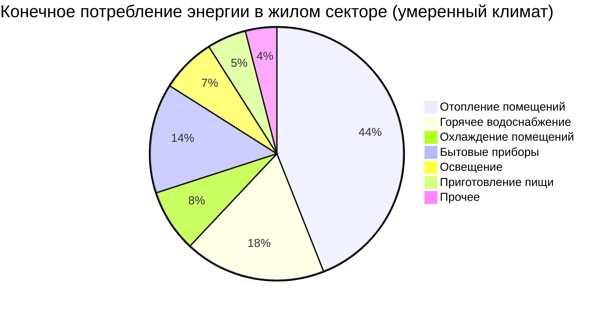

Жилищный сектор формирует устойчивую долю в структуре конечного потребления энергии: по данным IEA (World Energy Balances 2023), в странах с умеренным и холодным климатом на него приходится 25–35 % совокупного конечного потребления, причём отопление и горячее водоснабжение (ГВС) занимают более половины этого объёма. В России вклад жилищного сектора превышает 30 % конечного потребления тепловой энергии, а нормирование ограждающих конструкций регулируется СП 50.13330.2012 «Тепловая защита зданий» и ФЗ-261 «Об энергосбережении».

## Структура конечного использования энергии

Типовое распределение конечного потребления для многоквартирного жилого фонда умеренного климата выглядит следующим образом.

Системы ОВК (отопление, вентиляция, кондиционирование — HVAC) в совокупности потребляют 50–60 % общей энергии жилого здания. Именно этот сегмент является приоритетным объектом политики энергосбережения согласно требованиям EN 16247-2 и ISO 50001.

## Показатель интенсивности энергопотребления

Интенсивность энергопотребления здания (EUI — Energy Use Intensity) нормирует годовое потребление на единицу отапливаемой площади:


\text{EUI} = \frac{E_{\text{год}}}{A_{\text{пол}}}


где:
- $E_{\text{год}}$ — суммарное годовое потребление энергии, кВт·ч/год;
- $A_{\text{пол}}$ — отапливаемая площадь, м².

Для систем ОВК отдельно:


\text{EUI}_{\text{ОВК}} = \frac{Q_{\text{отопл}} + Q_{\text{охл}} + W_{\text{вент}}}{A_{\text{пол}}}


Климатически скорректированный показатель вводит нормировку на градусо-дни отопления (ГДО) и охлаждения (ГДО_охл):


\text{EUI}_{\text{норм}} = \frac{E_{\text{отопл}}}{\text{ГДО} \cdot A_{\text{пол}}} + \frac{E_{\text{охл}}}{\text{ГДО}_{\text{охл}} \cdot A_{\text{пол}}}


### Пример расчёта (числовой)

**Условие.** Многоквартирный жилой дом, Москва. Отапливаемая площадь $A = 5000\ \text{м}^2$. Годовое потребление на отопление $E_{\text{отопл}} = 800\ 000\ \text{кВт·ч}$. Число градусо-дней отопления для Москвы: $\text{ГДО} = 4943\ \text{°С·сут}$ (СП 131.13330.2020).

**Решение:**

$$\text{EUI}_{\text{отопл}} = \frac{800\,000}{5000} = 160\ \text{кВт·ч/м}^2\text{·год}$$

Нормированный удельный показатель:

$$\frac{\text{EUI}_{\text{отопл}}}{\text{ГДО}} = \frac{160}{4943} = 0{,}032\ \text{кВт·ч/(м}^2\text{·°С·сут)}$$

По требованиям ASHRAE 90.1 для климатической зоны 6 целевой показатель составляет $\leq 0{,}028\ \text{кВт·ч/(м}^2\text{·°С·сут)}$, что указывает на потенциал улучшения теплозащиты порядка 14 %.

## Региональные различия по климатическим зонам

Климат определяет соотношение затрат на отопление и охлаждение. В таблице приведены типовые удельные годовые потребности для жилых зданий по климатическим зонам ASHRAE.


| Климатическая зона ASHRAE | Отопление, кВт·ч/м² | Охлаждение, кВт·ч/м² | Итого ОВК, кВт·ч/м² | Преобладающий энергоноситель |
|---|---|---|---|---|
| 1A — очень жаркий влажный | 5–15 | 60–90 | 65–105 | Электричество |
| 2A — жаркий влажный | 20–40 | 50–75 | 70–115 | Электричество |
| 3A — тёплый влажный | 40–70 | 35–55 | 75–125 | Электричество/газ |
| 4A — смешанный влажный | 80–120 | 20–35 | 100–155 | Газ/электричество |
| 5A — прохладный влажный | 110–160 | 10–20 | 120–180 | Природный газ |
| 6A — холодный влажный (Москва) | 140–200 | 5–12 | 145–212 | Природный газ/централизованное теплоснабжение |
| 7 — очень холодный | 180–260 | 2–6 | 182–266 | Природный газ/мазут |


В холодном климате (зоны 6–7) отопление формирует 92–98 % суммарного потребления ОВК, тогда как в жарком влажном (зоны 1A–2A) охлаждение даёт 75–85 %.

## Доля ОВК в суммарном потреблении по зонам


| Климатическая зона | Отопление, % | Охлаждение, % | Итого ОВК, % |
|---|---|---|---|
| 1A | 5–8 | 22–28 | 27–36 |
| 2A | 10–15 | 16–22 | 26–37 |
| 3A | 20–26 | 12–16 | 32–42 |
| 4A | 34–40 | 8–12 | 42–52 |
| 5A | 44–50 | 5–8 | 49–58 |
| 6A | 50–56 | 3–5 | 53–61 |
| 7 | 55–63 | 1–3 | 56–66 |


## Динамика повышения КПД оборудования

За последние тридцать лет нормативные требования к минимальной эффективности оборудования существенно ужесточились.

**Центральные кондиционеры (SEER — Seasonal Energy Efficiency Ratio):**
- 1990 г.: минимум 10 SEER;
- 2006 г.: минимум 13 SEER;
- 2023 г.: минимум 14–15 SEER2 в зависимости от климатической зоны;
- современные высокоэффективные модели: 20+ SEER2.

**Газовые котлы (КПД по AFUE — Annual Fuel Utilization Efficiency):**
- 1990 г.: 78 % AFUE;
- 2015 г.: 80–90 % AFUE в зависимости от типа;
- конденсационные котлы (актуальные): 92–98 % AFUE.

**Тепловые насосы (HSPF2 — Heating Seasonal Performance Factor):**
- 1990 г.: 6,8 HSPF;
- 2023 г.: минимум 7,5 HSPF2;
- современные инверторные: 10–13 HSPF2.

Повышение КПД оборудования с 10 SEER / 80 % AFUE до 16 SEER / 95 % AFUE обеспечивает снижение годового потребления ОВК на 30–45 %. Однако средний срок службы агрегата составляет 15–20 лет, поэтому значительная доля парка эксплуатируется с устаревшими показателями.

## Возможности повышения эффективности

На основе данных энергоаудитов (ASHRAE 211, EN 16247-2) выделяют три группы мероприятий.

**Ограждающие конструкции:**
- Воздухоизоляция (снижение инфильтрации с 0,8 до 0,3 ACH50): экономия 10–18 % тепла.
- Утепление чердачного перекрытия (с R-2,8 до R-7,0 м²·°С/Вт): экономия 8–14 % тепла.
- Замена одинарного остекления на двухкамерный стеклопакет с низкоэмиссионным покрытием (U ≤ 1,0 Вт/(м²·°С)): снижение потерь через окна на 50–65 %.

**Замена оборудования:**
- Переход от котла 80 % AFUE к конденсационному 96 % AFUE: экономия 15–20 % на отопление.
- Тепловой насос для ГВС взамен электрического нагревателя: экономия 55–65 % энергии ГВС.
- Установка умного (программируемого) термостата: 8–13 % экономии ОВК.

**Управление и режим эксплуатации:**
- Ночной откат температуры с 20 °С до 17 °С (8 ч в сутки): экономия 5–9 % тепла.
- Повышение уставки охлаждения с 22 °С до 25 °С: снижение потребления на охлаждение на 15–18 %.
- Регулярная замена фильтров и промывка теплообменников: сохранение 5–8 % КПД.

## Временные характеристики нагрузок

Жилые здания формируют характерные суточные и сезонные профили нагрузки:

- **Суточный профиль:** двухмодальная кривая — утренний пик (6:00–9:00) и вечерний пик (17:00–22:00), дневная впадина при отсутствии жильцов.
- **Выходные дни:** потребление на 15–25 % выше будних за счёт присутствия жильцов в дневное время.
- **Сезонный цикл:** пик отопительной нагрузки — декабрь–февраль; пик охлаждения — июль–август; «плечо» с режимом экономайзера — апрель–май и сентябрь–октябрь.
- **Погодная чувствительность:** каждый градус Цельсия ниже температуры теплового баланса (+18 °С) увеличивает нагрузку на отопление приблизительно на 3 %; каждый градус выше +24 °С — на охлаждение на 4–5 %.

Эти паттерны лежат в основе проектирования систем управления спросом и тарифов по времени использования (TOU).

## Нормативная база и политика

- **СП 50.13330.2012** устанавливает нормируемые значения приведённого сопротивления теплопередаче ограждающих конструкций в зависимости от ГДО.
- **ФЗ-261** обязывает собственников нежилых зданий площадью более 500 м² проводить энергетическое обследование не реже чем раз в пять лет; для жилых МКД предусмотрена маркировка энергетического класса.
- **СП 60.13330.2020** регулирует проектирование систем ОВК и нормирует удельный расход тепловой энергии.
- **ASHRAE 90.1-2022** устанавливает минимальные требования к энергоэффективности ограждающих конструкций и оборудования ОВК для коммерческого и многоквартирного жилого строительства.

Доминирование систем ОВК в структуре энергопотребления жилых зданий определяет их приоритетность при разработке программ повышения энергетической эффективности, выборе инструментов финансирования и формировании требований строительных норм.

## Источники

- IEA, World Energy Balances 2023. Paris: International Energy Agency, 2023.
- СП 50.13330.2012. Тепловая защита зданий. М.: Минстрой России, 2012 (актуализированная ред. 2017).
- СП 60.13330.2020. Отопление, вентиляция и кондиционирование воздуха. М.: Минстрой России, 2020.
- ФЗ-261 «Об энергосбережении и о повышении энергетической эффективности». М., 2009.
- ASHRAE Standard 90.1-2022. Energy Standard for Sites and Buildings Except Low-Rise Residential Buildings. Atlanta: ASHRAE, 2022.
- EN 16247-2:2014. Energy Audits — Part 2: Buildings. Brussels: CEN, 2014.
- BP Statistical Review of World Energy 2023. London: BP, 2023.
