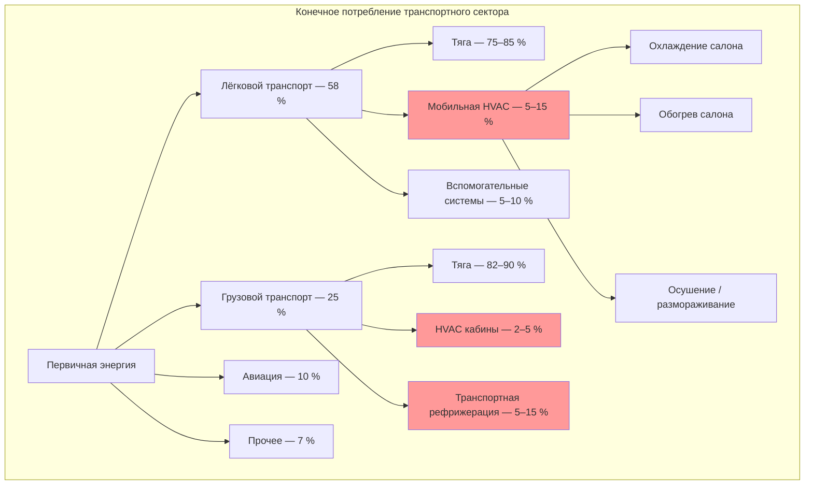

Транспортный сектор потребляет около 28 % мирового конечного потребления энергии (IEA, World Energy Balances 2023). Хотя тяга доминирует в этом объёме, мобильные системы ОВК (HVAC) формируют измеримую паразитную нагрузку: 5–30 % в зависимости от типа транспортного средства, климата и технологии. Для электромобилей (EV — electric vehicle) управление тепловым режимом напрямую конкурирует с тяговой энергией батареи, что делает эффективность климатического оборудования критическим параметром потребительских свойств.

## Модели потребления мобильной HVAC

### Транспортные средства с ДВС

Дополнительный расход топлива при включённом кондиционировании:


\Delta FC_{\text{AC}} = \frac{W_{\text{комп}} + W_{\text{всп}}}{\eta_{\text{дв}} \cdot Q_{\text{н}}^{\text{р}}}


где:
- $W_{\text{комп}}$ — мощность компрессора, кВт;
- $W_{\text{всп}}$ — мощность вспомогательных агрегатов (вентилятор конденсатора, электроника), кВт;
- $\eta_{\text{дв}}$ — термический КПД двигателя (0,25–0,40);
- $Q_{\text{н}}^{\text{р}}$ — низшая теплотворная способность топлива, МДж/кг (бензин ≈ 43,4 МДж/кг).

Мощность компрессора через холодильный коэффициент:


W_{\text{комп}} = \frac{Q_{\text{охл}}}{\text{COP}_{\text{моб}}} = \frac{Q_{\text{охл}} \cdot (T_{\text{конд}} - T_{\text{исп}})}{T_{\text{исп}} \cdot \eta_{\text{комп}}}


### Электромобили

Для EV климатическая нагрузка уменьшает располагаемую ёмкость батареи:


\Delta L_{\text{AC}} = \frac{P_{\text{AC}} \cdot t_{\text{поезд}}}{EC_{\text{баз}}}


где:
- $\Delta L_{\text{AC}}$ — снижение запаса хода, км;
- $P_{\text{AC}}$ — мощность климатической установки, кВт;
- $t_{\text{поезд}}$ — продолжительность поездки, ч;
- $EC_{\text{баз}}$ — базовое удельное потребление без климата, кВт·ч/км.

## Количественное влияние на эффективность


| Тип транспортного средства | Снижение эффективности | Пиковая мощность HVAC, кВт | Основной фактор |
|---|---|---|---|
| Малый легковой автомобиль (ДВС) | 10–18 % расхода топлива | 2–4 | Компрессор кондиционера |
| Внедорожник / кроссовер (ДВС) | 15–28 % расхода топлива | 4–7 | Компрессор + вентилятор конденсатора |
| Батарейный электромобиль (BEV) | 15–35 % запаса хода | 2–6 | Резистивный нагрев или компрессор |
| Гибридный подключаемый (PHEV) | 20–40 % в электрическом режиме | 2–5 | Зависит от режима |
| Городской автобус (дизель) | 8–15 % расхода топлива | 15–30 | Крышная климатическая установка |
| Седельный тягач (кабина с ночлегом) | 5–10 % расхода топлива | 3–5 | Автономный кондиционер кабины |


*Источник: протоколы испытаний EPA, исследования DOE Vehicle Technologies Office.*

## Поток энергии в транспортной системе

## Тепловые проблемы электромобилей

Принципиальное отличие EV от транспортных средств с ДВС — отсутствие бросового тепла двигателя для обогрева салона. Резистивный нагрев расходует энергию батареи с КПД = 1, тогда как тепловой насос (HP — heat pump) достигает COP 2,0–3,5.


| Температура окружающей среды | Режим климата | Снижение запаса хода | Технология снижения потерь |
|---|---|---|---|
| −10 … 0 °С | Резистивный нагрев | 30–50 % | Тепловой насос на CO₂ (R-744) |
| 0 … 15 °С | Минимальный обогрев | 5–12 % | Предварительный прогрев от сети |
| 15 … 25 °С | Без кондиционирования | 0–5 % | Только вентиляция |
| 25 … 35 °С | Кондиционирование | 15–25 % | Инверторный компрессор |
| 35 … 45 °С | Максимальное охлаждение | 25–40 % | Предварительное охлаждение от сети |


### Преимущество теплового насоса: числовой пример

**Условие.** Электромобиль, температура воздуха −5 °С, необходимая тепловая мощность обогрева $P_{\text{обогр}} = 3{,}0$ кВт, продолжительность поездки $t = 1{,}0$ ч. Базовый вариант — резистивный нагрев (COP = 1,0), модернизированный — тепловой насос с COP = 3,0. Удельное потребление автомобиля без климата $EC_{\text{баз}} = 0{,}18$ кВт·ч/км.

**Решение:**

Потребление резистивного нагревателя:
$$E_{\text{рез}} = P_{\text{обогр}} \cdot t = 3{,}0 \cdot 1{,}0 = 3{,}0\ \text{кВт·ч}$$

Потребление теплового насоса:
$$E_{\text{ТН}} = \frac{P_{\text{обогр}}}{\text{COP}} \cdot t = \frac{3{,}0}{3{,}0} \cdot 1{,}0 = 1{,}0\ \text{кВт·ч}$$

Экономия энергии:
$$E_{\text{эконом}} = 3{,}0 - 1{,}0 = 2{,}0\ \text{кВт·ч}$$

Дополнительный запас хода:
$$\Delta L = \frac{E_{\text{эконом}}}{EC_{\text{баз}}} = \frac{2{,}0}{0{,}18} \approx 11\ \text{км}$$

Экономия 2 кВт·ч соответствует увеличению запаса хода примерно на 11 км за одну поездку, а за зимний сезон (90 поездок) — около 990 км совокупного прироста.

## Транспортная рефрижерация

Рефрижерированный транспорт (холодовая цепь — cold chain) формирует специализированный высокоэнергоёмкий сегмент отраслевой HVAC.


| Тип транспортного средства | Требуемая мощность, кВт | Суточное потребление, кВт·ч | Температурный режим |
|---|---|---|---|
| Полуприцеп (заморозка) | 8–12 | 240–360 | −20 … −18 °С |
| Полуприцеп (охлаждение) | 5–8 | 150–240 | 0 … +4 °С |
| Изотермический грузовик | 4–7 | 110–180 | −20 … +4 °С |
| Фургон доставки | 2–4 | 50–100 | 0 … +8 °С |


Дизельные рефрижерирующие установки (TRU — transport refrigeration unit) производят выбросы CO₂ и NOₓ непосредственно в городской среде. Электрические TRU с питанием от тяговой батареи или вспомогательной литий-ионной батареи снижают эмиссию на стоянке на 90–100 % (IRENA, Innovation Outlook 2023).

## Стратегии управления энергией HVAC в парках

**Автономные энергетические установки (APU — auxiliary power unit)** для ночной стоянки грузовиков: исключают 6–8 ч/сут холостого хода двигателя (расход при холостом ходе — 3,0–4,5 л/ч), снижая выброс CO₂ на 15–25 т/год на единицу.

**Предварительное кондиционирование от сети (pre-conditioning):** зарядка электромобилей совмещается с доведением температуры салона до целевого значения при подключении к зарядной колонке, что сохраняет до 15–20 % ёмкости батареи при последующей поездке.

**Солнечная вентиляция припаркованных автомобилей:** фотогальванические панели на крыше мощностью 100–200 Вт обеспечивают работу вентилятора, снижая начальную температуру салона на 8–12 °С и уменьшая первичную пиковую нагрузку на компрессор на 30–50 %.

**Аккумулирование тепловой энергии (PCM — phase change materials):** буферизует пиковую холодильную нагрузку при посадке пассажиров, снижая требуемую пиковую мощность компрессора на 20–35 %.

## Интерфейс с инфраструктурой зданий

Электрификация транспорта формирует новые нагрузки на системы электроснабжения зданий:

- **Зарядная инфраструктура EV:** 7–22 кВт (AC Level 2) или 50–350 кВт (DC Fast Charging) на зарядную точку; пики зарядки в 16:00–19:00 совпадают с пиками климатического оборудования зданий.
- **Отапливаемые автобусные парки:** требуют поддержания температуры в боксах не ниже +5 °С, интенсивного воздухообмена (6–10 крат/ч) для удаления выхлопных газов при прогреве.
- **Паркинги:** вентиляция по требованию (DCV) на основе датчиков CO снижает потребление вентиляторов на 40–60 % по сравнению с непрерывной работой при проектном расходе воздуха.

## Перспективные технологии

Системы теплового насоса на CO₂ (R-744, GWP = 1) демонстрируют COP в режиме обогрева 2,0–2,8 при −10 °С, превосходя R-134a-системы на 30–50 % в этих условиях. По прогнозам DOE Advanced Vehicle Technologies, мобильные HVAC следующего поколения к 2030 г. снизят потребление на 50 % относительно базового уровня 2020 г. за счёт: интеграции управления батареей и климатом в единую тепловую архитектуру, точечного обогрева/охлаждения зоны водителя вместо кондиционирования всего салона, предиктивного управления с использованием данных GPS и метеопрогноза.

## Источники

- IEA, World Energy Balances 2023. Paris: International Energy Agency, 2023.
- IRENA, Innovation Outlook: Electric Vehicles 2023. Abu Dhabi: IRENA, 2023.
- U.S. DOE, Vehicle Technologies Office, Annual Report 2023. Washington: DOE, 2023.
- BP Statistical Review of World Energy 2023. London: BP, 2023.
- ASHRAE Handbook — Fundamentals, Ch. 10: Transport Refrigeration. Atlanta: ASHRAE, 2021.
