Энергопотребление систем ОВК не постоянно — оно формирует иерархически организованную структуру временны́х паттернов: от почасовых колебаний, обусловленных графиком занятости и инсоляцией, до годовых циклов, определяемых климатом. Понимание этих паттернов на каждом временно́м масштабе необходимо для точного прогнозирования нагрузок, оптимального выбора оборудования, разработки систем накопления тепловой энергии и построения эффективных стратегий управления спросом.

## Почасовые паттерны нагрузки

### Коэффициент загрузки

Почасовой коэффициент загрузки (Load Factor — LF) характеризует отношение средней к пиковой нагрузке:


LF_h = \frac{\bar{Q}_h}{Q_{\text{пик}}} \times 100\,\%


где $\bar{Q}_h$ — средняя нагрузка за расчётный период, $Q_{\text{пик}}$ — максимальная нагрузка за тот же период.

Типичные значения: коммерческие здания — 60–75 %, жилые — 40–60 %.

### Коэффициент совпадения (разнородности)

Для многозонных систем пиковые нагрузки отдельных зон, как правило, не совпадают по времени. Коэффициент совпадения (Coincidence Factor — CF) связывает суммарный пик зон с фактической одновременной нагрузкой:


CF = \frac{Q_{\text{пик, факт}}}{\displaystyle\sum_{i=1}^{n} Q_{i,\text{пик}}}


Для коммерческих зданий типичный диапазон CF = 0,70–0,85: суммарный расчётный пик превышает действительный на 15–30 %, что позволяет снизить установленную мощность центральных агрегатов.

### Коэффициент отношения незанятого к занятому периоду


R_{\text{н/з}} = \frac{E_{\text{незанят}}}{E_{\text{занят}}}


Хорошо оптимизированные здания достигают $R_{\text{н/з}} < 0{,}30$; плохо управляемые системы — $R_{\text{н/з}} > 0{,}60$.

## Суточные циклы потребления

Суточные паттерны отражают 24-часовой режим использования здания. Паттерны существенно различаются по типу объекта.


| Тип здания | Пиковые часы | Базовая нагрузка, % от пика | Суточный коэф. загрузки |
|---|---|---|---|
| Офисный центр | 10:00–16:00 | 15–25 | 0,55–0,70 |
| Торговый центр | 12:00–20:00 | 20–30 | 0,60–0,75 |
| Больница | 08:00–18:00 | 70–85 | 0,85–0,95 |
| Школа | 09:00–15:00 | 10–20 | 0,45–0,60 |
| Центр обработки данных | Непрерывно | 90–98 | 0,95–1,00 |
| Гостиница | 06:00–10:00, 18:00–22:00 | 40–55 | 0,65–0,80 |
| Жилой МКД | 06:00–09:00, 17:00–22:00 | 35–50 | 0,50–0,65 |


```mermaid
gantt
    title Суточный паттерн нагрузки ОВК — офисное здание
    dateFormat HH:mm
    axisFormat %H:%M

    section Нагрузка ОВК
    Откат (15 % пика)          :00:00, 06:00
    Утренний разгон (85 %)     :06:00, 08:00
    Пиковый период (100 %)     :08:00, 18:00
    Вечерний спад (55 %)       :18:00, 20:00
    Ночной откат (15 %)        :20:00, 24:00

    section Управление спросом
    Предварительное охлаждение :06:00, 08:00
    Пиковое окно спроса        :14:00, 18:00
    Сброс нагрузки (возможный) :15:00, 17:00
```

## Сезонные вариации

### Распределение сезонной энергии

Сезонное потребление описывается интегралом нагрузки по климатическим переменным:


E_{\text{сезон},i} = \int_{t_{\text{нач}}}^{t_{\text{кон}}} Q\bigl(T_{\text{нв}}(t),\,\varphi(t)\bigr)\,dt


где $Q$ — мгновенная нагрузка, $T_{\text{нв}}$ — температура наружного воздуха, $\varphi$ — суммарные поступления (инсоляция и внутренние источники).


| Сезон | Отопление, % | Охлаждение, % | Вентиляция, % | Доля в годовом объёме |
|---|---|---|---|---|
| Зима | 62–75 | 0–5 | 10–15 | 25–30 |
| Весна | 12–20 | 15–28 | 8–12 | 20–25 |
| Лето | 0–5 | 65–78 | 10–14 | 30–35 |
| Осень | 15–25 | 10–20 | 8–12 | 20–25 |


### Корреляция с градусо-днями

Линейная модель регрессии с градусо-днями отопления (ГДО) и охлаждения (ГДО_охл):


E_{\text{отопл}} = E_{\text{баз}} + \alpha_{\text{ГДО}} \cdot \text{ГДО}



E_{\text{охл}} = E_{\text{баз}} + \alpha_{\text{ГДО}_{\text{охл}}} \cdot \text{ГДО}_{\text{охл}}


где $E_{\text{баз}}$ — погодонезависимая базовая нагрузка; $\alpha$ — коэффициенты температурной чувствительности, кВт·ч/°С·сут. Коэффициенты детерминации $R^2 > 0{,}85$ типичны для хорошо охарактеризованных зданий.

### Числовой пример

**Условие.** Офисное здание, Москва (ГДО = 4943 °С·сут по базе 18 °С). По данным ежемесячных счетов: $E_{\text{баз}} = 15\ 000$ кВт·ч/мес (погодонезависимая часть); $\alpha_{\text{ГДО}} = 18{,}5$ кВт·ч/(°С·сут). Рассчитать потребление в январе (ГДО_янв = 720 °С·сут).

**Решение:**
$$E_{\text{янв}} = 15\,000 + 18{,}5 \times 720 = 15\,000 + 13\,320 = 28\,320\ \text{кВт·ч}$$

Январское потребление на отопление составляет 28 320 кВт·ч, из которых 13 320 кВт·ч (47 %) обусловлены климатической нагрузкой.

## Годовые профили нагрузки

### Кривая длительности нагрузки

Кривая длительности нагрузки (Load Duration Curve — LDC) строится упорядочиванием почасовых значений по убыванию:


\text{LDC}(x) = Q(t)\ \text{ранжировано по убыванию},\quad x \in [0,\,8760]\ \text{ч}


Площадь под LDC равна годовому потреблению. Оборудование, работающее лишь в период верхних 10–20 % нагрузки, работает менее 876–1752 ч/год — экономический аргумент в пользу систем накопления тепла.


| Показатель | Типичный диапазон | Применение |
|---|---|---|
| Годовой пик | 100 % | База тарифа на мощность |
| 95-й перцентиль | 85–95 % | Ориентир выбора мощности оборудования |
| 50-й перцентиль (медиана) | 45–65 % | Режим частичной нагрузки |
| Коэффициент использования | 50–75 % | Интегральная загрузка системы |
| Отношение пик / базовая нагрузка | 2,5–6,0 | Требование к резервной мощности |


## Влияние тарифной структуры

### Тариф по времени использования (TOU)


C_{\text{энергия}} = \sum_{p=1}^{n} E_p \cdot R_{\text{TOU},p}


где $E_p$ — потребление в тарифном периоде $p$; $R_{\text{TOU},p}$ — ставка периода. В часы максимума ставка обычно в 3–5 раз превышает ночную.

### Плата за пиковую мощность (demand charge)


C_{\text{мощность}} = D_{\text{пик}} \cdot R_{\text{мощн}}


где $D_{\text{пик}}$ — зафиксированная за 15-минутный интервал пиковая мощность, кВт; $R_{\text{мощн}}$ — тариф за мощность, руб./кВт. В коммерческих объектах плата за пиковую мощность составляет 30–60 % суммарного счёта за электроэнергию в летние месяцы.

## Прогнозирование нагрузки

Краткосрочное прогнозирование (горизонт сутки вперёд) на основе временны́х признаков и метеопрогноза:


\hat{Q}(t+\Delta t) = f\!\bigl(T_{\text{нв,прогн}},\,DOW,\,HOD,\,Q_{\text{ист}}\bigr)


где $DOW$ — день недели (day of week), $HOD$ — час суток (hour of day), $Q_{\text{ист}}$ — исторические значения нагрузки. Современные алгоритмы машинного обучения обеспечивают точность MAPE ≤ 5–8 % для прогнозов на следующий день в хорошо измеренных зданиях.

## Системы накопления тепловой энергии

Временны́е паттерны нагрузки создают экономический стимул для смещения потребления с пиковых в непиковые периоды. Ледяное аккумулирование (ice storage) или баки-аккумуляторы охлаждённой воды:

- заряжаются в ночное время (22:00–06:00) по льготному тарифу;
- обеспечивают охлаждение здания в часы пикового тарифа (10:00–20:00);
- снижают пиковую электрическую нагрузку чиллера на 40–80 %.

Срок окупаемости таких систем в условиях выраженной тарифной дифференциации (соотношение пикового к ночному тарифу ≥ 2,5) составляет 4–8 лет.

## Нормативная база

- **ASHRAE 90.1-2022** устанавливает требования к системам управления и контролю нагрузки для коммерческих зданий.
- **ISO 50001:2018** определяет систему энергетического менеджмента, в рамках которой мониторинг временны́х паттернов нагрузки является обязательным элементом.
- **ФЗ-261** обязывает организации с потреблением выше 50 ГВт·ч/год устанавливать приборы учёта с почасовой регистрацией.
- **EN 16247-1:2012** требует анализа почасовых профилей нагрузки при проведении энергетического аудита уровня II и выше.

## Источники

- ASHRAE Standard 90.1-2022. Energy Standard for Sites and Buildings Except Low-Rise Residential Buildings. Atlanta: ASHRAE, 2022.
- ISO 50001:2018. Energy Management Systems. Geneva: ISO, 2018.
- IEA, Tracking Buildings 2023. Paris: International Energy Agency, 2023.
- ФЗ-261 «Об энергосбережении и о повышении энергетической эффективности». М., 2009.
- EN 16247-1:2012. Energy Audits — Part 1: General Requirements. Brussels: CEN, 2012.
- ASHRAE Handbook — Fundamentals 2021, Ch. 19. Atlanta: ASHRAE, 2021.
