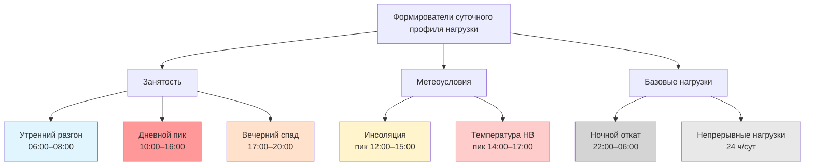

Суточный профиль нагрузки (daily load profile) описывает изменение потребляемой мощности системы ОВК в течение 24-часового периода. Корректная интерпретация профилей определяет: размер чиллеров и котлов, экономическую целесообразность систем аккумулирования тепловой энергии, стратегии управления спросом и оптимальные тарифные схемы коммунальных услуг.

## Базовые метрики профиля нагрузки

### Коэффициент загрузки


LF = \frac{\bar{P}}{P_{\max}} = \frac{\displaystyle\int_0^{24} P(t)\,dt}{24 \cdot P_{\max}}


где $P(t)$ — мгновенная мощность в момент $t$, кВт; $P_{\max}$ — суточный максимум мощности, кВт.

$LF \to 1{,}0$ соответствует равномерной нагрузке; $LF \ll 1{,}0$ — наличию выраженных пиков.

### Коэффициент разнородности


DF = \frac{\displaystyle\sum_{i=1}^{n} P_{\max,i}}{P_{\max,\text{сист}}}


Коэффициент $DF > 1{,}0$ означает, что пики отдельных зон или агрегатов не совпадают по времени. Типичный диапазон для многозонных коммерческих зданий: $DF = 1{,}10$–$1{,}40$.

### Коэффициент «пик к среднему»


PAR = \frac{1}{LF} = \frac{P_{\max}}{\bar{P}}


Высокое $PAR$ (низкое $LF$) — признак здания, которое выигрывает от систем аккумулирования или управления пиковым спросом.

## Профили коммерческих зданий

### Офисные здания

Офисные здания отличаются резким утренним ростом при переходе из режима ночного отката в режим занятости.

**Характерные события суточного цикла:**
- 00:00–06:00: ночной откат, нагрузка 12–18 % пика;
- 06:00–08:00: разгон систем, нагрузка нарастает до 80–90 %;
- 08:00–12:00: пиковый период, 90–100 % (достигается при максимальном присутствии и росте инсоляции восточного фасада);
- 12:00–17:00: устойчивый уровень 85–100 %;
- 17:00–20:00: вечерний спад, 50–65 %;
- 20:00–24:00: ночной режим, 12–18 %.

Типичный коэффициент загрузки офисного здания: $LF = 0{,}45$–$0{,}60$, что соответствует $PAR = 1{,}67$–$2{,}22$.

### Торгово-развлекательные комплексы

Торговые центры демонстрируют более позднее время пика (15:00–19:00), согласованное с потоком покупателей. Значительную долю базовой нагрузки формирует освещение витрин и встроенное холодильное оборудование. Коэффициент загрузки: $LF = 0{,}65$–$0{,}75$.

### Школы и учебные заведения

Для школ характерны наиболее контрастные профили: ночная нагрузка составляет 5–10 % пика, дневная — 85–100 %, при этом пик совпадает с уроками (08:00–15:00). Коэффициент загрузки: $LF = 0{,}35$–$0{,}48$ — минимальный среди коммерческих типов. Такой профиль максимально соответствует системам ледяного аккумулирования.

### Больницы и клиники

Круглосуточный режим работы сглаживает суточный профиль. Базовая нагрузка в ночные часы — 70–85 % от дневного пика. Коэффициент загрузки: $LF = 0{,}85$–$0{,}95$.

## Профили жилых зданий

### Одноквартирные дома

Двухмодальный суточный профиль: утренний пик (06:00–09:00) и вечерний пик (17:00–22:00), дневная впадина при отсутствии жильцов. Коэффициент загрузки существенно зависит от стратегии управления термостатом:

- агрессивный дневной откат: $LF = 0{,}35$–$0{,}50$;
- без отката: $LF = 0{,}60$–$0{,}75$.

### Многоквартирные жилые дома (МКД)

Разнородность режимов присутствия жильцов сглаживает общий профиль здания. Центральные системы МКД испытывают одновременный пик на 15–30 % ниже суммы пиков отдельных квартир. Коэффициент загрузки: $LF = 0{,}55$–$0{,}70$.

## Почасовая таблица нагрузок по типам зданий


| Час | Офис | Торговый центр | Школа | Ресторан | Гостиница | Жилой МКД |
|---|---|---|---|---|---|---|
| 00:00 | 14 | 45 | 5 | 20 | 55 | 40 |
| 02:00 | 12 | 40 | 5 | 15 | 50 | 35 |
| 04:00 | 10 | 40 | 5 | 15 | 45 | 35 |
| 06:00 | 25 | 45 | 35 | 30 | 50 | 58 |
| 08:00 | 75 | 60 | 88 | 40 | 65 | 65 |
| 10:00 | 95 | 75 | 100 | 55 | 72 | 44 |
| 12:00 | 100 | 85 | 95 | 85 | 75 | 40 |
| 14:00 | 95 | 90 | 90 | 75 | 75 | 40 |
| 16:00 | 90 | 95 | 68 | 70 | 80 | 50 |
| 18:00 | 63 | 100 | 18 | 100 | 85 | 85 |
| 20:00 | 24 | 90 | 10 | 95 | 90 | 97 |
| 22:00 | 14 | 58 | 5 | 45 | 74 | 74 |


*Источник: DOE Commercial Reference Buildings, EIA RECS 2020.*

## Различия выходного и рабочего дней

Коммерческие здания демонстрируют значительные различия профилей по дням недели.

**Офисные здания:** пиковая нагрузка в субботу–воскресенье на 40–70 % ниже рабочего дня. Профиль выходного дня более плоский ($LF$ возрастает до 0,70–0,85), поскольку базовые системы (вентиляция, охлаждение серверных) работают, а пиковая нагрузка присутствия отсутствует.

**Торговые центры и рестораны:** меньший перепад между будними и выходными; в ряде сегментов ретейла субботний пик превышает будний на 10–20 %.

**Жилые МКД:** более поздний утренний пик (сдвиг на 1–2 ч), повышенная нагрузка в дневное время (жильцы присутствуют дома), вечерний пик схож с будним.

## Числовой пример: расчёт потенциала теплового аккумулирования

**Условие.** Офисное здание, установленная мощность чиллера $P_{\text{чилл}} = 500$ кВт. Профиль охлаждения: в ночные часы (22:00–08:00, 10 ч) нагрузка составляет 14 % пика; в дневные (08:00–22:00, 14 ч) — в среднем 85 % пика. Требуется определить ёмкость бака-аккумулятора для полного смещения дневной нагрузки на ночные часы.

**Решение:**

Дневная тепловая энергия (целевая для смещения):
$$E_{\text{день}} = 0{,}85 \times 500 \times 14 = 5950\ \text{кВт·ч}$$

Ночная избыточная мощность чиллера (сверх текущей нагрузки):
$$\Delta P_{\text{ночь}} = 500 - 0{,}14 \times 500 = 430\ \text{кВт}$$

Время ночной зарядки при полной избыточной мощности:
$$t_{\text{зар}} = \frac{E_{\text{день}}}{\Delta P_{\text{ночь}}} = \frac{5950}{430} \approx 13{,}8\ \text{ч}$$

13,8 ч превышает доступные 10 ночных часов — полное смещение невозможно без увеличения мощности чиллера. Частичное смещение (10 ч × 430 кВт = 4300 кВт·ч) покрывает 72 % дневной нагрузки; ёмкость бака-аккумулятора при ΔT = 8 °С:

$$V = \frac{E_{\text{смещ}}}{\rho \cdot c_p \cdot \Delta T} = \frac{4{,}3 \times 10^6\ \text{Вт·ч} \times 3600}{\approx 1000 \times 4187 \times 8} \approx 463\ \text{м}^3$$

## Инженерные приложения

**Подбор оборудования.** Пиковая нагрузка определяет установленную мощность чиллеров и котлов. При низком $LF$ оборудование большую часть времени работает в режиме частичной нагрузки — важно выбирать агрегаты с высоким IPLV (Integrated Part Load Value) или IEER.

**Тепловое аккумулирование.** Здания с $PAR > 2{,}0$ экономически выигрывают от смещения нагрузки с пиковых на непиковые тарифные периоды. Типичная окупаемость — 4–8 лет при соотношении тарифов «пик/ночь» ≥ 2,5.

**Управление спросом.** Знание профиля позволяет целенаправленно снижать нагрузку в окна пикового тарифа: предварительное охлаждение за 2–4 ч до пика снижает пиковую нагрузку чиллера на 15–35 % без ущерба для комфорта.

**Оптимальный запуск.** Алгоритм вычисляет время предпускового прогрева:


t_{\text{пуск}} = t_{\text{занят}} - \frac{T_{\text{уст}} - T_{\text{тек}}}{R_{\text{терм}}}


где $R_{\text{терм}}$ — скорость изменения температуры здания, °С/ч. Правильная настройка алгоритма экономит 5–15 % от дневного потребления за счёт исключения преждевременного запуска.

## Стратегии модификации профиля

- **Предварительное охлаждение:** снизить температуру воздуха в помещении на 1–2 °С ниже уставки за 2–4 ч до периода пикового тарифа; эффективно в зданиях с высокой тепловой массой.
- **Оптимизация ночного отката:** баланс между экономией при отсутствии присутствия и штрафом утреннего разгона; оптимальная глубина отката зависит от тепловой массы и структуры тарифа.
- **Ступенчатый запуск:** в многозонных объектах поочерёдный запуск AHU снижает совпадающий пиковый спрос на 20–35 %.
- **Автоматический сброс нагрузки:** BAS (Building Automation System) отключает некритичные зоны при превышении порогового значения мощности.

## Источники

- DOE Commercial Reference Buildings. Washington: U.S. Department of Energy, 2020.
- EIA, Residential Energy Consumption Survey (RECS) 2020. Washington: EIA, 2021.
- ASHRAE Standard 90.1-2022. Atlanta: ASHRAE, 2022.
- ASHRAE Guideline 36-2021. High-Performance Sequences of Operation for HVAC Systems. Atlanta: ASHRAE, 2021.
- IEA, Tracking Buildings 2023. Paris: IEA, 2023.
