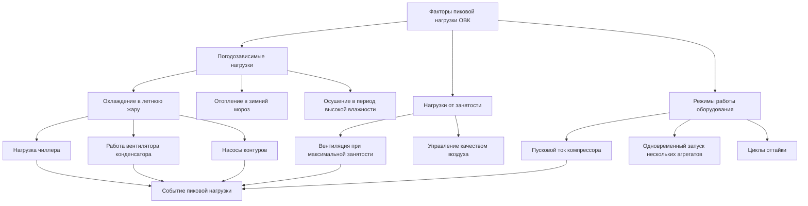

Пиковая нагрузка (peak demand) — максимальная средняя мощность, потреблённая за стандартный интервал учёта (15 или 30 мин), — определяет тарифную компоненту за мощность (demand charge), требуемую мощность вводного устройства и надёжность электроснабжения. Системы ОВК формируют 40–60 % пикового электрического спроса коммерческих зданий и 30–50 % жилых объектов при экстремальных погодных условиях, что делает управление пиком одним из ключевых инструментов сокращения эксплуатационных затрат.

## Основные определения и показатели

### Коэффициент использования нагрузки


LUF = \frac{\bar{P}}{P_{\text{пик}}} = \frac{E_{\text{период}}}{P_{\text{пик}} \cdot T_{\text{период}}}


где $E_{\text{период}}$ — потреблённая энергия за расчётный период, кВт·ч; $T_{\text{период}}$ — продолжительность периода, ч. Системы ОВК типично показывают $LUF = 0{,}30$–$0{,}60$ в коммерческих зданиях — следствие погодозависимого характера нагрузок.

### Коэффициент разнообразия


DF = \frac{\displaystyle\sum_{i} P_{\text{пик},i}}{P_{\text{пик,сист}}}


Для многозонных HVAC-систем $DF = 1{,}10$–$1{,}40$: индивидуальные пики не совпадают по времени, и фактический пик системы на 10–40 % ниже арифметической суммы пиков агрегатов.

## Плата за пиковую мощность

Тарифная составляющая за мощность компенсирует поставщику постоянные затраты на инфраструктуру и стимулирует управление нагрузкой. Базовая формула:


C_{\text{мощн}} = P_{\text{пик}} \cdot R_{\text{мощн}}


где $P_{\text{пик}}$ — зафиксированный за расчётный период максимум 15-минутной средней мощности, кВт; $R_{\text{мощн}}$ — тариф, руб./кВт.

### Типы тарифных структур

**Счётчик-трещотка (ratchet):** минимальная учётная нагрузка фиксируется как $\max(P_{\text{тек}},\ k \cdot P_{\text{год,пик}})$, где $k = 0{,}50$–$0{,}80$. Инструмент штрафует за сезонные пики, сохраняя их влияние на протяжении 12 мес.


P_{\text{учёт}} = \max\!\bigl(P_{\text{тек,пик}},\;k \cdot P_{\text{год,пик}}\bigr)


**Дифференцированный по времени тариф на мощность:** различные ставки для пиковых (обычно 10:00–20:00 летом) и внепиковых периодов.

**Совпадающий пик (coincident peak):** плата рассчитывается по нагрузке объекта в момент системного пика поставщика (как правило, летние полудни).


| Компонент | Типичный диапазон | Примечание |
|---|---|---|
| Плата за мощность объекта | 200–1500 руб./кВт·мес | Любой 15-мин пик в расчётном месяце |
| Плата за пиковое время | 350–2500 руб./кВт·мес | Только часы пикового тарифа (TOU) |
| Плата за совпадающий пик | 120–1000 руб./кВт·мес | Нагрузка в момент системного пика |
| Трещотка | 50–80 % годового пика | Действует 12 мес после события |


## Вклад ОВК в пиковую нагрузку


| Тип здания | Коэф. пиковой нагрузки | Коэф. использования | Доля ОВК в пике, % | Основной формирователь пика |
|---|---|---|---|---|
| Офисный центр | 0,75–0,85 | 0,45–0,60 | 45–55 | Охлаждение + полная занятость |
| Торговый центр | 0,80–0,95 | 0,40–0,55 | 50–65 | Охлаждение + освещение витрин |
| Гостиница | 0,60–0,75 | 0,55–0,70 | 35–45 | Номерной фонд + прачечная |
| Больница | 0,85–0,95 | 0,70–0,85 | 30–40 | Режим 24/7, критичные нагрузки |
| Школа | 0,70–0,85 | 0,30–0,45 | 50–60 | Пиковая занятость, малая тепловая масса |
| ЦОД | 0,90–1,00 | 0,85–0,98 | 35–45 | ИТ-нагрузка + охлаждение 24/7 |
| Производство | 0,65–0,85 | 0,60–0,75 | 20–35 | Технологическое оборудование доминирует |
| Склад | 0,55–0,70 | 0,35–0,50 | 40–55 | Периодическое кондиционирование |


## Числовой пример: расчёт экономии от управления пиковым спросом

**Условие.** Офисное здание. Установленная мощность HVAC: 400 кВт. Тариф за мощность: $R_{\text{мощн}} = 800$ руб./кВт·мес. Текущий пик: $P_{\text{пик}} = 380$ кВт. Предлагается стратегия предварительного охлаждения и сброса нагрузки, позволяющая снизить пик до $P_{\text{пик,нов}} = 280$ кВт.

**Решение:**

Экономия на оплате мощности:
$$\Delta C_{\text{мощн}} = (380 - 280) \times 800 = 100 \times 800 = 80\,000\ \text{руб./мес}$$

Годовая экономия (6 летних расчётных месяцев):
$$\Delta C_{\text{год}} = 80\,000 \times 6 = 480\,000\ \text{руб./год}$$

Дополнительно снижается нагрузка в тарифном окне с более высокой ставкой на энергию. При разнице ставок «пик/ночь» = 3,0 руб./кВт·ч и суточном смещении 800 кВт·ч:
$$\Delta C_{\text{TOU}} = 800 \times (3{,}0 - 1{,}0) \times 6 \times 22 \approx 211\,200\ \text{руб./год}$$

Совокупная годовая экономия: $480\,000 + 211\,200 = 691\,200$ руб./год.

## Управление спросом и сброс нагрузки

### Основные стратегии сокращения пиковой нагрузки HVAC

**Предварительное охлаждение:** снизить температуру воздуха в помещении на 1,0–2,0 °С ниже уставки за 2–4 ч до периода пикового тарифа. Используется тепловая масса здания как аккумулятор.

**Сброс уставки охлаждения:** повысить уставку термостата на 1,5–3,0 °С в пиковые часы — снижает нагрузку чиллера на 10–25 % при допустимом ухудшении комфорта.

**Циклирование:** поочерёдное кратковременное (10–15 мин/ч) отключение некритичных зон по ротационному графику BAS.

**Сброс температуры приточного воздуха (SAT reset):** повышение SAT на 1,0–2,0 °С снижает нагрузку на охлаждающий змеевик.

Расчёт потенциала снижения нагрузки:


\Delta P_{\text{УС}} = P_{\text{баз}} \cdot \left(1 - \frac{T_{\text{уст,УС}} - T_{\text{нв}}}{T_{\text{уст,норм}} - T_{\text{нв}}}\right) \cdot \eta_{\text{управ}}


где $\eta_{\text{управ}}$ — КПД реализации (0,70–0,90) с учётом задержек отклика и частичного охвата систем.

## Расчёт электрической инфраструктуры

### Вводное устройство


I_{\text{ввод}} = \frac{P_{\text{пик}} \times 10^3}{\sqrt{3} \cdot U_{\text{ном}} \cdot \cos\varphi} \cdot k_{\text{зап}}


где $U_{\text{ном}}$ — номинальное напряжение (380 В для трёхфазных сетей); $\cos\varphi$ — коэффициент мощности (0,75–0,92 с учётом HVAC); $k_{\text{зап}} = 1{,}15$–$1{,}25$ — коэффициент запаса на будущий рост нагрузок.

Оборудование HVAC без коррекции коэффициента мощности ($\cos\varphi = 0{,}75$–$0{,}85$) увеличивает требуемый ток на 15–33 % по сравнению с нагрузками $\cos\varphi = 1{,}0$.

### Трансформатор


S_{\text{тр}} = \frac{P_{\text{пик,сист}}}{\overline{\cos\varphi}} \cdot DF


где $DF$ — коэффициент разнообразия нагрузок; $\overline{\cos\varphi}$ — средневзвешенный коэффициент мощности по всем нагрузкам объекта.

Управление пиком снижает затраты на инфраструктуру в новом строительстве на 500–2000 руб./кВт избежанной пиковой мощности и позволяет вписаться в пределы существующих вводов при реконструкции.

## Нормативная база

- **ASHRAE Standard 90.1-2022** содержит требования к системам управления пиковым спросом для коммерческих объектов.
- **ISO 50001:2018** предусматривает мониторинг и контроль пиковых нагрузок как элемент системы энергетического менеджмента.
- **ФЗ-261** обязывает крупных потребителей устанавливать интеллектуальные системы учёта с возможностью фиксации 15-минутных максимумов мощности.
- **СП 60.13330.2020** регулирует выбор мощности оборудования ОВК с учётом коэффициентов спроса и разнообразия.

## Источники

- ASHRAE Standard 90.1-2022. Atlanta: ASHRAE, 2022.
- ASHRAE Guideline 36-2021. High-Performance Sequences of Operation for HVAC Systems. Atlanta: ASHRAE, 2021.
- ISO 50001:2018. Energy Management Systems. Geneva: ISO, 2018.
- IEA, Demand Response 2023: Global Status Report. Paris: IEA, 2023.
- ФЗ-261 «Об энергосбережении и о повышении энергетической эффективности». М., 2009.
- СП 60.13330.2020. Отопление, вентиляция и кондиционирование воздуха. М., 2020.
