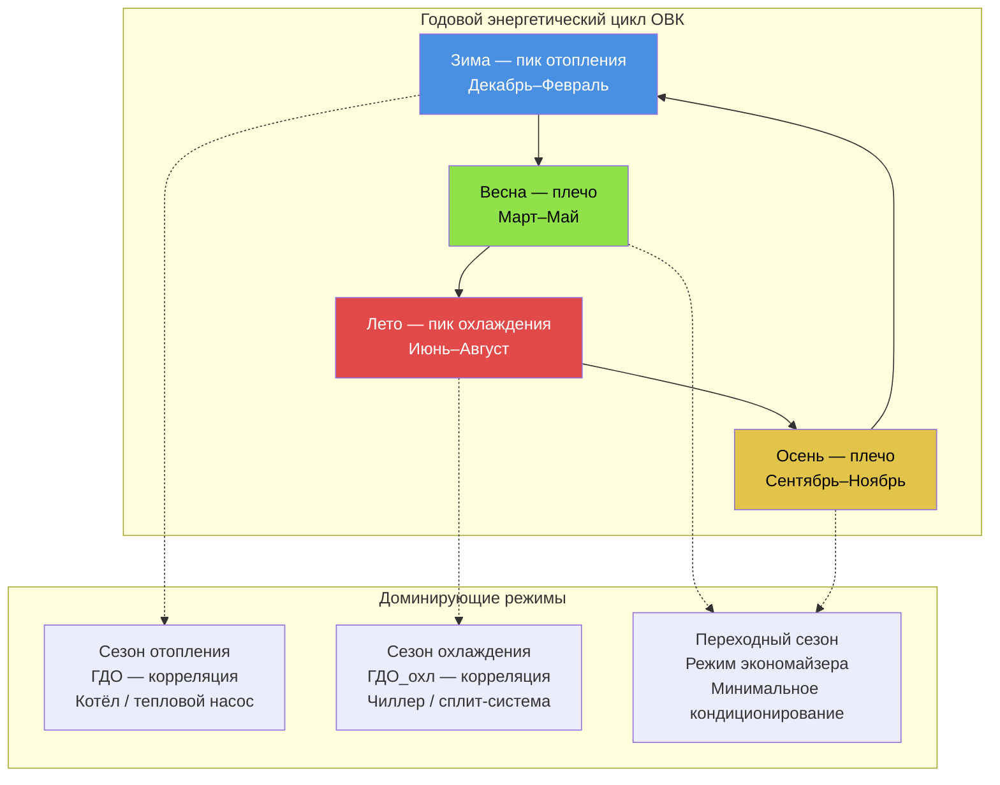

Энергопотребление систем ОВК следует предсказуемому годовому циклу, определяемому климатом, внутренними тепловыделениями и тепловыми характеристиками ограждающих конструкций. Этот цикл включает три чётко выраженных периода: сезон отопления, сезон охлаждения и переходные «плечевые» периоды. Понимание сезонных паттернов необходимо для прогнозирования расходов на коммунальные услуги, оптимального проектирования систем и управления режимами работы в соответствии с ISO 50001 и ФЗ-261.

## Сезон отопления

Отопительный сезон начинается при снижении температуры наружного воздуха ниже точки теплового баланса здания $T_{\text{баланс}}$. Суммарная потребность в тепловой энергии выражается через градусо-дни отопления (ГДО — Heating Degree Days, HDD):


\text{ГДО}_{\text{баз}} = \sum_{i=1}^{n} \max\!\bigl(T_{\text{баз}} - T_{\text{нв,ср},i},\;0\bigr)


где $T_{\text{баз}}$ — базовая температура (по СП 131.13330.2020 принимается 8 °С для расчёта начала отопительного периода; для энергетических расчётов — 18 °С); $T_{\text{нв,ср},i}$ — среднесуточная температура наружного воздуха в день $i$.

Месячное потребление тепловой энергии на отопление:


Q_{\text{отопл,мес}} = \frac{UA \cdot \text{ГДО}_{\text{мес}} \cdot 24}{\eta_{\text{сист}}}


где:
- $U$ — удельный коэффициент теплопередачи через ограждающие конструкции, Вт/(м²·°С);
- $A$ — суммарная площадь ограждающих конструкций, м²;
- $\eta_{\text{сист}}$ — КПД системы отопления (доли единицы);
- 24 — число часов в сутках.

## Сезон охлаждения

Сезон охлаждения наступает при превышении температурой наружного воздуха точки теплового баланса. Градусо-дни охлаждения (ГДО_охл — Cooling Degree Days, CDD):


\text{ГДО}_{\text{охл}} = \sum_{i=1}^{n} \max\!\bigl(T_{\text{нв,ср},i} - T_{\text{баз}},\;0\bigr)


Полное месячное потребление энергии на охлаждение включает явную (sensible) и скрытую (latent) составляющие:


Q_{\text{охл,мес}} = \frac{Q_{\text{явн}} + Q_{\text{скр}}}{\text{EER}/12} \cdot t_{\text{работа}}


Во влажном климате скрытая нагрузка составляет 25–40 % общей нагрузки охлаждения. Нагрузки на охлаждение демонстрируют более выраженные суточные пики, чем нагрузки на отопление, вследствие значительной роли солнечного облучения.

## Переходные периоды

Весна (апрель–май) и осень (сентябрь–октябрь) в умеренном климате характеризуются умеренными температурами, при которых механическое отопление и охлаждение минимальны. Температура теплового баланса здания:


T_{\text{баланс}} = T_{\text{внутр}} - \frac{Q_{\text{внутр}}}{UA}


где $Q_{\text{внутр}}$ — суммарные внутренние тепловыделения от людей, освещения и оборудования.

В переходные периоды работа экономайзера (free cooling) позволяет полностью или частично исключить механическое охлаждение. Потенциальная доля «бесплатного охлаждения» составляет 15–35 % годовых часов работы систем охлаждения в умеренном климате.

## Месячное потребление по климатическим зонам


| Месяц | Зона 1A (Майами) | Зона 4A (Нью-Йорк) | Зона 5A (Чикаго) | Зона 6A (Москва) | Зона 7 (Дулут) |
|---|---|---|---|---|---|
| Январь | 145 | 285 | 340 | 420 | 480 |
| Февраль | 140 | 260 | 310 | 385 | 440 |
| Март | 155 | 195 | 240 | 295 | 360 |
| Апрель | 180 | 140 | 165 | 175 | 240 |
| Май | 220 | 155 | 180 | 140 | 185 |
| Июнь | 265 | 195 | 230 | 120 | 175 |
| Июль | 285 | 248 | 272 | 145 | 200 |
| Август | 278 | 242 | 266 | 140 | 195 |
| Сентябрь | 248 | 190 | 215 | 160 | 195 |
| Октябрь | 195 | 150 | 175 | 230 | 270 |
| Ноябрь | 160 | 222 | 272 | 340 | 380 |
| Декабрь | 150 | 272 | 326 | 408 | 455 |


*Примечание: значения для Москвы рассчитаны по данным СП 131.13330.2020 и характеристикам типового российского офисного здания с EUI ≈ 180 кВт·ч/м²·год.*

## Корреляция с погодой

Энергопотребление зданий, как правило, хорошо описывается кусочно-линейной регрессией с ГДО и ГДО_охл:


E_{\text{сут}} = E_{\text{баз}} + k_{\text{отопл}} \cdot \max(T_{\text{баз}} - T_{\text{нв}}, 0) + k_{\text{охл}} \cdot \max(T_{\text{нв}} - T_{\text{баз}}, 0)


где:
- $E_{\text{баз}}$ — погодонезависимое базовое потребление;
- $k_{\text{отопл}}, k_{\text{охл}}$ — коэффициенты температурной чувствительности, кВт·ч/(°С·сут).

Коэффициенты детерминации $R^2 > 0{,}85$ достигаются для хорошо охарактеризованных зданий, что позволяет прогнозировать потребление по метеопрогнозам.

## Числовой пример: сезонный энергобаланс

**Условие.** Офисное здание, Москва, площадь $A_{\text{пол}} = 3000\ \text{м}^2$. Параметры ограждающих конструкций: $UA = 4200\ \text{Вт/°С}$. КПД отопления: $\eta_{\text{отопл}} = 0{,}88$ (газовый котёл). ГДО по Москве (база 18 °С): 4943 °С·сут; ГДО_охл (база 18 °С): 52 °С·сут.

**Решение — годовое потребление на отопление:**
$$Q_{\text{отопл,год}} = \frac{4200 \times 4943 \times 24}{0{,}88} = \frac{499\,358\,400}{0{,}88} \approx 567\ \text{МДж} \approx 157\,500\ \text{кВт·ч}$$

Удельное потребление:
$$\text{EUI}_{\text{отопл}} = \frac{157\,500}{3000} = 52{,}5\ \text{кВт·ч/м}^2\text{·год}$$

Сравнение с нормативным показателем по ASHRAE 90.1 для зоны 6A ($\leq 55\ \text{кВт·ч/м}^2$) — результат соответствует требованиям.

**Сезонный потенциал «бесплатного охлаждения»:** при доле переходных периодов ~28 % (2450 ч из 8760) и полной работе экономайзера в это время экономия механической холодопроизводительности составит:
$$E_{\text{экон}} = 0{,}28 \times Q_{\text{охл,год}} \approx 0{,}28 \times 15\,500 = 4340\ \text{кВт·ч/год}$$

## Визуализация годового цикла

## Коэффициент загрузки и сезонные последствия

Сезонные колебания снижают годовой коэффициент использования установленной мощности. Здания с резкими сезонными пиками демонстрируют:


LF_{\text{год}} = \frac{E_{\text{год}}}{P_{\text{пик}} \cdot 8760}


- Здания с резкими сезонными пиками: $LF_{\text{год}} = 0{,}40$–$0{,}60$;
- Здания со сбалансированными нагрузками: $LF_{\text{год}} = 0{,}65$–$0{,}80$.

Низкий $LF$ означает повышенный тариф на мощность в расчёте на кВт·ч потреблённой энергии — экономический аргумент в пользу тепловых аккумуляторов и межсезонного аккумулирования тепла (UTES — Underground Thermal Energy Storage).

## Стратегии сезонной оптимизации

**Сезонная балансировка систем:** проверка и настройка оборудования перед началом каждого пикового сезона позволяет обеспечить максимальный КПД в период наиболее интенсивной нагрузки.

**Тепловое аккумулирование:** перенос части охлаждения с дневного пика на ночные часы в летний период. Ёмкость бака-аккумулятора подбирается на покрытие 50–100 % суточного пика.

**Управление экономайзером:** в переходные периоды полное открытие воздушных клапанов наружного воздуха исключает механическое охлаждение при $T_{\text{нв}} < T_{\text{приток,уст}}$. Потенциальная экономия — 10–25 % от годового потребления на охлаждение (больше в сухом климате).

**Сезонный сброс температуры:** регулировка температуры теплоносителя (горячей воды или хладоносителя) по кривой в зависимости от температуры наружного воздуха снижает потери в трубопроводах и повышает КПД генерирующего оборудования.

## Нормативная база

- **СП 131.13330.2020** содержит нормативные данные по климату (ГДО, расчётные температуры) для населённых пунктов России.
- **СП 50.13330.2012** устанавливает нормируемые значения термического сопротивления ограждающих конструкций с учётом ГДО.
- **ASHRAE 90.1-2022** требует применения климатических данных TMY (Typical Meteorological Year) для энергетического моделирования.
- **ISO 50001:2018** предписывает анализ сезонных паттернов как часть идентификации значимых энергетических объектов (SEO).

## Источники

- СП 131.13330.2020. Строительная климатология. М.: Минстрой России, 2020.
- СП 50.13330.2012. Тепловая защита зданий. М., 2012.
- ASHRAE Standard 90.1-2022. Atlanta: ASHRAE, 2022.
- ASHRAE Handbook — Fundamentals 2021, Ch. 14: Climatic Design Information. Atlanta: ASHRAE, 2021.
- ISO 50001:2018. Energy Management Systems. Geneva: ISO, 2018.
- IEA, World Energy Balances 2023. Paris: IEA, 2023.
