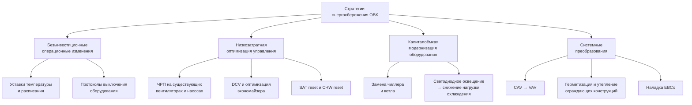

Стратегии энергосбережения в системах ОВК охватывают диапазон от безынвестиционных операционных изменений до комплексных системных преобразований. Их общий принцип — максимальное извлечение потенциала существующего оборудования перед капитальной модернизацией. По данным ASHRAE и ISO 50001, правильно реализованная совокупность мер способна снизить потребление ОВК на 25–45 % без замены основного оборудования.

## Классификация стратегий

## Безынвестиционные операционные мероприятия

### Уставки температуры

Каждые 0,6 °С повышения уставки охлаждения снижают потребление примерно на 3–5 %; каждые 0,6 °С снижения уставки отопления дают аналогичный эффект.

**Рекомендуемые уставки:**
- Охлаждение при занятости: 23–25 °С;
- Охлаждение при отсутствии занятости: 28–30 °С;
- Отопление при занятости: 20–21 °С;
- Отопление при отсутствии занятости: 14–16 °С;
- Мёртвая зона между режимами отопления и охлаждения: не менее 2,8 °С (ASHRAE Guideline 36).

### Оптимизация расписания

Правильный алгоритм запуска устанавливает минимально необходимое время предварительного прогрева:


t_{\text{пуск}} = t_{\text{занят}} - \frac{T_{\text{уст}} - T_{\text{тек}}}{R_{\text{терм}}}


где $R_{\text{терм}}$ — скорость изменения температуры здания, °С/ч. Типичное время восстановления коммерческого здания: 1–3 ч при нормальных погодных условиях.

**Сокращение часов работы:** переход с непрерывной работы на режим «06:00–18:00 рабочих дней» снижает число часов работы ОВК на 60–70 ч/нед — до 3500–4500 ч/год вместо 8760 ч.

### Сброс температуры приточного воздуха (SAT reset)

Фиксированная низкая температура нагнетания вызывает чрезмерный повторный нагрев в концевых устройствах. Сброс по наружному воздуху или по спросу зоны:

- Типичный диапазон SAT: 12–18 °С в зависимости от суммарной нагрузки охлаждения.
- Экономия: 10–20 % суммарного потребления ОВК за счёт снижения повторного нагрева и мощности вентилятора.

## Оптимизация управления с низкими затратами

### Вентиляция по потребности (DCV — Demand-Controlled Ventilation)

Регулирование подачи наружного воздуха на основе концентрации CO₂ (косвенная характеристика занятости) или прямых датчиков занятости.

Расход воздуха при известной концентрации CO₂:


Q_{\text{вент}} = \frac{G \times 10^6}{C_{\text{пом}} - C_{\text{нв}}}


где $G$ — скорость выделения CO₂, м³/с; $C_{\text{пом}}, C_{\text{нв}}$ — концентрации в помещении и снаружи, ppm.

Типичная уставка: $C_{\text{пом}} \leq 1000$–$1200$ ppm. При 50 % занятости (200 м³/ч вместо 400 м³/ч наружного воздуха) в климате Москвы: годовая экономия на кондиционировании воздуха составит:

$$E_{\text{DCV}} \approx \frac{\Delta Q_{\text{нв}} \cdot \rho \cdot c_p \cdot \text{ГДО} \cdot 24}{\eta_{\text{сист}}} \approx 12\,000–18\,000\ \text{кВт·ч/год}$$

на каждые 1000 м² офисной площади при типичной загруженности.

### Оптимизация экономайзера

Типичные причины неработающих экономайзеров: заклиненные воздушные клапаны (в 60–80 % проверяемых объектов), неверная калибровка датчиков, ошибки логики управления. Ежегодная функциональная проверка экономайзера:

- проверка хода клапана во всём диапазоне;
- верификация показаний датчиков наружного и смешанного воздуха;
- тестирование последовательности «экономайзер → механическое охлаждение».

Потенциал исправного экономайзера: 10–30 % экономии энергии охлаждения в зависимости от климатической зоны.

### Сброс температуры охлаждённой воды (CHW reset)

Повышение температуры подачи хладоносителя на 1 °С повышает COP чиллера на 1–2 %. Типичный диапазон управления: 6–12 °С. Стратегии реализации:

- сброс по температуре наружного воздуха (OAT reset);
- сброс по спросу зоны (позиция управляющего клапана: сброс начинается, когда все клапаны открыты менее 90 %);
- сброс по нагрузке чиллера.

## Модернизация оборудования

### Частотные преобразователи (ЧРП / VFD)

Мощность вентилятора (или насоса) пропорциональна кубу скорости вращения:


\frac{P_2}{P_1} = \left(\frac{n_2}{n_1}\right)^3



| Тип агрегата | Типичная экономия | Срок окупаемости |
|---|---|---|
| ПВУ постоянного расхода → VAV с ЧРП | 30–50 % | 2–4 года |
| Насос первичного контура | 20–40 % | 3–5 лет |
| Вентилятор градирни | 30–60 % | 1–3 года |
| Насос конденсаторной воды | 25–45 % | 2–4 года |


**Числовой пример.** Вентилятор ПВУ мощностью $P_1 = 22$ кВт, режим работы $n_1 = 1450$ об/мин (100 %). При среднегодовой нагрузке 80 % частота снижается до $n_2 = 0{,}80 \times 1450 = 1160$ об/мин:

$$P_2 = 22 \times (0{,}80)^3 = 22 \times 0{,}512 = 11{,}3\ \text{кВт}$$

Экономия: $(22 - 11{,}3) = 10{,}7$ кВт. За 4000 ч/год: $E_{\text{эконом}} = 10{,}7 \times 4000 = 42\,800$ кВт·ч/год.

### Светодиодное освещение и снижение нагрузки охлаждения

Тепловыделение от освещения непосредственно формирует охлаждающую нагрузку. Замена люминесцентного освещения (14 Вт/м²) светодиодным (7 Вт/м²):


Q_{\text{охл,снижение}} = \Delta q_{\text{осв}} \cdot A_{\text{пол}} \cdot F_{\text{пр}} \cdot F_{\text{вент}}


где $F_{\text{пр}}$ — доля тепла в кондиционируемом пространстве (0,65–0,90); $F_{\text{вент}}$ — коэффициент взаимодействия с вентиляцией (1,10–1,25).

## Системные преобразования


| Тип преобразования | Экономия | Удельная стоимость | Применение |
|---|---|---|---|
| CAV → VAV | 25–40 % | 400–800 руб./м³/ч | Офисы, школы |
| Постоянный расход → VPF (переменный первичный) | 30–50 % | 700–1500 руб./кВт_охл | Чиллерные установки |
| Пневматика → DDC | 15–25 % | 100–200 руб./м² | Устаревшие здания |
| RTU → DOAS + местное охлаждение | 30–50 % | 1200–2000 руб./м² | Капитальный ремонт |


**Замена чиллера:** современные высокоэффективные центробежные чиллеры с магнитными подшипниками достигают 0,11–0,14 кВт/кВт_охл против 0,18–0,24 кВт/кВт_охл устаревшего оборудования — улучшение на 35–55 %.

**Конденсационные котлы:** замена атмосферных котлов (КПД 75–80 %) на конденсационные (92–96 %) при температуре обратного теплоносителя ≤ 55 °С. Снижение потребления газа на 15–22 %. При стоимости газа 9 руб./м³ и годовом потреблении 500 000 м³: $S = 0{,}18 \times 500\,000 \times 9 = 810\,000$ руб./год.

## Наладка существующих зданий (EBCx)

Типовые дефекты, выявляемые при наладке:


| Категория дефекта | Частота выявления | Штраф потребления | Стоимость устранения |
|---|---|---|---|
| Неработающие экономайзеры | 60–80 % объектов | 10–30 % охлаждения | Низкая (15–80 тыс. руб.) |
| Одновременное отопление и охлаждение | 40–60 % систем | 15–25 % ОВК | Низкая (0–50 тыс. руб.) |
| Ошибки расписания | 50–70 % систем | 20–40 % ОВК | Минимальная |
| Дрейф датчиков | 30–50 % датчиков | 5–15 % ОВК | Низкая |


Наладка (EBCx — Existing Building Commissioning) обеспечивает в среднем 10–20 % экономии суммарного потребления здания при сроке окупаемости до 2 лет. Непрерывная наладка (CCx — Continuous Commissioning) с системами FDD (Fault Detection and Diagnostics) предотвращает деградацию производительности, типично составляющую 2–5 % в год.

## Взаимодействие мероприятий

**Положительные синергии:**
- Улучшение ограждающих конструкций + снижение мощности оборудования = снижение капитальных затрат на 20–35 %.
- ЧРП + оптимизированное расписание = улучшенная работа при частичной нагрузке.

**Отрицательные взаимодействия:**
- SAT reset + оптимизация экономайзера — частично пересекающиеся меры; суммарная экономия на 15–20 % ниже суммы индивидуальных оценок.
- DCV + герметизация ограждающих конструкций — снижение инфильтрации уменьшает выгоду DCV.

Нормализованный расчёт экономии (вариант C IPMVP):


S = (E_{\text{баз,скорр}} - E_{\text{отчёт}}) \times \frac{\text{ГДО}_{\text{факт}}}{\text{ГДО}_{\text{баз}}}


Статистическая значимость требует не менее 12 мес базовых данных и 12 мес данных после реализации.

## Деградация экономии и сохранение результата


| Категория | Годовая деградация | Требования к поддержанию |
|---|---|---|
| Изменения уставок | 15–30 % | Ежемесячная проверка |
| Оптимизация расписания | 10–20 % | Ежеквартальный аудит |
| Работа ЧРП | 5–10 % | Ежегодная калибровка |
| Функция экономайзера | 20–40 % | Полугодовое функциональное тестирование |
| DCV | 10–15 % | Ежегодная калибровка датчиков CO₂ |


## Нормативная база

- **ASHRAE Standard 90.1-2022** — требования к системам управления и оборудованию.
- **ASHRAE Guideline 36-2021** — эталонные последовательности управления высокоэффективными системами ОВК.
- **ISO 50001:2018** — система энергетического менеджмента.
- **СП 60.13330.2020** — проектирование систем ОВК, нормирование удельного расхода тепловой энергии.
- **ФЗ-261** — правовая основа обязательных энергетических обследований.
- **EN 16247-2:2014** — стандарт энергоаудита зданий.

## Источники

- ASHRAE Standard 90.1-2022. Atlanta: ASHRAE, 2022.
- ASHRAE Guideline 36-2021. High-Performance Sequences of Operation for HVAC Systems. Atlanta: ASHRAE, 2021.
- ISO 50001:2018. Energy Management Systems. Geneva: ISO, 2018.
- IEA, Energy Efficiency 2023. Paris: IEA, 2023.
- СП 60.13330.2020. Отопление, вентиляция и кондиционирование воздуха. М.: Минстрой России, 2020.
- IPMVP, Volume I. Concepts and Options for Determining Energy and Water Savings. EVO, 2022.
